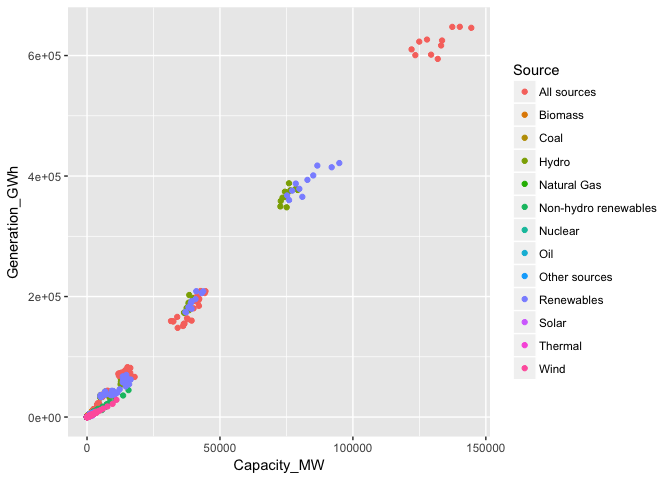

# Renewable Energy and Sustainable Infrastructure

```r
library(readr)
library(dplyr)
```

```
## 
## Attaching package: 'dplyr'
```

```
## The following objects are masked from 'package:stats':
## 
##     filter, lag
```

```
## The following objects are masked from 'package:base':
## 
##     intersect, setdiff, setequal, union
```

```r
library(tidyr)
library(ggplot2)

RE_Capacity <- read_csv("Data/Renewable_energy_Capacity.csv")
```

```
## Parsed with column specification:
## cols(
##   Region = col_character(),
##   Source = col_character(),
##   Year = col_integer(),
##   Data = col_double(),
##   Unit = col_character()
## )
```

```r
RE_Generation <- read_csv("Data/Renewable_energy_Generation.csv")
```

```
## Parsed with column specification:
## cols(
##   Region = col_character(),
##   Source = col_character(),
##   Year = col_integer(),
##   Data = col_double(),
##   Unit = col_character()
## )
```

```r
RE_Dictionary <- read_csv("Data/RE_Dictionary.csv")
```

```
## Parsed with column specification:
## cols(
##   Column = col_character(),
##   `Data Value or Column Name Indication` = col_character(),
##   `Description of Data Value or Column Name` = col_character()
## )
```

```r
RE_Capacity <- RE_Capacity %>%
  rename(Data_Capacity = Data) %>%
  unite(RSV, Region, Source, Year)

RE_Generation <- RE_Generation %>%
  rename(Data_Generation = Data) %>%
  unite(RSV, Region, Source, Year)

RE_Full <- full_join(RE_Capacity, RE_Generation, by = "RSV") %>%
  separate(RSV, into = c("Region", "Source", "Year"), sep = "_") %>%
  rename(Capacity_MW = Data_Capacity) %>%
  rename(Generation_GWh = Data_Generation) %>%
  select(-Unit.x, -Unit.y)

RE_Full %>%
  ggplot(aes(Capacity_MW, Generation_GWh, color = Source)) +
  geom_point()
```

```
## Warning: Removed 924 rows containing missing values (geom_point).
```

<!-- -->

