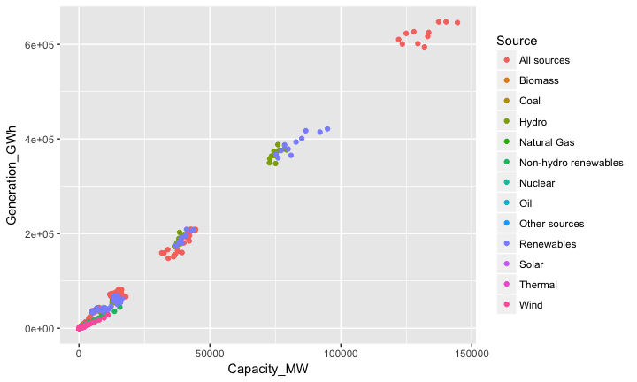
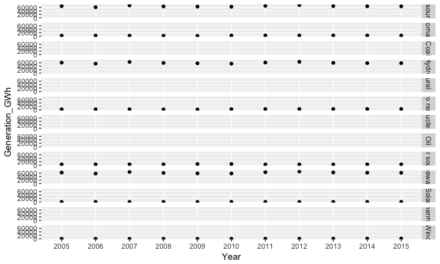
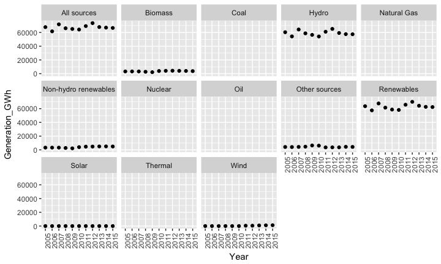

# Renewable Energy and Sustainable Infrastructure
PRISMS  
November, 2017  


## Data Description
http://open.canada.ca/data/en/dataset/7e50d70e-f462-48ea-97f5-6c0bc48cfd14 

## Load Library

```r
library(readr)
library(dplyr)
```

```
## 
## Attaching package: 'dplyr'
```

```
## The following objects are masked from 'package:stats':
## 
##     filter, lag
```

```
## The following objects are masked from 'package:base':
## 
##     intersect, setdiff, setequal, union
```

```r
library(tidyr)
library(ggplot2)
library(knitr)
library(kableExtra)
```

## Import Datasets

```r
RE_Capacity <- read_csv("Data/Renewable_energy_Capacity.csv")
RE_Generation <- read_csv("Data/Renewable_energy_Generation.csv")
RE_Dictionary <- read_csv("Data/RE_Dictionary.csv")
```

## Tidy Datasets

```r
RE_Capacity <- RE_Capacity %>%
  rename(Data_Capacity = Data) %>%
  unite(RSV, Region, Source, Year)

RE_Generation <- RE_Generation %>%
  rename(Data_Generation = Data) %>%
  unite(RSV, Region, Source, Year)

RE_Full <- full_join(RE_Capacity, RE_Generation, by = "RSV") %>%
  separate(RSV, into = c("Region", "Source", "Year"), sep = "_") %>%
  rename(Capacity_MW = Data_Capacity) %>%
  rename(Generation_GWh = Data_Generation) %>%
  select(-Unit.x, -Unit.y)
```

## Renewable Energy Dataset

```r
kable(RE_Full, "html") %>%
  kable_styling(bootstrap_options = c("striped", "hover", "condensed", "responsive")) %>%
  scroll_box(width = "100%", height = "400px")
```

<div style="border: 1px solid #ddd; padding: 5px; overflow-y: scroll; height:400px; overflow-x: scroll; width:100%; "><table class="table table-striped table-hover table-condensed table-responsive" style="margin-left: auto; margin-right: auto;">
<thead><tr>
<th style="text-align:left;"> Region </th>
   <th style="text-align:left;"> Source </th>
   <th style="text-align:left;"> Year </th>
   <th style="text-align:right;"> Capacity_MW </th>
   <th style="text-align:right;"> Generation_GWh </th>
  </tr></thead>
<tbody>
<tr>
<td style="text-align:left;"> BC </td>
   <td style="text-align:left;"> Biomass </td>
   <td style="text-align:left;"> 2005 </td>
   <td style="text-align:right;"> 810.920 </td>
   <td style="text-align:right;"> 3254.00000 </td>
  </tr>
<tr>
<td style="text-align:left;"> BC </td>
   <td style="text-align:left;"> Biomass </td>
   <td style="text-align:left;"> 2006 </td>
   <td style="text-align:right;"> 810.920 </td>
   <td style="text-align:right;"> 3254.00000 </td>
  </tr>
<tr>
<td style="text-align:left;"> BC </td>
   <td style="text-align:left;"> Biomass </td>
   <td style="text-align:left;"> 2007 </td>
   <td style="text-align:right;"> 810.920 </td>
   <td style="text-align:right;"> 3254.00000 </td>
  </tr>
<tr>
<td style="text-align:left;"> BC </td>
   <td style="text-align:left;"> Biomass </td>
   <td style="text-align:left;"> 2008 </td>
   <td style="text-align:right;"> 810.920 </td>
   <td style="text-align:right;"> 2739.00000 </td>
  </tr>
<tr>
<td style="text-align:left;"> BC </td>
   <td style="text-align:left;"> Biomass </td>
   <td style="text-align:left;"> 2009 </td>
   <td style="text-align:right;"> 810.920 </td>
   <td style="text-align:right;"> 2163.00000 </td>
  </tr>
<tr>
<td style="text-align:left;"> BC </td>
   <td style="text-align:left;"> Biomass </td>
   <td style="text-align:left;"> 2010 </td>
   <td style="text-align:right;"> 858.920 </td>
   <td style="text-align:right;"> 3848.00000 </td>
  </tr>
<tr>
<td style="text-align:left;"> BC </td>
   <td style="text-align:left;"> Biomass </td>
   <td style="text-align:left;"> 2011 </td>
   <td style="text-align:right;"> 860.190 </td>
   <td style="text-align:right;"> 4165.00000 </td>
  </tr>
<tr>
<td style="text-align:left;"> BC </td>
   <td style="text-align:left;"> Biomass </td>
   <td style="text-align:left;"> 2012 </td>
   <td style="text-align:right;"> 860.190 </td>
   <td style="text-align:right;"> 4289.00000 </td>
  </tr>
<tr>
<td style="text-align:left;"> BC </td>
   <td style="text-align:left;"> Biomass </td>
   <td style="text-align:left;"> 2013 </td>
   <td style="text-align:right;"> 885.590 </td>
   <td style="text-align:right;"> 4121.00000 </td>
  </tr>
<tr>
<td style="text-align:left;"> BC </td>
   <td style="text-align:left;"> Biomass </td>
   <td style="text-align:left;"> 2014 </td>
   <td style="text-align:right;"> 885.590 </td>
   <td style="text-align:right;"> 3964.00000 </td>
  </tr>
<tr>
<td style="text-align:left;"> BC </td>
   <td style="text-align:left;"> Biomass </td>
   <td style="text-align:left;"> 2015 </td>
   <td style="text-align:right;"> 885.590 </td>
   <td style="text-align:right;"> 3711.00000 </td>
  </tr>
<tr>
<td style="text-align:left;"> AB </td>
   <td style="text-align:left;"> Biomass </td>
   <td style="text-align:left;"> 2005 </td>
   <td style="text-align:right;"> 271.000 </td>
   <td style="text-align:right;"> 1725.16800 </td>
  </tr>
<tr>
<td style="text-align:left;"> AB </td>
   <td style="text-align:left;"> Biomass </td>
   <td style="text-align:left;"> 2006 </td>
   <td style="text-align:right;"> 313.100 </td>
   <td style="text-align:right;"> 1855.16900 </td>
  </tr>
<tr>
<td style="text-align:left;"> AB </td>
   <td style="text-align:left;"> Biomass </td>
   <td style="text-align:left;"> 2007 </td>
   <td style="text-align:right;"> 313.100 </td>
   <td style="text-align:right;"> 1870.36200 </td>
  </tr>
<tr>
<td style="text-align:left;"> AB </td>
   <td style="text-align:left;"> Biomass </td>
   <td style="text-align:left;"> 2008 </td>
   <td style="text-align:right;"> 313.100 </td>
   <td style="text-align:right;"> 1917.38800 </td>
  </tr>
<tr>
<td style="text-align:left;"> AB </td>
   <td style="text-align:left;"> Biomass </td>
   <td style="text-align:left;"> 2009 </td>
   <td style="text-align:right;"> 323.200 </td>
   <td style="text-align:right;"> 1861.50000 </td>
  </tr>
<tr>
<td style="text-align:left;"> AB </td>
   <td style="text-align:left;"> Biomass </td>
   <td style="text-align:left;"> 2010 </td>
   <td style="text-align:right;"> 340.200 </td>
   <td style="text-align:right;"> 1908.77700 </td>
  </tr>
<tr>
<td style="text-align:left;"> AB </td>
   <td style="text-align:left;"> Biomass </td>
   <td style="text-align:left;"> 2011 </td>
   <td style="text-align:right;"> 358.697 </td>
   <td style="text-align:right;"> 1972.19000 </td>
  </tr>
<tr>
<td style="text-align:left;"> AB </td>
   <td style="text-align:left;"> Biomass </td>
   <td style="text-align:left;"> 2012 </td>
   <td style="text-align:right;"> 413.797 </td>
   <td style="text-align:right;"> 2089.11769 </td>
  </tr>
<tr>
<td style="text-align:left;"> AB </td>
   <td style="text-align:left;"> Biomass </td>
   <td style="text-align:left;"> 2013 </td>
   <td style="text-align:right;"> 416.646 </td>
   <td style="text-align:right;"> 2250.10000 </td>
  </tr>
<tr>
<td style="text-align:left;"> AB </td>
   <td style="text-align:left;"> Biomass </td>
   <td style="text-align:left;"> 2014 </td>
   <td style="text-align:right;"> 438.300 </td>
   <td style="text-align:right;"> 2065.20000 </td>
  </tr>
<tr>
<td style="text-align:left;"> AB </td>
   <td style="text-align:left;"> Biomass </td>
   <td style="text-align:left;"> 2015 </td>
   <td style="text-align:right;"> 428.000 </td>
   <td style="text-align:right;"> 2148.50000 </td>
  </tr>
<tr>
<td style="text-align:left;"> SK </td>
   <td style="text-align:left;"> Biomass </td>
   <td style="text-align:left;"> 2005 </td>
   <td style="text-align:right;"> 0.000 </td>
   <td style="text-align:right;"> 0.00000 </td>
  </tr>
<tr>
<td style="text-align:left;"> SK </td>
   <td style="text-align:left;"> Biomass </td>
   <td style="text-align:left;"> 2006 </td>
   <td style="text-align:right;"> 0.000 </td>
   <td style="text-align:right;"> 0.00000 </td>
  </tr>
<tr>
<td style="text-align:left;"> SK </td>
   <td style="text-align:left;"> Biomass </td>
   <td style="text-align:left;"> 2007 </td>
   <td style="text-align:right;"> 0.000 </td>
   <td style="text-align:right;"> 0.00000 </td>
  </tr>
<tr>
<td style="text-align:left;"> SK </td>
   <td style="text-align:left;"> Biomass </td>
   <td style="text-align:left;"> 2008 </td>
   <td style="text-align:right;"> 0.000 </td>
   <td style="text-align:right;"> 0.00000 </td>
  </tr>
<tr>
<td style="text-align:left;"> SK </td>
   <td style="text-align:left;"> Biomass </td>
   <td style="text-align:left;"> 2009 </td>
   <td style="text-align:right;"> 0.000 </td>
   <td style="text-align:right;"> 0.00000 </td>
  </tr>
<tr>
<td style="text-align:left;"> SK </td>
   <td style="text-align:left;"> Biomass </td>
   <td style="text-align:left;"> 2010 </td>
   <td style="text-align:right;"> 0.000 </td>
   <td style="text-align:right;"> 0.00000 </td>
  </tr>
<tr>
<td style="text-align:left;"> SK </td>
   <td style="text-align:left;"> Biomass </td>
   <td style="text-align:left;"> 2011 </td>
   <td style="text-align:right;"> 0.000 </td>
   <td style="text-align:right;"> 0.00000 </td>
  </tr>
<tr>
<td style="text-align:left;"> SK </td>
   <td style="text-align:left;"> Biomass </td>
   <td style="text-align:left;"> 2012 </td>
   <td style="text-align:right;"> 0.000 </td>
   <td style="text-align:right;"> 0.00000 </td>
  </tr>
<tr>
<td style="text-align:left;"> SK </td>
   <td style="text-align:left;"> Biomass </td>
   <td style="text-align:left;"> 2013 </td>
   <td style="text-align:right;"> 0.000 </td>
   <td style="text-align:right;"> 0.00000 </td>
  </tr>
<tr>
<td style="text-align:left;"> SK </td>
   <td style="text-align:left;"> Biomass </td>
   <td style="text-align:left;"> 2014 </td>
   <td style="text-align:right;"> 1.600 </td>
   <td style="text-align:right;"> 0.00000 </td>
  </tr>
<tr>
<td style="text-align:left;"> SK </td>
   <td style="text-align:left;"> Biomass </td>
   <td style="text-align:left;"> 2015 </td>
   <td style="text-align:right;"> 1.600 </td>
   <td style="text-align:right;"> 0.00000 </td>
  </tr>
<tr>
<td style="text-align:left;"> MB </td>
   <td style="text-align:left;"> Biomass </td>
   <td style="text-align:left;"> 2005 </td>
   <td style="text-align:right;"> 22.000 </td>
   <td style="text-align:right;"> 27.43320 </td>
  </tr>
<tr>
<td style="text-align:left;"> MB </td>
   <td style="text-align:left;"> Biomass </td>
   <td style="text-align:left;"> 2006 </td>
   <td style="text-align:right;"> 22.000 </td>
   <td style="text-align:right;"> 32.47250 </td>
  </tr>
<tr>
<td style="text-align:left;"> MB </td>
   <td style="text-align:left;"> Biomass </td>
   <td style="text-align:left;"> 2007 </td>
   <td style="text-align:right;"> 22.000 </td>
   <td style="text-align:right;"> 26.87160 </td>
  </tr>
<tr>
<td style="text-align:left;"> MB </td>
   <td style="text-align:left;"> Biomass </td>
   <td style="text-align:left;"> 2008 </td>
   <td style="text-align:right;"> 22.000 </td>
   <td style="text-align:right;"> 38.12960 </td>
  </tr>
<tr>
<td style="text-align:left;"> MB </td>
   <td style="text-align:left;"> Biomass </td>
   <td style="text-align:left;"> 2009 </td>
   <td style="text-align:right;"> 22.000 </td>
   <td style="text-align:right;"> 0.00000 </td>
  </tr>
<tr>
<td style="text-align:left;"> MB </td>
   <td style="text-align:left;"> Biomass </td>
   <td style="text-align:left;"> 2010 </td>
   <td style="text-align:right;"> 22.000 </td>
   <td style="text-align:right;"> 0.00000 </td>
  </tr>
<tr>
<td style="text-align:left;"> MB </td>
   <td style="text-align:left;"> Biomass </td>
   <td style="text-align:left;"> 2011 </td>
   <td style="text-align:right;"> 22.000 </td>
   <td style="text-align:right;"> 0.00000 </td>
  </tr>
<tr>
<td style="text-align:left;"> MB </td>
   <td style="text-align:left;"> Biomass </td>
   <td style="text-align:left;"> 2012 </td>
   <td style="text-align:right;"> 22.000 </td>
   <td style="text-align:right;"> 38.67690 </td>
  </tr>
<tr>
<td style="text-align:left;"> MB </td>
   <td style="text-align:left;"> Biomass </td>
   <td style="text-align:left;"> 2013 </td>
   <td style="text-align:right;"> 22.000 </td>
   <td style="text-align:right;"> 41.86550 </td>
  </tr>
<tr>
<td style="text-align:left;"> MB </td>
   <td style="text-align:left;"> Biomass </td>
   <td style="text-align:left;"> 2014 </td>
   <td style="text-align:right;"> 22.000 </td>
   <td style="text-align:right;"> 44.67350 </td>
  </tr>
<tr>
<td style="text-align:left;"> MB </td>
   <td style="text-align:left;"> Biomass </td>
   <td style="text-align:left;"> 2015 </td>
   <td style="text-align:right;"> 22.000 </td>
   <td style="text-align:right;"> 44.94140 </td>
  </tr>
<tr>
<td style="text-align:left;"> ON </td>
   <td style="text-align:left;"> Biomass </td>
   <td style="text-align:left;"> 2005 </td>
   <td style="text-align:right;"> 209.000 </td>
   <td style="text-align:right;"> 1251.61400 </td>
  </tr>
<tr>
<td style="text-align:left;"> ON </td>
   <td style="text-align:left;"> Biomass </td>
   <td style="text-align:left;"> 2006 </td>
   <td style="text-align:right;"> 176.000 </td>
   <td style="text-align:right;"> 1251.61400 </td>
  </tr>
<tr>
<td style="text-align:left;"> ON </td>
   <td style="text-align:left;"> Biomass </td>
   <td style="text-align:left;"> 2007 </td>
   <td style="text-align:right;"> 176.000 </td>
   <td style="text-align:right;"> 1251.61400 </td>
  </tr>
<tr>
<td style="text-align:left;"> ON </td>
   <td style="text-align:left;"> Biomass </td>
   <td style="text-align:left;"> 2008 </td>
   <td style="text-align:right;"> 148.000 </td>
   <td style="text-align:right;"> 2668.61600 </td>
  </tr>
<tr>
<td style="text-align:left;"> ON </td>
   <td style="text-align:left;"> Biomass </td>
   <td style="text-align:left;"> 2009 </td>
   <td style="text-align:right;"> 207.000 </td>
   <td style="text-align:right;"> 1159.35980 </td>
  </tr>
<tr>
<td style="text-align:left;"> ON </td>
   <td style="text-align:left;"> Biomass </td>
   <td style="text-align:left;"> 2010 </td>
   <td style="text-align:right;"> 207.000 </td>
   <td style="text-align:right;"> 1322.06600 </td>
  </tr>
<tr>
<td style="text-align:left;"> ON </td>
   <td style="text-align:left;"> Biomass </td>
   <td style="text-align:left;"> 2011 </td>
   <td style="text-align:right;"> 207.000 </td>
   <td style="text-align:right;"> 1206.44820 </td>
  </tr>
<tr>
<td style="text-align:left;"> ON </td>
   <td style="text-align:left;"> Biomass </td>
   <td style="text-align:left;"> 2012 </td>
   <td style="text-align:right;"> 207.000 </td>
   <td style="text-align:right;"> 1242.51950 </td>
  </tr>
<tr>
<td style="text-align:left;"> ON </td>
   <td style="text-align:left;"> Biomass </td>
   <td style="text-align:left;"> 2013 </td>
   <td style="text-align:right;"> 207.000 </td>
   <td style="text-align:right;"> 1701.64950 </td>
  </tr>
<tr>
<td style="text-align:left;"> ON </td>
   <td style="text-align:left;"> Biomass </td>
   <td style="text-align:left;"> 2014 </td>
   <td style="text-align:right;"> 592.000 </td>
   <td style="text-align:right;"> 2962.21380 </td>
  </tr>
<tr>
<td style="text-align:left;"> ON </td>
   <td style="text-align:left;"> Biomass </td>
   <td style="text-align:left;"> 2015 </td>
   <td style="text-align:right;"> 574.000 </td>
   <td style="text-align:right;"> 3898.58370 </td>
  </tr>
<tr>
<td style="text-align:left;"> QC </td>
   <td style="text-align:left;"> Biomass </td>
   <td style="text-align:left;"> 2005 </td>
   <td style="text-align:right;"> 278.160 </td>
   <td style="text-align:right;"> 646.00000 </td>
  </tr>
<tr>
<td style="text-align:left;"> QC </td>
   <td style="text-align:left;"> Biomass </td>
   <td style="text-align:left;"> 2006 </td>
   <td style="text-align:right;"> 278.160 </td>
   <td style="text-align:right;"> 646.00000 </td>
  </tr>
<tr>
<td style="text-align:left;"> QC </td>
   <td style="text-align:left;"> Biomass </td>
   <td style="text-align:left;"> 2007 </td>
   <td style="text-align:right;"> 278.160 </td>
   <td style="text-align:right;"> 646.00000 </td>
  </tr>
<tr>
<td style="text-align:left;"> QC </td>
   <td style="text-align:left;"> Biomass </td>
   <td style="text-align:left;"> 2008 </td>
   <td style="text-align:right;"> 229.660 </td>
   <td style="text-align:right;"> 439.00000 </td>
  </tr>
<tr>
<td style="text-align:left;"> QC </td>
   <td style="text-align:left;"> Biomass </td>
   <td style="text-align:left;"> 2009 </td>
   <td style="text-align:right;"> 229.660 </td>
   <td style="text-align:right;"> 550.00000 </td>
  </tr>
<tr>
<td style="text-align:left;"> QC </td>
   <td style="text-align:left;"> Biomass </td>
   <td style="text-align:left;"> 2010 </td>
   <td style="text-align:right;"> 229.660 </td>
   <td style="text-align:right;"> 844.00000 </td>
  </tr>
<tr>
<td style="text-align:left;"> QC </td>
   <td style="text-align:left;"> Biomass </td>
   <td style="text-align:left;"> 2011 </td>
   <td style="text-align:right;"> 239.640 </td>
   <td style="text-align:right;"> 1089.00000 </td>
  </tr>
<tr>
<td style="text-align:left;"> QC </td>
   <td style="text-align:left;"> Biomass </td>
   <td style="text-align:left;"> 2012 </td>
   <td style="text-align:right;"> 239.640 </td>
   <td style="text-align:right;"> 1233.00000 </td>
  </tr>
<tr>
<td style="text-align:left;"> QC </td>
   <td style="text-align:left;"> Biomass </td>
   <td style="text-align:left;"> 2013 </td>
   <td style="text-align:right;"> 239.640 </td>
   <td style="text-align:right;"> 1614.00000 </td>
  </tr>
<tr>
<td style="text-align:left;"> QC </td>
   <td style="text-align:left;"> Biomass </td>
   <td style="text-align:left;"> 2014 </td>
   <td style="text-align:right;"> 239.640 </td>
   <td style="text-align:right;"> 1724.00000 </td>
  </tr>
<tr>
<td style="text-align:left;"> QC </td>
   <td style="text-align:left;"> Biomass </td>
   <td style="text-align:left;"> 2015 </td>
   <td style="text-align:right;"> 244.840 </td>
   <td style="text-align:right;"> 2053.00000 </td>
  </tr>
<tr>
<td style="text-align:left;"> NB </td>
   <td style="text-align:left;"> Biomass </td>
   <td style="text-align:left;"> 2005 </td>
   <td style="text-align:right;"> 127.300 </td>
   <td style="text-align:right;"> 653.00000 </td>
  </tr>
<tr>
<td style="text-align:left;"> NB </td>
   <td style="text-align:left;"> Biomass </td>
   <td style="text-align:left;"> 2006 </td>
   <td style="text-align:right;"> 127.300 </td>
   <td style="text-align:right;"> 653.00000 </td>
  </tr>
<tr>
<td style="text-align:left;"> NB </td>
   <td style="text-align:left;"> Biomass </td>
   <td style="text-align:left;"> 2007 </td>
   <td style="text-align:right;"> 127.300 </td>
   <td style="text-align:right;"> 653.00000 </td>
  </tr>
<tr>
<td style="text-align:left;"> NB </td>
   <td style="text-align:left;"> Biomass </td>
   <td style="text-align:left;"> 2008 </td>
   <td style="text-align:right;"> 127.300 </td>
   <td style="text-align:right;"> 672.00000 </td>
  </tr>
<tr>
<td style="text-align:left;"> NB </td>
   <td style="text-align:left;"> Biomass </td>
   <td style="text-align:left;"> 2009 </td>
   <td style="text-align:right;"> 127.300 </td>
   <td style="text-align:right;"> 664.00000 </td>
  </tr>
<tr>
<td style="text-align:left;"> NB </td>
   <td style="text-align:left;"> Biomass </td>
   <td style="text-align:left;"> 2010 </td>
   <td style="text-align:right;"> 127.300 </td>
   <td style="text-align:right;"> 577.00000 </td>
  </tr>
<tr>
<td style="text-align:left;"> NB </td>
   <td style="text-align:left;"> Biomass </td>
   <td style="text-align:left;"> 2011 </td>
   <td style="text-align:right;"> 127.300 </td>
   <td style="text-align:right;"> 565.00000 </td>
  </tr>
<tr>
<td style="text-align:left;"> NB </td>
   <td style="text-align:left;"> Biomass </td>
   <td style="text-align:left;"> 2012 </td>
   <td style="text-align:right;"> 127.300 </td>
   <td style="text-align:right;"> 574.00000 </td>
  </tr>
<tr>
<td style="text-align:left;"> NB </td>
   <td style="text-align:left;"> Biomass </td>
   <td style="text-align:left;"> 2013 </td>
   <td style="text-align:right;"> 127.300 </td>
   <td style="text-align:right;"> 550.00000 </td>
  </tr>
<tr>
<td style="text-align:left;"> NB </td>
   <td style="text-align:left;"> Biomass </td>
   <td style="text-align:left;"> 2014 </td>
   <td style="text-align:right;"> 127.300 </td>
   <td style="text-align:right;"> 606.00000 </td>
  </tr>
<tr>
<td style="text-align:left;"> NB </td>
   <td style="text-align:left;"> Biomass </td>
   <td style="text-align:left;"> 2015 </td>
   <td style="text-align:right;"> 127.300 </td>
   <td style="text-align:right;"> 606.00000 </td>
  </tr>
<tr>
<td style="text-align:left;"> NS </td>
   <td style="text-align:left;"> Biomass </td>
   <td style="text-align:left;"> 2005 </td>
   <td style="text-align:right;"> 68.620 </td>
   <td style="text-align:right;"> 317.80150 </td>
  </tr>
<tr>
<td style="text-align:left;"> NS </td>
   <td style="text-align:left;"> Biomass </td>
   <td style="text-align:left;"> 2006 </td>
   <td style="text-align:right;"> 66.120 </td>
   <td style="text-align:right;"> 317.80150 </td>
  </tr>
<tr>
<td style="text-align:left;"> NS </td>
   <td style="text-align:left;"> Biomass </td>
   <td style="text-align:left;"> 2007 </td>
   <td style="text-align:right;"> 66.120 </td>
   <td style="text-align:right;"> 317.80150 </td>
  </tr>
<tr>
<td style="text-align:left;"> NS </td>
   <td style="text-align:left;"> Biomass </td>
   <td style="text-align:left;"> 2008 </td>
   <td style="text-align:right;"> 66.120 </td>
   <td style="text-align:right;"> 322.10350 </td>
  </tr>
<tr>
<td style="text-align:left;"> NS </td>
   <td style="text-align:left;"> Biomass </td>
   <td style="text-align:left;"> 2009 </td>
   <td style="text-align:right;"> 66.120 </td>
   <td style="text-align:right;"> 244.82110 </td>
  </tr>
<tr>
<td style="text-align:left;"> NS </td>
   <td style="text-align:left;"> Biomass </td>
   <td style="text-align:left;"> 2010 </td>
   <td style="text-align:right;"> 66.120 </td>
   <td style="text-align:right;"> 378.40910 </td>
  </tr>
<tr>
<td style="text-align:left;"> NS </td>
   <td style="text-align:left;"> Biomass </td>
   <td style="text-align:left;"> 2011 </td>
   <td style="text-align:right;"> 66.120 </td>
   <td style="text-align:right;"> 362.73330 </td>
  </tr>
<tr>
<td style="text-align:left;"> NS </td>
   <td style="text-align:left;"> Biomass </td>
   <td style="text-align:left;"> 2012 </td>
   <td style="text-align:right;"> 66.120 </td>
   <td style="text-align:right;"> 386.65500 </td>
  </tr>
<tr>
<td style="text-align:left;"> NS </td>
   <td style="text-align:left;"> Biomass </td>
   <td style="text-align:left;"> 2013 </td>
   <td style="text-align:right;"> 66.120 </td>
   <td style="text-align:right;"> 330.86410 </td>
  </tr>
<tr>
<td style="text-align:left;"> NS </td>
   <td style="text-align:left;"> Biomass </td>
   <td style="text-align:left;"> 2014 </td>
   <td style="text-align:right;"> 112.560 </td>
   <td style="text-align:right;"> 648.05560 </td>
  </tr>
<tr>
<td style="text-align:left;"> NS </td>
   <td style="text-align:left;"> Biomass </td>
   <td style="text-align:left;"> 2015 </td>
   <td style="text-align:right;"> 112.560 </td>
   <td style="text-align:right;"> 640.82950 </td>
  </tr>
<tr>
<td style="text-align:left;"> PE </td>
   <td style="text-align:left;"> Biomass </td>
   <td style="text-align:left;"> 2005 </td>
   <td style="text-align:right;"> 1.000 </td>
   <td style="text-align:right;"> 0.00000 </td>
  </tr>
<tr>
<td style="text-align:left;"> PE </td>
   <td style="text-align:left;"> Biomass </td>
   <td style="text-align:left;"> 2006 </td>
   <td style="text-align:right;"> 1.000 </td>
   <td style="text-align:right;"> 0.00000 </td>
  </tr>
<tr>
<td style="text-align:left;"> PE </td>
   <td style="text-align:left;"> Biomass </td>
   <td style="text-align:left;"> 2007 </td>
   <td style="text-align:right;"> 1.000 </td>
   <td style="text-align:right;"> 0.00000 </td>
  </tr>
<tr>
<td style="text-align:left;"> PE </td>
   <td style="text-align:left;"> Biomass </td>
   <td style="text-align:left;"> 2008 </td>
   <td style="text-align:right;"> 1.000 </td>
   <td style="text-align:right;"> 5.45800 </td>
  </tr>
<tr>
<td style="text-align:left;"> PE </td>
   <td style="text-align:left;"> Biomass </td>
   <td style="text-align:left;"> 2009 </td>
   <td style="text-align:right;"> 1.000 </td>
   <td style="text-align:right;"> 4.81600 </td>
  </tr>
<tr>
<td style="text-align:left;"> PE </td>
   <td style="text-align:left;"> Biomass </td>
   <td style="text-align:left;"> 2010 </td>
   <td style="text-align:right;"> 1.000 </td>
   <td style="text-align:right;"> 5.07700 </td>
  </tr>
<tr>
<td style="text-align:left;"> PE </td>
   <td style="text-align:left;"> Biomass </td>
   <td style="text-align:left;"> 2011 </td>
   <td style="text-align:right;"> 1.000 </td>
   <td style="text-align:right;"> 5.11900 </td>
  </tr>
<tr>
<td style="text-align:left;"> PE </td>
   <td style="text-align:left;"> Biomass </td>
   <td style="text-align:left;"> 2012 </td>
   <td style="text-align:right;"> 1.000 </td>
   <td style="text-align:right;"> 4.99800 </td>
  </tr>
<tr>
<td style="text-align:left;"> PE </td>
   <td style="text-align:left;"> Biomass </td>
   <td style="text-align:left;"> 2013 </td>
   <td style="text-align:right;"> 1.000 </td>
   <td style="text-align:right;"> 4.89100 </td>
  </tr>
<tr>
<td style="text-align:left;"> PE </td>
   <td style="text-align:left;"> Biomass </td>
   <td style="text-align:left;"> 2014 </td>
   <td style="text-align:right;"> 1.000 </td>
   <td style="text-align:right;"> 6.56677 </td>
  </tr>
<tr>
<td style="text-align:left;"> PE </td>
   <td style="text-align:left;"> Biomass </td>
   <td style="text-align:left;"> 2015 </td>
   <td style="text-align:right;"> 1.000 </td>
   <td style="text-align:right;"> 4.36073 </td>
  </tr>
<tr>
<td style="text-align:left;"> NF </td>
   <td style="text-align:left;"> Biomass </td>
   <td style="text-align:left;"> 2005 </td>
   <td style="text-align:right;"> 0.000 </td>
   <td style="text-align:right;"> 0.00000 </td>
  </tr>
<tr>
<td style="text-align:left;"> NF </td>
   <td style="text-align:left;"> Biomass </td>
   <td style="text-align:left;"> 2006 </td>
   <td style="text-align:right;"> 0.000 </td>
   <td style="text-align:right;"> 0.00000 </td>
  </tr>
<tr>
<td style="text-align:left;"> NF </td>
   <td style="text-align:left;"> Biomass </td>
   <td style="text-align:left;"> 2007 </td>
   <td style="text-align:right;"> 0.000 </td>
   <td style="text-align:right;"> 0.00000 </td>
  </tr>
<tr>
<td style="text-align:left;"> NF </td>
   <td style="text-align:left;"> Biomass </td>
   <td style="text-align:left;"> 2008 </td>
   <td style="text-align:right;"> 0.000 </td>
   <td style="text-align:right;"> 0.00000 </td>
  </tr>
<tr>
<td style="text-align:left;"> NF </td>
   <td style="text-align:left;"> Biomass </td>
   <td style="text-align:left;"> 2009 </td>
   <td style="text-align:right;"> 0.000 </td>
   <td style="text-align:right;"> 0.00000 </td>
  </tr>
<tr>
<td style="text-align:left;"> NF </td>
   <td style="text-align:left;"> Biomass </td>
   <td style="text-align:left;"> 2010 </td>
   <td style="text-align:right;"> 0.000 </td>
   <td style="text-align:right;"> 0.00000 </td>
  </tr>
<tr>
<td style="text-align:left;"> NF </td>
   <td style="text-align:left;"> Biomass </td>
   <td style="text-align:left;"> 2011 </td>
   <td style="text-align:right;"> 0.000 </td>
   <td style="text-align:right;"> 0.00000 </td>
  </tr>
<tr>
<td style="text-align:left;"> NF </td>
   <td style="text-align:left;"> Biomass </td>
   <td style="text-align:left;"> 2012 </td>
   <td style="text-align:right;"> 0.000 </td>
   <td style="text-align:right;"> 0.00000 </td>
  </tr>
<tr>
<td style="text-align:left;"> NF </td>
   <td style="text-align:left;"> Biomass </td>
   <td style="text-align:left;"> 2013 </td>
   <td style="text-align:right;"> 0.000 </td>
   <td style="text-align:right;"> 0.00000 </td>
  </tr>
<tr>
<td style="text-align:left;"> NF </td>
   <td style="text-align:left;"> Biomass </td>
   <td style="text-align:left;"> 2014 </td>
   <td style="text-align:right;"> 0.000 </td>
   <td style="text-align:right;"> 0.00000 </td>
  </tr>
<tr>
<td style="text-align:left;"> NF </td>
   <td style="text-align:left;"> Biomass </td>
   <td style="text-align:left;"> 2015 </td>
   <td style="text-align:right;"> 0.000 </td>
   <td style="text-align:right;"> 0.00000 </td>
  </tr>
<tr>
<td style="text-align:left;"> NWT </td>
   <td style="text-align:left;"> Biomass </td>
   <td style="text-align:left;"> 2005 </td>
   <td style="text-align:right;"> 0.000 </td>
   <td style="text-align:right;"> 0.00000 </td>
  </tr>
<tr>
<td style="text-align:left;"> NWT </td>
   <td style="text-align:left;"> Biomass </td>
   <td style="text-align:left;"> 2006 </td>
   <td style="text-align:right;"> 0.000 </td>
   <td style="text-align:right;"> 0.00000 </td>
  </tr>
<tr>
<td style="text-align:left;"> NWT </td>
   <td style="text-align:left;"> Biomass </td>
   <td style="text-align:left;"> 2007 </td>
   <td style="text-align:right;"> 0.000 </td>
   <td style="text-align:right;"> 0.00000 </td>
  </tr>
<tr>
<td style="text-align:left;"> NWT </td>
   <td style="text-align:left;"> Biomass </td>
   <td style="text-align:left;"> 2008 </td>
   <td style="text-align:right;"> 0.000 </td>
   <td style="text-align:right;"> 0.00000 </td>
  </tr>
<tr>
<td style="text-align:left;"> NWT </td>
   <td style="text-align:left;"> Biomass </td>
   <td style="text-align:left;"> 2009 </td>
   <td style="text-align:right;"> 0.000 </td>
   <td style="text-align:right;"> 0.00000 </td>
  </tr>
<tr>
<td style="text-align:left;"> NWT </td>
   <td style="text-align:left;"> Biomass </td>
   <td style="text-align:left;"> 2010 </td>
   <td style="text-align:right;"> 0.000 </td>
   <td style="text-align:right;"> 0.00000 </td>
  </tr>
<tr>
<td style="text-align:left;"> NWT </td>
   <td style="text-align:left;"> Biomass </td>
   <td style="text-align:left;"> 2011 </td>
   <td style="text-align:right;"> 0.000 </td>
   <td style="text-align:right;"> 0.00000 </td>
  </tr>
<tr>
<td style="text-align:left;"> NWT </td>
   <td style="text-align:left;"> Biomass </td>
   <td style="text-align:left;"> 2012 </td>
   <td style="text-align:right;"> 0.000 </td>
   <td style="text-align:right;"> 0.00000 </td>
  </tr>
<tr>
<td style="text-align:left;"> NWT </td>
   <td style="text-align:left;"> Biomass </td>
   <td style="text-align:left;"> 2013 </td>
   <td style="text-align:right;"> 0.000 </td>
   <td style="text-align:right;"> 0.00000 </td>
  </tr>
<tr>
<td style="text-align:left;"> NWT </td>
   <td style="text-align:left;"> Biomass </td>
   <td style="text-align:left;"> 2014 </td>
   <td style="text-align:right;"> 0.000 </td>
   <td style="text-align:right;"> 0.00000 </td>
  </tr>
<tr>
<td style="text-align:left;"> NWT </td>
   <td style="text-align:left;"> Biomass </td>
   <td style="text-align:left;"> 2015 </td>
   <td style="text-align:right;"> 0.000 </td>
   <td style="text-align:right;"> 0.00000 </td>
  </tr>
<tr>
<td style="text-align:left;"> YT </td>
   <td style="text-align:left;"> Biomass </td>
   <td style="text-align:left;"> 2005 </td>
   <td style="text-align:right;"> 0.000 </td>
   <td style="text-align:right;"> 0.00000 </td>
  </tr>
<tr>
<td style="text-align:left;"> YT </td>
   <td style="text-align:left;"> Biomass </td>
   <td style="text-align:left;"> 2006 </td>
   <td style="text-align:right;"> 0.000 </td>
   <td style="text-align:right;"> 0.00000 </td>
  </tr>
<tr>
<td style="text-align:left;"> YT </td>
   <td style="text-align:left;"> Biomass </td>
   <td style="text-align:left;"> 2007 </td>
   <td style="text-align:right;"> 0.000 </td>
   <td style="text-align:right;"> 0.00000 </td>
  </tr>
<tr>
<td style="text-align:left;"> YT </td>
   <td style="text-align:left;"> Biomass </td>
   <td style="text-align:left;"> 2008 </td>
   <td style="text-align:right;"> 0.000 </td>
   <td style="text-align:right;"> 0.00000 </td>
  </tr>
<tr>
<td style="text-align:left;"> YT </td>
   <td style="text-align:left;"> Biomass </td>
   <td style="text-align:left;"> 2009 </td>
   <td style="text-align:right;"> 0.000 </td>
   <td style="text-align:right;"> 0.00000 </td>
  </tr>
<tr>
<td style="text-align:left;"> YT </td>
   <td style="text-align:left;"> Biomass </td>
   <td style="text-align:left;"> 2010 </td>
   <td style="text-align:right;"> 0.000 </td>
   <td style="text-align:right;"> 0.00000 </td>
  </tr>
<tr>
<td style="text-align:left;"> YT </td>
   <td style="text-align:left;"> Biomass </td>
   <td style="text-align:left;"> 2011 </td>
   <td style="text-align:right;"> 0.000 </td>
   <td style="text-align:right;"> 0.00000 </td>
  </tr>
<tr>
<td style="text-align:left;"> YT </td>
   <td style="text-align:left;"> Biomass </td>
   <td style="text-align:left;"> 2012 </td>
   <td style="text-align:right;"> 0.000 </td>
   <td style="text-align:right;"> 0.00000 </td>
  </tr>
<tr>
<td style="text-align:left;"> YT </td>
   <td style="text-align:left;"> Biomass </td>
   <td style="text-align:left;"> 2013 </td>
   <td style="text-align:right;"> 0.000 </td>
   <td style="text-align:right;"> 0.00000 </td>
  </tr>
<tr>
<td style="text-align:left;"> YT </td>
   <td style="text-align:left;"> Biomass </td>
   <td style="text-align:left;"> 2014 </td>
   <td style="text-align:right;"> 0.000 </td>
   <td style="text-align:right;"> 0.00000 </td>
  </tr>
<tr>
<td style="text-align:left;"> YT </td>
   <td style="text-align:left;"> Biomass </td>
   <td style="text-align:left;"> 2015 </td>
   <td style="text-align:right;"> 0.000 </td>
   <td style="text-align:right;"> 0.00000 </td>
  </tr>
<tr>
<td style="text-align:left;"> NU </td>
   <td style="text-align:left;"> Biomass </td>
   <td style="text-align:left;"> 2005 </td>
   <td style="text-align:right;"> 0.000 </td>
   <td style="text-align:right;"> 0.00000 </td>
  </tr>
<tr>
<td style="text-align:left;"> NU </td>
   <td style="text-align:left;"> Biomass </td>
   <td style="text-align:left;"> 2006 </td>
   <td style="text-align:right;"> 0.000 </td>
   <td style="text-align:right;"> 0.00000 </td>
  </tr>
<tr>
<td style="text-align:left;"> NU </td>
   <td style="text-align:left;"> Biomass </td>
   <td style="text-align:left;"> 2007 </td>
   <td style="text-align:right;"> 0.000 </td>
   <td style="text-align:right;"> 0.00000 </td>
  </tr>
<tr>
<td style="text-align:left;"> NU </td>
   <td style="text-align:left;"> Biomass </td>
   <td style="text-align:left;"> 2008 </td>
   <td style="text-align:right;"> 0.000 </td>
   <td style="text-align:right;"> 0.00000 </td>
  </tr>
<tr>
<td style="text-align:left;"> NU </td>
   <td style="text-align:left;"> Biomass </td>
   <td style="text-align:left;"> 2009 </td>
   <td style="text-align:right;"> 0.000 </td>
   <td style="text-align:right;"> 0.00000 </td>
  </tr>
<tr>
<td style="text-align:left;"> NU </td>
   <td style="text-align:left;"> Biomass </td>
   <td style="text-align:left;"> 2010 </td>
   <td style="text-align:right;"> 0.000 </td>
   <td style="text-align:right;"> 0.00000 </td>
  </tr>
<tr>
<td style="text-align:left;"> NU </td>
   <td style="text-align:left;"> Biomass </td>
   <td style="text-align:left;"> 2011 </td>
   <td style="text-align:right;"> 0.000 </td>
   <td style="text-align:right;"> 0.00000 </td>
  </tr>
<tr>
<td style="text-align:left;"> NU </td>
   <td style="text-align:left;"> Biomass </td>
   <td style="text-align:left;"> 2012 </td>
   <td style="text-align:right;"> 0.000 </td>
   <td style="text-align:right;"> 0.00000 </td>
  </tr>
<tr>
<td style="text-align:left;"> NU </td>
   <td style="text-align:left;"> Biomass </td>
   <td style="text-align:left;"> 2013 </td>
   <td style="text-align:right;"> 0.000 </td>
   <td style="text-align:right;"> 0.00000 </td>
  </tr>
<tr>
<td style="text-align:left;"> NU </td>
   <td style="text-align:left;"> Biomass </td>
   <td style="text-align:left;"> 2014 </td>
   <td style="text-align:right;"> 0.000 </td>
   <td style="text-align:right;"> 0.00000 </td>
  </tr>
<tr>
<td style="text-align:left;"> NU </td>
   <td style="text-align:left;"> Biomass </td>
   <td style="text-align:left;"> 2015 </td>
   <td style="text-align:right;"> 0.000 </td>
   <td style="text-align:right;"> 0.00000 </td>
  </tr>
<tr>
<td style="text-align:left;"> Canada </td>
   <td style="text-align:left;"> Biomass </td>
   <td style="text-align:left;"> 2005 </td>
   <td style="text-align:right;"> 1788.000 </td>
   <td style="text-align:right;"> 7875.01670 </td>
  </tr>
<tr>
<td style="text-align:left;"> Canada </td>
   <td style="text-align:left;"> Biomass </td>
   <td style="text-align:left;"> 2006 </td>
   <td style="text-align:right;"> 1794.600 </td>
   <td style="text-align:right;"> 8010.05700 </td>
  </tr>
<tr>
<td style="text-align:left;"> Canada </td>
   <td style="text-align:left;"> Biomass </td>
   <td style="text-align:left;"> 2007 </td>
   <td style="text-align:right;"> 1794.600 </td>
   <td style="text-align:right;"> 8019.64910 </td>
  </tr>
<tr>
<td style="text-align:left;"> Canada </td>
   <td style="text-align:left;"> Biomass </td>
   <td style="text-align:left;"> 2008 </td>
   <td style="text-align:right;"> 1718.100 </td>
   <td style="text-align:right;"> 8801.69510 </td>
  </tr>
<tr>
<td style="text-align:left;"> Canada </td>
   <td style="text-align:left;"> Biomass </td>
   <td style="text-align:left;"> 2009 </td>
   <td style="text-align:right;"> 1787.200 </td>
   <td style="text-align:right;"> 6647.49690 </td>
  </tr>
<tr>
<td style="text-align:left;"> Canada </td>
   <td style="text-align:left;"> Biomass </td>
   <td style="text-align:left;"> 2010 </td>
   <td style="text-align:right;"> 1852.200 </td>
   <td style="text-align:right;"> 8883.32910 </td>
  </tr>
<tr>
<td style="text-align:left;"> Canada </td>
   <td style="text-align:left;"> Biomass </td>
   <td style="text-align:left;"> 2011 </td>
   <td style="text-align:right;"> 1881.947 </td>
   <td style="text-align:right;"> 9365.49050 </td>
  </tr>
<tr>
<td style="text-align:left;"> Canada </td>
   <td style="text-align:left;"> Biomass </td>
   <td style="text-align:left;"> 2012 </td>
   <td style="text-align:right;"> 1937.047 </td>
   <td style="text-align:right;"> 9857.96709 </td>
  </tr>
<tr>
<td style="text-align:left;"> Canada </td>
   <td style="text-align:left;"> Biomass </td>
   <td style="text-align:left;"> 2013 </td>
   <td style="text-align:right;"> 1965.296 </td>
   <td style="text-align:right;"> 10614.37010 </td>
  </tr>
<tr>
<td style="text-align:left;"> Canada </td>
   <td style="text-align:left;"> Biomass </td>
   <td style="text-align:left;"> 2014 </td>
   <td style="text-align:right;"> 2419.990 </td>
   <td style="text-align:right;"> 12020.70967 </td>
  </tr>
<tr>
<td style="text-align:left;"> Canada </td>
   <td style="text-align:left;"> Biomass </td>
   <td style="text-align:left;"> 2015 </td>
   <td style="text-align:right;"> 2396.890 </td>
   <td style="text-align:right;"> 13107.21533 </td>
  </tr>
<tr>
<td style="text-align:left;"> BC </td>
   <td style="text-align:left;"> Coal </td>
   <td style="text-align:left;"> 2005 </td>
   <td style="text-align:right;"> 0.000 </td>
   <td style="text-align:right;"> NA </td>
  </tr>
<tr>
<td style="text-align:left;"> BC </td>
   <td style="text-align:left;"> Coal </td>
   <td style="text-align:left;"> 2006 </td>
   <td style="text-align:right;"> 0.000 </td>
   <td style="text-align:right;"> NA </td>
  </tr>
<tr>
<td style="text-align:left;"> BC </td>
   <td style="text-align:left;"> Coal </td>
   <td style="text-align:left;"> 2007 </td>
   <td style="text-align:right;"> 0.000 </td>
   <td style="text-align:right;"> NA </td>
  </tr>
<tr>
<td style="text-align:left;"> BC </td>
   <td style="text-align:left;"> Coal </td>
   <td style="text-align:left;"> 2008 </td>
   <td style="text-align:right;"> 0.000 </td>
   <td style="text-align:right;"> NA </td>
  </tr>
<tr>
<td style="text-align:left;"> BC </td>
   <td style="text-align:left;"> Coal </td>
   <td style="text-align:left;"> 2009 </td>
   <td style="text-align:right;"> 0.000 </td>
   <td style="text-align:right;"> NA </td>
  </tr>
<tr>
<td style="text-align:left;"> BC </td>
   <td style="text-align:left;"> Coal </td>
   <td style="text-align:left;"> 2010 </td>
   <td style="text-align:right;"> 0.000 </td>
   <td style="text-align:right;"> NA </td>
  </tr>
<tr>
<td style="text-align:left;"> BC </td>
   <td style="text-align:left;"> Coal </td>
   <td style="text-align:left;"> 2011 </td>
   <td style="text-align:right;"> 0.000 </td>
   <td style="text-align:right;"> NA </td>
  </tr>
<tr>
<td style="text-align:left;"> BC </td>
   <td style="text-align:left;"> Coal </td>
   <td style="text-align:left;"> 2012 </td>
   <td style="text-align:right;"> 0.000 </td>
   <td style="text-align:right;"> NA </td>
  </tr>
<tr>
<td style="text-align:left;"> BC </td>
   <td style="text-align:left;"> Coal </td>
   <td style="text-align:left;"> 2013 </td>
   <td style="text-align:right;"> 0.000 </td>
   <td style="text-align:right;"> NA </td>
  </tr>
<tr>
<td style="text-align:left;"> BC </td>
   <td style="text-align:left;"> Coal </td>
   <td style="text-align:left;"> 2014 </td>
   <td style="text-align:right;"> 0.000 </td>
   <td style="text-align:right;"> NA </td>
  </tr>
<tr>
<td style="text-align:left;"> BC </td>
   <td style="text-align:left;"> Coal </td>
   <td style="text-align:left;"> 2015 </td>
   <td style="text-align:right;"> 0.000 </td>
   <td style="text-align:right;"> NA </td>
  </tr>
<tr>
<td style="text-align:left;"> AB </td>
   <td style="text-align:left;"> Coal </td>
   <td style="text-align:left;"> 2005 </td>
   <td style="text-align:right;"> 5839.600 </td>
   <td style="text-align:right;"> NA </td>
  </tr>
<tr>
<td style="text-align:left;"> AB </td>
   <td style="text-align:left;"> Coal </td>
   <td style="text-align:left;"> 2006 </td>
   <td style="text-align:right;"> 5863.600 </td>
   <td style="text-align:right;"> NA </td>
  </tr>
<tr>
<td style="text-align:left;"> AB </td>
   <td style="text-align:left;"> Coal </td>
   <td style="text-align:left;"> 2007 </td>
   <td style="text-align:right;"> 5917.900 </td>
   <td style="text-align:right;"> NA </td>
  </tr>
<tr>
<td style="text-align:left;"> AB </td>
   <td style="text-align:left;"> Coal </td>
   <td style="text-align:left;"> 2008 </td>
   <td style="text-align:right;"> 5918.300 </td>
   <td style="text-align:right;"> NA </td>
  </tr>
<tr>
<td style="text-align:left;"> AB </td>
   <td style="text-align:left;"> Coal </td>
   <td style="text-align:left;"> 2009 </td>
   <td style="text-align:right;"> 5971.300 </td>
   <td style="text-align:right;"> NA </td>
  </tr>
<tr>
<td style="text-align:left;"> AB </td>
   <td style="text-align:left;"> Coal </td>
   <td style="text-align:left;"> 2010 </td>
   <td style="text-align:right;"> 5735.300 </td>
   <td style="text-align:right;"> NA </td>
  </tr>
<tr>
<td style="text-align:left;"> AB </td>
   <td style="text-align:left;"> Coal </td>
   <td style="text-align:left;"> 2011 </td>
   <td style="text-align:right;"> 5631.800 </td>
   <td style="text-align:right;"> NA </td>
  </tr>
<tr>
<td style="text-align:left;"> AB </td>
   <td style="text-align:left;"> Coal </td>
   <td style="text-align:left;"> 2012 </td>
   <td style="text-align:right;"> 5690.327 </td>
   <td style="text-align:right;"> NA </td>
  </tr>
<tr>
<td style="text-align:left;"> AB </td>
   <td style="text-align:left;"> Coal </td>
   <td style="text-align:left;"> 2013 </td>
   <td style="text-align:right;"> 6258.300 </td>
   <td style="text-align:right;"> NA </td>
  </tr>
<tr>
<td style="text-align:left;"> AB </td>
   <td style="text-align:left;"> Coal </td>
   <td style="text-align:left;"> 2014 </td>
   <td style="text-align:right;"> 6258.000 </td>
   <td style="text-align:right;"> NA </td>
  </tr>
<tr>
<td style="text-align:left;"> AB </td>
   <td style="text-align:left;"> Coal </td>
   <td style="text-align:left;"> 2015 </td>
   <td style="text-align:right;"> 6266.800 </td>
   <td style="text-align:right;"> NA </td>
  </tr>
<tr>
<td style="text-align:left;"> SK </td>
   <td style="text-align:left;"> Coal </td>
   <td style="text-align:left;"> 2005 </td>
   <td style="text-align:right;"> 1818.380 </td>
   <td style="text-align:right;"> NA </td>
  </tr>
<tr>
<td style="text-align:left;"> SK </td>
   <td style="text-align:left;"> Coal </td>
   <td style="text-align:left;"> 2006 </td>
   <td style="text-align:right;"> 1800.000 </td>
   <td style="text-align:right;"> NA </td>
  </tr>
<tr>
<td style="text-align:left;"> SK </td>
   <td style="text-align:left;"> Coal </td>
   <td style="text-align:left;"> 2007 </td>
   <td style="text-align:right;"> 1800.000 </td>
   <td style="text-align:right;"> NA </td>
  </tr>
<tr>
<td style="text-align:left;"> SK </td>
   <td style="text-align:left;"> Coal </td>
   <td style="text-align:left;"> 2008 </td>
   <td style="text-align:right;"> 1822.000 </td>
   <td style="text-align:right;"> NA </td>
  </tr>
<tr>
<td style="text-align:left;"> SK </td>
   <td style="text-align:left;"> Coal </td>
   <td style="text-align:left;"> 2009 </td>
   <td style="text-align:right;"> 1822.000 </td>
   <td style="text-align:right;"> NA </td>
  </tr>
<tr>
<td style="text-align:left;"> SK </td>
   <td style="text-align:left;"> Coal </td>
   <td style="text-align:left;"> 2010 </td>
   <td style="text-align:right;"> 1826.000 </td>
   <td style="text-align:right;"> NA </td>
  </tr>
<tr>
<td style="text-align:left;"> SK </td>
   <td style="text-align:left;"> Coal </td>
   <td style="text-align:left;"> 2011 </td>
   <td style="text-align:right;"> 1826.000 </td>
   <td style="text-align:right;"> NA </td>
  </tr>
<tr>
<td style="text-align:left;"> SK </td>
   <td style="text-align:left;"> Coal </td>
   <td style="text-align:left;"> 2012 </td>
   <td style="text-align:right;"> 1826.000 </td>
   <td style="text-align:right;"> NA </td>
  </tr>
<tr>
<td style="text-align:left;"> SK </td>
   <td style="text-align:left;"> Coal </td>
   <td style="text-align:left;"> 2013 </td>
   <td style="text-align:right;"> 1756.000 </td>
   <td style="text-align:right;"> NA </td>
  </tr>
<tr>
<td style="text-align:left;"> SK </td>
   <td style="text-align:left;"> Coal </td>
   <td style="text-align:left;"> 2014 </td>
   <td style="text-align:right;"> 1651.000 </td>
   <td style="text-align:right;"> NA </td>
  </tr>
<tr>
<td style="text-align:left;"> SK </td>
   <td style="text-align:left;"> Coal </td>
   <td style="text-align:left;"> 2015 </td>
   <td style="text-align:right;"> 1651.380 </td>
   <td style="text-align:right;"> NA </td>
  </tr>
<tr>
<td style="text-align:left;"> MB </td>
   <td style="text-align:left;"> Coal </td>
   <td style="text-align:left;"> 2005 </td>
   <td style="text-align:right;"> 97.640 </td>
   <td style="text-align:right;"> NA </td>
  </tr>
<tr>
<td style="text-align:left;"> MB </td>
   <td style="text-align:left;"> Coal </td>
   <td style="text-align:left;"> 2006 </td>
   <td style="text-align:right;"> 97.640 </td>
   <td style="text-align:right;"> NA </td>
  </tr>
<tr>
<td style="text-align:left;"> MB </td>
   <td style="text-align:left;"> Coal </td>
   <td style="text-align:left;"> 2007 </td>
   <td style="text-align:right;"> 97.640 </td>
   <td style="text-align:right;"> NA </td>
  </tr>
<tr>
<td style="text-align:left;"> MB </td>
   <td style="text-align:left;"> Coal </td>
   <td style="text-align:left;"> 2008 </td>
   <td style="text-align:right;"> 97.640 </td>
   <td style="text-align:right;"> NA </td>
  </tr>
<tr>
<td style="text-align:left;"> MB </td>
   <td style="text-align:left;"> Coal </td>
   <td style="text-align:left;"> 2009 </td>
   <td style="text-align:right;"> 97.640 </td>
   <td style="text-align:right;"> NA </td>
  </tr>
<tr>
<td style="text-align:left;"> MB </td>
   <td style="text-align:left;"> Coal </td>
   <td style="text-align:left;"> 2010 </td>
   <td style="text-align:right;"> 97.640 </td>
   <td style="text-align:right;"> NA </td>
  </tr>
<tr>
<td style="text-align:left;"> MB </td>
   <td style="text-align:left;"> Coal </td>
   <td style="text-align:left;"> 2011 </td>
   <td style="text-align:right;"> 97.640 </td>
   <td style="text-align:right;"> NA </td>
  </tr>
<tr>
<td style="text-align:left;"> MB </td>
   <td style="text-align:left;"> Coal </td>
   <td style="text-align:left;"> 2012 </td>
   <td style="text-align:right;"> 97.640 </td>
   <td style="text-align:right;"> NA </td>
  </tr>
<tr>
<td style="text-align:left;"> MB </td>
   <td style="text-align:left;"> Coal </td>
   <td style="text-align:left;"> 2013 </td>
   <td style="text-align:right;"> 97.640 </td>
   <td style="text-align:right;"> NA </td>
  </tr>
<tr>
<td style="text-align:left;"> MB </td>
   <td style="text-align:left;"> Coal </td>
   <td style="text-align:left;"> 2014 </td>
   <td style="text-align:right;"> 97.640 </td>
   <td style="text-align:right;"> NA </td>
  </tr>
<tr>
<td style="text-align:left;"> MB </td>
   <td style="text-align:left;"> Coal </td>
   <td style="text-align:left;"> 2015 </td>
   <td style="text-align:right;"> 97.640 </td>
   <td style="text-align:right;"> NA </td>
  </tr>
<tr>
<td style="text-align:left;"> ON </td>
   <td style="text-align:left;"> Coal </td>
   <td style="text-align:left;"> 2005 </td>
   <td style="text-align:right;"> 6437.000 </td>
   <td style="text-align:right;"> NA </td>
  </tr>
<tr>
<td style="text-align:left;"> ON </td>
   <td style="text-align:left;"> Coal </td>
   <td style="text-align:left;"> 2006 </td>
   <td style="text-align:right;"> 6329.000 </td>
   <td style="text-align:right;"> NA </td>
  </tr>
<tr>
<td style="text-align:left;"> ON </td>
   <td style="text-align:left;"> Coal </td>
   <td style="text-align:left;"> 2007 </td>
   <td style="text-align:right;"> 6339.000 </td>
   <td style="text-align:right;"> NA </td>
  </tr>
<tr>
<td style="text-align:left;"> ON </td>
   <td style="text-align:left;"> Coal </td>
   <td style="text-align:left;"> 2008 </td>
   <td style="text-align:right;"> 6077.000 </td>
   <td style="text-align:right;"> NA </td>
  </tr>
<tr>
<td style="text-align:left;"> ON </td>
   <td style="text-align:left;"> Coal </td>
   <td style="text-align:left;"> 2009 </td>
   <td style="text-align:right;"> 6077.000 </td>
   <td style="text-align:right;"> NA </td>
  </tr>
<tr>
<td style="text-align:left;"> ON </td>
   <td style="text-align:left;"> Coal </td>
   <td style="text-align:left;"> 2010 </td>
   <td style="text-align:right;"> 4487.000 </td>
   <td style="text-align:right;"> NA </td>
  </tr>
<tr>
<td style="text-align:left;"> ON </td>
   <td style="text-align:left;"> Coal </td>
   <td style="text-align:left;"> 2011 </td>
   <td style="text-align:right;"> 4275.000 </td>
   <td style="text-align:right;"> NA </td>
  </tr>
<tr>
<td style="text-align:left;"> ON </td>
   <td style="text-align:left;"> Coal </td>
   <td style="text-align:left;"> 2012 </td>
   <td style="text-align:right;"> 3296.000 </td>
   <td style="text-align:right;"> NA </td>
  </tr>
<tr>
<td style="text-align:left;"> ON </td>
   <td style="text-align:left;"> Coal </td>
   <td style="text-align:left;"> 2013 </td>
   <td style="text-align:right;"> 2291.000 </td>
   <td style="text-align:right;"> NA </td>
  </tr>
<tr>
<td style="text-align:left;"> ON </td>
   <td style="text-align:left;"> Coal </td>
   <td style="text-align:left;"> 2014 </td>
   <td style="text-align:right;"> 153.000 </td>
   <td style="text-align:right;"> NA </td>
  </tr>
<tr>
<td style="text-align:left;"> ON </td>
   <td style="text-align:left;"> Coal </td>
   <td style="text-align:left;"> 2015 </td>
   <td style="text-align:right;"> 0.000 </td>
   <td style="text-align:right;"> NA </td>
  </tr>
<tr>
<td style="text-align:left;"> QC </td>
   <td style="text-align:left;"> Coal </td>
   <td style="text-align:left;"> 2005 </td>
   <td style="text-align:right;"> 0.000 </td>
   <td style="text-align:right;"> NA </td>
  </tr>
<tr>
<td style="text-align:left;"> QC </td>
   <td style="text-align:left;"> Coal </td>
   <td style="text-align:left;"> 2006 </td>
   <td style="text-align:right;"> 0.000 </td>
   <td style="text-align:right;"> NA </td>
  </tr>
<tr>
<td style="text-align:left;"> QC </td>
   <td style="text-align:left;"> Coal </td>
   <td style="text-align:left;"> 2007 </td>
   <td style="text-align:right;"> 0.000 </td>
   <td style="text-align:right;"> NA </td>
  </tr>
<tr>
<td style="text-align:left;"> QC </td>
   <td style="text-align:left;"> Coal </td>
   <td style="text-align:left;"> 2008 </td>
   <td style="text-align:right;"> 0.000 </td>
   <td style="text-align:right;"> NA </td>
  </tr>
<tr>
<td style="text-align:left;"> QC </td>
   <td style="text-align:left;"> Coal </td>
   <td style="text-align:left;"> 2009 </td>
   <td style="text-align:right;"> 0.000 </td>
   <td style="text-align:right;"> NA </td>
  </tr>
<tr>
<td style="text-align:left;"> QC </td>
   <td style="text-align:left;"> Coal </td>
   <td style="text-align:left;"> 2010 </td>
   <td style="text-align:right;"> 0.000 </td>
   <td style="text-align:right;"> NA </td>
  </tr>
<tr>
<td style="text-align:left;"> QC </td>
   <td style="text-align:left;"> Coal </td>
   <td style="text-align:left;"> 2011 </td>
   <td style="text-align:right;"> 0.000 </td>
   <td style="text-align:right;"> NA </td>
  </tr>
<tr>
<td style="text-align:left;"> QC </td>
   <td style="text-align:left;"> Coal </td>
   <td style="text-align:left;"> 2012 </td>
   <td style="text-align:right;"> 0.000 </td>
   <td style="text-align:right;"> NA </td>
  </tr>
<tr>
<td style="text-align:left;"> QC </td>
   <td style="text-align:left;"> Coal </td>
   <td style="text-align:left;"> 2013 </td>
   <td style="text-align:right;"> 0.000 </td>
   <td style="text-align:right;"> NA </td>
  </tr>
<tr>
<td style="text-align:left;"> QC </td>
   <td style="text-align:left;"> Coal </td>
   <td style="text-align:left;"> 2014 </td>
   <td style="text-align:right;"> 0.000 </td>
   <td style="text-align:right;"> NA </td>
  </tr>
<tr>
<td style="text-align:left;"> QC </td>
   <td style="text-align:left;"> Coal </td>
   <td style="text-align:left;"> 2015 </td>
   <td style="text-align:right;"> 0.000 </td>
   <td style="text-align:right;"> NA </td>
  </tr>
<tr>
<td style="text-align:left;"> NB </td>
   <td style="text-align:left;"> Coal </td>
   <td style="text-align:left;"> 2005 </td>
   <td style="text-align:right;"> 541.000 </td>
   <td style="text-align:right;"> NA </td>
  </tr>
<tr>
<td style="text-align:left;"> NB </td>
   <td style="text-align:left;"> Coal </td>
   <td style="text-align:left;"> 2006 </td>
   <td style="text-align:right;"> 541.000 </td>
   <td style="text-align:right;"> NA </td>
  </tr>
<tr>
<td style="text-align:left;"> NB </td>
   <td style="text-align:left;"> Coal </td>
   <td style="text-align:left;"> 2007 </td>
   <td style="text-align:right;"> 541.000 </td>
   <td style="text-align:right;"> NA </td>
  </tr>
<tr>
<td style="text-align:left;"> NB </td>
   <td style="text-align:left;"> Coal </td>
   <td style="text-align:left;"> 2008 </td>
   <td style="text-align:right;"> 541.000 </td>
   <td style="text-align:right;"> NA </td>
  </tr>
<tr>
<td style="text-align:left;"> NB </td>
   <td style="text-align:left;"> Coal </td>
   <td style="text-align:left;"> 2009 </td>
   <td style="text-align:right;"> 541.000 </td>
   <td style="text-align:right;"> NA </td>
  </tr>
<tr>
<td style="text-align:left;"> NB </td>
   <td style="text-align:left;"> Coal </td>
   <td style="text-align:left;"> 2010 </td>
   <td style="text-align:right;"> 490.000 </td>
   <td style="text-align:right;"> NA </td>
  </tr>
<tr>
<td style="text-align:left;"> NB </td>
   <td style="text-align:left;"> Coal </td>
   <td style="text-align:left;"> 2011 </td>
   <td style="text-align:right;"> 490.000 </td>
   <td style="text-align:right;"> NA </td>
  </tr>
<tr>
<td style="text-align:left;"> NB </td>
   <td style="text-align:left;"> Coal </td>
   <td style="text-align:left;"> 2012 </td>
   <td style="text-align:right;"> 490.000 </td>
   <td style="text-align:right;"> NA </td>
  </tr>
<tr>
<td style="text-align:left;"> NB </td>
   <td style="text-align:left;"> Coal </td>
   <td style="text-align:left;"> 2013 </td>
   <td style="text-align:right;"> 490.000 </td>
   <td style="text-align:right;"> NA </td>
  </tr>
<tr>
<td style="text-align:left;"> NB </td>
   <td style="text-align:left;"> Coal </td>
   <td style="text-align:left;"> 2014 </td>
   <td style="text-align:right;"> 490.000 </td>
   <td style="text-align:right;"> NA </td>
  </tr>
<tr>
<td style="text-align:left;"> NB </td>
   <td style="text-align:left;"> Coal </td>
   <td style="text-align:left;"> 2015 </td>
   <td style="text-align:right;"> 490.000 </td>
   <td style="text-align:right;"> NA </td>
  </tr>
<tr>
<td style="text-align:left;"> NS </td>
   <td style="text-align:left;"> Coal </td>
   <td style="text-align:left;"> 2005 </td>
   <td style="text-align:right;"> 1288.000 </td>
   <td style="text-align:right;"> NA </td>
  </tr>
<tr>
<td style="text-align:left;"> NS </td>
   <td style="text-align:left;"> Coal </td>
   <td style="text-align:left;"> 2006 </td>
   <td style="text-align:right;"> 1288.000 </td>
   <td style="text-align:right;"> NA </td>
  </tr>
<tr>
<td style="text-align:left;"> NS </td>
   <td style="text-align:left;"> Coal </td>
   <td style="text-align:left;"> 2007 </td>
   <td style="text-align:right;"> 1288.000 </td>
   <td style="text-align:right;"> NA </td>
  </tr>
<tr>
<td style="text-align:left;"> NS </td>
   <td style="text-align:left;"> Coal </td>
   <td style="text-align:left;"> 2008 </td>
   <td style="text-align:right;"> 1288.000 </td>
   <td style="text-align:right;"> NA </td>
  </tr>
<tr>
<td style="text-align:left;"> NS </td>
   <td style="text-align:left;"> Coal </td>
   <td style="text-align:left;"> 2009 </td>
   <td style="text-align:right;"> 1288.000 </td>
   <td style="text-align:right;"> NA </td>
  </tr>
<tr>
<td style="text-align:left;"> NS </td>
   <td style="text-align:left;"> Coal </td>
   <td style="text-align:left;"> 2010 </td>
   <td style="text-align:right;"> 1288.000 </td>
   <td style="text-align:right;"> NA </td>
  </tr>
<tr>
<td style="text-align:left;"> NS </td>
   <td style="text-align:left;"> Coal </td>
   <td style="text-align:left;"> 2011 </td>
   <td style="text-align:right;"> 1288.000 </td>
   <td style="text-align:right;"> NA </td>
  </tr>
<tr>
<td style="text-align:left;"> NS </td>
   <td style="text-align:left;"> Coal </td>
   <td style="text-align:left;"> 2012 </td>
   <td style="text-align:right;"> 1288.000 </td>
   <td style="text-align:right;"> NA </td>
  </tr>
<tr>
<td style="text-align:left;"> NS </td>
   <td style="text-align:left;"> Coal </td>
   <td style="text-align:left;"> 2013 </td>
   <td style="text-align:right;"> 1288.000 </td>
   <td style="text-align:right;"> NA </td>
  </tr>
<tr>
<td style="text-align:left;"> NS </td>
   <td style="text-align:left;"> Coal </td>
   <td style="text-align:left;"> 2014 </td>
   <td style="text-align:right;"> 1288.000 </td>
   <td style="text-align:right;"> NA </td>
  </tr>
<tr>
<td style="text-align:left;"> NS </td>
   <td style="text-align:left;"> Coal </td>
   <td style="text-align:left;"> 2015 </td>
   <td style="text-align:right;"> 1288.000 </td>
   <td style="text-align:right;"> NA </td>
  </tr>
<tr>
<td style="text-align:left;"> PE </td>
   <td style="text-align:left;"> Coal </td>
   <td style="text-align:left;"> 2005 </td>
   <td style="text-align:right;"> 0.000 </td>
   <td style="text-align:right;"> NA </td>
  </tr>
<tr>
<td style="text-align:left;"> PE </td>
   <td style="text-align:left;"> Coal </td>
   <td style="text-align:left;"> 2006 </td>
   <td style="text-align:right;"> 0.000 </td>
   <td style="text-align:right;"> NA </td>
  </tr>
<tr>
<td style="text-align:left;"> PE </td>
   <td style="text-align:left;"> Coal </td>
   <td style="text-align:left;"> 2007 </td>
   <td style="text-align:right;"> 0.000 </td>
   <td style="text-align:right;"> NA </td>
  </tr>
<tr>
<td style="text-align:left;"> PE </td>
   <td style="text-align:left;"> Coal </td>
   <td style="text-align:left;"> 2008 </td>
   <td style="text-align:right;"> 0.000 </td>
   <td style="text-align:right;"> NA </td>
  </tr>
<tr>
<td style="text-align:left;"> PE </td>
   <td style="text-align:left;"> Coal </td>
   <td style="text-align:left;"> 2009 </td>
   <td style="text-align:right;"> 0.000 </td>
   <td style="text-align:right;"> NA </td>
  </tr>
<tr>
<td style="text-align:left;"> PE </td>
   <td style="text-align:left;"> Coal </td>
   <td style="text-align:left;"> 2010 </td>
   <td style="text-align:right;"> 0.000 </td>
   <td style="text-align:right;"> NA </td>
  </tr>
<tr>
<td style="text-align:left;"> PE </td>
   <td style="text-align:left;"> Coal </td>
   <td style="text-align:left;"> 2011 </td>
   <td style="text-align:right;"> 0.000 </td>
   <td style="text-align:right;"> NA </td>
  </tr>
<tr>
<td style="text-align:left;"> PE </td>
   <td style="text-align:left;"> Coal </td>
   <td style="text-align:left;"> 2012 </td>
   <td style="text-align:right;"> 0.000 </td>
   <td style="text-align:right;"> NA </td>
  </tr>
<tr>
<td style="text-align:left;"> PE </td>
   <td style="text-align:left;"> Coal </td>
   <td style="text-align:left;"> 2013 </td>
   <td style="text-align:right;"> 0.000 </td>
   <td style="text-align:right;"> NA </td>
  </tr>
<tr>
<td style="text-align:left;"> PE </td>
   <td style="text-align:left;"> Coal </td>
   <td style="text-align:left;"> 2014 </td>
   <td style="text-align:right;"> 0.000 </td>
   <td style="text-align:right;"> NA </td>
  </tr>
<tr>
<td style="text-align:left;"> PE </td>
   <td style="text-align:left;"> Coal </td>
   <td style="text-align:left;"> 2015 </td>
   <td style="text-align:right;"> 0.000 </td>
   <td style="text-align:right;"> NA </td>
  </tr>
<tr>
<td style="text-align:left;"> NF </td>
   <td style="text-align:left;"> Coal </td>
   <td style="text-align:left;"> 2005 </td>
   <td style="text-align:right;"> 0.000 </td>
   <td style="text-align:right;"> NA </td>
  </tr>
<tr>
<td style="text-align:left;"> NF </td>
   <td style="text-align:left;"> Coal </td>
   <td style="text-align:left;"> 2006 </td>
   <td style="text-align:right;"> 0.000 </td>
   <td style="text-align:right;"> NA </td>
  </tr>
<tr>
<td style="text-align:left;"> NF </td>
   <td style="text-align:left;"> Coal </td>
   <td style="text-align:left;"> 2007 </td>
   <td style="text-align:right;"> 0.000 </td>
   <td style="text-align:right;"> NA </td>
  </tr>
<tr>
<td style="text-align:left;"> NF </td>
   <td style="text-align:left;"> Coal </td>
   <td style="text-align:left;"> 2008 </td>
   <td style="text-align:right;"> 0.000 </td>
   <td style="text-align:right;"> NA </td>
  </tr>
<tr>
<td style="text-align:left;"> NF </td>
   <td style="text-align:left;"> Coal </td>
   <td style="text-align:left;"> 2009 </td>
   <td style="text-align:right;"> 0.000 </td>
   <td style="text-align:right;"> NA </td>
  </tr>
<tr>
<td style="text-align:left;"> NF </td>
   <td style="text-align:left;"> Coal </td>
   <td style="text-align:left;"> 2010 </td>
   <td style="text-align:right;"> 0.000 </td>
   <td style="text-align:right;"> NA </td>
  </tr>
<tr>
<td style="text-align:left;"> NF </td>
   <td style="text-align:left;"> Coal </td>
   <td style="text-align:left;"> 2011 </td>
   <td style="text-align:right;"> 0.000 </td>
   <td style="text-align:right;"> NA </td>
  </tr>
<tr>
<td style="text-align:left;"> NF </td>
   <td style="text-align:left;"> Coal </td>
   <td style="text-align:left;"> 2012 </td>
   <td style="text-align:right;"> 0.000 </td>
   <td style="text-align:right;"> NA </td>
  </tr>
<tr>
<td style="text-align:left;"> NF </td>
   <td style="text-align:left;"> Coal </td>
   <td style="text-align:left;"> 2013 </td>
   <td style="text-align:right;"> 0.000 </td>
   <td style="text-align:right;"> NA </td>
  </tr>
<tr>
<td style="text-align:left;"> NF </td>
   <td style="text-align:left;"> Coal </td>
   <td style="text-align:left;"> 2014 </td>
   <td style="text-align:right;"> 0.000 </td>
   <td style="text-align:right;"> NA </td>
  </tr>
<tr>
<td style="text-align:left;"> NF </td>
   <td style="text-align:left;"> Coal </td>
   <td style="text-align:left;"> 2015 </td>
   <td style="text-align:right;"> 0.000 </td>
   <td style="text-align:right;"> NA </td>
  </tr>
<tr>
<td style="text-align:left;"> NWT </td>
   <td style="text-align:left;"> Coal </td>
   <td style="text-align:left;"> 2005 </td>
   <td style="text-align:right;"> 0.000 </td>
   <td style="text-align:right;"> NA </td>
  </tr>
<tr>
<td style="text-align:left;"> NWT </td>
   <td style="text-align:left;"> Coal </td>
   <td style="text-align:left;"> 2006 </td>
   <td style="text-align:right;"> 0.000 </td>
   <td style="text-align:right;"> NA </td>
  </tr>
<tr>
<td style="text-align:left;"> NWT </td>
   <td style="text-align:left;"> Coal </td>
   <td style="text-align:left;"> 2007 </td>
   <td style="text-align:right;"> 0.000 </td>
   <td style="text-align:right;"> NA </td>
  </tr>
<tr>
<td style="text-align:left;"> NWT </td>
   <td style="text-align:left;"> Coal </td>
   <td style="text-align:left;"> 2008 </td>
   <td style="text-align:right;"> 0.000 </td>
   <td style="text-align:right;"> NA </td>
  </tr>
<tr>
<td style="text-align:left;"> NWT </td>
   <td style="text-align:left;"> Coal </td>
   <td style="text-align:left;"> 2009 </td>
   <td style="text-align:right;"> 0.000 </td>
   <td style="text-align:right;"> NA </td>
  </tr>
<tr>
<td style="text-align:left;"> NWT </td>
   <td style="text-align:left;"> Coal </td>
   <td style="text-align:left;"> 2010 </td>
   <td style="text-align:right;"> 0.000 </td>
   <td style="text-align:right;"> NA </td>
  </tr>
<tr>
<td style="text-align:left;"> NWT </td>
   <td style="text-align:left;"> Coal </td>
   <td style="text-align:left;"> 2011 </td>
   <td style="text-align:right;"> 0.000 </td>
   <td style="text-align:right;"> NA </td>
  </tr>
<tr>
<td style="text-align:left;"> NWT </td>
   <td style="text-align:left;"> Coal </td>
   <td style="text-align:left;"> 2012 </td>
   <td style="text-align:right;"> 0.000 </td>
   <td style="text-align:right;"> NA </td>
  </tr>
<tr>
<td style="text-align:left;"> NWT </td>
   <td style="text-align:left;"> Coal </td>
   <td style="text-align:left;"> 2013 </td>
   <td style="text-align:right;"> 0.000 </td>
   <td style="text-align:right;"> NA </td>
  </tr>
<tr>
<td style="text-align:left;"> NWT </td>
   <td style="text-align:left;"> Coal </td>
   <td style="text-align:left;"> 2014 </td>
   <td style="text-align:right;"> 0.000 </td>
   <td style="text-align:right;"> NA </td>
  </tr>
<tr>
<td style="text-align:left;"> NWT </td>
   <td style="text-align:left;"> Coal </td>
   <td style="text-align:left;"> 2015 </td>
   <td style="text-align:right;"> 0.000 </td>
   <td style="text-align:right;"> NA </td>
  </tr>
<tr>
<td style="text-align:left;"> YT </td>
   <td style="text-align:left;"> Coal </td>
   <td style="text-align:left;"> 2005 </td>
   <td style="text-align:right;"> 0.000 </td>
   <td style="text-align:right;"> NA </td>
  </tr>
<tr>
<td style="text-align:left;"> YT </td>
   <td style="text-align:left;"> Coal </td>
   <td style="text-align:left;"> 2006 </td>
   <td style="text-align:right;"> 0.000 </td>
   <td style="text-align:right;"> NA </td>
  </tr>
<tr>
<td style="text-align:left;"> YT </td>
   <td style="text-align:left;"> Coal </td>
   <td style="text-align:left;"> 2007 </td>
   <td style="text-align:right;"> 0.000 </td>
   <td style="text-align:right;"> NA </td>
  </tr>
<tr>
<td style="text-align:left;"> YT </td>
   <td style="text-align:left;"> Coal </td>
   <td style="text-align:left;"> 2008 </td>
   <td style="text-align:right;"> 0.000 </td>
   <td style="text-align:right;"> NA </td>
  </tr>
<tr>
<td style="text-align:left;"> YT </td>
   <td style="text-align:left;"> Coal </td>
   <td style="text-align:left;"> 2009 </td>
   <td style="text-align:right;"> 0.000 </td>
   <td style="text-align:right;"> NA </td>
  </tr>
<tr>
<td style="text-align:left;"> YT </td>
   <td style="text-align:left;"> Coal </td>
   <td style="text-align:left;"> 2010 </td>
   <td style="text-align:right;"> 0.000 </td>
   <td style="text-align:right;"> NA </td>
  </tr>
<tr>
<td style="text-align:left;"> YT </td>
   <td style="text-align:left;"> Coal </td>
   <td style="text-align:left;"> 2011 </td>
   <td style="text-align:right;"> 0.000 </td>
   <td style="text-align:right;"> NA </td>
  </tr>
<tr>
<td style="text-align:left;"> YT </td>
   <td style="text-align:left;"> Coal </td>
   <td style="text-align:left;"> 2012 </td>
   <td style="text-align:right;"> 0.000 </td>
   <td style="text-align:right;"> NA </td>
  </tr>
<tr>
<td style="text-align:left;"> YT </td>
   <td style="text-align:left;"> Coal </td>
   <td style="text-align:left;"> 2013 </td>
   <td style="text-align:right;"> 0.000 </td>
   <td style="text-align:right;"> NA </td>
  </tr>
<tr>
<td style="text-align:left;"> YT </td>
   <td style="text-align:left;"> Coal </td>
   <td style="text-align:left;"> 2014 </td>
   <td style="text-align:right;"> 0.000 </td>
   <td style="text-align:right;"> NA </td>
  </tr>
<tr>
<td style="text-align:left;"> YT </td>
   <td style="text-align:left;"> Coal </td>
   <td style="text-align:left;"> 2015 </td>
   <td style="text-align:right;"> 0.000 </td>
   <td style="text-align:right;"> NA </td>
  </tr>
<tr>
<td style="text-align:left;"> NU </td>
   <td style="text-align:left;"> Coal </td>
   <td style="text-align:left;"> 2005 </td>
   <td style="text-align:right;"> 0.000 </td>
   <td style="text-align:right;"> NA </td>
  </tr>
<tr>
<td style="text-align:left;"> NU </td>
   <td style="text-align:left;"> Coal </td>
   <td style="text-align:left;"> 2006 </td>
   <td style="text-align:right;"> 0.000 </td>
   <td style="text-align:right;"> NA </td>
  </tr>
<tr>
<td style="text-align:left;"> NU </td>
   <td style="text-align:left;"> Coal </td>
   <td style="text-align:left;"> 2007 </td>
   <td style="text-align:right;"> 0.000 </td>
   <td style="text-align:right;"> NA </td>
  </tr>
<tr>
<td style="text-align:left;"> NU </td>
   <td style="text-align:left;"> Coal </td>
   <td style="text-align:left;"> 2008 </td>
   <td style="text-align:right;"> 0.000 </td>
   <td style="text-align:right;"> NA </td>
  </tr>
<tr>
<td style="text-align:left;"> NU </td>
   <td style="text-align:left;"> Coal </td>
   <td style="text-align:left;"> 2009 </td>
   <td style="text-align:right;"> 0.000 </td>
   <td style="text-align:right;"> NA </td>
  </tr>
<tr>
<td style="text-align:left;"> NU </td>
   <td style="text-align:left;"> Coal </td>
   <td style="text-align:left;"> 2010 </td>
   <td style="text-align:right;"> 0.000 </td>
   <td style="text-align:right;"> NA </td>
  </tr>
<tr>
<td style="text-align:left;"> NU </td>
   <td style="text-align:left;"> Coal </td>
   <td style="text-align:left;"> 2011 </td>
   <td style="text-align:right;"> 0.000 </td>
   <td style="text-align:right;"> NA </td>
  </tr>
<tr>
<td style="text-align:left;"> NU </td>
   <td style="text-align:left;"> Coal </td>
   <td style="text-align:left;"> 2012 </td>
   <td style="text-align:right;"> 0.000 </td>
   <td style="text-align:right;"> NA </td>
  </tr>
<tr>
<td style="text-align:left;"> NU </td>
   <td style="text-align:left;"> Coal </td>
   <td style="text-align:left;"> 2013 </td>
   <td style="text-align:right;"> 0.000 </td>
   <td style="text-align:right;"> NA </td>
  </tr>
<tr>
<td style="text-align:left;"> NU </td>
   <td style="text-align:left;"> Coal </td>
   <td style="text-align:left;"> 2014 </td>
   <td style="text-align:right;"> 0.000 </td>
   <td style="text-align:right;"> NA </td>
  </tr>
<tr>
<td style="text-align:left;"> NU </td>
   <td style="text-align:left;"> Coal </td>
   <td style="text-align:left;"> 2015 </td>
   <td style="text-align:right;"> 0.000 </td>
   <td style="text-align:right;"> NA </td>
  </tr>
<tr>
<td style="text-align:left;"> Canada </td>
   <td style="text-align:left;"> Coal </td>
   <td style="text-align:left;"> 2005 </td>
   <td style="text-align:right;"> 16021.620 </td>
   <td style="text-align:right;"> NA </td>
  </tr>
<tr>
<td style="text-align:left;"> Canada </td>
   <td style="text-align:left;"> Coal </td>
   <td style="text-align:left;"> 2006 </td>
   <td style="text-align:right;"> 15919.240 </td>
   <td style="text-align:right;"> NA </td>
  </tr>
<tr>
<td style="text-align:left;"> Canada </td>
   <td style="text-align:left;"> Coal </td>
   <td style="text-align:left;"> 2007 </td>
   <td style="text-align:right;"> 15983.540 </td>
   <td style="text-align:right;"> NA </td>
  </tr>
<tr>
<td style="text-align:left;"> Canada </td>
   <td style="text-align:left;"> Coal </td>
   <td style="text-align:left;"> 2008 </td>
   <td style="text-align:right;"> 15743.940 </td>
   <td style="text-align:right;"> NA </td>
  </tr>
<tr>
<td style="text-align:left;"> Canada </td>
   <td style="text-align:left;"> Coal </td>
   <td style="text-align:left;"> 2009 </td>
   <td style="text-align:right;"> 15796.940 </td>
   <td style="text-align:right;"> NA </td>
  </tr>
<tr>
<td style="text-align:left;"> Canada </td>
   <td style="text-align:left;"> Coal </td>
   <td style="text-align:left;"> 2010 </td>
   <td style="text-align:right;"> 13923.940 </td>
   <td style="text-align:right;"> NA </td>
  </tr>
<tr>
<td style="text-align:left;"> Canada </td>
   <td style="text-align:left;"> Coal </td>
   <td style="text-align:left;"> 2011 </td>
   <td style="text-align:right;"> 13608.440 </td>
   <td style="text-align:right;"> NA </td>
  </tr>
<tr>
<td style="text-align:left;"> Canada </td>
   <td style="text-align:left;"> Coal </td>
   <td style="text-align:left;"> 2012 </td>
   <td style="text-align:right;"> 12687.967 </td>
   <td style="text-align:right;"> NA </td>
  </tr>
<tr>
<td style="text-align:left;"> Canada </td>
   <td style="text-align:left;"> Coal </td>
   <td style="text-align:left;"> 2013 </td>
   <td style="text-align:right;"> 12180.940 </td>
   <td style="text-align:right;"> NA </td>
  </tr>
<tr>
<td style="text-align:left;"> Canada </td>
   <td style="text-align:left;"> Coal </td>
   <td style="text-align:left;"> 2014 </td>
   <td style="text-align:right;"> 9937.640 </td>
   <td style="text-align:right;"> NA </td>
  </tr>
<tr>
<td style="text-align:left;"> Canada </td>
   <td style="text-align:left;"> Coal </td>
   <td style="text-align:left;"> 2015 </td>
   <td style="text-align:right;"> 9793.820 </td>
   <td style="text-align:right;"> NA </td>
  </tr>
<tr>
<td style="text-align:left;"> BC </td>
   <td style="text-align:left;"> Hydro </td>
   <td style="text-align:left;"> 2005 </td>
   <td style="text-align:right;"> 12847.490 </td>
   <td style="text-align:right;"> 60327.01600 </td>
  </tr>
<tr>
<td style="text-align:left;"> BC </td>
   <td style="text-align:left;"> Hydro </td>
   <td style="text-align:left;"> 2006 </td>
   <td style="text-align:right;"> 12613.697 </td>
   <td style="text-align:right;"> 54247.22800 </td>
  </tr>
<tr>
<td style="text-align:left;"> BC </td>
   <td style="text-align:left;"> Hydro </td>
   <td style="text-align:left;"> 2007 </td>
   <td style="text-align:right;"> 12660.898 </td>
   <td style="text-align:right;"> 64287.01400 </td>
  </tr>
<tr>
<td style="text-align:left;"> BC </td>
   <td style="text-align:left;"> Hydro </td>
   <td style="text-align:left;"> 2008 </td>
   <td style="text-align:right;"> 12733.048 </td>
   <td style="text-align:right;"> 58699.09000 </td>
  </tr>
<tr>
<td style="text-align:left;"> BC </td>
   <td style="text-align:left;"> Hydro </td>
   <td style="text-align:left;"> 2009 </td>
   <td style="text-align:right;"> 12858.248 </td>
   <td style="text-align:right;"> 56462.24800 </td>
  </tr>
<tr>
<td style="text-align:left;"> BC </td>
   <td style="text-align:left;"> Hydro </td>
   <td style="text-align:left;"> 2010 </td>
   <td style="text-align:right;"> 13201.771 </td>
   <td style="text-align:right;"> 54151.85500 </td>
  </tr>
<tr>
<td style="text-align:left;"> BC </td>
   <td style="text-align:left;"> Hydro </td>
   <td style="text-align:left;"> 2011 </td>
   <td style="text-align:right;"> 13672.762 </td>
   <td style="text-align:right;"> 61037.38200 </td>
  </tr>
<tr>
<td style="text-align:left;"> BC </td>
   <td style="text-align:left;"> Hydro </td>
   <td style="text-align:left;"> 2012 </td>
   <td style="text-align:right;"> 13672.762 </td>
   <td style="text-align:right;"> 65140.91100 </td>
  </tr>
<tr>
<td style="text-align:left;"> BC </td>
   <td style="text-align:left;"> Hydro </td>
   <td style="text-align:left;"> 2013 </td>
   <td style="text-align:right;"> 13686.852 </td>
   <td style="text-align:right;"> 59223.45400 </td>
  </tr>
<tr>
<td style="text-align:left;"> BC </td>
   <td style="text-align:left;"> Hydro </td>
   <td style="text-align:left;"> 2014 </td>
   <td style="text-align:right;"> 14206.752 </td>
   <td style="text-align:right;"> 57572.87300 </td>
  </tr>
<tr>
<td style="text-align:left;"> BC </td>
   <td style="text-align:left;"> Hydro </td>
   <td style="text-align:left;"> 2015 </td>
   <td style="text-align:right;"> 15029.000 </td>
   <td style="text-align:right;"> 57374.36100 </td>
  </tr>
<tr>
<td style="text-align:left;"> AB </td>
   <td style="text-align:left;"> Hydro </td>
   <td style="text-align:left;"> 2005 </td>
   <td style="text-align:right;"> 869.000 </td>
   <td style="text-align:right;"> 2316.00000 </td>
  </tr>
<tr>
<td style="text-align:left;"> AB </td>
   <td style="text-align:left;"> Hydro </td>
   <td style="text-align:left;"> 2006 </td>
   <td style="text-align:right;"> 874.350 </td>
   <td style="text-align:right;"> 1966.38000 </td>
  </tr>
<tr>
<td style="text-align:left;"> AB </td>
   <td style="text-align:left;"> Hydro </td>
   <td style="text-align:left;"> 2007 </td>
   <td style="text-align:right;"> 874.350 </td>
   <td style="text-align:right;"> 2113.03000 </td>
  </tr>
<tr>
<td style="text-align:left;"> AB </td>
   <td style="text-align:left;"> Hydro </td>
   <td style="text-align:left;"> 2008 </td>
   <td style="text-align:right;"> 874.350 </td>
   <td style="text-align:right;"> 2149.92000 </td>
  </tr>
<tr>
<td style="text-align:left;"> AB </td>
   <td style="text-align:left;"> Hydro </td>
   <td style="text-align:left;"> 2009 </td>
   <td style="text-align:right;"> 874.350 </td>
   <td style="text-align:right;"> 1695.30000 </td>
  </tr>
<tr>
<td style="text-align:left;"> AB </td>
   <td style="text-align:left;"> Hydro </td>
   <td style="text-align:left;"> 2010 </td>
   <td style="text-align:right;"> 874.350 </td>
   <td style="text-align:right;"> 1620.00000 </td>
  </tr>
<tr>
<td style="text-align:left;"> AB </td>
   <td style="text-align:left;"> Hydro </td>
   <td style="text-align:left;"> 2011 </td>
   <td style="text-align:right;"> 879.000 </td>
   <td style="text-align:right;"> 2035.62327 </td>
  </tr>
<tr>
<td style="text-align:left;"> AB </td>
   <td style="text-align:left;"> Hydro </td>
   <td style="text-align:left;"> 2012 </td>
   <td style="text-align:right;"> 894.000 </td>
   <td style="text-align:right;"> 2318.68000 </td>
  </tr>
<tr>
<td style="text-align:left;"> AB </td>
   <td style="text-align:left;"> Hydro </td>
   <td style="text-align:left;"> 2013 </td>
   <td style="text-align:right;"> 894.000 </td>
   <td style="text-align:right;"> 2027.80000 </td>
  </tr>
<tr>
<td style="text-align:left;"> AB </td>
   <td style="text-align:left;"> Hydro </td>
   <td style="text-align:left;"> 2014 </td>
   <td style="text-align:right;"> 894.000 </td>
   <td style="text-align:right;"> 1861.10000 </td>
  </tr>
<tr>
<td style="text-align:left;"> AB </td>
   <td style="text-align:left;"> Hydro </td>
   <td style="text-align:left;"> 2015 </td>
   <td style="text-align:right;"> 894.000 </td>
   <td style="text-align:right;"> 1709.00000 </td>
  </tr>
<tr>
<td style="text-align:left;"> SK </td>
   <td style="text-align:left;"> Hydro </td>
   <td style="text-align:left;"> 2005 </td>
   <td style="text-align:right;"> 854.000 </td>
   <td style="text-align:right;"> 4572.91000 </td>
  </tr>
<tr>
<td style="text-align:left;"> SK </td>
   <td style="text-align:left;"> Hydro </td>
   <td style="text-align:left;"> 2006 </td>
   <td style="text-align:right;"> 853.000 </td>
   <td style="text-align:right;"> 4031.93800 </td>
  </tr>
<tr>
<td style="text-align:left;"> SK </td>
   <td style="text-align:left;"> Hydro </td>
   <td style="text-align:left;"> 2007 </td>
   <td style="text-align:right;"> 853.000 </td>
   <td style="text-align:right;"> 4392.98500 </td>
  </tr>
<tr>
<td style="text-align:left;"> SK </td>
   <td style="text-align:left;"> Hydro </td>
   <td style="text-align:left;"> 2008 </td>
   <td style="text-align:right;"> 853.000 </td>
   <td style="text-align:right;"> 4029.86900 </td>
  </tr>
<tr>
<td style="text-align:left;"> SK </td>
   <td style="text-align:left;"> Hydro </td>
   <td style="text-align:left;"> 2009 </td>
   <td style="text-align:right;"> 853.000 </td>
   <td style="text-align:right;"> 2961.92400 </td>
  </tr>
<tr>
<td style="text-align:left;"> SK </td>
   <td style="text-align:left;"> Hydro </td>
   <td style="text-align:left;"> 2010 </td>
   <td style="text-align:right;"> 853.000 </td>
   <td style="text-align:right;"> 3866.04800 </td>
  </tr>
<tr>
<td style="text-align:left;"> SK </td>
   <td style="text-align:left;"> Hydro </td>
   <td style="text-align:left;"> 2011 </td>
   <td style="text-align:right;"> 853.000 </td>
   <td style="text-align:right;"> 4641.15300 </td>
  </tr>
<tr>
<td style="text-align:left;"> SK </td>
   <td style="text-align:left;"> Hydro </td>
   <td style="text-align:left;"> 2012 </td>
   <td style="text-align:right;"> 853.000 </td>
   <td style="text-align:right;"> 4240.37800 </td>
  </tr>
<tr>
<td style="text-align:left;"> SK </td>
   <td style="text-align:left;"> Hydro </td>
   <td style="text-align:left;"> 2013 </td>
   <td style="text-align:right;"> 863.000 </td>
   <td style="text-align:right;"> 4448.81100 </td>
  </tr>
<tr>
<td style="text-align:left;"> SK </td>
   <td style="text-align:left;"> Hydro </td>
   <td style="text-align:left;"> 2014 </td>
   <td style="text-align:right;"> 864.000 </td>
   <td style="text-align:right;"> 4706.09000 </td>
  </tr>
<tr>
<td style="text-align:left;"> SK </td>
   <td style="text-align:left;"> Hydro </td>
   <td style="text-align:left;"> 2015 </td>
   <td style="text-align:right;"> 889.000 </td>
   <td style="text-align:right;"> 3425.61200 </td>
  </tr>
<tr>
<td style="text-align:left;"> MB </td>
   <td style="text-align:left;"> Hydro </td>
   <td style="text-align:left;"> 2005 </td>
   <td style="text-align:right;"> 5037.790 </td>
   <td style="text-align:right;"> 36439.65500 </td>
  </tr>
<tr>
<td style="text-align:left;"> MB </td>
   <td style="text-align:left;"> Hydro </td>
   <td style="text-align:left;"> 2006 </td>
   <td style="text-align:right;"> 5037.790 </td>
   <td style="text-align:right;"> 33650.53800 </td>
  </tr>
<tr>
<td style="text-align:left;"> MB </td>
   <td style="text-align:left;"> Hydro </td>
   <td style="text-align:left;"> 2007 </td>
   <td style="text-align:right;"> 5037.790 </td>
   <td style="text-align:right;"> 33513.21700 </td>
  </tr>
<tr>
<td style="text-align:left;"> MB </td>
   <td style="text-align:left;"> Hydro </td>
   <td style="text-align:left;"> 2008 </td>
   <td style="text-align:right;"> 5037.790 </td>
   <td style="text-align:right;"> 34588.46400 </td>
  </tr>
<tr>
<td style="text-align:left;"> MB </td>
   <td style="text-align:left;"> Hydro </td>
   <td style="text-align:left;"> 2009 </td>
   <td style="text-align:right;"> 5037.790 </td>
   <td style="text-align:right;"> 33549.05400 </td>
  </tr>
<tr>
<td style="text-align:left;"> MB </td>
   <td style="text-align:left;"> Hydro </td>
   <td style="text-align:left;"> 2010 </td>
   <td style="text-align:right;"> 5037.790 </td>
   <td style="text-align:right;"> 33268.92200 </td>
  </tr>
<tr>
<td style="text-align:left;"> MB </td>
   <td style="text-align:left;"> Hydro </td>
   <td style="text-align:left;"> 2011 </td>
   <td style="text-align:right;"> 5037.790 </td>
   <td style="text-align:right;"> 34206.29000 </td>
  </tr>
<tr>
<td style="text-align:left;"> MB </td>
   <td style="text-align:left;"> Hydro </td>
   <td style="text-align:left;"> 2012 </td>
   <td style="text-align:right;"> 5037.790 </td>
   <td style="text-align:right;"> 32185.43600 </td>
  </tr>
<tr>
<td style="text-align:left;"> MB </td>
   <td style="text-align:left;"> Hydro </td>
   <td style="text-align:left;"> 2013 </td>
   <td style="text-align:right;"> 5238.790 </td>
   <td style="text-align:right;"> 35337.16500 </td>
  </tr>
<tr>
<td style="text-align:left;"> MB </td>
   <td style="text-align:left;"> Hydro </td>
   <td style="text-align:left;"> 2014 </td>
   <td style="text-align:right;"> 5238.790 </td>
   <td style="text-align:right;"> 34494.87400 </td>
  </tr>
<tr>
<td style="text-align:left;"> MB </td>
   <td style="text-align:left;"> Hydro </td>
   <td style="text-align:left;"> 2015 </td>
   <td style="text-align:right;"> 5238.790 </td>
   <td style="text-align:right;"> 34694.20110 </td>
  </tr>
<tr>
<td style="text-align:left;"> ON </td>
   <td style="text-align:left;"> Hydro </td>
   <td style="text-align:left;"> 2005 </td>
   <td style="text-align:right;"> 8504.760 </td>
   <td style="text-align:right;"> 35479.84100 </td>
  </tr>
<tr>
<td style="text-align:left;"> ON </td>
   <td style="text-align:left;"> Hydro </td>
   <td style="text-align:left;"> 2006 </td>
   <td style="text-align:right;"> 8410.080 </td>
   <td style="text-align:right;"> 36032.18100 </td>
  </tr>
<tr>
<td style="text-align:left;"> ON </td>
   <td style="text-align:left;"> Hydro </td>
   <td style="text-align:left;"> 2007 </td>
   <td style="text-align:right;"> 8410.080 </td>
   <td style="text-align:right;"> 34315.28800 </td>
  </tr>
<tr>
<td style="text-align:left;"> ON </td>
   <td style="text-align:left;"> Hydro </td>
   <td style="text-align:left;"> 2008 </td>
   <td style="text-align:right;"> 8416.080 </td>
   <td style="text-align:right;"> 39615.42800 </td>
  </tr>
<tr>
<td style="text-align:left;"> ON </td>
   <td style="text-align:left;"> Hydro </td>
   <td style="text-align:left;"> 2009 </td>
   <td style="text-align:right;"> 8424.080 </td>
   <td style="text-align:right;"> 39684.50600 </td>
  </tr>
<tr>
<td style="text-align:left;"> ON </td>
   <td style="text-align:left;"> Hydro </td>
   <td style="text-align:left;"> 2010 </td>
   <td style="text-align:right;"> 8463.080 </td>
   <td style="text-align:right;"> 32555.29300 </td>
  </tr>
<tr>
<td style="text-align:left;"> ON </td>
   <td style="text-align:left;"> Hydro </td>
   <td style="text-align:left;"> 2011 </td>
   <td style="text-align:right;"> 8524.080 </td>
   <td style="text-align:right;"> 34907.28600 </td>
  </tr>
<tr>
<td style="text-align:left;"> ON </td>
   <td style="text-align:left;"> Hydro </td>
   <td style="text-align:left;"> 2012 </td>
   <td style="text-align:right;"> 8524.080 </td>
   <td style="text-align:right;"> 33887.13600 </td>
  </tr>
<tr>
<td style="text-align:left;"> ON </td>
   <td style="text-align:left;"> Hydro </td>
   <td style="text-align:left;"> 2013 </td>
   <td style="text-align:right;"> 8565.080 </td>
   <td style="text-align:right;"> 37936.08800 </td>
  </tr>
<tr>
<td style="text-align:left;"> ON </td>
   <td style="text-align:left;"> Hydro </td>
   <td style="text-align:left;"> 2014 </td>
   <td style="text-align:right;"> 8972.000 </td>
   <td style="text-align:right;"> 39199.46400 </td>
  </tr>
<tr>
<td style="text-align:left;"> ON </td>
   <td style="text-align:left;"> Hydro </td>
   <td style="text-align:left;"> 2015 </td>
   <td style="text-align:right;"> 8768.000 </td>
   <td style="text-align:right;"> 37300.00000 </td>
  </tr>
<tr>
<td style="text-align:left;"> QC </td>
   <td style="text-align:left;"> Hydro </td>
   <td style="text-align:left;"> 2005 </td>
   <td style="text-align:right;"> 36473.477 </td>
   <td style="text-align:right;"> 173356.23500 </td>
  </tr>
<tr>
<td style="text-align:left;"> QC </td>
   <td style="text-align:left;"> Hydro </td>
   <td style="text-align:left;"> 2006 </td>
   <td style="text-align:right;"> 36685.549 </td>
   <td style="text-align:right;"> 172591.11700 </td>
  </tr>
<tr>
<td style="text-align:left;"> QC </td>
   <td style="text-align:left;"> Hydro </td>
   <td style="text-align:left;"> 2007 </td>
   <td style="text-align:right;"> 37439.617 </td>
   <td style="text-align:right;"> 181099.75700 </td>
  </tr>
<tr>
<td style="text-align:left;"> QC </td>
   <td style="text-align:left;"> Hydro </td>
   <td style="text-align:left;"> 2008 </td>
   <td style="text-align:right;"> 38264.765 </td>
   <td style="text-align:right;"> 187891.24500 </td>
  </tr>
<tr>
<td style="text-align:left;"> QC </td>
   <td style="text-align:left;"> Hydro </td>
   <td style="text-align:left;"> 2009 </td>
   <td style="text-align:right;"> 38414.050 </td>
   <td style="text-align:right;"> 189422.84200 </td>
  </tr>
<tr>
<td style="text-align:left;"> QC </td>
   <td style="text-align:left;"> Hydro </td>
   <td style="text-align:left;"> 2010 </td>
   <td style="text-align:right;"> 38426.460 </td>
   <td style="text-align:right;"> 177410.35900 </td>
  </tr>
<tr>
<td style="text-align:left;"> QC </td>
   <td style="text-align:left;"> Hydro </td>
   <td style="text-align:left;"> 2011 </td>
   <td style="text-align:right;"> 38183.753 </td>
   <td style="text-align:right;"> 189691.86700 </td>
  </tr>
<tr>
<td style="text-align:left;"> QC </td>
   <td style="text-align:left;"> Hydro </td>
   <td style="text-align:left;"> 2012 </td>
   <td style="text-align:right;"> 39216.800 </td>
   <td style="text-align:right;"> 191971.73000 </td>
  </tr>
<tr>
<td style="text-align:left;"> QC </td>
   <td style="text-align:left;"> Hydro </td>
   <td style="text-align:left;"> 2013 </td>
   <td style="text-align:right;"> 38433.353 </td>
   <td style="text-align:right;"> 202530.14400 </td>
  </tr>
<tr>
<td style="text-align:left;"> QC </td>
   <td style="text-align:left;"> Hydro </td>
   <td style="text-align:left;"> 2014 </td>
   <td style="text-align:right;"> 40034.257 </td>
   <td style="text-align:right;"> 197207.36700 </td>
  </tr>
<tr>
<td style="text-align:left;"> QC </td>
   <td style="text-align:left;"> Hydro </td>
   <td style="text-align:left;"> 2015 </td>
   <td style="text-align:right;"> 40211.970 </td>
   <td style="text-align:right;"> 197667.96900 </td>
  </tr>
<tr>
<td style="text-align:left;"> NB </td>
   <td style="text-align:left;"> Hydro </td>
   <td style="text-align:left;"> 2005 </td>
   <td style="text-align:right;"> 948.950 </td>
   <td style="text-align:right;"> 3875.33200 </td>
  </tr>
<tr>
<td style="text-align:left;"> NB </td>
   <td style="text-align:left;"> Hydro </td>
   <td style="text-align:left;"> 2006 </td>
   <td style="text-align:right;"> 948.950 </td>
   <td style="text-align:right;"> 3730.62500 </td>
  </tr>
<tr>
<td style="text-align:left;"> NB </td>
   <td style="text-align:left;"> Hydro </td>
   <td style="text-align:left;"> 2007 </td>
   <td style="text-align:right;"> 948.950 </td>
   <td style="text-align:right;"> 2802.98100 </td>
  </tr>
<tr>
<td style="text-align:left;"> NB </td>
   <td style="text-align:left;"> Hydro </td>
   <td style="text-align:left;"> 2008 </td>
   <td style="text-align:right;"> 948.950 </td>
   <td style="text-align:right;"> 3543.11300 </td>
  </tr>
<tr>
<td style="text-align:left;"> NB </td>
   <td style="text-align:left;"> Hydro </td>
   <td style="text-align:left;"> 2009 </td>
   <td style="text-align:right;"> 948.950 </td>
   <td style="text-align:right;"> 2971.62600 </td>
  </tr>
<tr>
<td style="text-align:left;"> NB </td>
   <td style="text-align:left;"> Hydro </td>
   <td style="text-align:left;"> 2010 </td>
   <td style="text-align:right;"> 948.950 </td>
   <td style="text-align:right;"> 3325.35000 </td>
  </tr>
<tr>
<td style="text-align:left;"> NB </td>
   <td style="text-align:left;"> Hydro </td>
   <td style="text-align:left;"> 2011 </td>
   <td style="text-align:right;"> 956.800 </td>
   <td style="text-align:right;"> 3841.28800 </td>
  </tr>
<tr>
<td style="text-align:left;"> NB </td>
   <td style="text-align:left;"> Hydro </td>
   <td style="text-align:left;"> 2012 </td>
   <td style="text-align:right;"> 956.800 </td>
   <td style="text-align:right;"> 2857.28000 </td>
  </tr>
<tr>
<td style="text-align:left;"> NB </td>
   <td style="text-align:left;"> Hydro </td>
   <td style="text-align:left;"> 2013 </td>
   <td style="text-align:right;"> 956.800 </td>
   <td style="text-align:right;"> 3400.31200 </td>
  </tr>
<tr>
<td style="text-align:left;"> NB </td>
   <td style="text-align:left;"> Hydro </td>
   <td style="text-align:left;"> 2014 </td>
   <td style="text-align:right;"> 956.800 </td>
   <td style="text-align:right;"> 2963.11400 </td>
  </tr>
<tr>
<td style="text-align:left;"> NB </td>
   <td style="text-align:left;"> Hydro </td>
   <td style="text-align:left;"> 2015 </td>
   <td style="text-align:right;"> 956.800 </td>
   <td style="text-align:right;"> 2727.82400 </td>
  </tr>
<tr>
<td style="text-align:left;"> NS </td>
   <td style="text-align:left;"> Hydro </td>
   <td style="text-align:left;"> 2005 </td>
   <td style="text-align:right;"> 403.750 </td>
   <td style="text-align:right;"> 1075.36800 </td>
  </tr>
<tr>
<td style="text-align:left;"> NS </td>
   <td style="text-align:left;"> Hydro </td>
   <td style="text-align:left;"> 2006 </td>
   <td style="text-align:right;"> 403.750 </td>
   <td style="text-align:right;"> 1019.42000 </td>
  </tr>
<tr>
<td style="text-align:left;"> NS </td>
   <td style="text-align:left;"> Hydro </td>
   <td style="text-align:left;"> 2007 </td>
   <td style="text-align:right;"> 403.750 </td>
   <td style="text-align:right;"> 922.06300 </td>
  </tr>
<tr>
<td style="text-align:left;"> NS </td>
   <td style="text-align:left;"> Hydro </td>
   <td style="text-align:left;"> 2008 </td>
   <td style="text-align:right;"> 403.750 </td>
   <td style="text-align:right;"> 1095.09500 </td>
  </tr>
<tr>
<td style="text-align:left;"> NS </td>
   <td style="text-align:left;"> Hydro </td>
   <td style="text-align:left;"> 2009 </td>
   <td style="text-align:right;"> 403.750 </td>
   <td style="text-align:right;"> 1072.66600 </td>
  </tr>
<tr>
<td style="text-align:left;"> NS </td>
   <td style="text-align:left;"> Hydro </td>
   <td style="text-align:left;"> 2010 </td>
   <td style="text-align:right;"> 373.750 </td>
   <td style="text-align:right;"> 1006.74600 </td>
  </tr>
<tr>
<td style="text-align:left;"> NS </td>
   <td style="text-align:left;"> Hydro </td>
   <td style="text-align:left;"> 2011 </td>
   <td style="text-align:right;"> 375.580 </td>
   <td style="text-align:right;"> 1110.99200 </td>
  </tr>
<tr>
<td style="text-align:left;"> NS </td>
   <td style="text-align:left;"> Hydro </td>
   <td style="text-align:left;"> 2012 </td>
   <td style="text-align:right;"> 375.580 </td>
   <td style="text-align:right;"> 849.98100 </td>
  </tr>
<tr>
<td style="text-align:left;"> NS </td>
   <td style="text-align:left;"> Hydro </td>
   <td style="text-align:left;"> 2013 </td>
   <td style="text-align:right;"> 375.580 </td>
   <td style="text-align:right;"> 1003.98700 </td>
  </tr>
<tr>
<td style="text-align:left;"> NS </td>
   <td style="text-align:left;"> Hydro </td>
   <td style="text-align:left;"> 2014 </td>
   <td style="text-align:right;"> 375.580 </td>
   <td style="text-align:right;"> 1128.68600 </td>
  </tr>
<tr>
<td style="text-align:left;"> NS </td>
   <td style="text-align:left;"> Hydro </td>
   <td style="text-align:left;"> 2015 </td>
   <td style="text-align:right;"> 375.580 </td>
   <td style="text-align:right;"> 1003.30400 </td>
  </tr>
<tr>
<td style="text-align:left;"> PE </td>
   <td style="text-align:left;"> Hydro </td>
   <td style="text-align:left;"> 2005 </td>
   <td style="text-align:right;"> 0.000 </td>
   <td style="text-align:right;"> 0.00000 </td>
  </tr>
<tr>
<td style="text-align:left;"> PE </td>
   <td style="text-align:left;"> Hydro </td>
   <td style="text-align:left;"> 2006 </td>
   <td style="text-align:right;"> 0.000 </td>
   <td style="text-align:right;"> 0.00000 </td>
  </tr>
<tr>
<td style="text-align:left;"> PE </td>
   <td style="text-align:left;"> Hydro </td>
   <td style="text-align:left;"> 2007 </td>
   <td style="text-align:right;"> 0.000 </td>
   <td style="text-align:right;"> 0.00000 </td>
  </tr>
<tr>
<td style="text-align:left;"> PE </td>
   <td style="text-align:left;"> Hydro </td>
   <td style="text-align:left;"> 2008 </td>
   <td style="text-align:right;"> 0.000 </td>
   <td style="text-align:right;"> 0.00000 </td>
  </tr>
<tr>
<td style="text-align:left;"> PE </td>
   <td style="text-align:left;"> Hydro </td>
   <td style="text-align:left;"> 2009 </td>
   <td style="text-align:right;"> 0.000 </td>
   <td style="text-align:right;"> 0.00000 </td>
  </tr>
<tr>
<td style="text-align:left;"> PE </td>
   <td style="text-align:left;"> Hydro </td>
   <td style="text-align:left;"> 2010 </td>
   <td style="text-align:right;"> 0.000 </td>
   <td style="text-align:right;"> 0.00000 </td>
  </tr>
<tr>
<td style="text-align:left;"> PE </td>
   <td style="text-align:left;"> Hydro </td>
   <td style="text-align:left;"> 2011 </td>
   <td style="text-align:right;"> 0.000 </td>
   <td style="text-align:right;"> 0.00000 </td>
  </tr>
<tr>
<td style="text-align:left;"> PE </td>
   <td style="text-align:left;"> Hydro </td>
   <td style="text-align:left;"> 2012 </td>
   <td style="text-align:right;"> 0.000 </td>
   <td style="text-align:right;"> 0.00000 </td>
  </tr>
<tr>
<td style="text-align:left;"> PE </td>
   <td style="text-align:left;"> Hydro </td>
   <td style="text-align:left;"> 2013 </td>
   <td style="text-align:right;"> 0.000 </td>
   <td style="text-align:right;"> 0.00000 </td>
  </tr>
<tr>
<td style="text-align:left;"> PE </td>
   <td style="text-align:left;"> Hydro </td>
   <td style="text-align:left;"> 2014 </td>
   <td style="text-align:right;"> 0.000 </td>
   <td style="text-align:right;"> 0.00000 </td>
  </tr>
<tr>
<td style="text-align:left;"> PE </td>
   <td style="text-align:left;"> Hydro </td>
   <td style="text-align:left;"> 2015 </td>
   <td style="text-align:right;"> 0.000 </td>
   <td style="text-align:right;"> 0.00000 </td>
  </tr>
<tr>
<td style="text-align:left;"> NF </td>
   <td style="text-align:left;"> Hydro </td>
   <td style="text-align:left;"> 2005 </td>
   <td style="text-align:right;"> 6780.060 </td>
   <td style="text-align:right;"> 40498.23800 </td>
  </tr>
<tr>
<td style="text-align:left;"> NF </td>
   <td style="text-align:left;"> Hydro </td>
   <td style="text-align:left;"> 2006 </td>
   <td style="text-align:right;"> 6775.450 </td>
   <td style="text-align:right;"> 41709.86600 </td>
  </tr>
<tr>
<td style="text-align:left;"> NF </td>
   <td style="text-align:left;"> Hydro </td>
   <td style="text-align:left;"> 2007 </td>
   <td style="text-align:right;"> 6776.800 </td>
   <td style="text-align:right;"> 40048.49100 </td>
  </tr>
<tr>
<td style="text-align:left;"> NF </td>
   <td style="text-align:left;"> Hydro </td>
   <td style="text-align:left;"> 2008 </td>
   <td style="text-align:right;"> 6776.800 </td>
   <td style="text-align:right;"> 41790.38800 </td>
  </tr>
<tr>
<td style="text-align:left;"> NF </td>
   <td style="text-align:left;"> Hydro </td>
   <td style="text-align:left;"> 2009 </td>
   <td style="text-align:right;"> 6781.050 </td>
   <td style="text-align:right;"> 36728.17500 </td>
  </tr>
<tr>
<td style="text-align:left;"> NF </td>
   <td style="text-align:left;"> Hydro </td>
   <td style="text-align:left;"> 2010 </td>
   <td style="text-align:right;"> 6781.050 </td>
   <td style="text-align:right;"> 40278.70600 </td>
  </tr>
<tr>
<td style="text-align:left;"> NF </td>
   <td style="text-align:left;"> Hydro </td>
   <td style="text-align:left;"> 2011 </td>
   <td style="text-align:right;"> 6788.700 </td>
   <td style="text-align:right;"> 40016.89500 </td>
  </tr>
<tr>
<td style="text-align:left;"> NF </td>
   <td style="text-align:left;"> Hydro </td>
   <td style="text-align:left;"> 2012 </td>
   <td style="text-align:right;"> 6783.060 </td>
   <td style="text-align:right;"> 42186.46100 </td>
  </tr>
<tr>
<td style="text-align:left;"> NF </td>
   <td style="text-align:left;"> Hydro </td>
   <td style="text-align:left;"> 2013 </td>
   <td style="text-align:right;"> 6788.700 </td>
   <td style="text-align:right;"> 41424.41400 </td>
  </tr>
<tr>
<td style="text-align:left;"> NF </td>
   <td style="text-align:left;"> Hydro </td>
   <td style="text-align:left;"> 2014 </td>
   <td style="text-align:right;"> 6766.420 </td>
   <td style="text-align:right;"> 39047.82600 </td>
  </tr>
<tr>
<td style="text-align:left;"> NF </td>
   <td style="text-align:left;"> Hydro </td>
   <td style="text-align:left;"> 2015 </td>
   <td style="text-align:right;"> 6766.420 </td>
   <td style="text-align:right;"> 40332.00000 </td>
  </tr>
<tr>
<td style="text-align:left;"> NWT </td>
   <td style="text-align:left;"> Hydro </td>
   <td style="text-align:left;"> 2005 </td>
   <td style="text-align:right;"> 65.000 </td>
   <td style="text-align:right;"> 259.10700 </td>
  </tr>
<tr>
<td style="text-align:left;"> NWT </td>
   <td style="text-align:left;"> Hydro </td>
   <td style="text-align:left;"> 2006 </td>
   <td style="text-align:right;"> 41.700 </td>
   <td style="text-align:right;"> 251.86600 </td>
  </tr>
<tr>
<td style="text-align:left;"> NWT </td>
   <td style="text-align:left;"> Hydro </td>
   <td style="text-align:left;"> 2007 </td>
   <td style="text-align:right;"> 43.000 </td>
   <td style="text-align:right;"> 250.24600 </td>
  </tr>
<tr>
<td style="text-align:left;"> NWT </td>
   <td style="text-align:left;"> Hydro </td>
   <td style="text-align:left;"> 2008 </td>
   <td style="text-align:right;"> 55.700 </td>
   <td style="text-align:right;"> 246.57500 </td>
  </tr>
<tr>
<td style="text-align:left;"> NWT </td>
   <td style="text-align:left;"> Hydro </td>
   <td style="text-align:left;"> 2009 </td>
   <td style="text-align:right;"> 55.700 </td>
   <td style="text-align:right;"> 253.95200 </td>
  </tr>
<tr>
<td style="text-align:left;"> NWT </td>
   <td style="text-align:left;"> Hydro </td>
   <td style="text-align:left;"> 2010 </td>
   <td style="text-align:right;"> 55.700 </td>
   <td style="text-align:right;"> 253.95200 </td>
  </tr>
<tr>
<td style="text-align:left;"> NWT </td>
   <td style="text-align:left;"> Hydro </td>
   <td style="text-align:left;"> 2011 </td>
   <td style="text-align:right;"> 55.700 </td>
   <td style="text-align:right;"> 260.34500 </td>
  </tr>
<tr>
<td style="text-align:left;"> NWT </td>
   <td style="text-align:left;"> Hydro </td>
   <td style="text-align:left;"> 2012 </td>
   <td style="text-align:right;"> 55.700 </td>
   <td style="text-align:right;"> 252.69900 </td>
  </tr>
<tr>
<td style="text-align:left;"> NWT </td>
   <td style="text-align:left;"> Hydro </td>
   <td style="text-align:left;"> 2013 </td>
   <td style="text-align:right;"> 55.700 </td>
   <td style="text-align:right;"> 262.68300 </td>
  </tr>
<tr>
<td style="text-align:left;"> NWT </td>
   <td style="text-align:left;"> Hydro </td>
   <td style="text-align:left;"> 2014 </td>
   <td style="text-align:right;"> 55.700 </td>
   <td style="text-align:right;"> 233.91600 </td>
  </tr>
<tr>
<td style="text-align:left;"> NWT </td>
   <td style="text-align:left;"> Hydro </td>
   <td style="text-align:left;"> 2015 </td>
   <td style="text-align:right;"> 55.700 </td>
   <td style="text-align:right;"> 252.74878 </td>
  </tr>
<tr>
<td style="text-align:left;"> YT </td>
   <td style="text-align:left;"> Hydro </td>
   <td style="text-align:left;"> 2005 </td>
   <td style="text-align:right;"> 76.700 </td>
   <td style="text-align:right;"> 320.44300 </td>
  </tr>
<tr>
<td style="text-align:left;"> YT </td>
   <td style="text-align:left;"> Hydro </td>
   <td style="text-align:left;"> 2006 </td>
   <td style="text-align:right;"> 76.700 </td>
   <td style="text-align:right;"> 334.60800 </td>
  </tr>
<tr>
<td style="text-align:left;"> YT </td>
   <td style="text-align:left;"> Hydro </td>
   <td style="text-align:left;"> 2007 </td>
   <td style="text-align:right;"> 77.900 </td>
   <td style="text-align:right;"> 330.63200 </td>
  </tr>
<tr>
<td style="text-align:left;"> YT </td>
   <td style="text-align:left;"> Hydro </td>
   <td style="text-align:left;"> 2008 </td>
   <td style="text-align:right;"> 77.900 </td>
   <td style="text-align:right;"> 348.29300 </td>
  </tr>
<tr>
<td style="text-align:left;"> YT </td>
   <td style="text-align:left;"> Hydro </td>
   <td style="text-align:left;"> 2009 </td>
   <td style="text-align:right;"> 77.900 </td>
   <td style="text-align:right;"> 379.05600 </td>
  </tr>
<tr>
<td style="text-align:left;"> YT </td>
   <td style="text-align:left;"> Hydro </td>
   <td style="text-align:left;"> 2010 </td>
   <td style="text-align:right;"> 77.900 </td>
   <td style="text-align:right;"> 380.43100 </td>
  </tr>
<tr>
<td style="text-align:left;"> YT </td>
   <td style="text-align:left;"> Hydro </td>
   <td style="text-align:left;"> 2011 </td>
   <td style="text-align:right;"> 94.500 </td>
   <td style="text-align:right;"> 388.06600 </td>
  </tr>
<tr>
<td style="text-align:left;"> YT </td>
   <td style="text-align:left;"> Hydro </td>
   <td style="text-align:left;"> 2012 </td>
   <td style="text-align:right;"> 94.500 </td>
   <td style="text-align:right;"> 430.19400 </td>
  </tr>
<tr>
<td style="text-align:left;"> YT </td>
   <td style="text-align:left;"> Hydro </td>
   <td style="text-align:left;"> 2013 </td>
   <td style="text-align:right;"> 94.500 </td>
   <td style="text-align:right;"> 424.99000 </td>
  </tr>
<tr>
<td style="text-align:left;"> YT </td>
   <td style="text-align:left;"> Hydro </td>
   <td style="text-align:left;"> 2014 </td>
   <td style="text-align:right;"> 94.500 </td>
   <td style="text-align:right;"> 410.66800 </td>
  </tr>
<tr>
<td style="text-align:left;"> YT </td>
   <td style="text-align:left;"> Hydro </td>
   <td style="text-align:left;"> 2015 </td>
   <td style="text-align:right;"> 94.500 </td>
   <td style="text-align:right;"> 421.88400 </td>
  </tr>
<tr>
<td style="text-align:left;"> NU </td>
   <td style="text-align:left;"> Hydro </td>
   <td style="text-align:left;"> 2005 </td>
   <td style="text-align:right;"> 0.000 </td>
   <td style="text-align:right;"> 0.00000 </td>
  </tr>
<tr>
<td style="text-align:left;"> NU </td>
   <td style="text-align:left;"> Hydro </td>
   <td style="text-align:left;"> 2006 </td>
   <td style="text-align:right;"> 0.000 </td>
   <td style="text-align:right;"> 0.00000 </td>
  </tr>
<tr>
<td style="text-align:left;"> NU </td>
   <td style="text-align:left;"> Hydro </td>
   <td style="text-align:left;"> 2007 </td>
   <td style="text-align:right;"> 0.000 </td>
   <td style="text-align:right;"> 0.00000 </td>
  </tr>
<tr>
<td style="text-align:left;"> NU </td>
   <td style="text-align:left;"> Hydro </td>
   <td style="text-align:left;"> 2008 </td>
   <td style="text-align:right;"> 0.000 </td>
   <td style="text-align:right;"> 0.00000 </td>
  </tr>
<tr>
<td style="text-align:left;"> NU </td>
   <td style="text-align:left;"> Hydro </td>
   <td style="text-align:left;"> 2009 </td>
   <td style="text-align:right;"> 0.000 </td>
   <td style="text-align:right;"> 0.00000 </td>
  </tr>
<tr>
<td style="text-align:left;"> NU </td>
   <td style="text-align:left;"> Hydro </td>
   <td style="text-align:left;"> 2010 </td>
   <td style="text-align:right;"> 0.000 </td>
   <td style="text-align:right;"> 0.00000 </td>
  </tr>
<tr>
<td style="text-align:left;"> NU </td>
   <td style="text-align:left;"> Hydro </td>
   <td style="text-align:left;"> 2011 </td>
   <td style="text-align:right;"> 0.000 </td>
   <td style="text-align:right;"> 0.00000 </td>
  </tr>
<tr>
<td style="text-align:left;"> NU </td>
   <td style="text-align:left;"> Hydro </td>
   <td style="text-align:left;"> 2012 </td>
   <td style="text-align:right;"> 0.000 </td>
   <td style="text-align:right;"> 0.00000 </td>
  </tr>
<tr>
<td style="text-align:left;"> NU </td>
   <td style="text-align:left;"> Hydro </td>
   <td style="text-align:left;"> 2013 </td>
   <td style="text-align:right;"> 0.000 </td>
   <td style="text-align:right;"> 0.00000 </td>
  </tr>
<tr>
<td style="text-align:left;"> NU </td>
   <td style="text-align:left;"> Hydro </td>
   <td style="text-align:left;"> 2014 </td>
   <td style="text-align:right;"> 0.000 </td>
   <td style="text-align:right;"> 0.00000 </td>
  </tr>
<tr>
<td style="text-align:left;"> NU </td>
   <td style="text-align:left;"> Hydro </td>
   <td style="text-align:left;"> 2015 </td>
   <td style="text-align:right;"> 0.000 </td>
   <td style="text-align:right;"> 0.00000 </td>
  </tr>
<tr>
<td style="text-align:left;"> Canada </td>
   <td style="text-align:left;"> Hydro </td>
   <td style="text-align:left;"> 2005 </td>
   <td style="text-align:right;"> 72860.977 </td>
   <td style="text-align:right;"> 358520.14500 </td>
  </tr>
<tr>
<td style="text-align:left;"> Canada </td>
   <td style="text-align:left;"> Hydro </td>
   <td style="text-align:left;"> 2006 </td>
   <td style="text-align:right;"> 72721.016 </td>
   <td style="text-align:right;"> 349565.76700 </td>
  </tr>
<tr>
<td style="text-align:left;"> Canada </td>
   <td style="text-align:left;"> Hydro </td>
   <td style="text-align:left;"> 2007 </td>
   <td style="text-align:right;"> 73526.135 </td>
   <td style="text-align:right;"> 364075.70400 </td>
  </tr>
<tr>
<td style="text-align:left;"> Canada </td>
   <td style="text-align:left;"> Hydro </td>
   <td style="text-align:left;"> 2008 </td>
   <td style="text-align:right;"> 74442.133 </td>
   <td style="text-align:right;"> 373997.48000 </td>
  </tr>
<tr>
<td style="text-align:left;"> Canada </td>
   <td style="text-align:left;"> Hydro </td>
   <td style="text-align:left;"> 2009 </td>
   <td style="text-align:right;"> 74728.868 </td>
   <td style="text-align:right;"> 365181.34900 </td>
  </tr>
<tr>
<td style="text-align:left;"> Canada </td>
   <td style="text-align:left;"> Hydro </td>
   <td style="text-align:left;"> 2010 </td>
   <td style="text-align:right;"> 75093.801 </td>
   <td style="text-align:right;"> 348117.66200 </td>
  </tr>
<tr>
<td style="text-align:left;"> Canada </td>
   <td style="text-align:left;"> Hydro </td>
   <td style="text-align:left;"> 2011 </td>
   <td style="text-align:right;"> 75421.665 </td>
   <td style="text-align:right;"> 372137.18730 </td>
  </tr>
<tr>
<td style="text-align:left;"> Canada </td>
   <td style="text-align:left;"> Hydro </td>
   <td style="text-align:left;"> 2012 </td>
   <td style="text-align:right;"> 76464.072 </td>
   <td style="text-align:right;"> 376320.88600 </td>
  </tr>
<tr>
<td style="text-align:left;"> Canada </td>
   <td style="text-align:left;"> Hydro </td>
   <td style="text-align:left;"> 2013 </td>
   <td style="text-align:right;"> 75952.355 </td>
   <td style="text-align:right;"> 388019.84800 </td>
  </tr>
<tr>
<td style="text-align:left;"> Canada </td>
   <td style="text-align:left;"> Hydro </td>
   <td style="text-align:left;"> 2014 </td>
   <td style="text-align:right;"> 78458.799 </td>
   <td style="text-align:right;"> 378825.97800 </td>
  </tr>
<tr>
<td style="text-align:left;"> Canada </td>
   <td style="text-align:left;"> Hydro </td>
   <td style="text-align:left;"> 2015 </td>
   <td style="text-align:right;"> 79279.760 </td>
   <td style="text-align:right;"> 376908.90390 </td>
  </tr>
<tr>
<td style="text-align:left;"> BC </td>
   <td style="text-align:left;"> Natural Gas </td>
   <td style="text-align:left;"> 2005 </td>
   <td style="text-align:right;"> 1320.000 </td>
   <td style="text-align:right;"> NA </td>
  </tr>
<tr>
<td style="text-align:left;"> BC </td>
   <td style="text-align:left;"> Natural Gas </td>
   <td style="text-align:left;"> 2006 </td>
   <td style="text-align:right;"> 1425.000 </td>
   <td style="text-align:right;"> NA </td>
  </tr>
<tr>
<td style="text-align:left;"> BC </td>
   <td style="text-align:left;"> Natural Gas </td>
   <td style="text-align:left;"> 2007 </td>
   <td style="text-align:right;"> 1425.000 </td>
   <td style="text-align:right;"> NA </td>
  </tr>
<tr>
<td style="text-align:left;"> BC </td>
   <td style="text-align:left;"> Natural Gas </td>
   <td style="text-align:left;"> 2008 </td>
   <td style="text-align:right;"> 1425.000 </td>
   <td style="text-align:right;"> NA </td>
  </tr>
<tr>
<td style="text-align:left;"> BC </td>
   <td style="text-align:left;"> Natural Gas </td>
   <td style="text-align:left;"> 2009 </td>
   <td style="text-align:right;"> 1425.000 </td>
   <td style="text-align:right;"> NA </td>
  </tr>
<tr>
<td style="text-align:left;"> BC </td>
   <td style="text-align:left;"> Natural Gas </td>
   <td style="text-align:left;"> 2010 </td>
   <td style="text-align:right;"> 1425.000 </td>
   <td style="text-align:right;"> NA </td>
  </tr>
<tr>
<td style="text-align:left;"> BC </td>
   <td style="text-align:left;"> Natural Gas </td>
   <td style="text-align:left;"> 2011 </td>
   <td style="text-align:right;"> 1425.200 </td>
   <td style="text-align:right;"> NA </td>
  </tr>
<tr>
<td style="text-align:left;"> BC </td>
   <td style="text-align:left;"> Natural Gas </td>
   <td style="text-align:left;"> 2012 </td>
   <td style="text-align:right;"> 1425.000 </td>
   <td style="text-align:right;"> NA </td>
  </tr>
<tr>
<td style="text-align:left;"> BC </td>
   <td style="text-align:left;"> Natural Gas </td>
   <td style="text-align:left;"> 2013 </td>
   <td style="text-align:right;"> 1425.000 </td>
   <td style="text-align:right;"> NA </td>
  </tr>
<tr>
<td style="text-align:left;"> BC </td>
   <td style="text-align:left;"> Natural Gas </td>
   <td style="text-align:left;"> 2014 </td>
   <td style="text-align:right;"> 1425.000 </td>
   <td style="text-align:right;"> NA </td>
  </tr>
<tr>
<td style="text-align:left;"> BC </td>
   <td style="text-align:left;"> Natural Gas </td>
   <td style="text-align:left;"> 2015 </td>
   <td style="text-align:right;"> 1425.000 </td>
   <td style="text-align:right;"> NA </td>
  </tr>
<tr>
<td style="text-align:left;"> AB </td>
   <td style="text-align:left;"> Natural Gas </td>
   <td style="text-align:left;"> 2005 </td>
   <td style="text-align:right;"> 4770.200 </td>
   <td style="text-align:right;"> NA </td>
  </tr>
<tr>
<td style="text-align:left;"> AB </td>
   <td style="text-align:left;"> Natural Gas </td>
   <td style="text-align:left;"> 2006 </td>
   <td style="text-align:right;"> 4324.500 </td>
   <td style="text-align:right;"> NA </td>
  </tr>
<tr>
<td style="text-align:left;"> AB </td>
   <td style="text-align:left;"> Natural Gas </td>
   <td style="text-align:left;"> 2007 </td>
   <td style="text-align:right;"> 4425.200 </td>
   <td style="text-align:right;"> NA </td>
  </tr>
<tr>
<td style="text-align:left;"> AB </td>
   <td style="text-align:left;"> Natural Gas </td>
   <td style="text-align:left;"> 2008 </td>
   <td style="text-align:right;"> 4823.400 </td>
   <td style="text-align:right;"> NA </td>
  </tr>
<tr>
<td style="text-align:left;"> AB </td>
   <td style="text-align:left;"> Natural Gas </td>
   <td style="text-align:left;"> 2009 </td>
   <td style="text-align:right;"> 5138.600 </td>
   <td style="text-align:right;"> NA </td>
  </tr>
<tr>
<td style="text-align:left;"> AB </td>
   <td style="text-align:left;"> Natural Gas </td>
   <td style="text-align:left;"> 2010 </td>
   <td style="text-align:right;"> 5217.500 </td>
   <td style="text-align:right;"> NA </td>
  </tr>
<tr>
<td style="text-align:left;"> AB </td>
   <td style="text-align:left;"> Natural Gas </td>
   <td style="text-align:left;"> 2011 </td>
   <td style="text-align:right;"> 5251.454 </td>
   <td style="text-align:right;"> NA </td>
  </tr>
<tr>
<td style="text-align:left;"> AB </td>
   <td style="text-align:left;"> Natural Gas </td>
   <td style="text-align:left;"> 2012 </td>
   <td style="text-align:right;"> 5682.755 </td>
   <td style="text-align:right;"> NA </td>
  </tr>
<tr>
<td style="text-align:left;"> AB </td>
   <td style="text-align:left;"> Natural Gas </td>
   <td style="text-align:left;"> 2013 </td>
   <td style="text-align:right;"> 5811.200 </td>
   <td style="text-align:right;"> NA </td>
  </tr>
<tr>
<td style="text-align:left;"> AB </td>
   <td style="text-align:left;"> Natural Gas </td>
   <td style="text-align:left;"> 2014 </td>
   <td style="text-align:right;"> 6160.630 </td>
   <td style="text-align:right;"> NA </td>
  </tr>
<tr>
<td style="text-align:left;"> AB </td>
   <td style="text-align:left;"> Natural Gas </td>
   <td style="text-align:left;"> 2015 </td>
   <td style="text-align:right;"> 7214.000 </td>
   <td style="text-align:right;"> NA </td>
  </tr>
<tr>
<td style="text-align:left;"> SK </td>
   <td style="text-align:left;"> Natural Gas </td>
   <td style="text-align:left;"> 2005 </td>
   <td style="text-align:right;"> 1053.450 </td>
   <td style="text-align:right;"> NA </td>
  </tr>
<tr>
<td style="text-align:left;"> SK </td>
   <td style="text-align:left;"> Natural Gas </td>
   <td style="text-align:left;"> 2006 </td>
   <td style="text-align:right;"> 1053.450 </td>
   <td style="text-align:right;"> NA </td>
  </tr>
<tr>
<td style="text-align:left;"> SK </td>
   <td style="text-align:left;"> Natural Gas </td>
   <td style="text-align:left;"> 2007 </td>
   <td style="text-align:right;"> 1053.450 </td>
   <td style="text-align:right;"> NA </td>
  </tr>
<tr>
<td style="text-align:left;"> SK </td>
   <td style="text-align:left;"> Natural Gas </td>
   <td style="text-align:left;"> 2008 </td>
   <td style="text-align:right;"> 1053.450 </td>
   <td style="text-align:right;"> NA </td>
  </tr>
<tr>
<td style="text-align:left;"> SK </td>
   <td style="text-align:left;"> Natural Gas </td>
   <td style="text-align:left;"> 2009 </td>
   <td style="text-align:right;"> 1146.450 </td>
   <td style="text-align:right;"> NA </td>
  </tr>
<tr>
<td style="text-align:left;"> SK </td>
   <td style="text-align:left;"> Natural Gas </td>
   <td style="text-align:left;"> 2010 </td>
   <td style="text-align:right;"> 1393.950 </td>
   <td style="text-align:right;"> NA </td>
  </tr>
<tr>
<td style="text-align:left;"> SK </td>
   <td style="text-align:left;"> Natural Gas </td>
   <td style="text-align:left;"> 2011 </td>
   <td style="text-align:right;"> 1393.950 </td>
   <td style="text-align:right;"> NA </td>
  </tr>
<tr>
<td style="text-align:left;"> SK </td>
   <td style="text-align:left;"> Natural Gas </td>
   <td style="text-align:left;"> 2012 </td>
   <td style="text-align:right;"> 1394.000 </td>
   <td style="text-align:right;"> NA </td>
  </tr>
<tr>
<td style="text-align:left;"> SK </td>
   <td style="text-align:left;"> Natural Gas </td>
   <td style="text-align:left;"> 2013 </td>
   <td style="text-align:right;"> 1328.000 </td>
   <td style="text-align:right;"> NA </td>
  </tr>
<tr>
<td style="text-align:left;"> SK </td>
   <td style="text-align:left;"> Natural Gas </td>
   <td style="text-align:left;"> 2014 </td>
   <td style="text-align:right;"> 1480.000 </td>
   <td style="text-align:right;"> NA </td>
  </tr>
<tr>
<td style="text-align:left;"> SK </td>
   <td style="text-align:left;"> Natural Gas </td>
   <td style="text-align:left;"> 2015 </td>
   <td style="text-align:right;"> 1709.000 </td>
   <td style="text-align:right;"> NA </td>
  </tr>
<tr>
<td style="text-align:left;"> MB </td>
   <td style="text-align:left;"> Natural Gas </td>
   <td style="text-align:left;"> 2005 </td>
   <td style="text-align:right;"> 368.100 </td>
   <td style="text-align:right;"> NA </td>
  </tr>
<tr>
<td style="text-align:left;"> MB </td>
   <td style="text-align:left;"> Natural Gas </td>
   <td style="text-align:left;"> 2006 </td>
   <td style="text-align:right;"> 368.100 </td>
   <td style="text-align:right;"> NA </td>
  </tr>
<tr>
<td style="text-align:left;"> MB </td>
   <td style="text-align:left;"> Natural Gas </td>
   <td style="text-align:left;"> 2007 </td>
   <td style="text-align:right;"> 368.100 </td>
   <td style="text-align:right;"> NA </td>
  </tr>
<tr>
<td style="text-align:left;"> MB </td>
   <td style="text-align:left;"> Natural Gas </td>
   <td style="text-align:left;"> 2008 </td>
   <td style="text-align:right;"> 368.100 </td>
   <td style="text-align:right;"> NA </td>
  </tr>
<tr>
<td style="text-align:left;"> MB </td>
   <td style="text-align:left;"> Natural Gas </td>
   <td style="text-align:left;"> 2009 </td>
   <td style="text-align:right;"> 368.100 </td>
   <td style="text-align:right;"> NA </td>
  </tr>
<tr>
<td style="text-align:left;"> MB </td>
   <td style="text-align:left;"> Natural Gas </td>
   <td style="text-align:left;"> 2010 </td>
   <td style="text-align:right;"> 368.100 </td>
   <td style="text-align:right;"> NA </td>
  </tr>
<tr>
<td style="text-align:left;"> MB </td>
   <td style="text-align:left;"> Natural Gas </td>
   <td style="text-align:left;"> 2011 </td>
   <td style="text-align:right;"> 368.100 </td>
   <td style="text-align:right;"> NA </td>
  </tr>
<tr>
<td style="text-align:left;"> MB </td>
   <td style="text-align:left;"> Natural Gas </td>
   <td style="text-align:left;"> 2012 </td>
   <td style="text-align:right;"> 368.100 </td>
   <td style="text-align:right;"> NA </td>
  </tr>
<tr>
<td style="text-align:left;"> MB </td>
   <td style="text-align:left;"> Natural Gas </td>
   <td style="text-align:left;"> 2013 </td>
   <td style="text-align:right;"> 368.100 </td>
   <td style="text-align:right;"> NA </td>
  </tr>
<tr>
<td style="text-align:left;"> MB </td>
   <td style="text-align:left;"> Natural Gas </td>
   <td style="text-align:left;"> 2014 </td>
   <td style="text-align:right;"> 368.100 </td>
   <td style="text-align:right;"> NA </td>
  </tr>
<tr>
<td style="text-align:left;"> MB </td>
   <td style="text-align:left;"> Natural Gas </td>
   <td style="text-align:left;"> 2015 </td>
   <td style="text-align:right;"> 368.100 </td>
   <td style="text-align:right;"> NA </td>
  </tr>
<tr>
<td style="text-align:left;"> ON </td>
   <td style="text-align:left;"> Natural Gas </td>
   <td style="text-align:left;"> 2005 </td>
   <td style="text-align:right;"> 2813.000 </td>
   <td style="text-align:right;"> NA </td>
  </tr>
<tr>
<td style="text-align:left;"> ON </td>
   <td style="text-align:left;"> Natural Gas </td>
   <td style="text-align:left;"> 2006 </td>
   <td style="text-align:right;"> 2907.000 </td>
   <td style="text-align:right;"> NA </td>
  </tr>
<tr>
<td style="text-align:left;"> ON </td>
   <td style="text-align:left;"> Natural Gas </td>
   <td style="text-align:left;"> 2007 </td>
   <td style="text-align:right;"> 2905.000 </td>
   <td style="text-align:right;"> NA </td>
  </tr>
<tr>
<td style="text-align:left;"> ON </td>
   <td style="text-align:left;"> Natural Gas </td>
   <td style="text-align:left;"> 2008 </td>
   <td style="text-align:right;"> 4344.000 </td>
   <td style="text-align:right;"> NA </td>
  </tr>
<tr>
<td style="text-align:left;"> ON </td>
   <td style="text-align:left;"> Natural Gas </td>
   <td style="text-align:left;"> 2009 </td>
   <td style="text-align:right;"> 4010.000 </td>
   <td style="text-align:right;"> NA </td>
  </tr>
<tr>
<td style="text-align:left;"> ON </td>
   <td style="text-align:left;"> Natural Gas </td>
   <td style="text-align:left;"> 2010 </td>
   <td style="text-align:right;"> 7122.000 </td>
   <td style="text-align:right;"> NA </td>
  </tr>
<tr>
<td style="text-align:left;"> ON </td>
   <td style="text-align:left;"> Natural Gas </td>
   <td style="text-align:left;"> 2011 </td>
   <td style="text-align:right;"> 7106.000 </td>
   <td style="text-align:right;"> NA </td>
  </tr>
<tr>
<td style="text-align:left;"> ON </td>
   <td style="text-align:left;"> Natural Gas </td>
   <td style="text-align:left;"> 2012 </td>
   <td style="text-align:right;"> 7499.000 </td>
   <td style="text-align:right;"> NA </td>
  </tr>
<tr>
<td style="text-align:left;"> ON </td>
   <td style="text-align:left;"> Natural Gas </td>
   <td style="text-align:left;"> 2013 </td>
   <td style="text-align:right;"> 7537.000 </td>
   <td style="text-align:right;"> NA </td>
  </tr>
<tr>
<td style="text-align:left;"> ON </td>
   <td style="text-align:left;"> Natural Gas </td>
   <td style="text-align:left;"> 2014 </td>
   <td style="text-align:right;"> 7038.000 </td>
   <td style="text-align:right;"> NA </td>
  </tr>
<tr>
<td style="text-align:left;"> ON </td>
   <td style="text-align:left;"> Natural Gas </td>
   <td style="text-align:left;"> 2015 </td>
   <td style="text-align:right;"> 7650.000 </td>
   <td style="text-align:right;"> NA </td>
  </tr>
<tr>
<td style="text-align:left;"> QC </td>
   <td style="text-align:left;"> Natural Gas </td>
   <td style="text-align:left;"> 2005 </td>
   <td style="text-align:right;"> 31.050 </td>
   <td style="text-align:right;"> NA </td>
  </tr>
<tr>
<td style="text-align:left;"> QC </td>
   <td style="text-align:left;"> Natural Gas </td>
   <td style="text-align:left;"> 2006 </td>
   <td style="text-align:right;"> 591.050 </td>
   <td style="text-align:right;"> NA </td>
  </tr>
<tr>
<td style="text-align:left;"> QC </td>
   <td style="text-align:left;"> Natural Gas </td>
   <td style="text-align:left;"> 2007 </td>
   <td style="text-align:right;"> 591.050 </td>
   <td style="text-align:right;"> NA </td>
  </tr>
<tr>
<td style="text-align:left;"> QC </td>
   <td style="text-align:left;"> Natural Gas </td>
   <td style="text-align:left;"> 2008 </td>
   <td style="text-align:right;"> 591.050 </td>
   <td style="text-align:right;"> NA </td>
  </tr>
<tr>
<td style="text-align:left;"> QC </td>
   <td style="text-align:left;"> Natural Gas </td>
   <td style="text-align:left;"> 2009 </td>
   <td style="text-align:right;"> 591.050 </td>
   <td style="text-align:right;"> NA </td>
  </tr>
<tr>
<td style="text-align:left;"> QC </td>
   <td style="text-align:left;"> Natural Gas </td>
   <td style="text-align:left;"> 2010 </td>
   <td style="text-align:right;"> 591.050 </td>
   <td style="text-align:right;"> NA </td>
  </tr>
<tr>
<td style="text-align:left;"> QC </td>
   <td style="text-align:left;"> Natural Gas </td>
   <td style="text-align:left;"> 2011 </td>
   <td style="text-align:right;"> 591.050 </td>
   <td style="text-align:right;"> NA </td>
  </tr>
<tr>
<td style="text-align:left;"> QC </td>
   <td style="text-align:left;"> Natural Gas </td>
   <td style="text-align:left;"> 2012 </td>
   <td style="text-align:right;"> 591.050 </td>
   <td style="text-align:right;"> NA </td>
  </tr>
<tr>
<td style="text-align:left;"> QC </td>
   <td style="text-align:left;"> Natural Gas </td>
   <td style="text-align:left;"> 2013 </td>
   <td style="text-align:right;"> 591.050 </td>
   <td style="text-align:right;"> NA </td>
  </tr>
<tr>
<td style="text-align:left;"> QC </td>
   <td style="text-align:left;"> Natural Gas </td>
   <td style="text-align:left;"> 2014 </td>
   <td style="text-align:right;"> 591.050 </td>
   <td style="text-align:right;"> NA </td>
  </tr>
<tr>
<td style="text-align:left;"> QC </td>
   <td style="text-align:left;"> Natural Gas </td>
   <td style="text-align:left;"> 2015 </td>
   <td style="text-align:right;"> 591.050 </td>
   <td style="text-align:right;"> NA </td>
  </tr>
<tr>
<td style="text-align:left;"> NB </td>
   <td style="text-align:left;"> Natural Gas </td>
   <td style="text-align:left;"> 2005 </td>
   <td style="text-align:right;"> 340.000 </td>
   <td style="text-align:right;"> NA </td>
  </tr>
<tr>
<td style="text-align:left;"> NB </td>
   <td style="text-align:left;"> Natural Gas </td>
   <td style="text-align:left;"> 2006 </td>
   <td style="text-align:right;"> 340.000 </td>
   <td style="text-align:right;"> NA </td>
  </tr>
<tr>
<td style="text-align:left;"> NB </td>
   <td style="text-align:left;"> Natural Gas </td>
   <td style="text-align:left;"> 2007 </td>
   <td style="text-align:right;"> 340.000 </td>
   <td style="text-align:right;"> NA </td>
  </tr>
<tr>
<td style="text-align:left;"> NB </td>
   <td style="text-align:left;"> Natural Gas </td>
   <td style="text-align:left;"> 2008 </td>
   <td style="text-align:right;"> 340.000 </td>
   <td style="text-align:right;"> NA </td>
  </tr>
<tr>
<td style="text-align:left;"> NB </td>
   <td style="text-align:left;"> Natural Gas </td>
   <td style="text-align:left;"> 2009 </td>
   <td style="text-align:right;"> 350.000 </td>
   <td style="text-align:right;"> NA </td>
  </tr>
<tr>
<td style="text-align:left;"> NB </td>
   <td style="text-align:left;"> Natural Gas </td>
   <td style="text-align:left;"> 2010 </td>
   <td style="text-align:right;"> 350.000 </td>
   <td style="text-align:right;"> NA </td>
  </tr>
<tr>
<td style="text-align:left;"> NB </td>
   <td style="text-align:left;"> Natural Gas </td>
   <td style="text-align:left;"> 2011 </td>
   <td style="text-align:right;"> 350.000 </td>
   <td style="text-align:right;"> NA </td>
  </tr>
<tr>
<td style="text-align:left;"> NB </td>
   <td style="text-align:left;"> Natural Gas </td>
   <td style="text-align:left;"> 2012 </td>
   <td style="text-align:right;"> 350.000 </td>
   <td style="text-align:right;"> NA </td>
  </tr>
<tr>
<td style="text-align:left;"> NB </td>
   <td style="text-align:left;"> Natural Gas </td>
   <td style="text-align:left;"> 2013 </td>
   <td style="text-align:right;"> 350.000 </td>
   <td style="text-align:right;"> NA </td>
  </tr>
<tr>
<td style="text-align:left;"> NB </td>
   <td style="text-align:left;"> Natural Gas </td>
   <td style="text-align:left;"> 2014 </td>
   <td style="text-align:right;"> 350.000 </td>
   <td style="text-align:right;"> NA </td>
  </tr>
<tr>
<td style="text-align:left;"> NB </td>
   <td style="text-align:left;"> Natural Gas </td>
   <td style="text-align:left;"> 2015 </td>
   <td style="text-align:right;"> 350.000 </td>
   <td style="text-align:right;"> NA </td>
  </tr>
<tr>
<td style="text-align:left;"> NS </td>
   <td style="text-align:left;"> Natural Gas </td>
   <td style="text-align:left;"> 2005 </td>
   <td style="text-align:right;"> 430.000 </td>
   <td style="text-align:right;"> NA </td>
  </tr>
<tr>
<td style="text-align:left;"> NS </td>
   <td style="text-align:left;"> Natural Gas </td>
   <td style="text-align:left;"> 2006 </td>
   <td style="text-align:right;"> 430.000 </td>
   <td style="text-align:right;"> NA </td>
  </tr>
<tr>
<td style="text-align:left;"> NS </td>
   <td style="text-align:left;"> Natural Gas </td>
   <td style="text-align:left;"> 2007 </td>
   <td style="text-align:right;"> 430.000 </td>
   <td style="text-align:right;"> NA </td>
  </tr>
<tr>
<td style="text-align:left;"> NS </td>
   <td style="text-align:left;"> Natural Gas </td>
   <td style="text-align:left;"> 2008 </td>
   <td style="text-align:right;"> 430.000 </td>
   <td style="text-align:right;"> NA </td>
  </tr>
<tr>
<td style="text-align:left;"> NS </td>
   <td style="text-align:left;"> Natural Gas </td>
   <td style="text-align:left;"> 2009 </td>
   <td style="text-align:right;"> 430.000 </td>
   <td style="text-align:right;"> NA </td>
  </tr>
<tr>
<td style="text-align:left;"> NS </td>
   <td style="text-align:left;"> Natural Gas </td>
   <td style="text-align:left;"> 2010 </td>
   <td style="text-align:right;"> 430.000 </td>
   <td style="text-align:right;"> NA </td>
  </tr>
<tr>
<td style="text-align:left;"> NS </td>
   <td style="text-align:left;"> Natural Gas </td>
   <td style="text-align:left;"> 2011 </td>
   <td style="text-align:right;"> 482.000 </td>
   <td style="text-align:right;"> NA </td>
  </tr>
<tr>
<td style="text-align:left;"> NS </td>
   <td style="text-align:left;"> Natural Gas </td>
   <td style="text-align:left;"> 2012 </td>
   <td style="text-align:right;"> 482.000 </td>
   <td style="text-align:right;"> NA </td>
  </tr>
<tr>
<td style="text-align:left;"> NS </td>
   <td style="text-align:left;"> Natural Gas </td>
   <td style="text-align:left;"> 2013 </td>
   <td style="text-align:right;"> 482.010 </td>
   <td style="text-align:right;"> NA </td>
  </tr>
<tr>
<td style="text-align:left;"> NS </td>
   <td style="text-align:left;"> Natural Gas </td>
   <td style="text-align:left;"> 2014 </td>
   <td style="text-align:right;"> 482.010 </td>
   <td style="text-align:right;"> NA </td>
  </tr>
<tr>
<td style="text-align:left;"> NS </td>
   <td style="text-align:left;"> Natural Gas </td>
   <td style="text-align:left;"> 2015 </td>
   <td style="text-align:right;"> 482.010 </td>
   <td style="text-align:right;"> NA </td>
  </tr>
<tr>
<td style="text-align:left;"> PE </td>
   <td style="text-align:left;"> Natural Gas </td>
   <td style="text-align:left;"> 2005 </td>
   <td style="text-align:right;"> 0.000 </td>
   <td style="text-align:right;"> NA </td>
  </tr>
<tr>
<td style="text-align:left;"> PE </td>
   <td style="text-align:left;"> Natural Gas </td>
   <td style="text-align:left;"> 2006 </td>
   <td style="text-align:right;"> 0.000 </td>
   <td style="text-align:right;"> NA </td>
  </tr>
<tr>
<td style="text-align:left;"> PE </td>
   <td style="text-align:left;"> Natural Gas </td>
   <td style="text-align:left;"> 2007 </td>
   <td style="text-align:right;"> 0.000 </td>
   <td style="text-align:right;"> NA </td>
  </tr>
<tr>
<td style="text-align:left;"> PE </td>
   <td style="text-align:left;"> Natural Gas </td>
   <td style="text-align:left;"> 2008 </td>
   <td style="text-align:right;"> 0.000 </td>
   <td style="text-align:right;"> NA </td>
  </tr>
<tr>
<td style="text-align:left;"> PE </td>
   <td style="text-align:left;"> Natural Gas </td>
   <td style="text-align:left;"> 2009 </td>
   <td style="text-align:right;"> 0.000 </td>
   <td style="text-align:right;"> NA </td>
  </tr>
<tr>
<td style="text-align:left;"> PE </td>
   <td style="text-align:left;"> Natural Gas </td>
   <td style="text-align:left;"> 2010 </td>
   <td style="text-align:right;"> 0.000 </td>
   <td style="text-align:right;"> NA </td>
  </tr>
<tr>
<td style="text-align:left;"> PE </td>
   <td style="text-align:left;"> Natural Gas </td>
   <td style="text-align:left;"> 2011 </td>
   <td style="text-align:right;"> 0.000 </td>
   <td style="text-align:right;"> NA </td>
  </tr>
<tr>
<td style="text-align:left;"> PE </td>
   <td style="text-align:left;"> Natural Gas </td>
   <td style="text-align:left;"> 2012 </td>
   <td style="text-align:right;"> 0.000 </td>
   <td style="text-align:right;"> NA </td>
  </tr>
<tr>
<td style="text-align:left;"> PE </td>
   <td style="text-align:left;"> Natural Gas </td>
   <td style="text-align:left;"> 2013 </td>
   <td style="text-align:right;"> 0.000 </td>
   <td style="text-align:right;"> NA </td>
  </tr>
<tr>
<td style="text-align:left;"> PE </td>
   <td style="text-align:left;"> Natural Gas </td>
   <td style="text-align:left;"> 2014 </td>
   <td style="text-align:right;"> 0.000 </td>
   <td style="text-align:right;"> NA </td>
  </tr>
<tr>
<td style="text-align:left;"> PE </td>
   <td style="text-align:left;"> Natural Gas </td>
   <td style="text-align:left;"> 2015 </td>
   <td style="text-align:right;"> 0.000 </td>
   <td style="text-align:right;"> NA </td>
  </tr>
<tr>
<td style="text-align:left;"> NF </td>
   <td style="text-align:left;"> Natural Gas </td>
   <td style="text-align:left;"> 2005 </td>
   <td style="text-align:right;"> 103.000 </td>
   <td style="text-align:right;"> NA </td>
  </tr>
<tr>
<td style="text-align:left;"> NF </td>
   <td style="text-align:left;"> Natural Gas </td>
   <td style="text-align:left;"> 2006 </td>
   <td style="text-align:right;"> 103.000 </td>
   <td style="text-align:right;"> NA </td>
  </tr>
<tr>
<td style="text-align:left;"> NF </td>
   <td style="text-align:left;"> Natural Gas </td>
   <td style="text-align:left;"> 2007 </td>
   <td style="text-align:right;"> 103.000 </td>
   <td style="text-align:right;"> NA </td>
  </tr>
<tr>
<td style="text-align:left;"> NF </td>
   <td style="text-align:left;"> Natural Gas </td>
   <td style="text-align:left;"> 2008 </td>
   <td style="text-align:right;"> 103.000 </td>
   <td style="text-align:right;"> NA </td>
  </tr>
<tr>
<td style="text-align:left;"> NF </td>
   <td style="text-align:left;"> Natural Gas </td>
   <td style="text-align:left;"> 2009 </td>
   <td style="text-align:right;"> 103.000 </td>
   <td style="text-align:right;"> NA </td>
  </tr>
<tr>
<td style="text-align:left;"> NF </td>
   <td style="text-align:left;"> Natural Gas </td>
   <td style="text-align:left;"> 2010 </td>
   <td style="text-align:right;"> 103.000 </td>
   <td style="text-align:right;"> NA </td>
  </tr>
<tr>
<td style="text-align:left;"> NF </td>
   <td style="text-align:left;"> Natural Gas </td>
   <td style="text-align:left;"> 2011 </td>
   <td style="text-align:right;"> 103.000 </td>
   <td style="text-align:right;"> NA </td>
  </tr>
<tr>
<td style="text-align:left;"> NF </td>
   <td style="text-align:left;"> Natural Gas </td>
   <td style="text-align:left;"> 2012 </td>
   <td style="text-align:right;"> 103.000 </td>
   <td style="text-align:right;"> NA </td>
  </tr>
<tr>
<td style="text-align:left;"> NF </td>
   <td style="text-align:left;"> Natural Gas </td>
   <td style="text-align:left;"> 2013 </td>
   <td style="text-align:right;"> 103.000 </td>
   <td style="text-align:right;"> NA </td>
  </tr>
<tr>
<td style="text-align:left;"> NF </td>
   <td style="text-align:left;"> Natural Gas </td>
   <td style="text-align:left;"> 2014 </td>
   <td style="text-align:right;"> 103.000 </td>
   <td style="text-align:right;"> NA </td>
  </tr>
<tr>
<td style="text-align:left;"> NF </td>
   <td style="text-align:left;"> Natural Gas </td>
   <td style="text-align:left;"> 2015 </td>
   <td style="text-align:right;"> 103.000 </td>
   <td style="text-align:right;"> NA </td>
  </tr>
<tr>
<td style="text-align:left;"> NWT </td>
   <td style="text-align:left;"> Natural Gas </td>
   <td style="text-align:left;"> 2005 </td>
   <td style="text-align:right;"> 35.000 </td>
   <td style="text-align:right;"> NA </td>
  </tr>
<tr>
<td style="text-align:left;"> NWT </td>
   <td style="text-align:left;"> Natural Gas </td>
   <td style="text-align:left;"> 2006 </td>
   <td style="text-align:right;"> 35.000 </td>
   <td style="text-align:right;"> NA </td>
  </tr>
<tr>
<td style="text-align:left;"> NWT </td>
   <td style="text-align:left;"> Natural Gas </td>
   <td style="text-align:left;"> 2007 </td>
   <td style="text-align:right;"> 27.200 </td>
   <td style="text-align:right;"> NA </td>
  </tr>
<tr>
<td style="text-align:left;"> NWT </td>
   <td style="text-align:left;"> Natural Gas </td>
   <td style="text-align:left;"> 2008 </td>
   <td style="text-align:right;"> 27.200 </td>
   <td style="text-align:right;"> NA </td>
  </tr>
<tr>
<td style="text-align:left;"> NWT </td>
   <td style="text-align:left;"> Natural Gas </td>
   <td style="text-align:left;"> 2009 </td>
   <td style="text-align:right;"> 60.920 </td>
   <td style="text-align:right;"> NA </td>
  </tr>
<tr>
<td style="text-align:left;"> NWT </td>
   <td style="text-align:left;"> Natural Gas </td>
   <td style="text-align:left;"> 2010 </td>
   <td style="text-align:right;"> 27.200 </td>
   <td style="text-align:right;"> NA </td>
  </tr>
<tr>
<td style="text-align:left;"> NWT </td>
   <td style="text-align:left;"> Natural Gas </td>
   <td style="text-align:left;"> 2011 </td>
   <td style="text-align:right;"> 27.200 </td>
   <td style="text-align:right;"> NA </td>
  </tr>
<tr>
<td style="text-align:left;"> NWT </td>
   <td style="text-align:left;"> Natural Gas </td>
   <td style="text-align:left;"> 2012 </td>
   <td style="text-align:right;"> 27.200 </td>
   <td style="text-align:right;"> NA </td>
  </tr>
<tr>
<td style="text-align:left;"> NWT </td>
   <td style="text-align:left;"> Natural Gas </td>
   <td style="text-align:left;"> 2013 </td>
   <td style="text-align:right;"> 27.200 </td>
   <td style="text-align:right;"> NA </td>
  </tr>
<tr>
<td style="text-align:left;"> NWT </td>
   <td style="text-align:left;"> Natural Gas </td>
   <td style="text-align:left;"> 2014 </td>
   <td style="text-align:right;"> 27.200 </td>
   <td style="text-align:right;"> NA </td>
  </tr>
<tr>
<td style="text-align:left;"> NWT </td>
   <td style="text-align:left;"> Natural Gas </td>
   <td style="text-align:left;"> 2015 </td>
   <td style="text-align:right;"> 27.200 </td>
   <td style="text-align:right;"> NA </td>
  </tr>
<tr>
<td style="text-align:left;"> YT </td>
   <td style="text-align:left;"> Natural Gas </td>
   <td style="text-align:left;"> 2005 </td>
   <td style="text-align:right;"> 0.000 </td>
   <td style="text-align:right;"> NA </td>
  </tr>
<tr>
<td style="text-align:left;"> YT </td>
   <td style="text-align:left;"> Natural Gas </td>
   <td style="text-align:left;"> 2006 </td>
   <td style="text-align:right;"> 0.000 </td>
   <td style="text-align:right;"> NA </td>
  </tr>
<tr>
<td style="text-align:left;"> YT </td>
   <td style="text-align:left;"> Natural Gas </td>
   <td style="text-align:left;"> 2007 </td>
   <td style="text-align:right;"> 0.000 </td>
   <td style="text-align:right;"> NA </td>
  </tr>
<tr>
<td style="text-align:left;"> YT </td>
   <td style="text-align:left;"> Natural Gas </td>
   <td style="text-align:left;"> 2008 </td>
   <td style="text-align:right;"> 0.000 </td>
   <td style="text-align:right;"> NA </td>
  </tr>
<tr>
<td style="text-align:left;"> YT </td>
   <td style="text-align:left;"> Natural Gas </td>
   <td style="text-align:left;"> 2009 </td>
   <td style="text-align:right;"> 0.000 </td>
   <td style="text-align:right;"> NA </td>
  </tr>
<tr>
<td style="text-align:left;"> YT </td>
   <td style="text-align:left;"> Natural Gas </td>
   <td style="text-align:left;"> 2010 </td>
   <td style="text-align:right;"> 0.000 </td>
   <td style="text-align:right;"> NA </td>
  </tr>
<tr>
<td style="text-align:left;"> YT </td>
   <td style="text-align:left;"> Natural Gas </td>
   <td style="text-align:left;"> 2011 </td>
   <td style="text-align:right;"> 0.000 </td>
   <td style="text-align:right;"> NA </td>
  </tr>
<tr>
<td style="text-align:left;"> YT </td>
   <td style="text-align:left;"> Natural Gas </td>
   <td style="text-align:left;"> 2012 </td>
   <td style="text-align:right;"> 0.000 </td>
   <td style="text-align:right;"> NA </td>
  </tr>
<tr>
<td style="text-align:left;"> YT </td>
   <td style="text-align:left;"> Natural Gas </td>
   <td style="text-align:left;"> 2013 </td>
   <td style="text-align:right;"> 0.000 </td>
   <td style="text-align:right;"> NA </td>
  </tr>
<tr>
<td style="text-align:left;"> YT </td>
   <td style="text-align:left;"> Natural Gas </td>
   <td style="text-align:left;"> 2014 </td>
   <td style="text-align:right;"> 0.000 </td>
   <td style="text-align:right;"> NA </td>
  </tr>
<tr>
<td style="text-align:left;"> YT </td>
   <td style="text-align:left;"> Natural Gas </td>
   <td style="text-align:left;"> 2015 </td>
   <td style="text-align:right;"> 4.400 </td>
   <td style="text-align:right;"> NA </td>
  </tr>
<tr>
<td style="text-align:left;"> NU </td>
   <td style="text-align:left;"> Natural Gas </td>
   <td style="text-align:left;"> 2005 </td>
   <td style="text-align:right;"> 0.000 </td>
   <td style="text-align:right;"> NA </td>
  </tr>
<tr>
<td style="text-align:left;"> NU </td>
   <td style="text-align:left;"> Natural Gas </td>
   <td style="text-align:left;"> 2006 </td>
   <td style="text-align:right;"> 0.000 </td>
   <td style="text-align:right;"> NA </td>
  </tr>
<tr>
<td style="text-align:left;"> NU </td>
   <td style="text-align:left;"> Natural Gas </td>
   <td style="text-align:left;"> 2007 </td>
   <td style="text-align:right;"> 0.000 </td>
   <td style="text-align:right;"> NA </td>
  </tr>
<tr>
<td style="text-align:left;"> NU </td>
   <td style="text-align:left;"> Natural Gas </td>
   <td style="text-align:left;"> 2008 </td>
   <td style="text-align:right;"> 0.000 </td>
   <td style="text-align:right;"> NA </td>
  </tr>
<tr>
<td style="text-align:left;"> NU </td>
   <td style="text-align:left;"> Natural Gas </td>
   <td style="text-align:left;"> 2009 </td>
   <td style="text-align:right;"> 0.000 </td>
   <td style="text-align:right;"> NA </td>
  </tr>
<tr>
<td style="text-align:left;"> NU </td>
   <td style="text-align:left;"> Natural Gas </td>
   <td style="text-align:left;"> 2010 </td>
   <td style="text-align:right;"> 0.000 </td>
   <td style="text-align:right;"> NA </td>
  </tr>
<tr>
<td style="text-align:left;"> NU </td>
   <td style="text-align:left;"> Natural Gas </td>
   <td style="text-align:left;"> 2011 </td>
   <td style="text-align:right;"> 0.000 </td>
   <td style="text-align:right;"> NA </td>
  </tr>
<tr>
<td style="text-align:left;"> NU </td>
   <td style="text-align:left;"> Natural Gas </td>
   <td style="text-align:left;"> 2012 </td>
   <td style="text-align:right;"> 0.000 </td>
   <td style="text-align:right;"> NA </td>
  </tr>
<tr>
<td style="text-align:left;"> NU </td>
   <td style="text-align:left;"> Natural Gas </td>
   <td style="text-align:left;"> 2013 </td>
   <td style="text-align:right;"> 0.000 </td>
   <td style="text-align:right;"> NA </td>
  </tr>
<tr>
<td style="text-align:left;"> NU </td>
   <td style="text-align:left;"> Natural Gas </td>
   <td style="text-align:left;"> 2014 </td>
   <td style="text-align:right;"> 0.000 </td>
   <td style="text-align:right;"> NA </td>
  </tr>
<tr>
<td style="text-align:left;"> NU </td>
   <td style="text-align:left;"> Natural Gas </td>
   <td style="text-align:left;"> 2015 </td>
   <td style="text-align:right;"> 0.000 </td>
   <td style="text-align:right;"> NA </td>
  </tr>
<tr>
<td style="text-align:left;"> Canada </td>
   <td style="text-align:left;"> Natural Gas </td>
   <td style="text-align:left;"> 2005 </td>
   <td style="text-align:right;"> 11263.800 </td>
   <td style="text-align:right;"> NA </td>
  </tr>
<tr>
<td style="text-align:left;"> Canada </td>
   <td style="text-align:left;"> Natural Gas </td>
   <td style="text-align:left;"> 2006 </td>
   <td style="text-align:right;"> 11577.100 </td>
   <td style="text-align:right;"> NA </td>
  </tr>
<tr>
<td style="text-align:left;"> Canada </td>
   <td style="text-align:left;"> Natural Gas </td>
   <td style="text-align:left;"> 2007 </td>
   <td style="text-align:right;"> 11668.000 </td>
   <td style="text-align:right;"> NA </td>
  </tr>
<tr>
<td style="text-align:left;"> Canada </td>
   <td style="text-align:left;"> Natural Gas </td>
   <td style="text-align:left;"> 2008 </td>
   <td style="text-align:right;"> 13505.200 </td>
   <td style="text-align:right;"> NA </td>
  </tr>
<tr>
<td style="text-align:left;"> Canada </td>
   <td style="text-align:left;"> Natural Gas </td>
   <td style="text-align:left;"> 2009 </td>
   <td style="text-align:right;"> 13623.120 </td>
   <td style="text-align:right;"> NA </td>
  </tr>
<tr>
<td style="text-align:left;"> Canada </td>
   <td style="text-align:left;"> Natural Gas </td>
   <td style="text-align:left;"> 2010 </td>
   <td style="text-align:right;"> 17027.800 </td>
   <td style="text-align:right;"> NA </td>
  </tr>
<tr>
<td style="text-align:left;"> Canada </td>
   <td style="text-align:left;"> Natural Gas </td>
   <td style="text-align:left;"> 2011 </td>
   <td style="text-align:right;"> 17097.954 </td>
   <td style="text-align:right;"> NA </td>
  </tr>
<tr>
<td style="text-align:left;"> Canada </td>
   <td style="text-align:left;"> Natural Gas </td>
   <td style="text-align:left;"> 2012 </td>
   <td style="text-align:right;"> 17922.105 </td>
   <td style="text-align:right;"> NA </td>
  </tr>
<tr>
<td style="text-align:left;"> Canada </td>
   <td style="text-align:left;"> Natural Gas </td>
   <td style="text-align:left;"> 2013 </td>
   <td style="text-align:right;"> 18022.560 </td>
   <td style="text-align:right;"> NA </td>
  </tr>
<tr>
<td style="text-align:left;"> Canada </td>
   <td style="text-align:left;"> Natural Gas </td>
   <td style="text-align:left;"> 2014 </td>
   <td style="text-align:right;"> 18024.990 </td>
   <td style="text-align:right;"> NA </td>
  </tr>
<tr>
<td style="text-align:left;"> Canada </td>
   <td style="text-align:left;"> Natural Gas </td>
   <td style="text-align:left;"> 2015 </td>
   <td style="text-align:right;"> 19923.760 </td>
   <td style="text-align:right;"> NA </td>
  </tr>
<tr>
<td style="text-align:left;"> BC </td>
   <td style="text-align:left;"> Nuclear </td>
   <td style="text-align:left;"> 2005 </td>
   <td style="text-align:right;"> 0.000 </td>
   <td style="text-align:right;"> NA </td>
  </tr>
<tr>
<td style="text-align:left;"> BC </td>
   <td style="text-align:left;"> Nuclear </td>
   <td style="text-align:left;"> 2006 </td>
   <td style="text-align:right;"> 0.000 </td>
   <td style="text-align:right;"> NA </td>
  </tr>
<tr>
<td style="text-align:left;"> BC </td>
   <td style="text-align:left;"> Nuclear </td>
   <td style="text-align:left;"> 2007 </td>
   <td style="text-align:right;"> 0.000 </td>
   <td style="text-align:right;"> NA </td>
  </tr>
<tr>
<td style="text-align:left;"> BC </td>
   <td style="text-align:left;"> Nuclear </td>
   <td style="text-align:left;"> 2008 </td>
   <td style="text-align:right;"> 0.000 </td>
   <td style="text-align:right;"> NA </td>
  </tr>
<tr>
<td style="text-align:left;"> BC </td>
   <td style="text-align:left;"> Nuclear </td>
   <td style="text-align:left;"> 2009 </td>
   <td style="text-align:right;"> 0.000 </td>
   <td style="text-align:right;"> NA </td>
  </tr>
<tr>
<td style="text-align:left;"> BC </td>
   <td style="text-align:left;"> Nuclear </td>
   <td style="text-align:left;"> 2010 </td>
   <td style="text-align:right;"> 0.000 </td>
   <td style="text-align:right;"> NA </td>
  </tr>
<tr>
<td style="text-align:left;"> BC </td>
   <td style="text-align:left;"> Nuclear </td>
   <td style="text-align:left;"> 2011 </td>
   <td style="text-align:right;"> 0.000 </td>
   <td style="text-align:right;"> NA </td>
  </tr>
<tr>
<td style="text-align:left;"> BC </td>
   <td style="text-align:left;"> Nuclear </td>
   <td style="text-align:left;"> 2012 </td>
   <td style="text-align:right;"> 0.000 </td>
   <td style="text-align:right;"> NA </td>
  </tr>
<tr>
<td style="text-align:left;"> BC </td>
   <td style="text-align:left;"> Nuclear </td>
   <td style="text-align:left;"> 2013 </td>
   <td style="text-align:right;"> 0.000 </td>
   <td style="text-align:right;"> NA </td>
  </tr>
<tr>
<td style="text-align:left;"> BC </td>
   <td style="text-align:left;"> Nuclear </td>
   <td style="text-align:left;"> 2014 </td>
   <td style="text-align:right;"> 0.000 </td>
   <td style="text-align:right;"> NA </td>
  </tr>
<tr>
<td style="text-align:left;"> BC </td>
   <td style="text-align:left;"> Nuclear </td>
   <td style="text-align:left;"> 2015 </td>
   <td style="text-align:right;"> 0.000 </td>
   <td style="text-align:right;"> NA </td>
  </tr>
<tr>
<td style="text-align:left;"> AB </td>
   <td style="text-align:left;"> Nuclear </td>
   <td style="text-align:left;"> 2005 </td>
   <td style="text-align:right;"> 0.000 </td>
   <td style="text-align:right;"> NA </td>
  </tr>
<tr>
<td style="text-align:left;"> AB </td>
   <td style="text-align:left;"> Nuclear </td>
   <td style="text-align:left;"> 2006 </td>
   <td style="text-align:right;"> 0.000 </td>
   <td style="text-align:right;"> NA </td>
  </tr>
<tr>
<td style="text-align:left;"> AB </td>
   <td style="text-align:left;"> Nuclear </td>
   <td style="text-align:left;"> 2007 </td>
   <td style="text-align:right;"> 0.000 </td>
   <td style="text-align:right;"> NA </td>
  </tr>
<tr>
<td style="text-align:left;"> AB </td>
   <td style="text-align:left;"> Nuclear </td>
   <td style="text-align:left;"> 2008 </td>
   <td style="text-align:right;"> 0.000 </td>
   <td style="text-align:right;"> NA </td>
  </tr>
<tr>
<td style="text-align:left;"> AB </td>
   <td style="text-align:left;"> Nuclear </td>
   <td style="text-align:left;"> 2009 </td>
   <td style="text-align:right;"> 0.000 </td>
   <td style="text-align:right;"> NA </td>
  </tr>
<tr>
<td style="text-align:left;"> AB </td>
   <td style="text-align:left;"> Nuclear </td>
   <td style="text-align:left;"> 2010 </td>
   <td style="text-align:right;"> 0.000 </td>
   <td style="text-align:right;"> NA </td>
  </tr>
<tr>
<td style="text-align:left;"> AB </td>
   <td style="text-align:left;"> Nuclear </td>
   <td style="text-align:left;"> 2011 </td>
   <td style="text-align:right;"> 0.000 </td>
   <td style="text-align:right;"> NA </td>
  </tr>
<tr>
<td style="text-align:left;"> AB </td>
   <td style="text-align:left;"> Nuclear </td>
   <td style="text-align:left;"> 2012 </td>
   <td style="text-align:right;"> 0.000 </td>
   <td style="text-align:right;"> NA </td>
  </tr>
<tr>
<td style="text-align:left;"> AB </td>
   <td style="text-align:left;"> Nuclear </td>
   <td style="text-align:left;"> 2013 </td>
   <td style="text-align:right;"> 0.000 </td>
   <td style="text-align:right;"> NA </td>
  </tr>
<tr>
<td style="text-align:left;"> AB </td>
   <td style="text-align:left;"> Nuclear </td>
   <td style="text-align:left;"> 2014 </td>
   <td style="text-align:right;"> 0.000 </td>
   <td style="text-align:right;"> NA </td>
  </tr>
<tr>
<td style="text-align:left;"> AB </td>
   <td style="text-align:left;"> Nuclear </td>
   <td style="text-align:left;"> 2015 </td>
   <td style="text-align:right;"> 0.000 </td>
   <td style="text-align:right;"> NA </td>
  </tr>
<tr>
<td style="text-align:left;"> SK </td>
   <td style="text-align:left;"> Nuclear </td>
   <td style="text-align:left;"> 2005 </td>
   <td style="text-align:right;"> 0.000 </td>
   <td style="text-align:right;"> NA </td>
  </tr>
<tr>
<td style="text-align:left;"> SK </td>
   <td style="text-align:left;"> Nuclear </td>
   <td style="text-align:left;"> 2006 </td>
   <td style="text-align:right;"> 0.000 </td>
   <td style="text-align:right;"> NA </td>
  </tr>
<tr>
<td style="text-align:left;"> SK </td>
   <td style="text-align:left;"> Nuclear </td>
   <td style="text-align:left;"> 2007 </td>
   <td style="text-align:right;"> 0.000 </td>
   <td style="text-align:right;"> NA </td>
  </tr>
<tr>
<td style="text-align:left;"> SK </td>
   <td style="text-align:left;"> Nuclear </td>
   <td style="text-align:left;"> 2008 </td>
   <td style="text-align:right;"> 0.000 </td>
   <td style="text-align:right;"> NA </td>
  </tr>
<tr>
<td style="text-align:left;"> SK </td>
   <td style="text-align:left;"> Nuclear </td>
   <td style="text-align:left;"> 2009 </td>
   <td style="text-align:right;"> 0.000 </td>
   <td style="text-align:right;"> NA </td>
  </tr>
<tr>
<td style="text-align:left;"> SK </td>
   <td style="text-align:left;"> Nuclear </td>
   <td style="text-align:left;"> 2010 </td>
   <td style="text-align:right;"> 0.000 </td>
   <td style="text-align:right;"> NA </td>
  </tr>
<tr>
<td style="text-align:left;"> SK </td>
   <td style="text-align:left;"> Nuclear </td>
   <td style="text-align:left;"> 2011 </td>
   <td style="text-align:right;"> 0.000 </td>
   <td style="text-align:right;"> NA </td>
  </tr>
<tr>
<td style="text-align:left;"> SK </td>
   <td style="text-align:left;"> Nuclear </td>
   <td style="text-align:left;"> 2012 </td>
   <td style="text-align:right;"> 0.000 </td>
   <td style="text-align:right;"> NA </td>
  </tr>
<tr>
<td style="text-align:left;"> SK </td>
   <td style="text-align:left;"> Nuclear </td>
   <td style="text-align:left;"> 2013 </td>
   <td style="text-align:right;"> 0.000 </td>
   <td style="text-align:right;"> NA </td>
  </tr>
<tr>
<td style="text-align:left;"> SK </td>
   <td style="text-align:left;"> Nuclear </td>
   <td style="text-align:left;"> 2014 </td>
   <td style="text-align:right;"> 0.000 </td>
   <td style="text-align:right;"> NA </td>
  </tr>
<tr>
<td style="text-align:left;"> SK </td>
   <td style="text-align:left;"> Nuclear </td>
   <td style="text-align:left;"> 2015 </td>
   <td style="text-align:right;"> 0.000 </td>
   <td style="text-align:right;"> NA </td>
  </tr>
<tr>
<td style="text-align:left;"> MB </td>
   <td style="text-align:left;"> Nuclear </td>
   <td style="text-align:left;"> 2005 </td>
   <td style="text-align:right;"> 0.000 </td>
   <td style="text-align:right;"> NA </td>
  </tr>
<tr>
<td style="text-align:left;"> MB </td>
   <td style="text-align:left;"> Nuclear </td>
   <td style="text-align:left;"> 2006 </td>
   <td style="text-align:right;"> 0.000 </td>
   <td style="text-align:right;"> NA </td>
  </tr>
<tr>
<td style="text-align:left;"> MB </td>
   <td style="text-align:left;"> Nuclear </td>
   <td style="text-align:left;"> 2007 </td>
   <td style="text-align:right;"> 0.000 </td>
   <td style="text-align:right;"> NA </td>
  </tr>
<tr>
<td style="text-align:left;"> MB </td>
   <td style="text-align:left;"> Nuclear </td>
   <td style="text-align:left;"> 2008 </td>
   <td style="text-align:right;"> 0.000 </td>
   <td style="text-align:right;"> NA </td>
  </tr>
<tr>
<td style="text-align:left;"> MB </td>
   <td style="text-align:left;"> Nuclear </td>
   <td style="text-align:left;"> 2009 </td>
   <td style="text-align:right;"> 0.000 </td>
   <td style="text-align:right;"> NA </td>
  </tr>
<tr>
<td style="text-align:left;"> MB </td>
   <td style="text-align:left;"> Nuclear </td>
   <td style="text-align:left;"> 2010 </td>
   <td style="text-align:right;"> 0.000 </td>
   <td style="text-align:right;"> NA </td>
  </tr>
<tr>
<td style="text-align:left;"> MB </td>
   <td style="text-align:left;"> Nuclear </td>
   <td style="text-align:left;"> 2011 </td>
   <td style="text-align:right;"> 0.000 </td>
   <td style="text-align:right;"> NA </td>
  </tr>
<tr>
<td style="text-align:left;"> MB </td>
   <td style="text-align:left;"> Nuclear </td>
   <td style="text-align:left;"> 2012 </td>
   <td style="text-align:right;"> 0.000 </td>
   <td style="text-align:right;"> NA </td>
  </tr>
<tr>
<td style="text-align:left;"> MB </td>
   <td style="text-align:left;"> Nuclear </td>
   <td style="text-align:left;"> 2013 </td>
   <td style="text-align:right;"> 0.000 </td>
   <td style="text-align:right;"> NA </td>
  </tr>
<tr>
<td style="text-align:left;"> MB </td>
   <td style="text-align:left;"> Nuclear </td>
   <td style="text-align:left;"> 2014 </td>
   <td style="text-align:right;"> 0.000 </td>
   <td style="text-align:right;"> NA </td>
  </tr>
<tr>
<td style="text-align:left;"> MB </td>
   <td style="text-align:left;"> Nuclear </td>
   <td style="text-align:left;"> 2015 </td>
   <td style="text-align:right;"> 0.000 </td>
   <td style="text-align:right;"> NA </td>
  </tr>
<tr>
<td style="text-align:left;"> ON </td>
   <td style="text-align:left;"> Nuclear </td>
   <td style="text-align:left;"> 2005 </td>
   <td style="text-align:right;"> 11450.000 </td>
   <td style="text-align:right;"> NA </td>
  </tr>
<tr>
<td style="text-align:left;"> ON </td>
   <td style="text-align:left;"> Nuclear </td>
   <td style="text-align:left;"> 2006 </td>
   <td style="text-align:right;"> 11990.000 </td>
   <td style="text-align:right;"> NA </td>
  </tr>
<tr>
<td style="text-align:left;"> ON </td>
   <td style="text-align:left;"> Nuclear </td>
   <td style="text-align:left;"> 2007 </td>
   <td style="text-align:right;"> 11990.000 </td>
   <td style="text-align:right;"> NA </td>
  </tr>
<tr>
<td style="text-align:left;"> ON </td>
   <td style="text-align:left;"> Nuclear </td>
   <td style="text-align:left;"> 2008 </td>
   <td style="text-align:right;"> 11990.000 </td>
   <td style="text-align:right;"> NA </td>
  </tr>
<tr>
<td style="text-align:left;"> ON </td>
   <td style="text-align:left;"> Nuclear </td>
   <td style="text-align:left;"> 2009 </td>
   <td style="text-align:right;"> 11990.000 </td>
   <td style="text-align:right;"> NA </td>
  </tr>
<tr>
<td style="text-align:left;"> ON </td>
   <td style="text-align:left;"> Nuclear </td>
   <td style="text-align:left;"> 2010 </td>
   <td style="text-align:right;"> 11990.000 </td>
   <td style="text-align:right;"> NA </td>
  </tr>
<tr>
<td style="text-align:left;"> ON </td>
   <td style="text-align:left;"> Nuclear </td>
   <td style="text-align:left;"> 2011 </td>
   <td style="text-align:right;"> 11990.000 </td>
   <td style="text-align:right;"> NA </td>
  </tr>
<tr>
<td style="text-align:left;"> ON </td>
   <td style="text-align:left;"> Nuclear </td>
   <td style="text-align:left;"> 2012 </td>
   <td style="text-align:right;"> 11990.000 </td>
   <td style="text-align:right;"> NA </td>
  </tr>
<tr>
<td style="text-align:left;"> ON </td>
   <td style="text-align:left;"> Nuclear </td>
   <td style="text-align:left;"> 2013 </td>
   <td style="text-align:right;"> 13640.000 </td>
   <td style="text-align:right;"> NA </td>
  </tr>
<tr>
<td style="text-align:left;"> ON </td>
   <td style="text-align:left;"> Nuclear </td>
   <td style="text-align:left;"> 2014 </td>
   <td style="text-align:right;"> 13568.000 </td>
   <td style="text-align:right;"> NA </td>
  </tr>
<tr>
<td style="text-align:left;"> ON </td>
   <td style="text-align:left;"> Nuclear </td>
   <td style="text-align:left;"> 2015 </td>
   <td style="text-align:right;"> 13568.000 </td>
   <td style="text-align:right;"> NA </td>
  </tr>
<tr>
<td style="text-align:left;"> QC </td>
   <td style="text-align:left;"> Nuclear </td>
   <td style="text-align:left;"> 2005 </td>
   <td style="text-align:right;"> 675.000 </td>
   <td style="text-align:right;"> NA </td>
  </tr>
<tr>
<td style="text-align:left;"> QC </td>
   <td style="text-align:left;"> Nuclear </td>
   <td style="text-align:left;"> 2006 </td>
   <td style="text-align:right;"> 675.000 </td>
   <td style="text-align:right;"> NA </td>
  </tr>
<tr>
<td style="text-align:left;"> QC </td>
   <td style="text-align:left;"> Nuclear </td>
   <td style="text-align:left;"> 2007 </td>
   <td style="text-align:right;"> 675.000 </td>
   <td style="text-align:right;"> NA </td>
  </tr>
<tr>
<td style="text-align:left;"> QC </td>
   <td style="text-align:left;"> Nuclear </td>
   <td style="text-align:left;"> 2008 </td>
   <td style="text-align:right;"> 675.000 </td>
   <td style="text-align:right;"> NA </td>
  </tr>
<tr>
<td style="text-align:left;"> QC </td>
   <td style="text-align:left;"> Nuclear </td>
   <td style="text-align:left;"> 2009 </td>
   <td style="text-align:right;"> 675.000 </td>
   <td style="text-align:right;"> NA </td>
  </tr>
<tr>
<td style="text-align:left;"> QC </td>
   <td style="text-align:left;"> Nuclear </td>
   <td style="text-align:left;"> 2010 </td>
   <td style="text-align:right;"> 675.000 </td>
   <td style="text-align:right;"> NA </td>
  </tr>
<tr>
<td style="text-align:left;"> QC </td>
   <td style="text-align:left;"> Nuclear </td>
   <td style="text-align:left;"> 2011 </td>
   <td style="text-align:right;"> 675.000 </td>
   <td style="text-align:right;"> NA </td>
  </tr>
<tr>
<td style="text-align:left;"> QC </td>
   <td style="text-align:left;"> Nuclear </td>
   <td style="text-align:left;"> 2012 </td>
   <td style="text-align:right;"> 0.000 </td>
   <td style="text-align:right;"> NA </td>
  </tr>
<tr>
<td style="text-align:left;"> QC </td>
   <td style="text-align:left;"> Nuclear </td>
   <td style="text-align:left;"> 2013 </td>
   <td style="text-align:right;"> 0.000 </td>
   <td style="text-align:right;"> NA </td>
  </tr>
<tr>
<td style="text-align:left;"> QC </td>
   <td style="text-align:left;"> Nuclear </td>
   <td style="text-align:left;"> 2014 </td>
   <td style="text-align:right;"> 0.000 </td>
   <td style="text-align:right;"> NA </td>
  </tr>
<tr>
<td style="text-align:left;"> QC </td>
   <td style="text-align:left;"> Nuclear </td>
   <td style="text-align:left;"> 2015 </td>
   <td style="text-align:right;"> 0.000 </td>
   <td style="text-align:right;"> NA </td>
  </tr>
<tr>
<td style="text-align:left;"> NB </td>
   <td style="text-align:left;"> Nuclear </td>
   <td style="text-align:left;"> 2005 </td>
   <td style="text-align:right;"> 680.000 </td>
   <td style="text-align:right;"> NA </td>
  </tr>
<tr>
<td style="text-align:left;"> NB </td>
   <td style="text-align:left;"> Nuclear </td>
   <td style="text-align:left;"> 2006 </td>
   <td style="text-align:right;"> 680.000 </td>
   <td style="text-align:right;"> NA </td>
  </tr>
<tr>
<td style="text-align:left;"> NB </td>
   <td style="text-align:left;"> Nuclear </td>
   <td style="text-align:left;"> 2007 </td>
   <td style="text-align:right;"> 680.000 </td>
   <td style="text-align:right;"> NA </td>
  </tr>
<tr>
<td style="text-align:left;"> NB </td>
   <td style="text-align:left;"> Nuclear </td>
   <td style="text-align:left;"> 2008 </td>
   <td style="text-align:right;"> 680.000 </td>
   <td style="text-align:right;"> NA </td>
  </tr>
<tr>
<td style="text-align:left;"> NB </td>
   <td style="text-align:left;"> Nuclear </td>
   <td style="text-align:left;"> 2009 </td>
   <td style="text-align:right;"> 680.000 </td>
   <td style="text-align:right;"> NA </td>
  </tr>
<tr>
<td style="text-align:left;"> NB </td>
   <td style="text-align:left;"> Nuclear </td>
   <td style="text-align:left;"> 2010 </td>
   <td style="text-align:right;"> 680.000 </td>
   <td style="text-align:right;"> NA </td>
  </tr>
<tr>
<td style="text-align:left;"> NB </td>
   <td style="text-align:left;"> Nuclear </td>
   <td style="text-align:left;"> 2011 </td>
   <td style="text-align:right;"> 680.000 </td>
   <td style="text-align:right;"> NA </td>
  </tr>
<tr>
<td style="text-align:left;"> NB </td>
   <td style="text-align:left;"> Nuclear </td>
   <td style="text-align:left;"> 2012 </td>
   <td style="text-align:right;"> 680.000 </td>
   <td style="text-align:right;"> NA </td>
  </tr>
<tr>
<td style="text-align:left;"> NB </td>
   <td style="text-align:left;"> Nuclear </td>
   <td style="text-align:left;"> 2013 </td>
   <td style="text-align:right;"> 705.000 </td>
   <td style="text-align:right;"> NA </td>
  </tr>
<tr>
<td style="text-align:left;"> NB </td>
   <td style="text-align:left;"> Nuclear </td>
   <td style="text-align:left;"> 2014 </td>
   <td style="text-align:right;"> 705.000 </td>
   <td style="text-align:right;"> NA </td>
  </tr>
<tr>
<td style="text-align:left;"> NB </td>
   <td style="text-align:left;"> Nuclear </td>
   <td style="text-align:left;"> 2015 </td>
   <td style="text-align:right;"> 705.000 </td>
   <td style="text-align:right;"> NA </td>
  </tr>
<tr>
<td style="text-align:left;"> NS </td>
   <td style="text-align:left;"> Nuclear </td>
   <td style="text-align:left;"> 2005 </td>
   <td style="text-align:right;"> 0.000 </td>
   <td style="text-align:right;"> NA </td>
  </tr>
<tr>
<td style="text-align:left;"> NS </td>
   <td style="text-align:left;"> Nuclear </td>
   <td style="text-align:left;"> 2006 </td>
   <td style="text-align:right;"> 0.000 </td>
   <td style="text-align:right;"> NA </td>
  </tr>
<tr>
<td style="text-align:left;"> NS </td>
   <td style="text-align:left;"> Nuclear </td>
   <td style="text-align:left;"> 2007 </td>
   <td style="text-align:right;"> 0.000 </td>
   <td style="text-align:right;"> NA </td>
  </tr>
<tr>
<td style="text-align:left;"> NS </td>
   <td style="text-align:left;"> Nuclear </td>
   <td style="text-align:left;"> 2008 </td>
   <td style="text-align:right;"> 0.000 </td>
   <td style="text-align:right;"> NA </td>
  </tr>
<tr>
<td style="text-align:left;"> NS </td>
   <td style="text-align:left;"> Nuclear </td>
   <td style="text-align:left;"> 2009 </td>
   <td style="text-align:right;"> 0.000 </td>
   <td style="text-align:right;"> NA </td>
  </tr>
<tr>
<td style="text-align:left;"> NS </td>
   <td style="text-align:left;"> Nuclear </td>
   <td style="text-align:left;"> 2010 </td>
   <td style="text-align:right;"> 0.000 </td>
   <td style="text-align:right;"> NA </td>
  </tr>
<tr>
<td style="text-align:left;"> NS </td>
   <td style="text-align:left;"> Nuclear </td>
   <td style="text-align:left;"> 2011 </td>
   <td style="text-align:right;"> 0.000 </td>
   <td style="text-align:right;"> NA </td>
  </tr>
<tr>
<td style="text-align:left;"> NS </td>
   <td style="text-align:left;"> Nuclear </td>
   <td style="text-align:left;"> 2012 </td>
   <td style="text-align:right;"> 0.000 </td>
   <td style="text-align:right;"> NA </td>
  </tr>
<tr>
<td style="text-align:left;"> NS </td>
   <td style="text-align:left;"> Nuclear </td>
   <td style="text-align:left;"> 2013 </td>
   <td style="text-align:right;"> 0.000 </td>
   <td style="text-align:right;"> NA </td>
  </tr>
<tr>
<td style="text-align:left;"> NS </td>
   <td style="text-align:left;"> Nuclear </td>
   <td style="text-align:left;"> 2014 </td>
   <td style="text-align:right;"> 0.000 </td>
   <td style="text-align:right;"> NA </td>
  </tr>
<tr>
<td style="text-align:left;"> NS </td>
   <td style="text-align:left;"> Nuclear </td>
   <td style="text-align:left;"> 2015 </td>
   <td style="text-align:right;"> 0.000 </td>
   <td style="text-align:right;"> NA </td>
  </tr>
<tr>
<td style="text-align:left;"> PE </td>
   <td style="text-align:left;"> Nuclear </td>
   <td style="text-align:left;"> 2005 </td>
   <td style="text-align:right;"> 0.000 </td>
   <td style="text-align:right;"> NA </td>
  </tr>
<tr>
<td style="text-align:left;"> PE </td>
   <td style="text-align:left;"> Nuclear </td>
   <td style="text-align:left;"> 2006 </td>
   <td style="text-align:right;"> 0.000 </td>
   <td style="text-align:right;"> NA </td>
  </tr>
<tr>
<td style="text-align:left;"> PE </td>
   <td style="text-align:left;"> Nuclear </td>
   <td style="text-align:left;"> 2007 </td>
   <td style="text-align:right;"> 0.000 </td>
   <td style="text-align:right;"> NA </td>
  </tr>
<tr>
<td style="text-align:left;"> PE </td>
   <td style="text-align:left;"> Nuclear </td>
   <td style="text-align:left;"> 2008 </td>
   <td style="text-align:right;"> 0.000 </td>
   <td style="text-align:right;"> NA </td>
  </tr>
<tr>
<td style="text-align:left;"> PE </td>
   <td style="text-align:left;"> Nuclear </td>
   <td style="text-align:left;"> 2009 </td>
   <td style="text-align:right;"> 0.000 </td>
   <td style="text-align:right;"> NA </td>
  </tr>
<tr>
<td style="text-align:left;"> PE </td>
   <td style="text-align:left;"> Nuclear </td>
   <td style="text-align:left;"> 2010 </td>
   <td style="text-align:right;"> 0.000 </td>
   <td style="text-align:right;"> NA </td>
  </tr>
<tr>
<td style="text-align:left;"> PE </td>
   <td style="text-align:left;"> Nuclear </td>
   <td style="text-align:left;"> 2011 </td>
   <td style="text-align:right;"> 0.000 </td>
   <td style="text-align:right;"> NA </td>
  </tr>
<tr>
<td style="text-align:left;"> PE </td>
   <td style="text-align:left;"> Nuclear </td>
   <td style="text-align:left;"> 2012 </td>
   <td style="text-align:right;"> 0.000 </td>
   <td style="text-align:right;"> NA </td>
  </tr>
<tr>
<td style="text-align:left;"> PE </td>
   <td style="text-align:left;"> Nuclear </td>
   <td style="text-align:left;"> 2013 </td>
   <td style="text-align:right;"> 0.000 </td>
   <td style="text-align:right;"> NA </td>
  </tr>
<tr>
<td style="text-align:left;"> PE </td>
   <td style="text-align:left;"> Nuclear </td>
   <td style="text-align:left;"> 2014 </td>
   <td style="text-align:right;"> 0.000 </td>
   <td style="text-align:right;"> NA </td>
  </tr>
<tr>
<td style="text-align:left;"> PE </td>
   <td style="text-align:left;"> Nuclear </td>
   <td style="text-align:left;"> 2015 </td>
   <td style="text-align:right;"> 0.000 </td>
   <td style="text-align:right;"> NA </td>
  </tr>
<tr>
<td style="text-align:left;"> NF </td>
   <td style="text-align:left;"> Nuclear </td>
   <td style="text-align:left;"> 2005 </td>
   <td style="text-align:right;"> 0.000 </td>
   <td style="text-align:right;"> NA </td>
  </tr>
<tr>
<td style="text-align:left;"> NF </td>
   <td style="text-align:left;"> Nuclear </td>
   <td style="text-align:left;"> 2006 </td>
   <td style="text-align:right;"> 0.000 </td>
   <td style="text-align:right;"> NA </td>
  </tr>
<tr>
<td style="text-align:left;"> NF </td>
   <td style="text-align:left;"> Nuclear </td>
   <td style="text-align:left;"> 2007 </td>
   <td style="text-align:right;"> 0.000 </td>
   <td style="text-align:right;"> NA </td>
  </tr>
<tr>
<td style="text-align:left;"> NF </td>
   <td style="text-align:left;"> Nuclear </td>
   <td style="text-align:left;"> 2008 </td>
   <td style="text-align:right;"> 0.000 </td>
   <td style="text-align:right;"> NA </td>
  </tr>
<tr>
<td style="text-align:left;"> NF </td>
   <td style="text-align:left;"> Nuclear </td>
   <td style="text-align:left;"> 2009 </td>
   <td style="text-align:right;"> 0.000 </td>
   <td style="text-align:right;"> NA </td>
  </tr>
<tr>
<td style="text-align:left;"> NF </td>
   <td style="text-align:left;"> Nuclear </td>
   <td style="text-align:left;"> 2010 </td>
   <td style="text-align:right;"> 0.000 </td>
   <td style="text-align:right;"> NA </td>
  </tr>
<tr>
<td style="text-align:left;"> NF </td>
   <td style="text-align:left;"> Nuclear </td>
   <td style="text-align:left;"> 2011 </td>
   <td style="text-align:right;"> 0.000 </td>
   <td style="text-align:right;"> NA </td>
  </tr>
<tr>
<td style="text-align:left;"> NF </td>
   <td style="text-align:left;"> Nuclear </td>
   <td style="text-align:left;"> 2012 </td>
   <td style="text-align:right;"> 0.000 </td>
   <td style="text-align:right;"> NA </td>
  </tr>
<tr>
<td style="text-align:left;"> NF </td>
   <td style="text-align:left;"> Nuclear </td>
   <td style="text-align:left;"> 2013 </td>
   <td style="text-align:right;"> 0.000 </td>
   <td style="text-align:right;"> NA </td>
  </tr>
<tr>
<td style="text-align:left;"> NF </td>
   <td style="text-align:left;"> Nuclear </td>
   <td style="text-align:left;"> 2014 </td>
   <td style="text-align:right;"> 0.000 </td>
   <td style="text-align:right;"> NA </td>
  </tr>
<tr>
<td style="text-align:left;"> NF </td>
   <td style="text-align:left;"> Nuclear </td>
   <td style="text-align:left;"> 2015 </td>
   <td style="text-align:right;"> 0.000 </td>
   <td style="text-align:right;"> NA </td>
  </tr>
<tr>
<td style="text-align:left;"> NWT </td>
   <td style="text-align:left;"> Nuclear </td>
   <td style="text-align:left;"> 2005 </td>
   <td style="text-align:right;"> 0.000 </td>
   <td style="text-align:right;"> NA </td>
  </tr>
<tr>
<td style="text-align:left;"> NWT </td>
   <td style="text-align:left;"> Nuclear </td>
   <td style="text-align:left;"> 2006 </td>
   <td style="text-align:right;"> 0.000 </td>
   <td style="text-align:right;"> NA </td>
  </tr>
<tr>
<td style="text-align:left;"> NWT </td>
   <td style="text-align:left;"> Nuclear </td>
   <td style="text-align:left;"> 2007 </td>
   <td style="text-align:right;"> 0.000 </td>
   <td style="text-align:right;"> NA </td>
  </tr>
<tr>
<td style="text-align:left;"> NWT </td>
   <td style="text-align:left;"> Nuclear </td>
   <td style="text-align:left;"> 2008 </td>
   <td style="text-align:right;"> 0.000 </td>
   <td style="text-align:right;"> NA </td>
  </tr>
<tr>
<td style="text-align:left;"> NWT </td>
   <td style="text-align:left;"> Nuclear </td>
   <td style="text-align:left;"> 2009 </td>
   <td style="text-align:right;"> 0.000 </td>
   <td style="text-align:right;"> NA </td>
  </tr>
<tr>
<td style="text-align:left;"> NWT </td>
   <td style="text-align:left;"> Nuclear </td>
   <td style="text-align:left;"> 2010 </td>
   <td style="text-align:right;"> 0.000 </td>
   <td style="text-align:right;"> NA </td>
  </tr>
<tr>
<td style="text-align:left;"> NWT </td>
   <td style="text-align:left;"> Nuclear </td>
   <td style="text-align:left;"> 2011 </td>
   <td style="text-align:right;"> 0.000 </td>
   <td style="text-align:right;"> NA </td>
  </tr>
<tr>
<td style="text-align:left;"> NWT </td>
   <td style="text-align:left;"> Nuclear </td>
   <td style="text-align:left;"> 2012 </td>
   <td style="text-align:right;"> 0.000 </td>
   <td style="text-align:right;"> NA </td>
  </tr>
<tr>
<td style="text-align:left;"> NWT </td>
   <td style="text-align:left;"> Nuclear </td>
   <td style="text-align:left;"> 2013 </td>
   <td style="text-align:right;"> 0.000 </td>
   <td style="text-align:right;"> NA </td>
  </tr>
<tr>
<td style="text-align:left;"> NWT </td>
   <td style="text-align:left;"> Nuclear </td>
   <td style="text-align:left;"> 2014 </td>
   <td style="text-align:right;"> 0.000 </td>
   <td style="text-align:right;"> NA </td>
  </tr>
<tr>
<td style="text-align:left;"> NWT </td>
   <td style="text-align:left;"> Nuclear </td>
   <td style="text-align:left;"> 2015 </td>
   <td style="text-align:right;"> 0.000 </td>
   <td style="text-align:right;"> NA </td>
  </tr>
<tr>
<td style="text-align:left;"> YT </td>
   <td style="text-align:left;"> Nuclear </td>
   <td style="text-align:left;"> 2005 </td>
   <td style="text-align:right;"> 0.000 </td>
   <td style="text-align:right;"> NA </td>
  </tr>
<tr>
<td style="text-align:left;"> YT </td>
   <td style="text-align:left;"> Nuclear </td>
   <td style="text-align:left;"> 2006 </td>
   <td style="text-align:right;"> 0.000 </td>
   <td style="text-align:right;"> NA </td>
  </tr>
<tr>
<td style="text-align:left;"> YT </td>
   <td style="text-align:left;"> Nuclear </td>
   <td style="text-align:left;"> 2007 </td>
   <td style="text-align:right;"> 0.000 </td>
   <td style="text-align:right;"> NA </td>
  </tr>
<tr>
<td style="text-align:left;"> YT </td>
   <td style="text-align:left;"> Nuclear </td>
   <td style="text-align:left;"> 2008 </td>
   <td style="text-align:right;"> 0.000 </td>
   <td style="text-align:right;"> NA </td>
  </tr>
<tr>
<td style="text-align:left;"> YT </td>
   <td style="text-align:left;"> Nuclear </td>
   <td style="text-align:left;"> 2009 </td>
   <td style="text-align:right;"> 0.000 </td>
   <td style="text-align:right;"> NA </td>
  </tr>
<tr>
<td style="text-align:left;"> YT </td>
   <td style="text-align:left;"> Nuclear </td>
   <td style="text-align:left;"> 2010 </td>
   <td style="text-align:right;"> 0.000 </td>
   <td style="text-align:right;"> NA </td>
  </tr>
<tr>
<td style="text-align:left;"> YT </td>
   <td style="text-align:left;"> Nuclear </td>
   <td style="text-align:left;"> 2011 </td>
   <td style="text-align:right;"> 0.000 </td>
   <td style="text-align:right;"> NA </td>
  </tr>
<tr>
<td style="text-align:left;"> YT </td>
   <td style="text-align:left;"> Nuclear </td>
   <td style="text-align:left;"> 2012 </td>
   <td style="text-align:right;"> 0.000 </td>
   <td style="text-align:right;"> NA </td>
  </tr>
<tr>
<td style="text-align:left;"> YT </td>
   <td style="text-align:left;"> Nuclear </td>
   <td style="text-align:left;"> 2013 </td>
   <td style="text-align:right;"> 0.000 </td>
   <td style="text-align:right;"> NA </td>
  </tr>
<tr>
<td style="text-align:left;"> YT </td>
   <td style="text-align:left;"> Nuclear </td>
   <td style="text-align:left;"> 2014 </td>
   <td style="text-align:right;"> 0.000 </td>
   <td style="text-align:right;"> NA </td>
  </tr>
<tr>
<td style="text-align:left;"> YT </td>
   <td style="text-align:left;"> Nuclear </td>
   <td style="text-align:left;"> 2015 </td>
   <td style="text-align:right;"> 0.000 </td>
   <td style="text-align:right;"> NA </td>
  </tr>
<tr>
<td style="text-align:left;"> NU </td>
   <td style="text-align:left;"> Nuclear </td>
   <td style="text-align:left;"> 2005 </td>
   <td style="text-align:right;"> 0.000 </td>
   <td style="text-align:right;"> NA </td>
  </tr>
<tr>
<td style="text-align:left;"> NU </td>
   <td style="text-align:left;"> Nuclear </td>
   <td style="text-align:left;"> 2006 </td>
   <td style="text-align:right;"> 0.000 </td>
   <td style="text-align:right;"> NA </td>
  </tr>
<tr>
<td style="text-align:left;"> NU </td>
   <td style="text-align:left;"> Nuclear </td>
   <td style="text-align:left;"> 2007 </td>
   <td style="text-align:right;"> 0.000 </td>
   <td style="text-align:right;"> NA </td>
  </tr>
<tr>
<td style="text-align:left;"> NU </td>
   <td style="text-align:left;"> Nuclear </td>
   <td style="text-align:left;"> 2008 </td>
   <td style="text-align:right;"> 0.000 </td>
   <td style="text-align:right;"> NA </td>
  </tr>
<tr>
<td style="text-align:left;"> NU </td>
   <td style="text-align:left;"> Nuclear </td>
   <td style="text-align:left;"> 2009 </td>
   <td style="text-align:right;"> 0.000 </td>
   <td style="text-align:right;"> NA </td>
  </tr>
<tr>
<td style="text-align:left;"> NU </td>
   <td style="text-align:left;"> Nuclear </td>
   <td style="text-align:left;"> 2010 </td>
   <td style="text-align:right;"> 0.000 </td>
   <td style="text-align:right;"> NA </td>
  </tr>
<tr>
<td style="text-align:left;"> NU </td>
   <td style="text-align:left;"> Nuclear </td>
   <td style="text-align:left;"> 2011 </td>
   <td style="text-align:right;"> 0.000 </td>
   <td style="text-align:right;"> NA </td>
  </tr>
<tr>
<td style="text-align:left;"> NU </td>
   <td style="text-align:left;"> Nuclear </td>
   <td style="text-align:left;"> 2012 </td>
   <td style="text-align:right;"> 0.000 </td>
   <td style="text-align:right;"> NA </td>
  </tr>
<tr>
<td style="text-align:left;"> NU </td>
   <td style="text-align:left;"> Nuclear </td>
   <td style="text-align:left;"> 2013 </td>
   <td style="text-align:right;"> 0.000 </td>
   <td style="text-align:right;"> NA </td>
  </tr>
<tr>
<td style="text-align:left;"> NU </td>
   <td style="text-align:left;"> Nuclear </td>
   <td style="text-align:left;"> 2014 </td>
   <td style="text-align:right;"> 0.000 </td>
   <td style="text-align:right;"> NA </td>
  </tr>
<tr>
<td style="text-align:left;"> NU </td>
   <td style="text-align:left;"> Nuclear </td>
   <td style="text-align:left;"> 2015 </td>
   <td style="text-align:right;"> 0.000 </td>
   <td style="text-align:right;"> NA </td>
  </tr>
<tr>
<td style="text-align:left;"> Canada </td>
   <td style="text-align:left;"> Nuclear </td>
   <td style="text-align:left;"> 2005 </td>
   <td style="text-align:right;"> 12805.000 </td>
   <td style="text-align:right;"> NA </td>
  </tr>
<tr>
<td style="text-align:left;"> Canada </td>
   <td style="text-align:left;"> Nuclear </td>
   <td style="text-align:left;"> 2006 </td>
   <td style="text-align:right;"> 13345.000 </td>
   <td style="text-align:right;"> NA </td>
  </tr>
<tr>
<td style="text-align:left;"> Canada </td>
   <td style="text-align:left;"> Nuclear </td>
   <td style="text-align:left;"> 2007 </td>
   <td style="text-align:right;"> 13345.000 </td>
   <td style="text-align:right;"> NA </td>
  </tr>
<tr>
<td style="text-align:left;"> Canada </td>
   <td style="text-align:left;"> Nuclear </td>
   <td style="text-align:left;"> 2008 </td>
   <td style="text-align:right;"> 13345.000 </td>
   <td style="text-align:right;"> NA </td>
  </tr>
<tr>
<td style="text-align:left;"> Canada </td>
   <td style="text-align:left;"> Nuclear </td>
   <td style="text-align:left;"> 2009 </td>
   <td style="text-align:right;"> 13345.000 </td>
   <td style="text-align:right;"> NA </td>
  </tr>
<tr>
<td style="text-align:left;"> Canada </td>
   <td style="text-align:left;"> Nuclear </td>
   <td style="text-align:left;"> 2010 </td>
   <td style="text-align:right;"> 13345.000 </td>
   <td style="text-align:right;"> NA </td>
  </tr>
<tr>
<td style="text-align:left;"> Canada </td>
   <td style="text-align:left;"> Nuclear </td>
   <td style="text-align:left;"> 2011 </td>
   <td style="text-align:right;"> 13345.000 </td>
   <td style="text-align:right;"> NA </td>
  </tr>
<tr>
<td style="text-align:left;"> Canada </td>
   <td style="text-align:left;"> Nuclear </td>
   <td style="text-align:left;"> 2012 </td>
   <td style="text-align:right;"> 12670.000 </td>
   <td style="text-align:right;"> NA </td>
  </tr>
<tr>
<td style="text-align:left;"> Canada </td>
   <td style="text-align:left;"> Nuclear </td>
   <td style="text-align:left;"> 2013 </td>
   <td style="text-align:right;"> 14345.000 </td>
   <td style="text-align:right;"> NA </td>
  </tr>
<tr>
<td style="text-align:left;"> Canada </td>
   <td style="text-align:left;"> Nuclear </td>
   <td style="text-align:left;"> 2014 </td>
   <td style="text-align:right;"> 14273.000 </td>
   <td style="text-align:right;"> NA </td>
  </tr>
<tr>
<td style="text-align:left;"> Canada </td>
   <td style="text-align:left;"> Nuclear </td>
   <td style="text-align:left;"> 2015 </td>
   <td style="text-align:right;"> 14273.000 </td>
   <td style="text-align:right;"> NA </td>
  </tr>
<tr>
<td style="text-align:left;"> BC </td>
   <td style="text-align:left;"> Oil </td>
   <td style="text-align:left;"> 2005 </td>
   <td style="text-align:right;"> 51.960 </td>
   <td style="text-align:right;"> NA </td>
  </tr>
<tr>
<td style="text-align:left;"> BC </td>
   <td style="text-align:left;"> Oil </td>
   <td style="text-align:left;"> 2006 </td>
   <td style="text-align:right;"> 51.960 </td>
   <td style="text-align:right;"> NA </td>
  </tr>
<tr>
<td style="text-align:left;"> BC </td>
   <td style="text-align:left;"> Oil </td>
   <td style="text-align:left;"> 2007 </td>
   <td style="text-align:right;"> 51.960 </td>
   <td style="text-align:right;"> NA </td>
  </tr>
<tr>
<td style="text-align:left;"> BC </td>
   <td style="text-align:left;"> Oil </td>
   <td style="text-align:left;"> 2008 </td>
   <td style="text-align:right;"> 51.960 </td>
   <td style="text-align:right;"> NA </td>
  </tr>
<tr>
<td style="text-align:left;"> BC </td>
   <td style="text-align:left;"> Oil </td>
   <td style="text-align:left;"> 2009 </td>
   <td style="text-align:right;"> 51.960 </td>
   <td style="text-align:right;"> NA </td>
  </tr>
<tr>
<td style="text-align:left;"> BC </td>
   <td style="text-align:left;"> Oil </td>
   <td style="text-align:left;"> 2010 </td>
   <td style="text-align:right;"> 36.460 </td>
   <td style="text-align:right;"> NA </td>
  </tr>
<tr>
<td style="text-align:left;"> BC </td>
   <td style="text-align:left;"> Oil </td>
   <td style="text-align:left;"> 2011 </td>
   <td style="text-align:right;"> 82.460 </td>
   <td style="text-align:right;"> NA </td>
  </tr>
<tr>
<td style="text-align:left;"> BC </td>
   <td style="text-align:left;"> Oil </td>
   <td style="text-align:left;"> 2012 </td>
   <td style="text-align:right;"> 36.460 </td>
   <td style="text-align:right;"> NA </td>
  </tr>
<tr>
<td style="text-align:left;"> BC </td>
   <td style="text-align:left;"> Oil </td>
   <td style="text-align:left;"> 2013 </td>
   <td style="text-align:right;"> 82.460 </td>
   <td style="text-align:right;"> NA </td>
  </tr>
<tr>
<td style="text-align:left;"> BC </td>
   <td style="text-align:left;"> Oil </td>
   <td style="text-align:left;"> 2014 </td>
   <td style="text-align:right;"> 82.460 </td>
   <td style="text-align:right;"> NA </td>
  </tr>
<tr>
<td style="text-align:left;"> BC </td>
   <td style="text-align:left;"> Oil </td>
   <td style="text-align:left;"> 2015 </td>
   <td style="text-align:right;"> 82.460 </td>
   <td style="text-align:right;"> NA </td>
  </tr>
<tr>
<td style="text-align:left;"> AB </td>
   <td style="text-align:left;"> Oil </td>
   <td style="text-align:left;"> 2005 </td>
   <td style="text-align:right;"> 7.150 </td>
   <td style="text-align:right;"> NA </td>
  </tr>
<tr>
<td style="text-align:left;"> AB </td>
   <td style="text-align:left;"> Oil </td>
   <td style="text-align:left;"> 2006 </td>
   <td style="text-align:right;"> 7.150 </td>
   <td style="text-align:right;"> NA </td>
  </tr>
<tr>
<td style="text-align:left;"> AB </td>
   <td style="text-align:left;"> Oil </td>
   <td style="text-align:left;"> 2007 </td>
   <td style="text-align:right;"> 7.150 </td>
   <td style="text-align:right;"> NA </td>
  </tr>
<tr>
<td style="text-align:left;"> AB </td>
   <td style="text-align:left;"> Oil </td>
   <td style="text-align:left;"> 2008 </td>
   <td style="text-align:right;"> 7.150 </td>
   <td style="text-align:right;"> NA </td>
  </tr>
<tr>
<td style="text-align:left;"> AB </td>
   <td style="text-align:left;"> Oil </td>
   <td style="text-align:left;"> 2009 </td>
   <td style="text-align:right;"> 7.150 </td>
   <td style="text-align:right;"> NA </td>
  </tr>
<tr>
<td style="text-align:left;"> AB </td>
   <td style="text-align:left;"> Oil </td>
   <td style="text-align:left;"> 2010 </td>
   <td style="text-align:right;"> 7.150 </td>
   <td style="text-align:right;"> NA </td>
  </tr>
<tr>
<td style="text-align:left;"> AB </td>
   <td style="text-align:left;"> Oil </td>
   <td style="text-align:left;"> 2011 </td>
   <td style="text-align:right;"> 7.150 </td>
   <td style="text-align:right;"> NA </td>
  </tr>
<tr>
<td style="text-align:left;"> AB </td>
   <td style="text-align:left;"> Oil </td>
   <td style="text-align:left;"> 2012 </td>
   <td style="text-align:right;"> 7.150 </td>
   <td style="text-align:right;"> NA </td>
  </tr>
<tr>
<td style="text-align:left;"> AB </td>
   <td style="text-align:left;"> Oil </td>
   <td style="text-align:left;"> 2013 </td>
   <td style="text-align:right;"> 7.150 </td>
   <td style="text-align:right;"> NA </td>
  </tr>
<tr>
<td style="text-align:left;"> AB </td>
   <td style="text-align:left;"> Oil </td>
   <td style="text-align:left;"> 2014 </td>
   <td style="text-align:right;"> 7.150 </td>
   <td style="text-align:right;"> NA </td>
  </tr>
<tr>
<td style="text-align:left;"> AB </td>
   <td style="text-align:left;"> Oil </td>
   <td style="text-align:left;"> 2015 </td>
   <td style="text-align:right;"> 7.150 </td>
   <td style="text-align:right;"> NA </td>
  </tr>
<tr>
<td style="text-align:left;"> SK </td>
   <td style="text-align:left;"> Oil </td>
   <td style="text-align:left;"> 2005 </td>
   <td style="text-align:right;"> 1.170 </td>
   <td style="text-align:right;"> NA </td>
  </tr>
<tr>
<td style="text-align:left;"> SK </td>
   <td style="text-align:left;"> Oil </td>
   <td style="text-align:left;"> 2006 </td>
   <td style="text-align:right;"> 1.170 </td>
   <td style="text-align:right;"> NA </td>
  </tr>
<tr>
<td style="text-align:left;"> SK </td>
   <td style="text-align:left;"> Oil </td>
   <td style="text-align:left;"> 2007 </td>
   <td style="text-align:right;"> 1.170 </td>
   <td style="text-align:right;"> NA </td>
  </tr>
<tr>
<td style="text-align:left;"> SK </td>
   <td style="text-align:left;"> Oil </td>
   <td style="text-align:left;"> 2008 </td>
   <td style="text-align:right;"> 4.000 </td>
   <td style="text-align:right;"> NA </td>
  </tr>
<tr>
<td style="text-align:left;"> SK </td>
   <td style="text-align:left;"> Oil </td>
   <td style="text-align:left;"> 2009 </td>
   <td style="text-align:right;"> 4.000 </td>
   <td style="text-align:right;"> NA </td>
  </tr>
<tr>
<td style="text-align:left;"> SK </td>
   <td style="text-align:left;"> Oil </td>
   <td style="text-align:left;"> 2010 </td>
   <td style="text-align:right;"> 5.000 </td>
   <td style="text-align:right;"> NA </td>
  </tr>
<tr>
<td style="text-align:left;"> SK </td>
   <td style="text-align:left;"> Oil </td>
   <td style="text-align:left;"> 2011 </td>
   <td style="text-align:right;"> 5.000 </td>
   <td style="text-align:right;"> NA </td>
  </tr>
<tr>
<td style="text-align:left;"> SK </td>
   <td style="text-align:left;"> Oil </td>
   <td style="text-align:left;"> 2012 </td>
   <td style="text-align:right;"> 0.000 </td>
   <td style="text-align:right;"> NA </td>
  </tr>
<tr>
<td style="text-align:left;"> SK </td>
   <td style="text-align:left;"> Oil </td>
   <td style="text-align:left;"> 2013 </td>
   <td style="text-align:right;"> 5.000 </td>
   <td style="text-align:right;"> NA </td>
  </tr>
<tr>
<td style="text-align:left;"> SK </td>
   <td style="text-align:left;"> Oil </td>
   <td style="text-align:left;"> 2014 </td>
   <td style="text-align:right;"> 16.000 </td>
   <td style="text-align:right;"> NA </td>
  </tr>
<tr>
<td style="text-align:left;"> SK </td>
   <td style="text-align:left;"> Oil </td>
   <td style="text-align:left;"> 2015 </td>
   <td style="text-align:right;"> 1.170 </td>
   <td style="text-align:right;"> NA </td>
  </tr>
<tr>
<td style="text-align:left;"> MB </td>
   <td style="text-align:left;"> Oil </td>
   <td style="text-align:left;"> 2005 </td>
   <td style="text-align:right;"> 32.380 </td>
   <td style="text-align:right;"> NA </td>
  </tr>
<tr>
<td style="text-align:left;"> MB </td>
   <td style="text-align:left;"> Oil </td>
   <td style="text-align:left;"> 2006 </td>
   <td style="text-align:right;"> 32.000 </td>
   <td style="text-align:right;"> NA </td>
  </tr>
<tr>
<td style="text-align:left;"> MB </td>
   <td style="text-align:left;"> Oil </td>
   <td style="text-align:left;"> 2007 </td>
   <td style="text-align:right;"> 32.000 </td>
   <td style="text-align:right;"> NA </td>
  </tr>
<tr>
<td style="text-align:left;"> MB </td>
   <td style="text-align:left;"> Oil </td>
   <td style="text-align:left;"> 2008 </td>
   <td style="text-align:right;"> 32.000 </td>
   <td style="text-align:right;"> NA </td>
  </tr>
<tr>
<td style="text-align:left;"> MB </td>
   <td style="text-align:left;"> Oil </td>
   <td style="text-align:left;"> 2009 </td>
   <td style="text-align:right;"> 32.000 </td>
   <td style="text-align:right;"> NA </td>
  </tr>
<tr>
<td style="text-align:left;"> MB </td>
   <td style="text-align:left;"> Oil </td>
   <td style="text-align:left;"> 2010 </td>
   <td style="text-align:right;"> 32.000 </td>
   <td style="text-align:right;"> NA </td>
  </tr>
<tr>
<td style="text-align:left;"> MB </td>
   <td style="text-align:left;"> Oil </td>
   <td style="text-align:left;"> 2011 </td>
   <td style="text-align:right;"> 32.000 </td>
   <td style="text-align:right;"> NA </td>
  </tr>
<tr>
<td style="text-align:left;"> MB </td>
   <td style="text-align:left;"> Oil </td>
   <td style="text-align:left;"> 2012 </td>
   <td style="text-align:right;"> 32.000 </td>
   <td style="text-align:right;"> NA </td>
  </tr>
<tr>
<td style="text-align:left;"> MB </td>
   <td style="text-align:left;"> Oil </td>
   <td style="text-align:left;"> 2013 </td>
   <td style="text-align:right;"> 32.000 </td>
   <td style="text-align:right;"> NA </td>
  </tr>
<tr>
<td style="text-align:left;"> MB </td>
   <td style="text-align:left;"> Oil </td>
   <td style="text-align:left;"> 2014 </td>
   <td style="text-align:right;"> 10.000 </td>
   <td style="text-align:right;"> NA </td>
  </tr>
<tr>
<td style="text-align:left;"> MB </td>
   <td style="text-align:left;"> Oil </td>
   <td style="text-align:left;"> 2015 </td>
   <td style="text-align:right;"> 12.120 </td>
   <td style="text-align:right;"> NA </td>
  </tr>
<tr>
<td style="text-align:left;"> ON </td>
   <td style="text-align:left;"> Oil </td>
   <td style="text-align:left;"> 2005 </td>
   <td style="text-align:right;"> 2130.000 </td>
   <td style="text-align:right;"> NA </td>
  </tr>
<tr>
<td style="text-align:left;"> ON </td>
   <td style="text-align:left;"> Oil </td>
   <td style="text-align:left;"> 2006 </td>
   <td style="text-align:right;"> 2125.685 </td>
   <td style="text-align:right;"> NA </td>
  </tr>
<tr>
<td style="text-align:left;"> ON </td>
   <td style="text-align:left;"> Oil </td>
   <td style="text-align:left;"> 2007 </td>
   <td style="text-align:right;"> 2125.850 </td>
   <td style="text-align:right;"> NA </td>
  </tr>
<tr>
<td style="text-align:left;"> ON </td>
   <td style="text-align:left;"> Oil </td>
   <td style="text-align:left;"> 2008 </td>
   <td style="text-align:right;"> 2126.300 </td>
   <td style="text-align:right;"> NA </td>
  </tr>
<tr>
<td style="text-align:left;"> ON </td>
   <td style="text-align:left;"> Oil </td>
   <td style="text-align:left;"> 2009 </td>
   <td style="text-align:right;"> 2126.870 </td>
   <td style="text-align:right;"> NA </td>
  </tr>
<tr>
<td style="text-align:left;"> ON </td>
   <td style="text-align:left;"> Oil </td>
   <td style="text-align:left;"> 2010 </td>
   <td style="text-align:right;"> 2128.170 </td>
   <td style="text-align:right;"> NA </td>
  </tr>
<tr>
<td style="text-align:left;"> ON </td>
   <td style="text-align:left;"> Oil </td>
   <td style="text-align:left;"> 2011 </td>
   <td style="text-align:right;"> 2156.305 </td>
   <td style="text-align:right;"> NA </td>
  </tr>
<tr>
<td style="text-align:left;"> ON </td>
   <td style="text-align:left;"> Oil </td>
   <td style="text-align:left;"> 2012 </td>
   <td style="text-align:right;"> 2156.305 </td>
   <td style="text-align:right;"> NA </td>
  </tr>
<tr>
<td style="text-align:left;"> ON </td>
   <td style="text-align:left;"> Oil </td>
   <td style="text-align:left;"> 2013 </td>
   <td style="text-align:right;"> 2156.305 </td>
   <td style="text-align:right;"> NA </td>
  </tr>
<tr>
<td style="text-align:left;"> ON </td>
   <td style="text-align:left;"> Oil </td>
   <td style="text-align:left;"> 2014 </td>
   <td style="text-align:right;"> 2291.750 </td>
   <td style="text-align:right;"> NA </td>
  </tr>
<tr>
<td style="text-align:left;"> ON </td>
   <td style="text-align:left;"> Oil </td>
   <td style="text-align:left;"> 2015 </td>
   <td style="text-align:right;"> 2291.750 </td>
   <td style="text-align:right;"> NA </td>
  </tr>
<tr>
<td style="text-align:left;"> QC </td>
   <td style="text-align:left;"> Oil </td>
   <td style="text-align:left;"> 2005 </td>
   <td style="text-align:right;"> 1595.000 </td>
   <td style="text-align:right;"> NA </td>
  </tr>
<tr>
<td style="text-align:left;"> QC </td>
   <td style="text-align:left;"> Oil </td>
   <td style="text-align:left;"> 2006 </td>
   <td style="text-align:right;"> 1544.000 </td>
   <td style="text-align:right;"> NA </td>
  </tr>
<tr>
<td style="text-align:left;"> QC </td>
   <td style="text-align:left;"> Oil </td>
   <td style="text-align:left;"> 2007 </td>
   <td style="text-align:right;"> 1665.000 </td>
   <td style="text-align:right;"> NA </td>
  </tr>
<tr>
<td style="text-align:left;"> QC </td>
   <td style="text-align:left;"> Oil </td>
   <td style="text-align:left;"> 2008 </td>
   <td style="text-align:right;"> 1633.000 </td>
   <td style="text-align:right;"> NA </td>
  </tr>
<tr>
<td style="text-align:left;"> QC </td>
   <td style="text-align:left;"> Oil </td>
   <td style="text-align:left;"> 2009 </td>
   <td style="text-align:right;"> 1633.000 </td>
   <td style="text-align:right;"> NA </td>
  </tr>
<tr>
<td style="text-align:left;"> QC </td>
   <td style="text-align:left;"> Oil </td>
   <td style="text-align:left;"> 2010 </td>
   <td style="text-align:right;"> 1502.000 </td>
   <td style="text-align:right;"> NA </td>
  </tr>
<tr>
<td style="text-align:left;"> QC </td>
   <td style="text-align:left;"> Oil </td>
   <td style="text-align:left;"> 2011 </td>
   <td style="text-align:right;"> 1007.000 </td>
   <td style="text-align:right;"> NA </td>
  </tr>
<tr>
<td style="text-align:left;"> QC </td>
   <td style="text-align:left;"> Oil </td>
   <td style="text-align:left;"> 2012 </td>
   <td style="text-align:right;"> 0.000 </td>
   <td style="text-align:right;"> NA </td>
  </tr>
<tr>
<td style="text-align:left;"> QC </td>
   <td style="text-align:left;"> Oil </td>
   <td style="text-align:left;"> 2013 </td>
   <td style="text-align:right;"> 1007.000 </td>
   <td style="text-align:right;"> NA </td>
  </tr>
<tr>
<td style="text-align:left;"> QC </td>
   <td style="text-align:left;"> Oil </td>
   <td style="text-align:left;"> 2014 </td>
   <td style="text-align:right;"> 538.000 </td>
   <td style="text-align:right;"> NA </td>
  </tr>
<tr>
<td style="text-align:left;"> QC </td>
   <td style="text-align:left;"> Oil </td>
   <td style="text-align:left;"> 2015 </td>
   <td style="text-align:right;"> 253.120 </td>
   <td style="text-align:right;"> NA </td>
  </tr>
<tr>
<td style="text-align:left;"> NB </td>
   <td style="text-align:left;"> Oil </td>
   <td style="text-align:left;"> 2005 </td>
   <td style="text-align:right;"> 1594.000 </td>
   <td style="text-align:right;"> NA </td>
  </tr>
<tr>
<td style="text-align:left;"> NB </td>
   <td style="text-align:left;"> Oil </td>
   <td style="text-align:left;"> 2006 </td>
   <td style="text-align:right;"> 1594.000 </td>
   <td style="text-align:right;"> NA </td>
  </tr>
<tr>
<td style="text-align:left;"> NB </td>
   <td style="text-align:left;"> Oil </td>
   <td style="text-align:left;"> 2007 </td>
   <td style="text-align:right;"> 1594.000 </td>
   <td style="text-align:right;"> NA </td>
  </tr>
<tr>
<td style="text-align:left;"> NB </td>
   <td style="text-align:left;"> Oil </td>
   <td style="text-align:left;"> 2008 </td>
   <td style="text-align:right;"> 1594.000 </td>
   <td style="text-align:right;"> NA </td>
  </tr>
<tr>
<td style="text-align:left;"> NB </td>
   <td style="text-align:left;"> Oil </td>
   <td style="text-align:left;"> 2009 </td>
   <td style="text-align:right;"> 1582.000 </td>
   <td style="text-align:right;"> NA </td>
  </tr>
<tr>
<td style="text-align:left;"> NB </td>
   <td style="text-align:left;"> Oil </td>
   <td style="text-align:left;"> 2010 </td>
   <td style="text-align:right;"> 1582.000 </td>
   <td style="text-align:right;"> NA </td>
  </tr>
<tr>
<td style="text-align:left;"> NB </td>
   <td style="text-align:left;"> Oil </td>
   <td style="text-align:left;"> 2011 </td>
   <td style="text-align:right;"> 1582.000 </td>
   <td style="text-align:right;"> NA </td>
  </tr>
<tr>
<td style="text-align:left;"> NB </td>
   <td style="text-align:left;"> Oil </td>
   <td style="text-align:left;"> 2012 </td>
   <td style="text-align:right;"> 1582.000 </td>
   <td style="text-align:right;"> NA </td>
  </tr>
<tr>
<td style="text-align:left;"> NB </td>
   <td style="text-align:left;"> Oil </td>
   <td style="text-align:left;"> 2013 </td>
   <td style="text-align:right;"> 1582.000 </td>
   <td style="text-align:right;"> NA </td>
  </tr>
<tr>
<td style="text-align:left;"> NB </td>
   <td style="text-align:left;"> Oil </td>
   <td style="text-align:left;"> 2014 </td>
   <td style="text-align:right;"> 1582.000 </td>
   <td style="text-align:right;"> NA </td>
  </tr>
<tr>
<td style="text-align:left;"> NB </td>
   <td style="text-align:left;"> Oil </td>
   <td style="text-align:left;"> 2015 </td>
   <td style="text-align:right;"> 1582.000 </td>
   <td style="text-align:right;"> NA </td>
  </tr>
<tr>
<td style="text-align:left;"> NS </td>
   <td style="text-align:left;"> Oil </td>
   <td style="text-align:left;"> 2005 </td>
   <td style="text-align:right;"> 222.300 </td>
   <td style="text-align:right;"> NA </td>
  </tr>
<tr>
<td style="text-align:left;"> NS </td>
   <td style="text-align:left;"> Oil </td>
   <td style="text-align:left;"> 2006 </td>
   <td style="text-align:right;"> 222.300 </td>
   <td style="text-align:right;"> NA </td>
  </tr>
<tr>
<td style="text-align:left;"> NS </td>
   <td style="text-align:left;"> Oil </td>
   <td style="text-align:left;"> 2007 </td>
   <td style="text-align:right;"> 222.300 </td>
   <td style="text-align:right;"> NA </td>
  </tr>
<tr>
<td style="text-align:left;"> NS </td>
   <td style="text-align:left;"> Oil </td>
   <td style="text-align:left;"> 2008 </td>
   <td style="text-align:right;"> 222.300 </td>
   <td style="text-align:right;"> NA </td>
  </tr>
<tr>
<td style="text-align:left;"> NS </td>
   <td style="text-align:left;"> Oil </td>
   <td style="text-align:left;"> 2009 </td>
   <td style="text-align:right;"> 222.000 </td>
   <td style="text-align:right;"> NA </td>
  </tr>
<tr>
<td style="text-align:left;"> NS </td>
   <td style="text-align:left;"> Oil </td>
   <td style="text-align:left;"> 2010 </td>
   <td style="text-align:right;"> 222.300 </td>
   <td style="text-align:right;"> NA </td>
  </tr>
<tr>
<td style="text-align:left;"> NS </td>
   <td style="text-align:left;"> Oil </td>
   <td style="text-align:left;"> 2011 </td>
   <td style="text-align:right;"> 222.300 </td>
   <td style="text-align:right;"> NA </td>
  </tr>
<tr>
<td style="text-align:left;"> NS </td>
   <td style="text-align:left;"> Oil </td>
   <td style="text-align:left;"> 2012 </td>
   <td style="text-align:right;"> 222.300 </td>
   <td style="text-align:right;"> NA </td>
  </tr>
<tr>
<td style="text-align:left;"> NS </td>
   <td style="text-align:left;"> Oil </td>
   <td style="text-align:left;"> 2013 </td>
   <td style="text-align:right;"> 222.300 </td>
   <td style="text-align:right;"> NA </td>
  </tr>
<tr>
<td style="text-align:left;"> NS </td>
   <td style="text-align:left;"> Oil </td>
   <td style="text-align:left;"> 2014 </td>
   <td style="text-align:right;"> 222.300 </td>
   <td style="text-align:right;"> NA </td>
  </tr>
<tr>
<td style="text-align:left;"> NS </td>
   <td style="text-align:left;"> Oil </td>
   <td style="text-align:left;"> 2015 </td>
   <td style="text-align:right;"> 222.300 </td>
   <td style="text-align:right;"> NA </td>
  </tr>
<tr>
<td style="text-align:left;"> PE </td>
   <td style="text-align:left;"> Oil </td>
   <td style="text-align:left;"> 2005 </td>
   <td style="text-align:right;"> 159.000 </td>
   <td style="text-align:right;"> NA </td>
  </tr>
<tr>
<td style="text-align:left;"> PE </td>
   <td style="text-align:left;"> Oil </td>
   <td style="text-align:left;"> 2006 </td>
   <td style="text-align:right;"> 159.000 </td>
   <td style="text-align:right;"> NA </td>
  </tr>
<tr>
<td style="text-align:left;"> PE </td>
   <td style="text-align:left;"> Oil </td>
   <td style="text-align:left;"> 2007 </td>
   <td style="text-align:right;"> 159.000 </td>
   <td style="text-align:right;"> NA </td>
  </tr>
<tr>
<td style="text-align:left;"> PE </td>
   <td style="text-align:left;"> Oil </td>
   <td style="text-align:left;"> 2008 </td>
   <td style="text-align:right;"> 159.000 </td>
   <td style="text-align:right;"> NA </td>
  </tr>
<tr>
<td style="text-align:left;"> PE </td>
   <td style="text-align:left;"> Oil </td>
   <td style="text-align:left;"> 2009 </td>
   <td style="text-align:right;"> 159.000 </td>
   <td style="text-align:right;"> NA </td>
  </tr>
<tr>
<td style="text-align:left;"> PE </td>
   <td style="text-align:left;"> Oil </td>
   <td style="text-align:left;"> 2010 </td>
   <td style="text-align:right;"> 160.000 </td>
   <td style="text-align:right;"> NA </td>
  </tr>
<tr>
<td style="text-align:left;"> PE </td>
   <td style="text-align:left;"> Oil </td>
   <td style="text-align:left;"> 2011 </td>
   <td style="text-align:right;"> 160.000 </td>
   <td style="text-align:right;"> NA </td>
  </tr>
<tr>
<td style="text-align:left;"> PE </td>
   <td style="text-align:left;"> Oil </td>
   <td style="text-align:left;"> 2012 </td>
   <td style="text-align:right;"> 160.000 </td>
   <td style="text-align:right;"> NA </td>
  </tr>
<tr>
<td style="text-align:left;"> PE </td>
   <td style="text-align:left;"> Oil </td>
   <td style="text-align:left;"> 2013 </td>
   <td style="text-align:right;"> 162.000 </td>
   <td style="text-align:right;"> NA </td>
  </tr>
<tr>
<td style="text-align:left;"> PE </td>
   <td style="text-align:left;"> Oil </td>
   <td style="text-align:left;"> 2014 </td>
   <td style="text-align:right;"> 162.000 </td>
   <td style="text-align:right;"> NA </td>
  </tr>
<tr>
<td style="text-align:left;"> PE </td>
   <td style="text-align:left;"> Oil </td>
   <td style="text-align:left;"> 2015 </td>
   <td style="text-align:right;"> 159.000 </td>
   <td style="text-align:right;"> NA </td>
  </tr>
<tr>
<td style="text-align:left;"> NF </td>
   <td style="text-align:left;"> Oil </td>
   <td style="text-align:left;"> 2005 </td>
   <td style="text-align:right;"> 759.000 </td>
   <td style="text-align:right;"> NA </td>
  </tr>
<tr>
<td style="text-align:left;"> NF </td>
   <td style="text-align:left;"> Oil </td>
   <td style="text-align:left;"> 2006 </td>
   <td style="text-align:right;"> 759.000 </td>
   <td style="text-align:right;"> NA </td>
  </tr>
<tr>
<td style="text-align:left;"> NF </td>
   <td style="text-align:left;"> Oil </td>
   <td style="text-align:left;"> 2007 </td>
   <td style="text-align:right;"> 759.000 </td>
   <td style="text-align:right;"> NA </td>
  </tr>
<tr>
<td style="text-align:left;"> NF </td>
   <td style="text-align:left;"> Oil </td>
   <td style="text-align:left;"> 2008 </td>
   <td style="text-align:right;"> 759.000 </td>
   <td style="text-align:right;"> NA </td>
  </tr>
<tr>
<td style="text-align:left;"> NF </td>
   <td style="text-align:left;"> Oil </td>
   <td style="text-align:left;"> 2009 </td>
   <td style="text-align:right;"> 789.000 </td>
   <td style="text-align:right;"> NA </td>
  </tr>
<tr>
<td style="text-align:left;"> NF </td>
   <td style="text-align:left;"> Oil </td>
   <td style="text-align:left;"> 2010 </td>
   <td style="text-align:right;"> 789.000 </td>
   <td style="text-align:right;"> NA </td>
  </tr>
<tr>
<td style="text-align:left;"> NF </td>
   <td style="text-align:left;"> Oil </td>
   <td style="text-align:left;"> 2011 </td>
   <td style="text-align:right;"> 786.000 </td>
   <td style="text-align:right;"> NA </td>
  </tr>
<tr>
<td style="text-align:left;"> NF </td>
   <td style="text-align:left;"> Oil </td>
   <td style="text-align:left;"> 2012 </td>
   <td style="text-align:right;"> 786.000 </td>
   <td style="text-align:right;"> NA </td>
  </tr>
<tr>
<td style="text-align:left;"> NF </td>
   <td style="text-align:left;"> Oil </td>
   <td style="text-align:left;"> 2013 </td>
   <td style="text-align:right;"> 760.000 </td>
   <td style="text-align:right;"> NA </td>
  </tr>
<tr>
<td style="text-align:left;"> NF </td>
   <td style="text-align:left;"> Oil </td>
   <td style="text-align:left;"> 2014 </td>
   <td style="text-align:right;"> 868.000 </td>
   <td style="text-align:right;"> NA </td>
  </tr>
<tr>
<td style="text-align:left;"> NF </td>
   <td style="text-align:left;"> Oil </td>
   <td style="text-align:left;"> 2015 </td>
   <td style="text-align:right;"> 868.000 </td>
   <td style="text-align:right;"> NA </td>
  </tr>
<tr>
<td style="text-align:left;"> NWT </td>
   <td style="text-align:left;"> Oil </td>
   <td style="text-align:left;"> 2005 </td>
   <td style="text-align:right;"> 114.000 </td>
   <td style="text-align:right;"> NA </td>
  </tr>
<tr>
<td style="text-align:left;"> NWT </td>
   <td style="text-align:left;"> Oil </td>
   <td style="text-align:left;"> 2006 </td>
   <td style="text-align:right;"> 74.923 </td>
   <td style="text-align:right;"> NA </td>
  </tr>
<tr>
<td style="text-align:left;"> NWT </td>
   <td style="text-align:left;"> Oil </td>
   <td style="text-align:left;"> 2007 </td>
   <td style="text-align:right;"> 79.980 </td>
   <td style="text-align:right;"> NA </td>
  </tr>
<tr>
<td style="text-align:left;"> NWT </td>
   <td style="text-align:left;"> Oil </td>
   <td style="text-align:left;"> 2008 </td>
   <td style="text-align:right;"> 84.398 </td>
   <td style="text-align:right;"> NA </td>
  </tr>
<tr>
<td style="text-align:left;"> NWT </td>
   <td style="text-align:left;"> Oil </td>
   <td style="text-align:left;"> 2009 </td>
   <td style="text-align:right;"> 99.798 </td>
   <td style="text-align:right;"> NA </td>
  </tr>
<tr>
<td style="text-align:left;"> NWT </td>
   <td style="text-align:left;"> Oil </td>
   <td style="text-align:left;"> 2010 </td>
   <td style="text-align:right;"> 99.798 </td>
   <td style="text-align:right;"> NA </td>
  </tr>
<tr>
<td style="text-align:left;"> NWT </td>
   <td style="text-align:left;"> Oil </td>
   <td style="text-align:left;"> 2011 </td>
   <td style="text-align:right;"> 99.740 </td>
   <td style="text-align:right;"> NA </td>
  </tr>
<tr>
<td style="text-align:left;"> NWT </td>
   <td style="text-align:left;"> Oil </td>
   <td style="text-align:left;"> 2012 </td>
   <td style="text-align:right;"> 99.740 </td>
   <td style="text-align:right;"> NA </td>
  </tr>
<tr>
<td style="text-align:left;"> NWT </td>
   <td style="text-align:left;"> Oil </td>
   <td style="text-align:left;"> 2013 </td>
   <td style="text-align:right;"> 103.560 </td>
   <td style="text-align:right;"> NA </td>
  </tr>
<tr>
<td style="text-align:left;"> NWT </td>
   <td style="text-align:left;"> Oil </td>
   <td style="text-align:left;"> 2014 </td>
   <td style="text-align:right;"> 77.760 </td>
   <td style="text-align:right;"> NA </td>
  </tr>
<tr>
<td style="text-align:left;"> NWT </td>
   <td style="text-align:left;"> Oil </td>
   <td style="text-align:left;"> 2015 </td>
   <td style="text-align:right;"> 94.070 </td>
   <td style="text-align:right;"> NA </td>
  </tr>
<tr>
<td style="text-align:left;"> YT </td>
   <td style="text-align:left;"> Oil </td>
   <td style="text-align:left;"> 2005 </td>
   <td style="text-align:right;"> 33.340 </td>
   <td style="text-align:right;"> NA </td>
  </tr>
<tr>
<td style="text-align:left;"> YT </td>
   <td style="text-align:left;"> Oil </td>
   <td style="text-align:left;"> 2006 </td>
   <td style="text-align:right;"> 33.340 </td>
   <td style="text-align:right;"> NA </td>
  </tr>
<tr>
<td style="text-align:left;"> YT </td>
   <td style="text-align:left;"> Oil </td>
   <td style="text-align:left;"> 2007 </td>
   <td style="text-align:right;"> 33.340 </td>
   <td style="text-align:right;"> NA </td>
  </tr>
<tr>
<td style="text-align:left;"> YT </td>
   <td style="text-align:left;"> Oil </td>
   <td style="text-align:left;"> 2008 </td>
   <td style="text-align:right;"> 33.340 </td>
   <td style="text-align:right;"> NA </td>
  </tr>
<tr>
<td style="text-align:left;"> YT </td>
   <td style="text-align:left;"> Oil </td>
   <td style="text-align:left;"> 2009 </td>
   <td style="text-align:right;"> 33.340 </td>
   <td style="text-align:right;"> NA </td>
  </tr>
<tr>
<td style="text-align:left;"> YT </td>
   <td style="text-align:left;"> Oil </td>
   <td style="text-align:left;"> 2010 </td>
   <td style="text-align:right;"> 33.570 </td>
   <td style="text-align:right;"> NA </td>
  </tr>
<tr>
<td style="text-align:left;"> YT </td>
   <td style="text-align:left;"> Oil </td>
   <td style="text-align:left;"> 2011 </td>
   <td style="text-align:right;"> 33.570 </td>
   <td style="text-align:right;"> NA </td>
  </tr>
<tr>
<td style="text-align:left;"> YT </td>
   <td style="text-align:left;"> Oil </td>
   <td style="text-align:left;"> 2012 </td>
   <td style="text-align:right;"> 33.570 </td>
   <td style="text-align:right;"> NA </td>
  </tr>
<tr>
<td style="text-align:left;"> YT </td>
   <td style="text-align:left;"> Oil </td>
   <td style="text-align:left;"> 2013 </td>
   <td style="text-align:right;"> 33.570 </td>
   <td style="text-align:right;"> NA </td>
  </tr>
<tr>
<td style="text-align:left;"> YT </td>
   <td style="text-align:left;"> Oil </td>
   <td style="text-align:left;"> 2014 </td>
   <td style="text-align:right;"> 33.570 </td>
   <td style="text-align:right;"> NA </td>
  </tr>
<tr>
<td style="text-align:left;"> YT </td>
   <td style="text-align:left;"> Oil </td>
   <td style="text-align:left;"> 2015 </td>
   <td style="text-align:right;"> 24.570 </td>
   <td style="text-align:right;"> NA </td>
  </tr>
<tr>
<td style="text-align:left;"> NU </td>
   <td style="text-align:left;"> Oil </td>
   <td style="text-align:left;"> 2005 </td>
   <td style="text-align:right;"> 54.280 </td>
   <td style="text-align:right;"> NA </td>
  </tr>
<tr>
<td style="text-align:left;"> NU </td>
   <td style="text-align:left;"> Oil </td>
   <td style="text-align:left;"> 2006 </td>
   <td style="text-align:right;"> 54.280 </td>
   <td style="text-align:right;"> NA </td>
  </tr>
<tr>
<td style="text-align:left;"> NU </td>
   <td style="text-align:left;"> Oil </td>
   <td style="text-align:left;"> 2007 </td>
   <td style="text-align:right;"> 54.280 </td>
   <td style="text-align:right;"> NA </td>
  </tr>
<tr>
<td style="text-align:left;"> NU </td>
   <td style="text-align:left;"> Oil </td>
   <td style="text-align:left;"> 2008 </td>
   <td style="text-align:right;"> 54.280 </td>
   <td style="text-align:right;"> NA </td>
  </tr>
<tr>
<td style="text-align:left;"> NU </td>
   <td style="text-align:left;"> Oil </td>
   <td style="text-align:left;"> 2009 </td>
   <td style="text-align:right;"> 54.280 </td>
   <td style="text-align:right;"> NA </td>
  </tr>
<tr>
<td style="text-align:left;"> NU </td>
   <td style="text-align:left;"> Oil </td>
   <td style="text-align:left;"> 2010 </td>
   <td style="text-align:right;"> 54.280 </td>
   <td style="text-align:right;"> NA </td>
  </tr>
<tr>
<td style="text-align:left;"> NU </td>
   <td style="text-align:left;"> Oil </td>
   <td style="text-align:left;"> 2011 </td>
   <td style="text-align:right;"> 54.280 </td>
   <td style="text-align:right;"> NA </td>
  </tr>
<tr>
<td style="text-align:left;"> NU </td>
   <td style="text-align:left;"> Oil </td>
   <td style="text-align:left;"> 2012 </td>
   <td style="text-align:right;"> 54.280 </td>
   <td style="text-align:right;"> NA </td>
  </tr>
<tr>
<td style="text-align:left;"> NU </td>
   <td style="text-align:left;"> Oil </td>
   <td style="text-align:left;"> 2013 </td>
   <td style="text-align:right;"> 54.280 </td>
   <td style="text-align:right;"> NA </td>
  </tr>
<tr>
<td style="text-align:left;"> NU </td>
   <td style="text-align:left;"> Oil </td>
   <td style="text-align:left;"> 2014 </td>
   <td style="text-align:right;"> 54.280 </td>
   <td style="text-align:right;"> NA </td>
  </tr>
<tr>
<td style="text-align:left;"> NU </td>
   <td style="text-align:left;"> Oil </td>
   <td style="text-align:left;"> 2015 </td>
   <td style="text-align:right;"> 54.280 </td>
   <td style="text-align:right;"> NA </td>
  </tr>
<tr>
<td style="text-align:left;"> Canada </td>
   <td style="text-align:left;"> Oil </td>
   <td style="text-align:left;"> 2005 </td>
   <td style="text-align:right;"> 6753.580 </td>
   <td style="text-align:right;"> NA </td>
  </tr>
<tr>
<td style="text-align:left;"> Canada </td>
   <td style="text-align:left;"> Oil </td>
   <td style="text-align:left;"> 2006 </td>
   <td style="text-align:right;"> 6658.808 </td>
   <td style="text-align:right;"> NA </td>
  </tr>
<tr>
<td style="text-align:left;"> Canada </td>
   <td style="text-align:left;"> Oil </td>
   <td style="text-align:left;"> 2007 </td>
   <td style="text-align:right;"> 6785.030 </td>
   <td style="text-align:right;"> NA </td>
  </tr>
<tr>
<td style="text-align:left;"> Canada </td>
   <td style="text-align:left;"> Oil </td>
   <td style="text-align:left;"> 2008 </td>
   <td style="text-align:right;"> 6760.728 </td>
   <td style="text-align:right;"> NA </td>
  </tr>
<tr>
<td style="text-align:left;"> Canada </td>
   <td style="text-align:left;"> Oil </td>
   <td style="text-align:left;"> 2009 </td>
   <td style="text-align:right;"> 6794.398 </td>
   <td style="text-align:right;"> NA </td>
  </tr>
<tr>
<td style="text-align:left;"> Canada </td>
   <td style="text-align:left;"> Oil </td>
   <td style="text-align:left;"> 2010 </td>
   <td style="text-align:right;"> 6651.728 </td>
   <td style="text-align:right;"> NA </td>
  </tr>
<tr>
<td style="text-align:left;"> Canada </td>
   <td style="text-align:left;"> Oil </td>
   <td style="text-align:left;"> 2011 </td>
   <td style="text-align:right;"> 6227.805 </td>
   <td style="text-align:right;"> NA </td>
  </tr>
<tr>
<td style="text-align:left;"> Canada </td>
   <td style="text-align:left;"> Oil </td>
   <td style="text-align:left;"> 2012 </td>
   <td style="text-align:right;"> 5169.805 </td>
   <td style="text-align:right;"> NA </td>
  </tr>
<tr>
<td style="text-align:left;"> Canada </td>
   <td style="text-align:left;"> Oil </td>
   <td style="text-align:left;"> 2013 </td>
   <td style="text-align:right;"> 6207.625 </td>
   <td style="text-align:right;"> NA </td>
  </tr>
<tr>
<td style="text-align:left;"> Canada </td>
   <td style="text-align:left;"> Oil </td>
   <td style="text-align:left;"> 2014 </td>
   <td style="text-align:right;"> 5945.270 </td>
   <td style="text-align:right;"> NA </td>
  </tr>
<tr>
<td style="text-align:left;"> Canada </td>
   <td style="text-align:left;"> Oil </td>
   <td style="text-align:left;"> 2015 </td>
   <td style="text-align:right;"> 5651.990 </td>
   <td style="text-align:right;"> NA </td>
  </tr>
<tr>
<td style="text-align:left;"> BC </td>
   <td style="text-align:left;"> Solar </td>
   <td style="text-align:left;"> 2005 </td>
   <td style="text-align:right;"> 0.000 </td>
   <td style="text-align:right;"> 0.00000 </td>
  </tr>
<tr>
<td style="text-align:left;"> BC </td>
   <td style="text-align:left;"> Solar </td>
   <td style="text-align:left;"> 2006 </td>
   <td style="text-align:right;"> 0.000 </td>
   <td style="text-align:right;"> 0.00000 </td>
  </tr>
<tr>
<td style="text-align:left;"> BC </td>
   <td style="text-align:left;"> Solar </td>
   <td style="text-align:left;"> 2007 </td>
   <td style="text-align:right;"> 0.000 </td>
   <td style="text-align:right;"> 0.00000 </td>
  </tr>
<tr>
<td style="text-align:left;"> BC </td>
   <td style="text-align:left;"> Solar </td>
   <td style="text-align:left;"> 2008 </td>
   <td style="text-align:right;"> 0.000 </td>
   <td style="text-align:right;"> 0.00000 </td>
  </tr>
<tr>
<td style="text-align:left;"> BC </td>
   <td style="text-align:left;"> Solar </td>
   <td style="text-align:left;"> 2009 </td>
   <td style="text-align:right;"> 0.000 </td>
   <td style="text-align:right;"> 0.00000 </td>
  </tr>
<tr>
<td style="text-align:left;"> BC </td>
   <td style="text-align:left;"> Solar </td>
   <td style="text-align:left;"> 2010 </td>
   <td style="text-align:right;"> 0.000 </td>
   <td style="text-align:right;"> 0.00000 </td>
  </tr>
<tr>
<td style="text-align:left;"> BC </td>
   <td style="text-align:left;"> Solar </td>
   <td style="text-align:left;"> 2011 </td>
   <td style="text-align:right;"> 0.000 </td>
   <td style="text-align:right;"> 0.00000 </td>
  </tr>
<tr>
<td style="text-align:left;"> BC </td>
   <td style="text-align:left;"> Solar </td>
   <td style="text-align:left;"> 2012 </td>
   <td style="text-align:right;"> 0.000 </td>
   <td style="text-align:right;"> 0.00000 </td>
  </tr>
<tr>
<td style="text-align:left;"> BC </td>
   <td style="text-align:left;"> Solar </td>
   <td style="text-align:left;"> 2013 </td>
   <td style="text-align:right;"> 0.000 </td>
   <td style="text-align:right;"> 0.00000 </td>
  </tr>
<tr>
<td style="text-align:left;"> BC </td>
   <td style="text-align:left;"> Solar </td>
   <td style="text-align:left;"> 2014 </td>
   <td style="text-align:right;"> 2.800 </td>
   <td style="text-align:right;"> 0.00000 </td>
  </tr>
<tr>
<td style="text-align:left;"> BC </td>
   <td style="text-align:left;"> Solar </td>
   <td style="text-align:left;"> 2015 </td>
   <td style="text-align:right;"> 2.800 </td>
   <td style="text-align:right;"> 0.00000 </td>
  </tr>
<tr>
<td style="text-align:left;"> AB </td>
   <td style="text-align:left;"> Solar </td>
   <td style="text-align:left;"> 2005 </td>
   <td style="text-align:right;"> 0.000 </td>
   <td style="text-align:right;"> 0.00000 </td>
  </tr>
<tr>
<td style="text-align:left;"> AB </td>
   <td style="text-align:left;"> Solar </td>
   <td style="text-align:left;"> 2006 </td>
   <td style="text-align:right;"> 0.000 </td>
   <td style="text-align:right;"> 0.00000 </td>
  </tr>
<tr>
<td style="text-align:left;"> AB </td>
   <td style="text-align:left;"> Solar </td>
   <td style="text-align:left;"> 2007 </td>
   <td style="text-align:right;"> 0.000 </td>
   <td style="text-align:right;"> 0.00000 </td>
  </tr>
<tr>
<td style="text-align:left;"> AB </td>
   <td style="text-align:left;"> Solar </td>
   <td style="text-align:left;"> 2008 </td>
   <td style="text-align:right;"> 0.000 </td>
   <td style="text-align:right;"> 0.00000 </td>
  </tr>
<tr>
<td style="text-align:left;"> AB </td>
   <td style="text-align:left;"> Solar </td>
   <td style="text-align:left;"> 2009 </td>
   <td style="text-align:right;"> 0.000 </td>
   <td style="text-align:right;"> 0.00000 </td>
  </tr>
<tr>
<td style="text-align:left;"> AB </td>
   <td style="text-align:left;"> Solar </td>
   <td style="text-align:left;"> 2010 </td>
   <td style="text-align:right;"> 0.000 </td>
   <td style="text-align:right;"> 0.00000 </td>
  </tr>
<tr>
<td style="text-align:left;"> AB </td>
   <td style="text-align:left;"> Solar </td>
   <td style="text-align:left;"> 2011 </td>
   <td style="text-align:right;"> 0.000 </td>
   <td style="text-align:right;"> 0.00000 </td>
  </tr>
<tr>
<td style="text-align:left;"> AB </td>
   <td style="text-align:left;"> Solar </td>
   <td style="text-align:left;"> 2012 </td>
   <td style="text-align:right;"> 0.000 </td>
   <td style="text-align:right;"> 0.00000 </td>
  </tr>
<tr>
<td style="text-align:left;"> AB </td>
   <td style="text-align:left;"> Solar </td>
   <td style="text-align:left;"> 2013 </td>
   <td style="text-align:right;"> 0.000 </td>
   <td style="text-align:right;"> 0.00000 </td>
  </tr>
<tr>
<td style="text-align:left;"> AB </td>
   <td style="text-align:left;"> Solar </td>
   <td style="text-align:left;"> 2014 </td>
   <td style="text-align:right;"> 6.400 </td>
   <td style="text-align:right;"> 0.00000 </td>
  </tr>
<tr>
<td style="text-align:left;"> AB </td>
   <td style="text-align:left;"> Solar </td>
   <td style="text-align:left;"> 2015 </td>
   <td style="text-align:right;"> 6.400 </td>
   <td style="text-align:right;"> 0.00000 </td>
  </tr>
<tr>
<td style="text-align:left;"> SK </td>
   <td style="text-align:left;"> Solar </td>
   <td style="text-align:left;"> 2005 </td>
   <td style="text-align:right;"> 0.000 </td>
   <td style="text-align:right;"> 0.00000 </td>
  </tr>
<tr>
<td style="text-align:left;"> SK </td>
   <td style="text-align:left;"> Solar </td>
   <td style="text-align:left;"> 2006 </td>
   <td style="text-align:right;"> 0.000 </td>
   <td style="text-align:right;"> 0.00000 </td>
  </tr>
<tr>
<td style="text-align:left;"> SK </td>
   <td style="text-align:left;"> Solar </td>
   <td style="text-align:left;"> 2007 </td>
   <td style="text-align:right;"> 0.000 </td>
   <td style="text-align:right;"> 0.00000 </td>
  </tr>
<tr>
<td style="text-align:left;"> SK </td>
   <td style="text-align:left;"> Solar </td>
   <td style="text-align:left;"> 2008 </td>
   <td style="text-align:right;"> 0.000 </td>
   <td style="text-align:right;"> 0.00000 </td>
  </tr>
<tr>
<td style="text-align:left;"> SK </td>
   <td style="text-align:left;"> Solar </td>
   <td style="text-align:left;"> 2009 </td>
   <td style="text-align:right;"> 0.000 </td>
   <td style="text-align:right;"> 0.00000 </td>
  </tr>
<tr>
<td style="text-align:left;"> SK </td>
   <td style="text-align:left;"> Solar </td>
   <td style="text-align:left;"> 2010 </td>
   <td style="text-align:right;"> 0.000 </td>
   <td style="text-align:right;"> 0.00000 </td>
  </tr>
<tr>
<td style="text-align:left;"> SK </td>
   <td style="text-align:left;"> Solar </td>
   <td style="text-align:left;"> 2011 </td>
   <td style="text-align:right;"> 0.000 </td>
   <td style="text-align:right;"> 0.00000 </td>
  </tr>
<tr>
<td style="text-align:left;"> SK </td>
   <td style="text-align:left;"> Solar </td>
   <td style="text-align:left;"> 2012 </td>
   <td style="text-align:right;"> 0.000 </td>
   <td style="text-align:right;"> 0.00000 </td>
  </tr>
<tr>
<td style="text-align:left;"> SK </td>
   <td style="text-align:left;"> Solar </td>
   <td style="text-align:left;"> 2013 </td>
   <td style="text-align:right;"> 0.000 </td>
   <td style="text-align:right;"> 0.00000 </td>
  </tr>
<tr>
<td style="text-align:left;"> SK </td>
   <td style="text-align:left;"> Solar </td>
   <td style="text-align:left;"> 2014 </td>
   <td style="text-align:right;"> 3.500 </td>
   <td style="text-align:right;"> 0.00000 </td>
  </tr>
<tr>
<td style="text-align:left;"> SK </td>
   <td style="text-align:left;"> Solar </td>
   <td style="text-align:left;"> 2015 </td>
   <td style="text-align:right;"> 3.500 </td>
   <td style="text-align:right;"> 0.00000 </td>
  </tr>
<tr>
<td style="text-align:left;"> MB </td>
   <td style="text-align:left;"> Solar </td>
   <td style="text-align:left;"> 2005 </td>
   <td style="text-align:right;"> 0.000 </td>
   <td style="text-align:right;"> 0.00000 </td>
  </tr>
<tr>
<td style="text-align:left;"> MB </td>
   <td style="text-align:left;"> Solar </td>
   <td style="text-align:left;"> 2006 </td>
   <td style="text-align:right;"> 0.000 </td>
   <td style="text-align:right;"> 0.00000 </td>
  </tr>
<tr>
<td style="text-align:left;"> MB </td>
   <td style="text-align:left;"> Solar </td>
   <td style="text-align:left;"> 2007 </td>
   <td style="text-align:right;"> 0.000 </td>
   <td style="text-align:right;"> 0.00000 </td>
  </tr>
<tr>
<td style="text-align:left;"> MB </td>
   <td style="text-align:left;"> Solar </td>
   <td style="text-align:left;"> 2008 </td>
   <td style="text-align:right;"> 0.000 </td>
   <td style="text-align:right;"> 0.00000 </td>
  </tr>
<tr>
<td style="text-align:left;"> MB </td>
   <td style="text-align:left;"> Solar </td>
   <td style="text-align:left;"> 2009 </td>
   <td style="text-align:right;"> 0.000 </td>
   <td style="text-align:right;"> 0.00000 </td>
  </tr>
<tr>
<td style="text-align:left;"> MB </td>
   <td style="text-align:left;"> Solar </td>
   <td style="text-align:left;"> 2010 </td>
   <td style="text-align:right;"> 0.000 </td>
   <td style="text-align:right;"> 0.00000 </td>
  </tr>
<tr>
<td style="text-align:left;"> MB </td>
   <td style="text-align:left;"> Solar </td>
   <td style="text-align:left;"> 2011 </td>
   <td style="text-align:right;"> 0.000 </td>
   <td style="text-align:right;"> 0.00000 </td>
  </tr>
<tr>
<td style="text-align:left;"> MB </td>
   <td style="text-align:left;"> Solar </td>
   <td style="text-align:left;"> 2012 </td>
   <td style="text-align:right;"> 0.000 </td>
   <td style="text-align:right;"> 0.00000 </td>
  </tr>
<tr>
<td style="text-align:left;"> MB </td>
   <td style="text-align:left;"> Solar </td>
   <td style="text-align:left;"> 2013 </td>
   <td style="text-align:right;"> 0.000 </td>
   <td style="text-align:right;"> 0.00000 </td>
  </tr>
<tr>
<td style="text-align:left;"> MB </td>
   <td style="text-align:left;"> Solar </td>
   <td style="text-align:left;"> 2014 </td>
   <td style="text-align:right;"> 0.400 </td>
   <td style="text-align:right;"> 0.00000 </td>
  </tr>
<tr>
<td style="text-align:left;"> MB </td>
   <td style="text-align:left;"> Solar </td>
   <td style="text-align:left;"> 2015 </td>
   <td style="text-align:right;"> 0.400 </td>
   <td style="text-align:right;"> 0.00000 </td>
  </tr>
<tr>
<td style="text-align:left;"> ON </td>
   <td style="text-align:left;"> Solar </td>
   <td style="text-align:left;"> 2005 </td>
   <td style="text-align:right;"> 16.750 </td>
   <td style="text-align:right;"> 0.00000 </td>
  </tr>
<tr>
<td style="text-align:left;"> ON </td>
   <td style="text-align:left;"> Solar </td>
   <td style="text-align:left;"> 2006 </td>
   <td style="text-align:right;"> 20.480 </td>
   <td style="text-align:right;"> 0.00000 </td>
  </tr>
<tr>
<td style="text-align:left;"> ON </td>
   <td style="text-align:left;"> Solar </td>
   <td style="text-align:left;"> 2007 </td>
   <td style="text-align:right;"> 25.770 </td>
   <td style="text-align:right;"> 0.00000 </td>
  </tr>
<tr>
<td style="text-align:left;"> ON </td>
   <td style="text-align:left;"> Solar </td>
   <td style="text-align:left;"> 2008 </td>
   <td style="text-align:right;"> 32.720 </td>
   <td style="text-align:right;"> 0.00000 </td>
  </tr>
<tr>
<td style="text-align:left;"> ON </td>
   <td style="text-align:left;"> Solar </td>
   <td style="text-align:left;"> 2009 </td>
   <td style="text-align:right;"> 94.570 </td>
   <td style="text-align:right;"> 5.00000 </td>
  </tr>
<tr>
<td style="text-align:left;"> ON </td>
   <td style="text-align:left;"> Solar </td>
   <td style="text-align:left;"> 2010 </td>
   <td style="text-align:right;"> 281.130 </td>
   <td style="text-align:right;"> 123.00000 </td>
  </tr>
<tr>
<td style="text-align:left;"> ON </td>
   <td style="text-align:left;"> Solar </td>
   <td style="text-align:left;"> 2011 </td>
   <td style="text-align:right;"> 419.400 </td>
   <td style="text-align:right;"> 398.00000 </td>
  </tr>
<tr>
<td style="text-align:left;"> ON </td>
   <td style="text-align:left;"> Solar </td>
   <td style="text-align:left;"> 2012 </td>
   <td style="text-align:right;"> 645.300 </td>
   <td style="text-align:right;"> 842.00000 </td>
  </tr>
<tr>
<td style="text-align:left;"> ON </td>
   <td style="text-align:left;"> Solar </td>
   <td style="text-align:left;"> 2013 </td>
   <td style="text-align:right;"> 1018.700 </td>
   <td style="text-align:right;"> 1173.00000 </td>
  </tr>
<tr>
<td style="text-align:left;"> ON </td>
   <td style="text-align:left;"> Solar </td>
   <td style="text-align:left;"> 2014 </td>
   <td style="text-align:right;"> 1509.400 </td>
   <td style="text-align:right;"> 1816.00000 </td>
  </tr>
<tr>
<td style="text-align:left;"> ON </td>
   <td style="text-align:left;"> Solar </td>
   <td style="text-align:left;"> 2015 </td>
   <td style="text-align:right;"> 2119.000 </td>
   <td style="text-align:right;"> 3001.00000 </td>
  </tr>
<tr>
<td style="text-align:left;"> QC </td>
   <td style="text-align:left;"> Solar </td>
   <td style="text-align:left;"> 2005 </td>
   <td style="text-align:right;"> 0.000 </td>
   <td style="text-align:right;"> 0.00000 </td>
  </tr>
<tr>
<td style="text-align:left;"> QC </td>
   <td style="text-align:left;"> Solar </td>
   <td style="text-align:left;"> 2006 </td>
   <td style="text-align:right;"> 0.000 </td>
   <td style="text-align:right;"> 0.00000 </td>
  </tr>
<tr>
<td style="text-align:left;"> QC </td>
   <td style="text-align:left;"> Solar </td>
   <td style="text-align:left;"> 2007 </td>
   <td style="text-align:right;"> 0.000 </td>
   <td style="text-align:right;"> 0.00000 </td>
  </tr>
<tr>
<td style="text-align:left;"> QC </td>
   <td style="text-align:left;"> Solar </td>
   <td style="text-align:left;"> 2008 </td>
   <td style="text-align:right;"> 0.000 </td>
   <td style="text-align:right;"> 0.00000 </td>
  </tr>
<tr>
<td style="text-align:left;"> QC </td>
   <td style="text-align:left;"> Solar </td>
   <td style="text-align:left;"> 2009 </td>
   <td style="text-align:right;"> 0.000 </td>
   <td style="text-align:right;"> 0.00000 </td>
  </tr>
<tr>
<td style="text-align:left;"> QC </td>
   <td style="text-align:left;"> Solar </td>
   <td style="text-align:left;"> 2010 </td>
   <td style="text-align:right;"> 0.000 </td>
   <td style="text-align:right;"> 0.00000 </td>
  </tr>
<tr>
<td style="text-align:left;"> QC </td>
   <td style="text-align:left;"> Solar </td>
   <td style="text-align:left;"> 2011 </td>
   <td style="text-align:right;"> 0.000 </td>
   <td style="text-align:right;"> 0.00000 </td>
  </tr>
<tr>
<td style="text-align:left;"> QC </td>
   <td style="text-align:left;"> Solar </td>
   <td style="text-align:left;"> 2012 </td>
   <td style="text-align:right;"> 0.000 </td>
   <td style="text-align:right;"> 0.00000 </td>
  </tr>
<tr>
<td style="text-align:left;"> QC </td>
   <td style="text-align:left;"> Solar </td>
   <td style="text-align:left;"> 2013 </td>
   <td style="text-align:right;"> 0.000 </td>
   <td style="text-align:right;"> 0.00000 </td>
  </tr>
<tr>
<td style="text-align:left;"> QC </td>
   <td style="text-align:left;"> Solar </td>
   <td style="text-align:left;"> 2014 </td>
   <td style="text-align:right;"> 0.400 </td>
   <td style="text-align:right;"> 0.00000 </td>
  </tr>
<tr>
<td style="text-align:left;"> QC </td>
   <td style="text-align:left;"> Solar </td>
   <td style="text-align:left;"> 2015 </td>
   <td style="text-align:right;"> 0.400 </td>
   <td style="text-align:right;"> 0.00000 </td>
  </tr>
<tr>
<td style="text-align:left;"> NB </td>
   <td style="text-align:left;"> Solar </td>
   <td style="text-align:left;"> 2005 </td>
   <td style="text-align:right;"> 0.000 </td>
   <td style="text-align:right;"> 0.00000 </td>
  </tr>
<tr>
<td style="text-align:left;"> NB </td>
   <td style="text-align:left;"> Solar </td>
   <td style="text-align:left;"> 2006 </td>
   <td style="text-align:right;"> 0.000 </td>
   <td style="text-align:right;"> 0.00000 </td>
  </tr>
<tr>
<td style="text-align:left;"> NB </td>
   <td style="text-align:left;"> Solar </td>
   <td style="text-align:left;"> 2007 </td>
   <td style="text-align:right;"> 0.000 </td>
   <td style="text-align:right;"> 0.00000 </td>
  </tr>
<tr>
<td style="text-align:left;"> NB </td>
   <td style="text-align:left;"> Solar </td>
   <td style="text-align:left;"> 2008 </td>
   <td style="text-align:right;"> 0.000 </td>
   <td style="text-align:right;"> 0.00000 </td>
  </tr>
<tr>
<td style="text-align:left;"> NB </td>
   <td style="text-align:left;"> Solar </td>
   <td style="text-align:left;"> 2009 </td>
   <td style="text-align:right;"> 0.000 </td>
   <td style="text-align:right;"> 0.00000 </td>
  </tr>
<tr>
<td style="text-align:left;"> NB </td>
   <td style="text-align:left;"> Solar </td>
   <td style="text-align:left;"> 2010 </td>
   <td style="text-align:right;"> 0.000 </td>
   <td style="text-align:right;"> 0.00000 </td>
  </tr>
<tr>
<td style="text-align:left;"> NB </td>
   <td style="text-align:left;"> Solar </td>
   <td style="text-align:left;"> 2011 </td>
   <td style="text-align:right;"> 0.000 </td>
   <td style="text-align:right;"> 0.00000 </td>
  </tr>
<tr>
<td style="text-align:left;"> NB </td>
   <td style="text-align:left;"> Solar </td>
   <td style="text-align:left;"> 2012 </td>
   <td style="text-align:right;"> 0.000 </td>
   <td style="text-align:right;"> 0.00000 </td>
  </tr>
<tr>
<td style="text-align:left;"> NB </td>
   <td style="text-align:left;"> Solar </td>
   <td style="text-align:left;"> 2013 </td>
   <td style="text-align:right;"> 0.000 </td>
   <td style="text-align:right;"> 0.00000 </td>
  </tr>
<tr>
<td style="text-align:left;"> NB </td>
   <td style="text-align:left;"> Solar </td>
   <td style="text-align:left;"> 2014 </td>
   <td style="text-align:right;"> 0.200 </td>
   <td style="text-align:right;"> 0.00000 </td>
  </tr>
<tr>
<td style="text-align:left;"> NB </td>
   <td style="text-align:left;"> Solar </td>
   <td style="text-align:left;"> 2015 </td>
   <td style="text-align:right;"> 0.200 </td>
   <td style="text-align:right;"> 0.00000 </td>
  </tr>
<tr>
<td style="text-align:left;"> NS </td>
   <td style="text-align:left;"> Solar </td>
   <td style="text-align:left;"> 2005 </td>
   <td style="text-align:right;"> 0.000 </td>
   <td style="text-align:right;"> 0.00000 </td>
  </tr>
<tr>
<td style="text-align:left;"> NS </td>
   <td style="text-align:left;"> Solar </td>
   <td style="text-align:left;"> 2006 </td>
   <td style="text-align:right;"> 0.000 </td>
   <td style="text-align:right;"> 0.00000 </td>
  </tr>
<tr>
<td style="text-align:left;"> NS </td>
   <td style="text-align:left;"> Solar </td>
   <td style="text-align:left;"> 2007 </td>
   <td style="text-align:right;"> 0.000 </td>
   <td style="text-align:right;"> 0.00000 </td>
  </tr>
<tr>
<td style="text-align:left;"> NS </td>
   <td style="text-align:left;"> Solar </td>
   <td style="text-align:left;"> 2008 </td>
   <td style="text-align:right;"> 0.000 </td>
   <td style="text-align:right;"> 0.00000 </td>
  </tr>
<tr>
<td style="text-align:left;"> NS </td>
   <td style="text-align:left;"> Solar </td>
   <td style="text-align:left;"> 2009 </td>
   <td style="text-align:right;"> 0.000 </td>
   <td style="text-align:right;"> 0.00000 </td>
  </tr>
<tr>
<td style="text-align:left;"> NS </td>
   <td style="text-align:left;"> Solar </td>
   <td style="text-align:left;"> 2010 </td>
   <td style="text-align:right;"> 0.000 </td>
   <td style="text-align:right;"> 0.00000 </td>
  </tr>
<tr>
<td style="text-align:left;"> NS </td>
   <td style="text-align:left;"> Solar </td>
   <td style="text-align:left;"> 2011 </td>
   <td style="text-align:right;"> 0.000 </td>
   <td style="text-align:right;"> 0.00000 </td>
  </tr>
<tr>
<td style="text-align:left;"> NS </td>
   <td style="text-align:left;"> Solar </td>
   <td style="text-align:left;"> 2012 </td>
   <td style="text-align:right;"> 0.000 </td>
   <td style="text-align:right;"> 0.00000 </td>
  </tr>
<tr>
<td style="text-align:left;"> NS </td>
   <td style="text-align:left;"> Solar </td>
   <td style="text-align:left;"> 2013 </td>
   <td style="text-align:right;"> 0.000 </td>
   <td style="text-align:right;"> 0.00000 </td>
  </tr>
<tr>
<td style="text-align:left;"> NS </td>
   <td style="text-align:left;"> Solar </td>
   <td style="text-align:left;"> 2014 </td>
   <td style="text-align:right;"> 0.600 </td>
   <td style="text-align:right;"> 0.00000 </td>
  </tr>
<tr>
<td style="text-align:left;"> NS </td>
   <td style="text-align:left;"> Solar </td>
   <td style="text-align:left;"> 2015 </td>
   <td style="text-align:right;"> 0.600 </td>
   <td style="text-align:right;"> 0.00000 </td>
  </tr>
<tr>
<td style="text-align:left;"> PE </td>
   <td style="text-align:left;"> Solar </td>
   <td style="text-align:left;"> 2005 </td>
   <td style="text-align:right;"> 0.000 </td>
   <td style="text-align:right;"> 0.00000 </td>
  </tr>
<tr>
<td style="text-align:left;"> PE </td>
   <td style="text-align:left;"> Solar </td>
   <td style="text-align:left;"> 2006 </td>
   <td style="text-align:right;"> 0.000 </td>
   <td style="text-align:right;"> 0.00000 </td>
  </tr>
<tr>
<td style="text-align:left;"> PE </td>
   <td style="text-align:left;"> Solar </td>
   <td style="text-align:left;"> 2007 </td>
   <td style="text-align:right;"> 0.000 </td>
   <td style="text-align:right;"> 0.00000 </td>
  </tr>
<tr>
<td style="text-align:left;"> PE </td>
   <td style="text-align:left;"> Solar </td>
   <td style="text-align:left;"> 2008 </td>
   <td style="text-align:right;"> 0.000 </td>
   <td style="text-align:right;"> 0.00000 </td>
  </tr>
<tr>
<td style="text-align:left;"> PE </td>
   <td style="text-align:left;"> Solar </td>
   <td style="text-align:left;"> 2009 </td>
   <td style="text-align:right;"> 0.000 </td>
   <td style="text-align:right;"> 0.00000 </td>
  </tr>
<tr>
<td style="text-align:left;"> PE </td>
   <td style="text-align:left;"> Solar </td>
   <td style="text-align:left;"> 2010 </td>
   <td style="text-align:right;"> 0.000 </td>
   <td style="text-align:right;"> 0.00000 </td>
  </tr>
<tr>
<td style="text-align:left;"> PE </td>
   <td style="text-align:left;"> Solar </td>
   <td style="text-align:left;"> 2011 </td>
   <td style="text-align:right;"> 0.000 </td>
   <td style="text-align:right;"> 0.00000 </td>
  </tr>
<tr>
<td style="text-align:left;"> PE </td>
   <td style="text-align:left;"> Solar </td>
   <td style="text-align:left;"> 2012 </td>
   <td style="text-align:right;"> 0.000 </td>
   <td style="text-align:right;"> 0.00000 </td>
  </tr>
<tr>
<td style="text-align:left;"> PE </td>
   <td style="text-align:left;"> Solar </td>
   <td style="text-align:left;"> 2013 </td>
   <td style="text-align:right;"> 0.000 </td>
   <td style="text-align:right;"> 0.00000 </td>
  </tr>
<tr>
<td style="text-align:left;"> PE </td>
   <td style="text-align:left;"> Solar </td>
   <td style="text-align:left;"> 2014 </td>
   <td style="text-align:right;"> 0.400 </td>
   <td style="text-align:right;"> 0.00000 </td>
  </tr>
<tr>
<td style="text-align:left;"> PE </td>
   <td style="text-align:left;"> Solar </td>
   <td style="text-align:left;"> 2015 </td>
   <td style="text-align:right;"> 0.400 </td>
   <td style="text-align:right;"> 0.00000 </td>
  </tr>
<tr>
<td style="text-align:left;"> NF </td>
   <td style="text-align:left;"> Solar </td>
   <td style="text-align:left;"> 2005 </td>
   <td style="text-align:right;"> 0.000 </td>
   <td style="text-align:right;"> 0.00000 </td>
  </tr>
<tr>
<td style="text-align:left;"> NF </td>
   <td style="text-align:left;"> Solar </td>
   <td style="text-align:left;"> 2006 </td>
   <td style="text-align:right;"> 0.000 </td>
   <td style="text-align:right;"> 0.00000 </td>
  </tr>
<tr>
<td style="text-align:left;"> NF </td>
   <td style="text-align:left;"> Solar </td>
   <td style="text-align:left;"> 2007 </td>
   <td style="text-align:right;"> 0.000 </td>
   <td style="text-align:right;"> 0.00000 </td>
  </tr>
<tr>
<td style="text-align:left;"> NF </td>
   <td style="text-align:left;"> Solar </td>
   <td style="text-align:left;"> 2008 </td>
   <td style="text-align:right;"> 0.000 </td>
   <td style="text-align:right;"> 0.00000 </td>
  </tr>
<tr>
<td style="text-align:left;"> NF </td>
   <td style="text-align:left;"> Solar </td>
   <td style="text-align:left;"> 2009 </td>
   <td style="text-align:right;"> 0.000 </td>
   <td style="text-align:right;"> 0.00000 </td>
  </tr>
<tr>
<td style="text-align:left;"> NF </td>
   <td style="text-align:left;"> Solar </td>
   <td style="text-align:left;"> 2010 </td>
   <td style="text-align:right;"> 0.000 </td>
   <td style="text-align:right;"> 0.00000 </td>
  </tr>
<tr>
<td style="text-align:left;"> NF </td>
   <td style="text-align:left;"> Solar </td>
   <td style="text-align:left;"> 2011 </td>
   <td style="text-align:right;"> 0.000 </td>
   <td style="text-align:right;"> 0.00000 </td>
  </tr>
<tr>
<td style="text-align:left;"> NF </td>
   <td style="text-align:left;"> Solar </td>
   <td style="text-align:left;"> 2012 </td>
   <td style="text-align:right;"> 0.000 </td>
   <td style="text-align:right;"> 0.00000 </td>
  </tr>
<tr>
<td style="text-align:left;"> NF </td>
   <td style="text-align:left;"> Solar </td>
   <td style="text-align:left;"> 2013 </td>
   <td style="text-align:right;"> 0.000 </td>
   <td style="text-align:right;"> 0.00000 </td>
  </tr>
<tr>
<td style="text-align:left;"> NF </td>
   <td style="text-align:left;"> Solar </td>
   <td style="text-align:left;"> 2014 </td>
   <td style="text-align:right;"> 0.035 </td>
   <td style="text-align:right;"> 0.00000 </td>
  </tr>
<tr>
<td style="text-align:left;"> NF </td>
   <td style="text-align:left;"> Solar </td>
   <td style="text-align:left;"> 2015 </td>
   <td style="text-align:right;"> 0.035 </td>
   <td style="text-align:right;"> 0.00000 </td>
  </tr>
<tr>
<td style="text-align:left;"> NWT </td>
   <td style="text-align:left;"> Solar </td>
   <td style="text-align:left;"> 2005 </td>
   <td style="text-align:right;"> 0.000 </td>
   <td style="text-align:right;"> 0.00000 </td>
  </tr>
<tr>
<td style="text-align:left;"> NWT </td>
   <td style="text-align:left;"> Solar </td>
   <td style="text-align:left;"> 2006 </td>
   <td style="text-align:right;"> 0.000 </td>
   <td style="text-align:right;"> 0.00000 </td>
  </tr>
<tr>
<td style="text-align:left;"> NWT </td>
   <td style="text-align:left;"> Solar </td>
   <td style="text-align:left;"> 2007 </td>
   <td style="text-align:right;"> 0.000 </td>
   <td style="text-align:right;"> 0.00000 </td>
  </tr>
<tr>
<td style="text-align:left;"> NWT </td>
   <td style="text-align:left;"> Solar </td>
   <td style="text-align:left;"> 2008 </td>
   <td style="text-align:right;"> 0.000 </td>
   <td style="text-align:right;"> 0.00000 </td>
  </tr>
<tr>
<td style="text-align:left;"> NWT </td>
   <td style="text-align:left;"> Solar </td>
   <td style="text-align:left;"> 2009 </td>
   <td style="text-align:right;"> 0.000 </td>
   <td style="text-align:right;"> 0.00000 </td>
  </tr>
<tr>
<td style="text-align:left;"> NWT </td>
   <td style="text-align:left;"> Solar </td>
   <td style="text-align:left;"> 2010 </td>
   <td style="text-align:right;"> 0.000 </td>
   <td style="text-align:right;"> 0.00000 </td>
  </tr>
<tr>
<td style="text-align:left;"> NWT </td>
   <td style="text-align:left;"> Solar </td>
   <td style="text-align:left;"> 2011 </td>
   <td style="text-align:right;"> 0.000 </td>
   <td style="text-align:right;"> 0.00000 </td>
  </tr>
<tr>
<td style="text-align:left;"> NWT </td>
   <td style="text-align:left;"> Solar </td>
   <td style="text-align:left;"> 2012 </td>
   <td style="text-align:right;"> 0.000 </td>
   <td style="text-align:right;"> 0.00000 </td>
  </tr>
<tr>
<td style="text-align:left;"> NWT </td>
   <td style="text-align:left;"> Solar </td>
   <td style="text-align:left;"> 2013 </td>
   <td style="text-align:right;"> 0.000 </td>
   <td style="text-align:right;"> 0.00000 </td>
  </tr>
<tr>
<td style="text-align:left;"> NWT </td>
   <td style="text-align:left;"> Solar </td>
   <td style="text-align:left;"> 2014 </td>
   <td style="text-align:right;"> 0.300 </td>
   <td style="text-align:right;"> 0.00000 </td>
  </tr>
<tr>
<td style="text-align:left;"> NWT </td>
   <td style="text-align:left;"> Solar </td>
   <td style="text-align:left;"> 2015 </td>
   <td style="text-align:right;"> 0.300 </td>
   <td style="text-align:right;"> 0.00000 </td>
  </tr>
<tr>
<td style="text-align:left;"> YT </td>
   <td style="text-align:left;"> Solar </td>
   <td style="text-align:left;"> 2005 </td>
   <td style="text-align:right;"> 0.000 </td>
   <td style="text-align:right;"> 0.00000 </td>
  </tr>
<tr>
<td style="text-align:left;"> YT </td>
   <td style="text-align:left;"> Solar </td>
   <td style="text-align:left;"> 2006 </td>
   <td style="text-align:right;"> 0.000 </td>
   <td style="text-align:right;"> 0.00000 </td>
  </tr>
<tr>
<td style="text-align:left;"> YT </td>
   <td style="text-align:left;"> Solar </td>
   <td style="text-align:left;"> 2007 </td>
   <td style="text-align:right;"> 0.000 </td>
   <td style="text-align:right;"> 0.00000 </td>
  </tr>
<tr>
<td style="text-align:left;"> YT </td>
   <td style="text-align:left;"> Solar </td>
   <td style="text-align:left;"> 2008 </td>
   <td style="text-align:right;"> 0.000 </td>
   <td style="text-align:right;"> 0.00000 </td>
  </tr>
<tr>
<td style="text-align:left;"> YT </td>
   <td style="text-align:left;"> Solar </td>
   <td style="text-align:left;"> 2009 </td>
   <td style="text-align:right;"> 0.000 </td>
   <td style="text-align:right;"> 0.00000 </td>
  </tr>
<tr>
<td style="text-align:left;"> YT </td>
   <td style="text-align:left;"> Solar </td>
   <td style="text-align:left;"> 2010 </td>
   <td style="text-align:right;"> 0.000 </td>
   <td style="text-align:right;"> 0.00000 </td>
  </tr>
<tr>
<td style="text-align:left;"> YT </td>
   <td style="text-align:left;"> Solar </td>
   <td style="text-align:left;"> 2011 </td>
   <td style="text-align:right;"> 0.000 </td>
   <td style="text-align:right;"> 0.00000 </td>
  </tr>
<tr>
<td style="text-align:left;"> YT </td>
   <td style="text-align:left;"> Solar </td>
   <td style="text-align:left;"> 2012 </td>
   <td style="text-align:right;"> 0.000 </td>
   <td style="text-align:right;"> 0.00000 </td>
  </tr>
<tr>
<td style="text-align:left;"> YT </td>
   <td style="text-align:left;"> Solar </td>
   <td style="text-align:left;"> 2013 </td>
   <td style="text-align:right;"> 0.000 </td>
   <td style="text-align:right;"> 0.00000 </td>
  </tr>
<tr>
<td style="text-align:left;"> YT </td>
   <td style="text-align:left;"> Solar </td>
   <td style="text-align:left;"> 2014 </td>
   <td style="text-align:right;"> 0.033 </td>
   <td style="text-align:right;"> 0.00000 </td>
  </tr>
<tr>
<td style="text-align:left;"> YT </td>
   <td style="text-align:left;"> Solar </td>
   <td style="text-align:left;"> 2015 </td>
   <td style="text-align:right;"> 0.033 </td>
   <td style="text-align:right;"> 0.00000 </td>
  </tr>
<tr>
<td style="text-align:left;"> NU </td>
   <td style="text-align:left;"> Solar </td>
   <td style="text-align:left;"> 2005 </td>
   <td style="text-align:right;"> 0.000 </td>
   <td style="text-align:right;"> 0.00000 </td>
  </tr>
<tr>
<td style="text-align:left;"> NU </td>
   <td style="text-align:left;"> Solar </td>
   <td style="text-align:left;"> 2006 </td>
   <td style="text-align:right;"> 0.000 </td>
   <td style="text-align:right;"> 0.00000 </td>
  </tr>
<tr>
<td style="text-align:left;"> NU </td>
   <td style="text-align:left;"> Solar </td>
   <td style="text-align:left;"> 2007 </td>
   <td style="text-align:right;"> 0.000 </td>
   <td style="text-align:right;"> 0.00000 </td>
  </tr>
<tr>
<td style="text-align:left;"> NU </td>
   <td style="text-align:left;"> Solar </td>
   <td style="text-align:left;"> 2008 </td>
   <td style="text-align:right;"> 0.000 </td>
   <td style="text-align:right;"> 0.00000 </td>
  </tr>
<tr>
<td style="text-align:left;"> NU </td>
   <td style="text-align:left;"> Solar </td>
   <td style="text-align:left;"> 2009 </td>
   <td style="text-align:right;"> 0.000 </td>
   <td style="text-align:right;"> 0.00000 </td>
  </tr>
<tr>
<td style="text-align:left;"> NU </td>
   <td style="text-align:left;"> Solar </td>
   <td style="text-align:left;"> 2010 </td>
   <td style="text-align:right;"> 0.000 </td>
   <td style="text-align:right;"> 0.00000 </td>
  </tr>
<tr>
<td style="text-align:left;"> NU </td>
   <td style="text-align:left;"> Solar </td>
   <td style="text-align:left;"> 2011 </td>
   <td style="text-align:right;"> 0.000 </td>
   <td style="text-align:right;"> 0.00000 </td>
  </tr>
<tr>
<td style="text-align:left;"> NU </td>
   <td style="text-align:left;"> Solar </td>
   <td style="text-align:left;"> 2012 </td>
   <td style="text-align:right;"> 0.000 </td>
   <td style="text-align:right;"> 0.00000 </td>
  </tr>
<tr>
<td style="text-align:left;"> NU </td>
   <td style="text-align:left;"> Solar </td>
   <td style="text-align:left;"> 2013 </td>
   <td style="text-align:right;"> 0.000 </td>
   <td style="text-align:right;"> 0.00000 </td>
  </tr>
<tr>
<td style="text-align:left;"> NU </td>
   <td style="text-align:left;"> Solar </td>
   <td style="text-align:left;"> 2014 </td>
   <td style="text-align:right;"> 0.035 </td>
   <td style="text-align:right;"> 0.00000 </td>
  </tr>
<tr>
<td style="text-align:left;"> NU </td>
   <td style="text-align:left;"> Solar </td>
   <td style="text-align:left;"> 2015 </td>
   <td style="text-align:right;"> 0.035 </td>
   <td style="text-align:right;"> 0.00000 </td>
  </tr>
<tr>
<td style="text-align:left;"> Canada </td>
   <td style="text-align:left;"> Solar </td>
   <td style="text-align:left;"> 2005 </td>
   <td style="text-align:right;"> 16.750 </td>
   <td style="text-align:right;"> 0.00000 </td>
  </tr>
<tr>
<td style="text-align:left;"> Canada </td>
   <td style="text-align:left;"> Solar </td>
   <td style="text-align:left;"> 2006 </td>
   <td style="text-align:right;"> 20.480 </td>
   <td style="text-align:right;"> 0.00000 </td>
  </tr>
<tr>
<td style="text-align:left;"> Canada </td>
   <td style="text-align:left;"> Solar </td>
   <td style="text-align:left;"> 2007 </td>
   <td style="text-align:right;"> 25.770 </td>
   <td style="text-align:right;"> 0.00000 </td>
  </tr>
<tr>
<td style="text-align:left;"> Canada </td>
   <td style="text-align:left;"> Solar </td>
   <td style="text-align:left;"> 2008 </td>
   <td style="text-align:right;"> 32.720 </td>
   <td style="text-align:right;"> 0.00000 </td>
  </tr>
<tr>
<td style="text-align:left;"> Canada </td>
   <td style="text-align:left;"> Solar </td>
   <td style="text-align:left;"> 2009 </td>
   <td style="text-align:right;"> 94.570 </td>
   <td style="text-align:right;"> 5.00000 </td>
  </tr>
<tr>
<td style="text-align:left;"> Canada </td>
   <td style="text-align:left;"> Solar </td>
   <td style="text-align:left;"> 2010 </td>
   <td style="text-align:right;"> 281.130 </td>
   <td style="text-align:right;"> 123.00000 </td>
  </tr>
<tr>
<td style="text-align:left;"> Canada </td>
   <td style="text-align:left;"> Solar </td>
   <td style="text-align:left;"> 2011 </td>
   <td style="text-align:right;"> 419.400 </td>
   <td style="text-align:right;"> 398.00000 </td>
  </tr>
<tr>
<td style="text-align:left;"> Canada </td>
   <td style="text-align:left;"> Solar </td>
   <td style="text-align:left;"> 2012 </td>
   <td style="text-align:right;"> 645.300 </td>
   <td style="text-align:right;"> 842.00000 </td>
  </tr>
<tr>
<td style="text-align:left;"> Canada </td>
   <td style="text-align:left;"> Solar </td>
   <td style="text-align:left;"> 2013 </td>
   <td style="text-align:right;"> 1018.700 </td>
   <td style="text-align:right;"> 1173.00000 </td>
  </tr>
<tr>
<td style="text-align:left;"> Canada </td>
   <td style="text-align:left;"> Solar </td>
   <td style="text-align:left;"> 2014 </td>
   <td style="text-align:right;"> 1524.503 </td>
   <td style="text-align:right;"> 1816.00000 </td>
  </tr>
<tr>
<td style="text-align:left;"> Canada </td>
   <td style="text-align:left;"> Solar </td>
   <td style="text-align:left;"> 2015 </td>
   <td style="text-align:right;"> 2134.103 </td>
   <td style="text-align:right;"> 3001.00000 </td>
  </tr>
<tr>
<td style="text-align:left;"> BC </td>
   <td style="text-align:left;"> All sources </td>
   <td style="text-align:left;"> 2005 </td>
   <td style="text-align:right;"> 15030.370 </td>
   <td style="text-align:right;"> 67773.67000 </td>
  </tr>
<tr>
<td style="text-align:left;"> BC </td>
   <td style="text-align:left;"> All sources </td>
   <td style="text-align:left;"> 2006 </td>
   <td style="text-align:right;"> 14901.577 </td>
   <td style="text-align:right;"> 61597.58100 </td>
  </tr>
<tr>
<td style="text-align:left;"> BC </td>
   <td style="text-align:left;"> All sources </td>
   <td style="text-align:left;"> 2007 </td>
   <td style="text-align:right;"> 14948.778 </td>
   <td style="text-align:right;"> 71829.97700 </td>
  </tr>
<tr>
<td style="text-align:left;"> BC </td>
   <td style="text-align:left;"> All sources </td>
   <td style="text-align:left;"> 2008 </td>
   <td style="text-align:right;"> 15020.928 </td>
   <td style="text-align:right;"> 66072.06600 </td>
  </tr>
<tr>
<td style="text-align:left;"> BC </td>
   <td style="text-align:left;"> All sources </td>
   <td style="text-align:left;"> 2009 </td>
   <td style="text-align:right;"> 15248.128 </td>
   <td style="text-align:right;"> 65056.65100 </td>
  </tr>
<tr>
<td style="text-align:left;"> BC </td>
   <td style="text-align:left;"> All sources </td>
   <td style="text-align:left;"> 2010 </td>
   <td style="text-align:right;"> 15624.151 </td>
   <td style="text-align:right;"> 64223.73700 </td>
  </tr>
<tr>
<td style="text-align:left;"> BC </td>
   <td style="text-align:left;"> All sources </td>
   <td style="text-align:left;"> 2011 </td>
   <td style="text-align:right;"> 16286.612 </td>
   <td style="text-align:right;"> 69257.26100 </td>
  </tr>
<tr>
<td style="text-align:left;"> BC </td>
   <td style="text-align:left;"> All sources </td>
   <td style="text-align:left;"> 2012 </td>
   <td style="text-align:right;"> 16240.412 </td>
   <td style="text-align:right;"> 73584.44200 </td>
  </tr>
<tr>
<td style="text-align:left;"> BC </td>
   <td style="text-align:left;"> All sources </td>
   <td style="text-align:left;"> 2013 </td>
   <td style="text-align:right;"> 16467.902 </td>
   <td style="text-align:right;"> 67851.10000 </td>
  </tr>
<tr>
<td style="text-align:left;"> BC </td>
   <td style="text-align:left;"> All sources </td>
   <td style="text-align:left;"> 2014 </td>
   <td style="text-align:right;"> 17090.602 </td>
   <td style="text-align:right;"> 67007.86200 </td>
  </tr>
<tr>
<td style="text-align:left;"> BC </td>
   <td style="text-align:left;"> All sources </td>
   <td style="text-align:left;"> 2015 </td>
   <td style="text-align:right;"> 17912.850 </td>
   <td style="text-align:right;"> 66564.66100 </td>
  </tr>
<tr>
<td style="text-align:left;"> AB </td>
   <td style="text-align:left;"> All sources </td>
   <td style="text-align:left;"> 2005 </td>
   <td style="text-align:right;"> 12007.950 </td>
   <td style="text-align:right;"> 68435.29740 </td>
  </tr>
<tr>
<td style="text-align:left;"> AB </td>
   <td style="text-align:left;"> All sources </td>
   <td style="text-align:left;"> 2006 </td>
   <td style="text-align:right;"> 11768.900 </td>
   <td style="text-align:right;"> 71777.67115 </td>
  </tr>
<tr>
<td style="text-align:left;"> AB </td>
   <td style="text-align:left;"> All sources </td>
   <td style="text-align:left;"> 2007 </td>
   <td style="text-align:right;"> 12062.900 </td>
   <td style="text-align:right;"> 72535.65900 </td>
  </tr>
<tr>
<td style="text-align:left;"> AB </td>
   <td style="text-align:left;"> All sources </td>
   <td style="text-align:left;"> 2008 </td>
   <td style="text-align:right;"> 12461.500 </td>
   <td style="text-align:right;"> 71649.51000 </td>
  </tr>
<tr>
<td style="text-align:left;"> AB </td>
   <td style="text-align:left;"> All sources </td>
   <td style="text-align:left;"> 2009 </td>
   <td style="text-align:right;"> 12905.800 </td>
   <td style="text-align:right;"> 72171.10000 </td>
  </tr>
<tr>
<td style="text-align:left;"> AB </td>
   <td style="text-align:left;"> All sources </td>
   <td style="text-align:left;"> 2010 </td>
   <td style="text-align:right;"> 12897.700 </td>
   <td style="text-align:right;"> 73568.50206 </td>
  </tr>
<tr>
<td style="text-align:left;"> AB </td>
   <td style="text-align:left;"> All sources </td>
   <td style="text-align:left;"> 2011 </td>
   <td style="text-align:right;"> 12993.101 </td>
   <td style="text-align:right;"> 73053.83951 </td>
  </tr>
<tr>
<td style="text-align:left;"> AB </td>
   <td style="text-align:left;"> All sources </td>
   <td style="text-align:left;"> 2012 </td>
   <td style="text-align:right;"> 13776.029 </td>
   <td style="text-align:right;"> 75076.50595 </td>
  </tr>
<tr>
<td style="text-align:left;"> AB </td>
   <td style="text-align:left;"> All sources </td>
   <td style="text-align:left;"> 2013 </td>
   <td style="text-align:right;"> 14475.296 </td>
   <td style="text-align:right;"> 78052.80000 </td>
  </tr>
<tr>
<td style="text-align:left;"> AB </td>
   <td style="text-align:left;"> All sources </td>
   <td style="text-align:left;"> 2014 </td>
   <td style="text-align:right;"> 15198.480 </td>
   <td style="text-align:right;"> 82822.70000 </td>
  </tr>
<tr>
<td style="text-align:left;"> AB </td>
   <td style="text-align:left;"> All sources </td>
   <td style="text-align:left;"> 2015 </td>
   <td style="text-align:right;"> 16279.350 </td>
   <td style="text-align:right;"> 81540.00000 </td>
  </tr>
<tr>
<td style="text-align:left;"> SK </td>
   <td style="text-align:left;"> All sources </td>
   <td style="text-align:left;"> 2005 </td>
   <td style="text-align:right;"> 3742.800 </td>
   <td style="text-align:right;"> 19910.15600 </td>
  </tr>
<tr>
<td style="text-align:left;"> SK </td>
   <td style="text-align:left;"> All sources </td>
   <td style="text-align:left;"> 2006 </td>
   <td style="text-align:right;"> 3878.800 </td>
   <td style="text-align:right;"> 19655.92800 </td>
  </tr>
<tr>
<td style="text-align:left;"> SK </td>
   <td style="text-align:left;"> All sources </td>
   <td style="text-align:left;"> 2007 </td>
   <td style="text-align:right;"> 3878.800 </td>
   <td style="text-align:right;"> 20614.96100 </td>
  </tr>
<tr>
<td style="text-align:left;"> SK </td>
   <td style="text-align:left;"> All sources </td>
   <td style="text-align:left;"> 2008 </td>
   <td style="text-align:right;"> 3903.630 </td>
   <td style="text-align:right;"> 21766.54600 </td>
  </tr>
<tr>
<td style="text-align:left;"> SK </td>
   <td style="text-align:left;"> All sources </td>
   <td style="text-align:left;"> 2009 </td>
   <td style="text-align:right;"> 3996.630 </td>
   <td style="text-align:right;"> 20768.42200 </td>
  </tr>
<tr>
<td style="text-align:left;"> SK </td>
   <td style="text-align:left;"> All sources </td>
   <td style="text-align:left;"> 2010 </td>
   <td style="text-align:right;"> 4249.130 </td>
   <td style="text-align:right;"> 20408.41400 </td>
  </tr>
<tr>
<td style="text-align:left;"> SK </td>
   <td style="text-align:left;"> All sources </td>
   <td style="text-align:left;"> 2011 </td>
   <td style="text-align:right;"> 4274.630 </td>
   <td style="text-align:right;"> 21195.35800 </td>
  </tr>
<tr>
<td style="text-align:left;"> SK </td>
   <td style="text-align:left;"> All sources </td>
   <td style="text-align:left;"> 2012 </td>
   <td style="text-align:right;"> 4269.680 </td>
   <td style="text-align:right;"> 21251.77800 </td>
  </tr>
<tr>
<td style="text-align:left;"> SK </td>
   <td style="text-align:left;"> All sources </td>
   <td style="text-align:left;"> 2013 </td>
   <td style="text-align:right;"> 4148.680 </td>
   <td style="text-align:right;"> 23181.93800 </td>
  </tr>
<tr>
<td style="text-align:left;"> SK </td>
   <td style="text-align:left;"> All sources </td>
   <td style="text-align:left;"> 2014 </td>
   <td style="text-align:right;"> 4212.780 </td>
   <td style="text-align:right;"> 22204.13800 </td>
  </tr>
<tr>
<td style="text-align:left;"> SK </td>
   <td style="text-align:left;"> All sources </td>
   <td style="text-align:left;"> 2015 </td>
   <td style="text-align:right;"> 4476.650 </td>
   <td style="text-align:right;"> 23598.61200 </td>
  </tr>
<tr>
<td style="text-align:left;"> MB </td>
   <td style="text-align:left;"> All sources </td>
   <td style="text-align:left;"> 2005 </td>
   <td style="text-align:right;"> 5577.910 </td>
   <td style="text-align:right;"> 37076.84220 </td>
  </tr>
<tr>
<td style="text-align:left;"> MB </td>
   <td style="text-align:left;"> All sources </td>
   <td style="text-align:left;"> 2006 </td>
   <td style="text-align:right;"> 5661.480 </td>
   <td style="text-align:right;"> 34511.53750 </td>
  </tr>
<tr>
<td style="text-align:left;"> MB </td>
   <td style="text-align:left;"> All sources </td>
   <td style="text-align:left;"> 2007 </td>
   <td style="text-align:right;"> 5661.480 </td>
   <td style="text-align:right;"> 34429.37360 </td>
  </tr>
<tr>
<td style="text-align:left;"> MB </td>
   <td style="text-align:left;"> All sources </td>
   <td style="text-align:left;"> 2008 </td>
   <td style="text-align:right;"> 5661.480 </td>
   <td style="text-align:right;"> 35561.75060 </td>
  </tr>
<tr>
<td style="text-align:left;"> MB </td>
   <td style="text-align:left;"> All sources </td>
   <td style="text-align:left;"> 2009 </td>
   <td style="text-align:right;"> 5661.480 </td>
   <td style="text-align:right;"> 34185.32600 </td>
  </tr>
<tr>
<td style="text-align:left;"> MB </td>
   <td style="text-align:left;"> All sources </td>
   <td style="text-align:left;"> 2010 </td>
   <td style="text-align:right;"> 5661.480 </td>
   <td style="text-align:right;"> 33786.56400 </td>
  </tr>
<tr>
<td style="text-align:left;"> MB </td>
   <td style="text-align:left;"> All sources </td>
   <td style="text-align:left;"> 2011 </td>
   <td style="text-align:right;"> 5799.480 </td>
   <td style="text-align:right;"> 35140.02800 </td>
  </tr>
<tr>
<td style="text-align:left;"> MB </td>
   <td style="text-align:left;"> All sources </td>
   <td style="text-align:left;"> 2012 </td>
   <td style="text-align:right;"> 5815.980 </td>
   <td style="text-align:right;"> 33242.26190 </td>
  </tr>
<tr>
<td style="text-align:left;"> MB </td>
   <td style="text-align:left;"> All sources </td>
   <td style="text-align:left;"> 2013 </td>
   <td style="text-align:right;"> 6016.980 </td>
   <td style="text-align:right;"> 36388.56050 </td>
  </tr>
<tr>
<td style="text-align:left;"> MB </td>
   <td style="text-align:left;"> All sources </td>
   <td style="text-align:left;"> 2014 </td>
   <td style="text-align:right;"> 5995.380 </td>
   <td style="text-align:right;"> 35564.42750 </td>
  </tr>
<tr>
<td style="text-align:left;"> MB </td>
   <td style="text-align:left;"> All sources </td>
   <td style="text-align:left;"> 2015 </td>
   <td style="text-align:right;"> 5997.500 </td>
   <td style="text-align:right;"> 35757.47086 </td>
  </tr>
<tr>
<td style="text-align:left;"> ON </td>
   <td style="text-align:left;"> All sources </td>
   <td style="text-align:left;"> 2005 </td>
   <td style="text-align:right;"> 31575.210 </td>
   <td style="text-align:right;"> 159335.36500 </td>
  </tr>
<tr>
<td style="text-align:left;"> ON </td>
   <td style="text-align:left;"> All sources </td>
   <td style="text-align:left;"> 2006 </td>
   <td style="text-align:right;"> 32372.245 </td>
   <td style="text-align:right;"> 158623.92600 </td>
  </tr>
<tr>
<td style="text-align:left;"> ON </td>
   <td style="text-align:left;"> All sources </td>
   <td style="text-align:left;"> 2007 </td>
   <td style="text-align:right;"> 32462.700 </td>
   <td style="text-align:right;"> 158892.95200 </td>
  </tr>
<tr>
<td style="text-align:left;"> ON </td>
   <td style="text-align:left;"> All sources </td>
   <td style="text-align:left;"> 2008 </td>
   <td style="text-align:right;"> 33916.100 </td>
   <td style="text-align:right;"> 166197.66400 </td>
  </tr>
<tr>
<td style="text-align:left;"> ON </td>
   <td style="text-align:left;"> All sources </td>
   <td style="text-align:left;"> 2009 </td>
   <td style="text-align:right;"> 34097.520 </td>
   <td style="text-align:right;"> 148045.98980 </td>
  </tr>
<tr>
<td style="text-align:left;"> ON </td>
   <td style="text-align:left;"> All sources </td>
   <td style="text-align:left;"> 2010 </td>
   <td style="text-align:right;"> 36125.380 </td>
   <td style="text-align:right;"> 151115.38200 </td>
  </tr>
<tr>
<td style="text-align:left;"> ON </td>
   <td style="text-align:left;"> All sources </td>
   <td style="text-align:left;"> 2011 </td>
   <td style="text-align:right;"> 36647.785 </td>
   <td style="text-align:right;"> 155088.44020 </td>
  </tr>
<tr>
<td style="text-align:left;"> ON </td>
   <td style="text-align:left;"> All sources </td>
   <td style="text-align:left;"> 2012 </td>
   <td style="text-align:right;"> 36370.685 </td>
   <td style="text-align:right;"> 154729.94650 </td>
  </tr>
<tr>
<td style="text-align:left;"> ON </td>
   <td style="text-align:left;"> All sources </td>
   <td style="text-align:left;"> 2013 </td>
   <td style="text-align:right;"> 37906.085 </td>
   <td style="text-align:right;"> 162377.78250 </td>
  </tr>
<tr>
<td style="text-align:left;"> ON </td>
   <td style="text-align:left;"> All sources </td>
   <td style="text-align:left;"> 2014 </td>
   <td style="text-align:right;"> 37614.150 </td>
   <td style="text-align:right;"> 163914.35180 </td>
  </tr>
<tr>
<td style="text-align:left;"> ON </td>
   <td style="text-align:left;"> All sources </td>
   <td style="text-align:left;"> 2015 </td>
   <td style="text-align:right;"> 39344.750 </td>
   <td style="text-align:right;"> 159999.00000 </td>
  </tr>
<tr>
<td style="text-align:left;"> QC </td>
   <td style="text-align:left;"> All sources </td>
   <td style="text-align:left;"> 2005 </td>
   <td style="text-align:right;"> 39259.687 </td>
   <td style="text-align:right;"> 180472.44300 </td>
  </tr>
<tr>
<td style="text-align:left;"> QC </td>
   <td style="text-align:left;"> All sources </td>
   <td style="text-align:left;"> 2006 </td>
   <td style="text-align:right;"> 40090.759 </td>
   <td style="text-align:right;"> 180460.96000 </td>
  </tr>
<tr>
<td style="text-align:left;"> QC </td>
   <td style="text-align:left;"> All sources </td>
   <td style="text-align:left;"> 2007 </td>
   <td style="text-align:right;"> 41065.827 </td>
   <td style="text-align:right;"> 192010.11900 </td>
  </tr>
<tr>
<td style="text-align:left;"> QC </td>
   <td style="text-align:left;"> All sources </td>
   <td style="text-align:left;"> 2008 </td>
   <td style="text-align:right;"> 41920.475 </td>
   <td style="text-align:right;"> 193731.65200 </td>
  </tr>
<tr>
<td style="text-align:left;"> QC </td>
   <td style="text-align:left;"> All sources </td>
   <td style="text-align:left;"> 2009 </td>
   <td style="text-align:right;"> 42202.760 </td>
   <td style="text-align:right;"> 196305.70400 </td>
  </tr>
<tr>
<td style="text-align:left;"> QC </td>
   <td style="text-align:left;"> All sources </td>
   <td style="text-align:left;"> 2010 </td>
   <td style="text-align:right;"> 42088.170 </td>
   <td style="text-align:right;"> 184541.25700 </td>
  </tr>
<tr>
<td style="text-align:left;"> QC </td>
   <td style="text-align:left;"> All sources </td>
   <td style="text-align:left;"> 2011 </td>
   <td style="text-align:right;"> 41619.443 </td>
   <td style="text-align:right;"> 196500.40900 </td>
  </tr>
<tr>
<td style="text-align:left;"> QC </td>
   <td style="text-align:left;"> All sources </td>
   <td style="text-align:left;"> 2012 </td>
   <td style="text-align:right;"> 41401.490 </td>
   <td style="text-align:right;"> 200557.99600 </td>
  </tr>
<tr>
<td style="text-align:left;"> QC </td>
   <td style="text-align:left;"> All sources </td>
   <td style="text-align:left;"> 2013 </td>
   <td style="text-align:right;"> 42675.043 </td>
   <td style="text-align:right;"> 209171.79800 </td>
  </tr>
<tr>
<td style="text-align:left;"> QC </td>
   <td style="text-align:left;"> All sources </td>
   <td style="text-align:left;"> 2014 </td>
   <td style="text-align:right;"> 44268.347 </td>
   <td style="text-align:right;"> 205687.92500 </td>
  </tr>
<tr>
<td style="text-align:left;"> QC </td>
   <td style="text-align:left;"> All sources </td>
   <td style="text-align:left;"> 2015 </td>
   <td style="text-align:right;"> 44563.380 </td>
   <td style="text-align:right;"> 208910.96900 </td>
  </tr>
<tr>
<td style="text-align:left;"> NB </td>
   <td style="text-align:left;"> All sources </td>
   <td style="text-align:left;"> 2005 </td>
   <td style="text-align:right;"> 4231.250 </td>
   <td style="text-align:right;"> 21332.95400 </td>
  </tr>
<tr>
<td style="text-align:left;"> NB </td>
   <td style="text-align:left;"> All sources </td>
   <td style="text-align:left;"> 2006 </td>
   <td style="text-align:right;"> 4231.250 </td>
   <td style="text-align:right;"> 18467.12000 </td>
  </tr>
<tr>
<td style="text-align:left;"> NB </td>
   <td style="text-align:left;"> All sources </td>
   <td style="text-align:left;"> 2007 </td>
   <td style="text-align:right;"> 4231.250 </td>
   <td style="text-align:right;"> 17268.83500 </td>
  </tr>
<tr>
<td style="text-align:left;"> NB </td>
   <td style="text-align:left;"> All sources </td>
   <td style="text-align:left;"> 2008 </td>
   <td style="text-align:right;"> 4327.250 </td>
   <td style="text-align:right;"> 14591.46900 </td>
  </tr>
<tr>
<td style="text-align:left;"> NB </td>
   <td style="text-align:left;"> All sources </td>
   <td style="text-align:left;"> 2009 </td>
   <td style="text-align:right;"> 4424.250 </td>
   <td style="text-align:right;"> 13458.85700 </td>
  </tr>
<tr>
<td style="text-align:left;"> NB </td>
   <td style="text-align:left;"> All sources </td>
   <td style="text-align:left;"> 2010 </td>
   <td style="text-align:right;"> 4373.250 </td>
   <td style="text-align:right;"> 11415.74500 </td>
  </tr>
<tr>
<td style="text-align:left;"> NB </td>
   <td style="text-align:left;"> All sources </td>
   <td style="text-align:left;"> 2011 </td>
   <td style="text-align:right;"> 4480.100 </td>
   <td style="text-align:right;"> 11801.69400 </td>
  </tr>
<tr>
<td style="text-align:left;"> NB </td>
   <td style="text-align:left;"> All sources </td>
   <td style="text-align:left;"> 2012 </td>
   <td style="text-align:right;"> 4480.100 </td>
   <td style="text-align:right;"> 10288.03900 </td>
  </tr>
<tr>
<td style="text-align:left;"> NB </td>
   <td style="text-align:left;"> All sources </td>
   <td style="text-align:left;"> 2013 </td>
   <td style="text-align:right;"> 4505.100 </td>
   <td style="text-align:right;"> 15070.04200 </td>
  </tr>
<tr>
<td style="text-align:left;"> NB </td>
   <td style="text-align:left;"> All sources </td>
   <td style="text-align:left;"> 2014 </td>
   <td style="text-align:right;"> 4505.300 </td>
   <td style="text-align:right;"> 16469.70300 </td>
  </tr>
<tr>
<td style="text-align:left;"> NB </td>
   <td style="text-align:left;"> All sources </td>
   <td style="text-align:left;"> 2015 </td>
   <td style="text-align:right;"> 4505.300 </td>
   <td style="text-align:right;"> 14378.39984 </td>
  </tr>
<tr>
<td style="text-align:left;"> NS </td>
   <td style="text-align:left;"> All sources </td>
   <td style="text-align:left;"> 2005 </td>
   <td style="text-align:right;"> 2447.370 </td>
   <td style="text-align:right;"> 12540.38150 </td>
  </tr>
<tr>
<td style="text-align:left;"> NS </td>
   <td style="text-align:left;"> All sources </td>
   <td style="text-align:left;"> 2006 </td>
   <td style="text-align:right;"> 2447.270 </td>
   <td style="text-align:right;"> 11539.28650 </td>
  </tr>
<tr>
<td style="text-align:left;"> NS </td>
   <td style="text-align:left;"> All sources </td>
   <td style="text-align:left;"> 2007 </td>
   <td style="text-align:right;"> 2452.470 </td>
   <td style="text-align:right;"> 12676.91950 </td>
  </tr>
<tr>
<td style="text-align:left;"> NS </td>
   <td style="text-align:left;"> All sources </td>
   <td style="text-align:left;"> 2008 </td>
   <td style="text-align:right;"> 2453.370 </td>
   <td style="text-align:right;"> 12314.77650 </td>
  </tr>
<tr>
<td style="text-align:left;"> NS </td>
   <td style="text-align:left;"> All sources </td>
   <td style="text-align:left;"> 2009 </td>
   <td style="text-align:right;"> 2453.070 </td>
   <td style="text-align:right;"> 11706.90010 </td>
  </tr>
<tr>
<td style="text-align:left;"> NS </td>
   <td style="text-align:left;"> All sources </td>
   <td style="text-align:left;"> 2010 </td>
   <td style="text-align:right;"> 2502.370 </td>
   <td style="text-align:right;"> 12067.11610 </td>
  </tr>
<tr>
<td style="text-align:left;"> NS </td>
   <td style="text-align:left;"> All sources </td>
   <td style="text-align:left;"> 2011 </td>
   <td style="text-align:right;"> 2650.600 </td>
   <td style="text-align:right;"> 11587.98630 </td>
  </tr>
<tr>
<td style="text-align:left;"> NS </td>
   <td style="text-align:left;"> All sources </td>
   <td style="text-align:left;"> 2012 </td>
   <td style="text-align:right;"> 2754.200 </td>
   <td style="text-align:right;"> 11078.88500 </td>
  </tr>
<tr>
<td style="text-align:left;"> NS </td>
   <td style="text-align:left;"> All sources </td>
   <td style="text-align:left;"> 2013 </td>
   <td style="text-align:right;"> 2760.180 </td>
   <td style="text-align:right;"> 10754.88910 </td>
  </tr>
<tr>
<td style="text-align:left;"> NS </td>
   <td style="text-align:left;"> All sources </td>
   <td style="text-align:left;"> 2014 </td>
   <td style="text-align:right;"> 2809.220 </td>
   <td style="text-align:right;"> 11032.58260 </td>
  </tr>
<tr>
<td style="text-align:left;"> NS </td>
   <td style="text-align:left;"> All sources </td>
   <td style="text-align:left;"> 2015 </td>
   <td style="text-align:right;"> 2925.020 </td>
   <td style="text-align:right;"> 11028.20875 </td>
  </tr>
<tr>
<td style="text-align:left;"> PE </td>
   <td style="text-align:left;"> All sources </td>
   <td style="text-align:left;"> 2005 </td>
   <td style="text-align:right;"> 173.000 </td>
   <td style="text-align:right;"> 46.41700 </td>
  </tr>
<tr>
<td style="text-align:left;"> PE </td>
   <td style="text-align:left;"> All sources </td>
   <td style="text-align:left;"> 2006 </td>
   <td style="text-align:right;"> 173.000 </td>
   <td style="text-align:right;"> 43.77700 </td>
  </tr>
<tr>
<td style="text-align:left;"> PE </td>
   <td style="text-align:left;"> All sources </td>
   <td style="text-align:left;"> 2007 </td>
   <td style="text-align:right;"> 232.000 </td>
   <td style="text-align:right;"> 44.73200 </td>
  </tr>
<tr>
<td style="text-align:left;"> PE </td>
   <td style="text-align:left;"> All sources </td>
   <td style="text-align:left;"> 2008 </td>
   <td style="text-align:right;"> 232.000 </td>
   <td style="text-align:right;"> 149.98900 </td>
  </tr>
<tr>
<td style="text-align:left;"> PE </td>
   <td style="text-align:left;"> All sources </td>
   <td style="text-align:left;"> 2009 </td>
   <td style="text-align:right;"> 311.000 </td>
   <td style="text-align:right;"> 357.06400 </td>
  </tr>
<tr>
<td style="text-align:left;"> PE </td>
   <td style="text-align:left;"> All sources </td>
   <td style="text-align:left;"> 2010 </td>
   <td style="text-align:right;"> 324.000 </td>
   <td style="text-align:right;"> 466.47800 </td>
  </tr>
<tr>
<td style="text-align:left;"> PE </td>
   <td style="text-align:left;"> All sources </td>
   <td style="text-align:left;"> 2011 </td>
   <td style="text-align:right;"> 324.000 </td>
   <td style="text-align:right;"> 497.60400 </td>
  </tr>
<tr>
<td style="text-align:left;"> PE </td>
   <td style="text-align:left;"> All sources </td>
   <td style="text-align:left;"> 2012 </td>
   <td style="text-align:right;"> 324.000 </td>
   <td style="text-align:right;"> 487.13000 </td>
  </tr>
<tr>
<td style="text-align:left;"> PE </td>
   <td style="text-align:left;"> All sources </td>
   <td style="text-align:left;"> 2013 </td>
   <td style="text-align:right;"> 336.000 </td>
   <td style="text-align:right;"> 512.07600 </td>
  </tr>
<tr>
<td style="text-align:left;"> PE </td>
   <td style="text-align:left;"> All sources </td>
   <td style="text-align:left;"> 2014 </td>
   <td style="text-align:right;"> 366.400 </td>
   <td style="text-align:right;"> 606.99077 </td>
  </tr>
<tr>
<td style="text-align:left;"> PE </td>
   <td style="text-align:left;"> All sources </td>
   <td style="text-align:left;"> 2015 </td>
   <td style="text-align:right;"> 363.400 </td>
   <td style="text-align:right;"> 596.19313 </td>
  </tr>
<tr>
<td style="text-align:left;"> NF </td>
   <td style="text-align:left;"> All sources </td>
   <td style="text-align:left;"> 2005 </td>
   <td style="text-align:right;"> 7642.060 </td>
   <td style="text-align:right;"> 42136.35100 </td>
  </tr>
<tr>
<td style="text-align:left;"> NF </td>
   <td style="text-align:left;"> All sources </td>
   <td style="text-align:left;"> 2006 </td>
   <td style="text-align:right;"> 7637.450 </td>
   <td style="text-align:right;"> 42768.07100 </td>
  </tr>
<tr>
<td style="text-align:left;"> NF </td>
   <td style="text-align:left;"> All sources </td>
   <td style="text-align:left;"> 2007 </td>
   <td style="text-align:right;"> 7638.800 </td>
   <td style="text-align:right;"> 41583.31300 </td>
  </tr>
<tr>
<td style="text-align:left;"> NF </td>
   <td style="text-align:left;"> All sources </td>
   <td style="text-align:left;"> 2008 </td>
   <td style="text-align:right;"> 7638.800 </td>
   <td style="text-align:right;"> 43206.68500 </td>
  </tr>
<tr>
<td style="text-align:left;"> NF </td>
   <td style="text-align:left;"> All sources </td>
   <td style="text-align:left;"> 2009 </td>
   <td style="text-align:right;"> 7727.050 </td>
   <td style="text-align:right;"> 38168.66000 </td>
  </tr>
<tr>
<td style="text-align:left;"> NF </td>
   <td style="text-align:left;"> All sources </td>
   <td style="text-align:left;"> 2010 </td>
   <td style="text-align:right;"> 7727.050 </td>
   <td style="text-align:right;"> 41742.83500 </td>
  </tr>
<tr>
<td style="text-align:left;"> NF </td>
   <td style="text-align:left;"> All sources </td>
   <td style="text-align:left;"> 2011 </td>
   <td style="text-align:right;"> 7731.700 </td>
   <td style="text-align:right;"> 41604.01600 </td>
  </tr>
<tr>
<td style="text-align:left;"> NF </td>
   <td style="text-align:left;"> All sources </td>
   <td style="text-align:left;"> 2012 </td>
   <td style="text-align:right;"> 7726.060 </td>
   <td style="text-align:right;"> 43702.50600 </td>
  </tr>
<tr>
<td style="text-align:left;"> NF </td>
   <td style="text-align:left;"> All sources </td>
   <td style="text-align:left;"> 2013 </td>
   <td style="text-align:right;"> 7705.700 </td>
   <td style="text-align:right;"> 43077.13900 </td>
  </tr>
<tr>
<td style="text-align:left;"> NF </td>
   <td style="text-align:left;"> All sources </td>
   <td style="text-align:left;"> 2014 </td>
   <td style="text-align:right;"> 7791.455 </td>
   <td style="text-align:right;"> 41053.96800 </td>
  </tr>
<tr>
<td style="text-align:left;"> NF </td>
   <td style="text-align:left;"> All sources </td>
   <td style="text-align:left;"> 2015 </td>
   <td style="text-align:right;"> 7791.455 </td>
   <td style="text-align:right;"> 42313.74296 </td>
  </tr>
<tr>
<td style="text-align:left;"> NWT </td>
   <td style="text-align:left;"> All sources </td>
   <td style="text-align:left;"> 2005 </td>
   <td style="text-align:right;"> 214.000 </td>
   <td style="text-align:right;"> 693.25030 </td>
  </tr>
<tr>
<td style="text-align:left;"> NWT </td>
   <td style="text-align:left;"> All sources </td>
   <td style="text-align:left;"> 2006 </td>
   <td style="text-align:right;"> 151.623 </td>
   <td style="text-align:right;"> 686.00930 </td>
  </tr>
<tr>
<td style="text-align:left;"> NWT </td>
   <td style="text-align:left;"> All sources </td>
   <td style="text-align:left;"> 2007 </td>
   <td style="text-align:right;"> 150.180 </td>
   <td style="text-align:right;"> 684.38930 </td>
  </tr>
<tr>
<td style="text-align:left;"> NWT </td>
   <td style="text-align:left;"> All sources </td>
   <td style="text-align:left;"> 2008 </td>
   <td style="text-align:right;"> 167.298 </td>
   <td style="text-align:right;"> 739.46740 </td>
  </tr>
<tr>
<td style="text-align:left;"> NWT </td>
   <td style="text-align:left;"> All sources </td>
   <td style="text-align:left;"> 2009 </td>
   <td style="text-align:right;"> 216.418 </td>
   <td style="text-align:right;"> 642.20450 </td>
  </tr>
<tr>
<td style="text-align:left;"> NWT </td>
   <td style="text-align:left;"> All sources </td>
   <td style="text-align:left;"> 2010 </td>
   <td style="text-align:right;"> 182.698 </td>
   <td style="text-align:right;"> 555.12230 </td>
  </tr>
<tr>
<td style="text-align:left;"> NWT </td>
   <td style="text-align:left;"> All sources </td>
   <td style="text-align:left;"> 2011 </td>
   <td style="text-align:right;"> 182.640 </td>
   <td style="text-align:right;"> 452.58010 </td>
  </tr>
<tr>
<td style="text-align:left;"> NWT </td>
   <td style="text-align:left;"> All sources </td>
   <td style="text-align:left;"> 2012 </td>
   <td style="text-align:right;"> 191.840 </td>
   <td style="text-align:right;"> 447.39710 </td>
  </tr>
<tr>
<td style="text-align:left;"> NWT </td>
   <td style="text-align:left;"> All sources </td>
   <td style="text-align:left;"> 2013 </td>
   <td style="text-align:right;"> 195.660 </td>
   <td style="text-align:right;"> 575.81830 </td>
  </tr>
<tr>
<td style="text-align:left;"> NWT </td>
   <td style="text-align:left;"> All sources </td>
   <td style="text-align:left;"> 2014 </td>
   <td style="text-align:right;"> 170.160 </td>
   <td style="text-align:right;"> 729.14140 </td>
  </tr>
<tr>
<td style="text-align:left;"> NWT </td>
   <td style="text-align:left;"> All sources </td>
   <td style="text-align:left;"> 2015 </td>
   <td style="text-align:right;"> 186.470 </td>
   <td style="text-align:right;"> 717.59178 </td>
  </tr>
<tr>
<td style="text-align:left;"> YT </td>
   <td style="text-align:left;"> All sources </td>
   <td style="text-align:left;"> 2005 </td>
   <td style="text-align:right;"> 110.040 </td>
   <td style="text-align:right;"> 342.85900 </td>
  </tr>
<tr>
<td style="text-align:left;"> YT </td>
   <td style="text-align:left;"> All sources </td>
   <td style="text-align:left;"> 2006 </td>
   <td style="text-align:right;"> 110.840 </td>
   <td style="text-align:right;"> 358.45200 </td>
  </tr>
<tr>
<td style="text-align:left;"> YT </td>
   <td style="text-align:left;"> All sources </td>
   <td style="text-align:left;"> 2007 </td>
   <td style="text-align:right;"> 112.040 </td>
   <td style="text-align:right;"> 354.28700 </td>
  </tr>
<tr>
<td style="text-align:left;"> YT </td>
   <td style="text-align:left;"> All sources </td>
   <td style="text-align:left;"> 2008 </td>
   <td style="text-align:right;"> 112.040 </td>
   <td style="text-align:right;"> 372.17800 </td>
  </tr>
<tr>
<td style="text-align:left;"> YT </td>
   <td style="text-align:left;"> All sources </td>
   <td style="text-align:left;"> 2009 </td>
   <td style="text-align:right;"> 112.040 </td>
   <td style="text-align:right;"> 401.66000 </td>
  </tr>
<tr>
<td style="text-align:left;"> YT </td>
   <td style="text-align:left;"> All sources </td>
   <td style="text-align:left;"> 2010 </td>
   <td style="text-align:right;"> 112.270 </td>
   <td style="text-align:right;"> 405.39700 </td>
  </tr>
<tr>
<td style="text-align:left;"> YT </td>
   <td style="text-align:left;"> All sources </td>
   <td style="text-align:left;"> 2011 </td>
   <td style="text-align:right;"> 128.870 </td>
   <td style="text-align:right;"> 424.93400 </td>
  </tr>
<tr>
<td style="text-align:left;"> YT </td>
   <td style="text-align:left;"> All sources </td>
   <td style="text-align:left;"> 2012 </td>
   <td style="text-align:right;"> 128.870 </td>
   <td style="text-align:right;"> 454.55900 </td>
  </tr>
<tr>
<td style="text-align:left;"> YT </td>
   <td style="text-align:left;"> All sources </td>
   <td style="text-align:left;"> 2013 </td>
   <td style="text-align:right;"> 128.870 </td>
   <td style="text-align:right;"> 448.28100 </td>
  </tr>
<tr>
<td style="text-align:left;"> YT </td>
   <td style="text-align:left;"> All sources </td>
   <td style="text-align:left;"> 2014 </td>
   <td style="text-align:right;"> 128.903 </td>
   <td style="text-align:right;"> 433.35200 </td>
  </tr>
<tr>
<td style="text-align:left;"> YT </td>
   <td style="text-align:left;"> All sources </td>
   <td style="text-align:left;"> 2015 </td>
   <td style="text-align:right;"> 124.303 </td>
   <td style="text-align:right;"> 447.88400 </td>
  </tr>
<tr>
<td style="text-align:left;"> NU </td>
   <td style="text-align:left;"> All sources </td>
   <td style="text-align:left;"> 2005 </td>
   <td style="text-align:right;"> 54.280 </td>
   <td style="text-align:right;"> 141.64500 </td>
  </tr>
<tr>
<td style="text-align:left;"> NU </td>
   <td style="text-align:left;"> All sources </td>
   <td style="text-align:left;"> 2006 </td>
   <td style="text-align:right;"> 54.280 </td>
   <td style="text-align:right;"> 144.70900 </td>
  </tr>
<tr>
<td style="text-align:left;"> NU </td>
   <td style="text-align:left;"> All sources </td>
   <td style="text-align:left;"> 2007 </td>
   <td style="text-align:right;"> 54.280 </td>
   <td style="text-align:right;"> 148.88100 </td>
  </tr>
<tr>
<td style="text-align:left;"> NU </td>
   <td style="text-align:left;"> All sources </td>
   <td style="text-align:left;"> 2008 </td>
   <td style="text-align:right;"> 54.280 </td>
   <td style="text-align:right;"> 182.19900 </td>
  </tr>
<tr>
<td style="text-align:left;"> NU </td>
   <td style="text-align:left;"> All sources </td>
   <td style="text-align:left;"> 2009 </td>
   <td style="text-align:right;"> 54.280 </td>
   <td style="text-align:right;"> 161.92500 </td>
  </tr>
<tr>
<td style="text-align:left;"> NU </td>
   <td style="text-align:left;"> All sources </td>
   <td style="text-align:left;"> 2010 </td>
   <td style="text-align:right;"> 54.280 </td>
   <td style="text-align:right;"> 161.92500 </td>
  </tr>
<tr>
<td style="text-align:left;"> NU </td>
   <td style="text-align:left;"> All sources </td>
   <td style="text-align:left;"> 2011 </td>
   <td style="text-align:right;"> 54.280 </td>
   <td style="text-align:right;"> 98.30800 </td>
  </tr>
<tr>
<td style="text-align:left;"> NU </td>
   <td style="text-align:left;"> All sources </td>
   <td style="text-align:left;"> 2012 </td>
   <td style="text-align:right;"> 54.280 </td>
   <td style="text-align:right;"> 98.30700 </td>
  </tr>
<tr>
<td style="text-align:left;"> NU </td>
   <td style="text-align:left;"> All sources </td>
   <td style="text-align:left;"> 2013 </td>
   <td style="text-align:right;"> 54.280 </td>
   <td style="text-align:right;"> 98.30700 </td>
  </tr>
<tr>
<td style="text-align:left;"> NU </td>
   <td style="text-align:left;"> All sources </td>
   <td style="text-align:left;"> 2014 </td>
   <td style="text-align:right;"> 54.315 </td>
   <td style="text-align:right;"> 157.59800 </td>
  </tr>
<tr>
<td style="text-align:left;"> NU </td>
   <td style="text-align:left;"> All sources </td>
   <td style="text-align:left;"> 2015 </td>
   <td style="text-align:right;"> 54.315 </td>
   <td style="text-align:right;"> 187.00000 </td>
  </tr>
<tr>
<td style="text-align:left;"> Canada </td>
   <td style="text-align:left;"> All sources </td>
   <td style="text-align:left;"> 2005 </td>
   <td style="text-align:right;"> 122065.927 </td>
   <td style="text-align:right;"> 610237.63140 </td>
  </tr>
<tr>
<td style="text-align:left;"> Canada </td>
   <td style="text-align:left;"> All sources </td>
   <td style="text-align:left;"> 2006 </td>
   <td style="text-align:right;"> 123479.474 </td>
   <td style="text-align:right;"> 600635.02850 </td>
  </tr>
<tr>
<td style="text-align:left;"> Canada </td>
   <td style="text-align:left;"> All sources </td>
   <td style="text-align:left;"> 2007 </td>
   <td style="text-align:right;"> 124951.505 </td>
   <td style="text-align:right;"> 623074.39840 </td>
  </tr>
<tr>
<td style="text-align:left;"> Canada </td>
   <td style="text-align:left;"> All sources </td>
   <td style="text-align:left;"> 2008 </td>
   <td style="text-align:right;"> 127869.151 </td>
   <td style="text-align:right;"> 626535.95250 </td>
  </tr>
<tr>
<td style="text-align:left;"> Canada </td>
   <td style="text-align:left;"> All sources </td>
   <td style="text-align:left;"> 2009 </td>
   <td style="text-align:right;"> 129410.426 </td>
   <td style="text-align:right;"> 601430.46340 </td>
  </tr>
<tr>
<td style="text-align:left;"> Canada </td>
   <td style="text-align:left;"> All sources </td>
   <td style="text-align:left;"> 2010 </td>
   <td style="text-align:right;"> 131921.929 </td>
   <td style="text-align:right;"> 594458.47450 </td>
  </tr>
<tr>
<td style="text-align:left;"> Canada </td>
   <td style="text-align:left;"> All sources </td>
   <td style="text-align:left;"> 2011 </td>
   <td style="text-align:right;"> 133173.241 </td>
   <td style="text-align:right;"> 616702.45810 </td>
  </tr>
<tr>
<td style="text-align:left;"> Canada </td>
   <td style="text-align:left;"> All sources </td>
   <td style="text-align:left;"> 2012 </td>
   <td style="text-align:right;"> 133533.626 </td>
   <td style="text-align:right;"> 624999.75350 </td>
  </tr>
<tr>
<td style="text-align:left;"> Canada </td>
   <td style="text-align:left;"> All sources </td>
   <td style="text-align:left;"> 2013 </td>
   <td style="text-align:right;"> 137375.776 </td>
   <td style="text-align:right;"> 647560.53140 </td>
  </tr>
<tr>
<td style="text-align:left;"> Canada </td>
   <td style="text-align:left;"> All sources </td>
   <td style="text-align:left;"> 2014 </td>
   <td style="text-align:right;"> 140205.492 </td>
   <td style="text-align:right;"> 647684.74010 </td>
  </tr>
<tr>
<td style="text-align:left;"> Canada </td>
   <td style="text-align:left;"> All sources </td>
   <td style="text-align:left;"> 2015 </td>
   <td style="text-align:right;"> 144524.743 </td>
   <td style="text-align:right;"> 646039.73330 </td>
  </tr>
<tr>
<td style="text-align:left;"> BC </td>
   <td style="text-align:left;"> Non-hydro renewables </td>
   <td style="text-align:left;"> 2005 </td>
   <td style="text-align:right;"> 810.920 </td>
   <td style="text-align:right;"> 3254.00000 </td>
  </tr>
<tr>
<td style="text-align:left;"> BC </td>
   <td style="text-align:left;"> Non-hydro renewables </td>
   <td style="text-align:left;"> 2006 </td>
   <td style="text-align:right;"> 810.920 </td>
   <td style="text-align:right;"> 3254.00000 </td>
  </tr>
<tr>
<td style="text-align:left;"> BC </td>
   <td style="text-align:left;"> Non-hydro renewables </td>
   <td style="text-align:left;"> 2007 </td>
   <td style="text-align:right;"> 810.920 </td>
   <td style="text-align:right;"> 3254.00000 </td>
  </tr>
<tr>
<td style="text-align:left;"> BC </td>
   <td style="text-align:left;"> Non-hydro renewables </td>
   <td style="text-align:left;"> 2008 </td>
   <td style="text-align:right;"> 810.920 </td>
   <td style="text-align:right;"> 2739.00000 </td>
  </tr>
<tr>
<td style="text-align:left;"> BC </td>
   <td style="text-align:left;"> Non-hydro renewables </td>
   <td style="text-align:left;"> 2009 </td>
   <td style="text-align:right;"> 912.920 </td>
   <td style="text-align:right;"> 2197.00000 </td>
  </tr>
<tr>
<td style="text-align:left;"> BC </td>
   <td style="text-align:left;"> Non-hydro renewables </td>
   <td style="text-align:left;"> 2010 </td>
   <td style="text-align:right;"> 960.920 </td>
   <td style="text-align:right;"> 3970.70000 </td>
  </tr>
<tr>
<td style="text-align:left;"> BC </td>
   <td style="text-align:left;"> Non-hydro renewables </td>
   <td style="text-align:left;"> 2011 </td>
   <td style="text-align:right;"> 1106.190 </td>
   <td style="text-align:right;"> 4649.90000 </td>
  </tr>
<tr>
<td style="text-align:left;"> BC </td>
   <td style="text-align:left;"> Non-hydro renewables </td>
   <td style="text-align:left;"> 2012 </td>
   <td style="text-align:right;"> 1106.190 </td>
   <td style="text-align:right;"> 4797.00000 </td>
  </tr>
<tr>
<td style="text-align:left;"> BC </td>
   <td style="text-align:left;"> Non-hydro renewables </td>
   <td style="text-align:left;"> 2013 </td>
   <td style="text-align:right;"> 1273.590 </td>
   <td style="text-align:right;"> 4980.80000 </td>
  </tr>
<tr>
<td style="text-align:left;"> BC </td>
   <td style="text-align:left;"> Non-hydro renewables </td>
   <td style="text-align:left;"> 2014 </td>
   <td style="text-align:right;"> 1376.390 </td>
   <td style="text-align:right;"> 5035.20000 </td>
  </tr>
<tr>
<td style="text-align:left;"> BC </td>
   <td style="text-align:left;"> Non-hydro renewables </td>
   <td style="text-align:left;"> 2015 </td>
   <td style="text-align:right;"> 1376.390 </td>
   <td style="text-align:right;"> 4917.30000 </td>
  </tr>
<tr>
<td style="text-align:left;"> AB </td>
   <td style="text-align:left;"> Non-hydro renewables </td>
   <td style="text-align:left;"> 2005 </td>
   <td style="text-align:right;"> 522.000 </td>
   <td style="text-align:right;"> 2466.16800 </td>
  </tr>
<tr>
<td style="text-align:left;"> AB </td>
   <td style="text-align:left;"> Non-hydro renewables </td>
   <td style="text-align:left;"> 2006 </td>
   <td style="text-align:right;"> 699.300 </td>
   <td style="text-align:right;"> 2776.53500 </td>
  </tr>
<tr>
<td style="text-align:left;"> AB </td>
   <td style="text-align:left;"> Non-hydro renewables </td>
   <td style="text-align:left;"> 2007 </td>
   <td style="text-align:right;"> 838.300 </td>
   <td style="text-align:right;"> 3300.62900 </td>
  </tr>
<tr>
<td style="text-align:left;"> AB </td>
   <td style="text-align:left;"> Non-hydro renewables </td>
   <td style="text-align:left;"> 2008 </td>
   <td style="text-align:right;"> 838.300 </td>
   <td style="text-align:right;"> 3390.29000 </td>
  </tr>
<tr>
<td style="text-align:left;"> AB </td>
   <td style="text-align:left;"> Non-hydro renewables </td>
   <td style="text-align:left;"> 2009 </td>
   <td style="text-align:right;"> 914.400 </td>
   <td style="text-align:right;"> 3419.40000 </td>
  </tr>
<tr>
<td style="text-align:left;"> AB </td>
   <td style="text-align:left;"> Non-hydro renewables </td>
   <td style="text-align:left;"> 2010 </td>
   <td style="text-align:right;"> 1063.400 </td>
   <td style="text-align:right;"> 3537.39800 </td>
  </tr>
<tr>
<td style="text-align:left;"> AB </td>
   <td style="text-align:left;"> Non-hydro renewables </td>
   <td style="text-align:left;"> 2011 </td>
   <td style="text-align:right;"> 1223.697 </td>
   <td style="text-align:right;"> 4344.19000 </td>
  </tr>
<tr>
<td style="text-align:left;"> AB </td>
   <td style="text-align:left;"> Non-hydro renewables </td>
   <td style="text-align:left;"> 2012 </td>
   <td style="text-align:right;"> 1501.797 </td>
   <td style="text-align:right;"> 4690.11769 </td>
  </tr>
<tr>
<td style="text-align:left;"> AB </td>
   <td style="text-align:left;"> Non-hydro renewables </td>
   <td style="text-align:left;"> 2013 </td>
   <td style="text-align:right;"> 1504.646 </td>
   <td style="text-align:right;"> 5308.10000 </td>
  </tr>
<tr>
<td style="text-align:left;"> AB </td>
   <td style="text-align:left;"> Non-hydro renewables </td>
   <td style="text-align:left;"> 2014 </td>
   <td style="text-align:right;"> 1878.700 </td>
   <td style="text-align:right;"> 5584.20000 </td>
  </tr>
<tr>
<td style="text-align:left;"> AB </td>
   <td style="text-align:left;"> Non-hydro renewables </td>
   <td style="text-align:left;"> 2015 </td>
   <td style="text-align:right;"> 1897.400 </td>
   <td style="text-align:right;"> 6237.50000 </td>
  </tr>
<tr>
<td style="text-align:left;"> SK </td>
   <td style="text-align:left;"> Non-hydro renewables </td>
   <td style="text-align:left;"> 2005 </td>
   <td style="text-align:right;"> 15.800 </td>
   <td style="text-align:right;"> 91.91600 </td>
  </tr>
<tr>
<td style="text-align:left;"> SK </td>
   <td style="text-align:left;"> Non-hydro renewables </td>
   <td style="text-align:left;"> 2006 </td>
   <td style="text-align:right;"> 171.180 </td>
   <td style="text-align:right;"> 573.00000 </td>
  </tr>
<tr>
<td style="text-align:left;"> SK </td>
   <td style="text-align:left;"> Non-hydro renewables </td>
   <td style="text-align:left;"> 2007 </td>
   <td style="text-align:right;"> 171.180 </td>
   <td style="text-align:right;"> 620.00000 </td>
  </tr>
<tr>
<td style="text-align:left;"> SK </td>
   <td style="text-align:left;"> Non-hydro renewables </td>
   <td style="text-align:left;"> 2008 </td>
   <td style="text-align:right;"> 171.180 </td>
   <td style="text-align:right;"> 574.39100 </td>
  </tr>
<tr>
<td style="text-align:left;"> SK </td>
   <td style="text-align:left;"> Non-hydro renewables </td>
   <td style="text-align:left;"> 2009 </td>
   <td style="text-align:right;"> 171.180 </td>
   <td style="text-align:right;"> 578.58200 </td>
  </tr>
<tr>
<td style="text-align:left;"> SK </td>
   <td style="text-align:left;"> Non-hydro renewables </td>
   <td style="text-align:left;"> 2010 </td>
   <td style="text-align:right;"> 171.180 </td>
   <td style="text-align:right;"> 506.58700 </td>
  </tr>
<tr>
<td style="text-align:left;"> SK </td>
   <td style="text-align:left;"> Non-hydro renewables </td>
   <td style="text-align:left;"> 2011 </td>
   <td style="text-align:right;"> 196.680 </td>
   <td style="text-align:right;"> 682.00000 </td>
  </tr>
<tr>
<td style="text-align:left;"> SK </td>
   <td style="text-align:left;"> Non-hydro renewables </td>
   <td style="text-align:left;"> 2012 </td>
   <td style="text-align:right;"> 196.680 </td>
   <td style="text-align:right;"> 655.33600 </td>
  </tr>
<tr>
<td style="text-align:left;"> SK </td>
   <td style="text-align:left;"> Non-hydro renewables </td>
   <td style="text-align:left;"> 2013 </td>
   <td style="text-align:right;"> 196.680 </td>
   <td style="text-align:right;"> 646.00000 </td>
  </tr>
<tr>
<td style="text-align:left;"> SK </td>
   <td style="text-align:left;"> Non-hydro renewables </td>
   <td style="text-align:left;"> 2014 </td>
   <td style="text-align:right;"> 201.780 </td>
   <td style="text-align:right;"> 636.00000 </td>
  </tr>
<tr>
<td style="text-align:left;"> SK </td>
   <td style="text-align:left;"> Non-hydro renewables </td>
   <td style="text-align:left;"> 2015 </td>
   <td style="text-align:right;"> 226.100 </td>
   <td style="text-align:right;"> 684.00000 </td>
  </tr>
<tr>
<td style="text-align:left;"> MB </td>
   <td style="text-align:left;"> Non-hydro renewables </td>
   <td style="text-align:left;"> 2005 </td>
   <td style="text-align:right;"> 42.000 </td>
   <td style="text-align:right;"> 80.85320 </td>
  </tr>
<tr>
<td style="text-align:left;"> MB </td>
   <td style="text-align:left;"> Non-hydro renewables </td>
   <td style="text-align:left;"> 2006 </td>
   <td style="text-align:right;"> 125.950 </td>
   <td style="text-align:right;"> 357.58750 </td>
  </tr>
<tr>
<td style="text-align:left;"> MB </td>
   <td style="text-align:left;"> Non-hydro renewables </td>
   <td style="text-align:left;"> 2007 </td>
   <td style="text-align:right;"> 125.950 </td>
   <td style="text-align:right;"> 351.98660 </td>
  </tr>
<tr>
<td style="text-align:left;"> MB </td>
   <td style="text-align:left;"> Non-hydro renewables </td>
   <td style="text-align:left;"> 2008 </td>
   <td style="text-align:right;"> 125.950 </td>
   <td style="text-align:right;"> 449.98160 </td>
  </tr>
<tr>
<td style="text-align:left;"> MB </td>
   <td style="text-align:left;"> Non-hydro renewables </td>
   <td style="text-align:left;"> 2009 </td>
   <td style="text-align:right;"> 125.950 </td>
   <td style="text-align:right;"> 364.51200 </td>
  </tr>
<tr>
<td style="text-align:left;"> MB </td>
   <td style="text-align:left;"> Non-hydro renewables </td>
   <td style="text-align:left;"> 2010 </td>
   <td style="text-align:right;"> 125.950 </td>
   <td style="text-align:right;"> 343.19600 </td>
  </tr>
<tr>
<td style="text-align:left;"> MB </td>
   <td style="text-align:left;"> Non-hydro renewables </td>
   <td style="text-align:left;"> 2011 </td>
   <td style="text-align:right;"> 263.950 </td>
   <td style="text-align:right;"> 746.90200 </td>
  </tr>
<tr>
<td style="text-align:left;"> MB </td>
   <td style="text-align:left;"> Non-hydro renewables </td>
   <td style="text-align:left;"> 2012 </td>
   <td style="text-align:right;"> 280.450 </td>
   <td style="text-align:right;"> 915.42390 </td>
  </tr>
<tr>
<td style="text-align:left;"> MB </td>
   <td style="text-align:left;"> Non-hydro renewables </td>
   <td style="text-align:left;"> 2013 </td>
   <td style="text-align:right;"> 280.450 </td>
   <td style="text-align:right;"> 909.67150 </td>
  </tr>
<tr>
<td style="text-align:left;"> MB </td>
   <td style="text-align:left;"> Non-hydro renewables </td>
   <td style="text-align:left;"> 2014 </td>
   <td style="text-align:right;"> 280.850 </td>
   <td style="text-align:right;"> 955.99250 </td>
  </tr>
<tr>
<td style="text-align:left;"> MB </td>
   <td style="text-align:left;"> Non-hydro renewables </td>
   <td style="text-align:left;"> 2015 </td>
   <td style="text-align:right;"> 280.850 </td>
   <td style="text-align:right;"> 905.26976 </td>
  </tr>
<tr>
<td style="text-align:left;"> ON </td>
   <td style="text-align:left;"> Non-hydro renewables </td>
   <td style="text-align:left;"> 2005 </td>
   <td style="text-align:right;"> 240.450 </td>
   <td style="text-align:right;"> 1277.27200 </td>
  </tr>
<tr>
<td style="text-align:left;"> ON </td>
   <td style="text-align:left;"> Non-hydro renewables </td>
   <td style="text-align:left;"> 2006 </td>
   <td style="text-align:right;"> 610.480 </td>
   <td style="text-align:right;"> 1396.79300 </td>
  </tr>
<tr>
<td style="text-align:left;"> ON </td>
   <td style="text-align:left;"> Non-hydro renewables </td>
   <td style="text-align:left;"> 2007 </td>
   <td style="text-align:right;"> 692.770 </td>
   <td style="text-align:right;"> 1745.33200 </td>
  </tr>
<tr>
<td style="text-align:left;"> ON </td>
   <td style="text-align:left;"> Non-hydro renewables </td>
   <td style="text-align:left;"> 2008 </td>
   <td style="text-align:right;"> 962.720 </td>
   <td style="text-align:right;"> 4068.61600 </td>
  </tr>
<tr>
<td style="text-align:left;"> ON </td>
   <td style="text-align:left;"> Non-hydro renewables </td>
   <td style="text-align:left;"> 2009 </td>
   <td style="text-align:right;"> 1469.570 </td>
   <td style="text-align:right;"> 3464.35980 </td>
  </tr>
<tr>
<td style="text-align:left;"> ON </td>
   <td style="text-align:left;"> Non-hydro renewables </td>
   <td style="text-align:left;"> 2010 </td>
   <td style="text-align:right;"> 1935.130 </td>
   <td style="text-align:right;"> 4245.06600 </td>
  </tr>
<tr>
<td style="text-align:left;"> ON </td>
   <td style="text-align:left;"> Non-hydro renewables </td>
   <td style="text-align:left;"> 2011 </td>
   <td style="text-align:right;"> 2596.400 </td>
   <td style="text-align:right;"> 5504.44820 </td>
  </tr>
<tr>
<td style="text-align:left;"> ON </td>
   <td style="text-align:left;"> Non-hydro renewables </td>
   <td style="text-align:left;"> 2012 </td>
   <td style="text-align:right;"> 2905.300 </td>
   <td style="text-align:right;"> 6684.51950 </td>
  </tr>
<tr>
<td style="text-align:left;"> ON </td>
   <td style="text-align:left;"> Non-hydro renewables </td>
   <td style="text-align:left;"> 2013 </td>
   <td style="text-align:right;"> 3716.700 </td>
   <td style="text-align:right;"> 8074.64950 </td>
  </tr>
<tr>
<td style="text-align:left;"> ON </td>
   <td style="text-align:left;"> Non-hydro renewables </td>
   <td style="text-align:left;"> 2014 </td>
   <td style="text-align:right;"> 5591.400 </td>
   <td style="text-align:right;"> 11578.21380 </td>
  </tr>
<tr>
<td style="text-align:left;"> ON </td>
   <td style="text-align:left;"> Non-hydro renewables </td>
   <td style="text-align:left;"> 2015 </td>
   <td style="text-align:right;"> 7067.000 </td>
   <td style="text-align:right;"> 17099.58370 </td>
  </tr>
<tr>
<td style="text-align:left;"> QC </td>
   <td style="text-align:left;"> Non-hydro renewables </td>
   <td style="text-align:left;"> 2005 </td>
   <td style="text-align:right;"> 485.160 </td>
   <td style="text-align:right;"> 1062.00000 </td>
  </tr>
<tr>
<td style="text-align:left;"> QC </td>
   <td style="text-align:left;"> Non-hydro renewables </td>
   <td style="text-align:left;"> 2006 </td>
   <td style="text-align:right;"> 595.160 </td>
   <td style="text-align:right;"> 1065.00000 </td>
  </tr>
<tr>
<td style="text-align:left;"> QC </td>
   <td style="text-align:left;"> Non-hydro renewables </td>
   <td style="text-align:left;"> 2007 </td>
   <td style="text-align:right;"> 695.160 </td>
   <td style="text-align:right;"> 1263.00000 </td>
  </tr>
<tr>
<td style="text-align:left;"> QC </td>
   <td style="text-align:left;"> Non-hydro renewables </td>
   <td style="text-align:left;"> 2008 </td>
   <td style="text-align:right;"> 756.660 </td>
   <td style="text-align:right;"> 1004.00000 </td>
  </tr>
<tr>
<td style="text-align:left;"> QC </td>
   <td style="text-align:left;"> Non-hydro renewables </td>
   <td style="text-align:left;"> 2009 </td>
   <td style="text-align:right;"> 889.660 </td>
   <td style="text-align:right;"> 1872.00000 </td>
  </tr>
<tr>
<td style="text-align:left;"> QC </td>
   <td style="text-align:left;"> Non-hydro renewables </td>
   <td style="text-align:left;"> 2010 </td>
   <td style="text-align:right;"> 893.660 </td>
   <td style="text-align:right;"> 2391.00000 </td>
  </tr>
<tr>
<td style="text-align:left;"> QC </td>
   <td style="text-align:left;"> Non-hydro renewables </td>
   <td style="text-align:left;"> 2011 </td>
   <td style="text-align:right;"> 1162.640 </td>
   <td style="text-align:right;"> 2489.00000 </td>
  </tr>
<tr>
<td style="text-align:left;"> QC </td>
   <td style="text-align:left;"> Non-hydro renewables </td>
   <td style="text-align:left;"> 2012 </td>
   <td style="text-align:right;"> 1593.640 </td>
   <td style="text-align:right;"> 3795.00000 </td>
  </tr>
<tr>
<td style="text-align:left;"> QC </td>
   <td style="text-align:left;"> Non-hydro renewables </td>
   <td style="text-align:left;"> 2013 </td>
   <td style="text-align:right;"> 2643.640 </td>
   <td style="text-align:right;"> 6335.00000 </td>
  </tr>
<tr>
<td style="text-align:left;"> QC </td>
   <td style="text-align:left;"> Non-hydro renewables </td>
   <td style="text-align:left;"> 2014 </td>
   <td style="text-align:right;"> 3105.040 </td>
   <td style="text-align:right;"> 8374.00000 </td>
  </tr>
<tr>
<td style="text-align:left;"> QC </td>
   <td style="text-align:left;"> Non-hydro renewables </td>
   <td style="text-align:left;"> 2015 </td>
   <td style="text-align:right;"> 3507.240 </td>
   <td style="text-align:right;"> 10991.00000 </td>
  </tr>
<tr>
<td style="text-align:left;"> NB </td>
   <td style="text-align:left;"> Non-hydro renewables </td>
   <td style="text-align:left;"> 2005 </td>
   <td style="text-align:right;"> 127.300 </td>
   <td style="text-align:right;"> 653.00000 </td>
  </tr>
<tr>
<td style="text-align:left;"> NB </td>
   <td style="text-align:left;"> Non-hydro renewables </td>
   <td style="text-align:left;"> 2006 </td>
   <td style="text-align:right;"> 127.300 </td>
   <td style="text-align:right;"> 653.00000 </td>
  </tr>
<tr>
<td style="text-align:left;"> NB </td>
   <td style="text-align:left;"> Non-hydro renewables </td>
   <td style="text-align:left;"> 2007 </td>
   <td style="text-align:right;"> 127.300 </td>
   <td style="text-align:right;"> 653.00000 </td>
  </tr>
<tr>
<td style="text-align:left;"> NB </td>
   <td style="text-align:left;"> Non-hydro renewables </td>
   <td style="text-align:left;"> 2008 </td>
   <td style="text-align:right;"> 223.300 </td>
   <td style="text-align:right;"> 672.00000 </td>
  </tr>
<tr>
<td style="text-align:left;"> NB </td>
   <td style="text-align:left;"> Non-hydro renewables </td>
   <td style="text-align:left;"> 2009 </td>
   <td style="text-align:right;"> 322.300 </td>
   <td style="text-align:right;"> 934.13400 </td>
  </tr>
<tr>
<td style="text-align:left;"> NB </td>
   <td style="text-align:left;"> Non-hydro renewables </td>
   <td style="text-align:left;"> 2010 </td>
   <td style="text-align:right;"> 322.300 </td>
   <td style="text-align:right;"> 966.12700 </td>
  </tr>
<tr>
<td style="text-align:left;"> NB </td>
   <td style="text-align:left;"> Non-hydro renewables </td>
   <td style="text-align:left;"> 2011 </td>
   <td style="text-align:right;"> 421.300 </td>
   <td style="text-align:right;"> 1257.97300 </td>
  </tr>
<tr>
<td style="text-align:left;"> NB </td>
   <td style="text-align:left;"> Non-hydro renewables </td>
   <td style="text-align:left;"> 2012 </td>
   <td style="text-align:right;"> 421.300 </td>
   <td style="text-align:right;"> 1306.95300 </td>
  </tr>
<tr>
<td style="text-align:left;"> NB </td>
   <td style="text-align:left;"> Non-hydro renewables </td>
   <td style="text-align:left;"> 2013 </td>
   <td style="text-align:right;"> 421.300 </td>
   <td style="text-align:right;"> 1287.27100 </td>
  </tr>
<tr>
<td style="text-align:left;"> NB </td>
   <td style="text-align:left;"> Non-hydro renewables </td>
   <td style="text-align:left;"> 2014 </td>
   <td style="text-align:right;"> 421.500 </td>
   <td style="text-align:right;"> 1391.85000 </td>
  </tr>
<tr>
<td style="text-align:left;"> NB </td>
   <td style="text-align:left;"> Non-hydro renewables </td>
   <td style="text-align:left;"> 2015 </td>
   <td style="text-align:right;"> 421.500 </td>
   <td style="text-align:right;"> 1342.57584 </td>
  </tr>
<tr>
<td style="text-align:left;"> NS </td>
   <td style="text-align:left;"> Non-hydro renewables </td>
   <td style="text-align:left;"> 2005 </td>
   <td style="text-align:right;"> 103.320 </td>
   <td style="text-align:right;"> 403.24650 </td>
  </tr>
<tr>
<td style="text-align:left;"> NS </td>
   <td style="text-align:left;"> Non-hydro renewables </td>
   <td style="text-align:left;"> 2006 </td>
   <td style="text-align:right;"> 103.220 </td>
   <td style="text-align:right;"> 427.33650 </td>
  </tr>
<tr>
<td style="text-align:left;"> NS </td>
   <td style="text-align:left;"> Non-hydro renewables </td>
   <td style="text-align:left;"> 2007 </td>
   <td style="text-align:right;"> 108.420 </td>
   <td style="text-align:right;"> 474.78850 </td>
  </tr>
<tr>
<td style="text-align:left;"> NS </td>
   <td style="text-align:left;"> Non-hydro renewables </td>
   <td style="text-align:left;"> 2008 </td>
   <td style="text-align:right;"> 109.320 </td>
   <td style="text-align:right;"> 470.71250 </td>
  </tr>
<tr>
<td style="text-align:left;"> NS </td>
   <td style="text-align:left;"> Non-hydro renewables </td>
   <td style="text-align:left;"> 2009 </td>
   <td style="text-align:right;"> 109.320 </td>
   <td style="text-align:right;"> 398.83010 </td>
  </tr>
<tr>
<td style="text-align:left;"> NS </td>
   <td style="text-align:left;"> Non-hydro renewables </td>
   <td style="text-align:left;"> 2010 </td>
   <td style="text-align:right;"> 188.320 </td>
   <td style="text-align:right;"> 765.07910 </td>
  </tr>
<tr>
<td style="text-align:left;"> NS </td>
   <td style="text-align:left;"> Non-hydro renewables </td>
   <td style="text-align:left;"> 2011 </td>
   <td style="text-align:right;"> 282.720 </td>
   <td style="text-align:right;"> 1145.23030 </td>
  </tr>
<tr>
<td style="text-align:left;"> NS </td>
   <td style="text-align:left;"> Non-hydro renewables </td>
   <td style="text-align:left;"> 2012 </td>
   <td style="text-align:right;"> 386.320 </td>
   <td style="text-align:right;"> 1186.94400 </td>
  </tr>
<tr>
<td style="text-align:left;"> NS </td>
   <td style="text-align:left;"> Non-hydro renewables </td>
   <td style="text-align:left;"> 2013 </td>
   <td style="text-align:right;"> 392.290 </td>
   <td style="text-align:right;"> 1096.27610 </td>
  </tr>
<tr>
<td style="text-align:left;"> NS </td>
   <td style="text-align:left;"> Non-hydro renewables </td>
   <td style="text-align:left;"> 2014 </td>
   <td style="text-align:right;"> 441.330 </td>
   <td style="text-align:right;"> 1396.73360 </td>
  </tr>
<tr>
<td style="text-align:left;"> NS </td>
   <td style="text-align:left;"> Non-hydro renewables </td>
   <td style="text-align:left;"> 2015 </td>
   <td style="text-align:right;"> 557.130 </td>
   <td style="text-align:right;"> 1655.90475 </td>
  </tr>
<tr>
<td style="text-align:left;"> PE </td>
   <td style="text-align:left;"> Non-hydro renewables </td>
   <td style="text-align:left;"> 2005 </td>
   <td style="text-align:right;"> 14.000 </td>
   <td style="text-align:right;"> 40.10400 </td>
  </tr>
<tr>
<td style="text-align:left;"> PE </td>
   <td style="text-align:left;"> Non-hydro renewables </td>
   <td style="text-align:left;"> 2006 </td>
   <td style="text-align:right;"> 14.000 </td>
   <td style="text-align:right;"> 36.24900 </td>
  </tr>
<tr>
<td style="text-align:left;"> PE </td>
   <td style="text-align:left;"> Non-hydro renewables </td>
   <td style="text-align:left;"> 2007 </td>
   <td style="text-align:right;"> 73.000 </td>
   <td style="text-align:right;"> 39.63300 </td>
  </tr>
<tr>
<td style="text-align:left;"> PE </td>
   <td style="text-align:left;"> Non-hydro renewables </td>
   <td style="text-align:left;"> 2008 </td>
   <td style="text-align:right;"> 73.000 </td>
   <td style="text-align:right;"> 147.12400 </td>
  </tr>
<tr>
<td style="text-align:left;"> PE </td>
   <td style="text-align:left;"> Non-hydro renewables </td>
   <td style="text-align:left;"> 2009 </td>
   <td style="text-align:right;"> 152.000 </td>
   <td style="text-align:right;"> 352.14400 </td>
  </tr>
<tr>
<td style="text-align:left;"> PE </td>
   <td style="text-align:left;"> Non-hydro renewables </td>
   <td style="text-align:left;"> 2010 </td>
   <td style="text-align:right;"> 164.000 </td>
   <td style="text-align:right;"> 462.70200 </td>
  </tr>
<tr>
<td style="text-align:left;"> PE </td>
   <td style="text-align:left;"> Non-hydro renewables </td>
   <td style="text-align:left;"> 2011 </td>
   <td style="text-align:right;"> 164.000 </td>
   <td style="text-align:right;"> 492.79400 </td>
  </tr>
<tr>
<td style="text-align:left;"> PE </td>
   <td style="text-align:left;"> Non-hydro renewables </td>
   <td style="text-align:left;"> 2012 </td>
   <td style="text-align:right;"> 164.000 </td>
   <td style="text-align:right;"> 472.61900 </td>
  </tr>
<tr>
<td style="text-align:left;"> PE </td>
   <td style="text-align:left;"> Non-hydro renewables </td>
   <td style="text-align:left;"> 2013 </td>
   <td style="text-align:right;"> 174.000 </td>
   <td style="text-align:right;"> 503.92000 </td>
  </tr>
<tr>
<td style="text-align:left;"> PE </td>
   <td style="text-align:left;"> Non-hydro renewables </td>
   <td style="text-align:left;"> 2014 </td>
   <td style="text-align:right;"> 204.400 </td>
   <td style="text-align:right;"> 601.33477 </td>
  </tr>
<tr>
<td style="text-align:left;"> PE </td>
   <td style="text-align:left;"> Non-hydro renewables </td>
   <td style="text-align:left;"> 2015 </td>
   <td style="text-align:right;"> 204.400 </td>
   <td style="text-align:right;"> 591.19313 </td>
  </tr>
<tr>
<td style="text-align:left;"> NF </td>
   <td style="text-align:left;"> Non-hydro renewables </td>
   <td style="text-align:left;"> 2005 </td>
   <td style="text-align:right;"> 0.000 </td>
   <td style="text-align:right;"> 0.00000 </td>
  </tr>
<tr>
<td style="text-align:left;"> NF </td>
   <td style="text-align:left;"> Non-hydro renewables </td>
   <td style="text-align:left;"> 2006 </td>
   <td style="text-align:right;"> 0.000 </td>
   <td style="text-align:right;"> 0.00000 </td>
  </tr>
<tr>
<td style="text-align:left;"> NF </td>
   <td style="text-align:left;"> Non-hydro renewables </td>
   <td style="text-align:left;"> 2007 </td>
   <td style="text-align:right;"> 0.000 </td>
   <td style="text-align:right;"> 0.00000 </td>
  </tr>
<tr>
<td style="text-align:left;"> NF </td>
   <td style="text-align:left;"> Non-hydro renewables </td>
   <td style="text-align:left;"> 2008 </td>
   <td style="text-align:right;"> 0.000 </td>
   <td style="text-align:right;"> 0.00000 </td>
  </tr>
<tr>
<td style="text-align:left;"> NF </td>
   <td style="text-align:left;"> Non-hydro renewables </td>
   <td style="text-align:left;"> 2009 </td>
   <td style="text-align:right;"> 54.000 </td>
   <td style="text-align:right;"> 102.36500 </td>
  </tr>
<tr>
<td style="text-align:left;"> NF </td>
   <td style="text-align:left;"> Non-hydro renewables </td>
   <td style="text-align:left;"> 2010 </td>
   <td style="text-align:right;"> 54.000 </td>
   <td style="text-align:right;"> 183.37900 </td>
  </tr>
<tr>
<td style="text-align:left;"> NF </td>
   <td style="text-align:left;"> Non-hydro renewables </td>
   <td style="text-align:left;"> 2011 </td>
   <td style="text-align:right;"> 54.000 </td>
   <td style="text-align:right;"> 197.96400 </td>
  </tr>
<tr>
<td style="text-align:left;"> NF </td>
   <td style="text-align:left;"> Non-hydro renewables </td>
   <td style="text-align:left;"> 2012 </td>
   <td style="text-align:right;"> 54.000 </td>
   <td style="text-align:right;"> 195.04400 </td>
  </tr>
<tr>
<td style="text-align:left;"> NF </td>
   <td style="text-align:left;"> Non-hydro renewables </td>
   <td style="text-align:left;"> 2013 </td>
   <td style="text-align:right;"> 54.000 </td>
   <td style="text-align:right;"> 191.90400 </td>
  </tr>
<tr>
<td style="text-align:left;"> NF </td>
   <td style="text-align:left;"> Non-hydro renewables </td>
   <td style="text-align:left;"> 2014 </td>
   <td style="text-align:right;"> 54.035 </td>
   <td style="text-align:right;"> 176.96300 </td>
  </tr>
<tr>
<td style="text-align:left;"> NF </td>
   <td style="text-align:left;"> Non-hydro renewables </td>
   <td style="text-align:left;"> 2015 </td>
   <td style="text-align:right;"> 54.035 </td>
   <td style="text-align:right;"> 188.74296 </td>
  </tr>
<tr>
<td style="text-align:left;"> NWT </td>
   <td style="text-align:left;"> Non-hydro renewables </td>
   <td style="text-align:left;"> 2005 </td>
   <td style="text-align:right;"> 0.000 </td>
   <td style="text-align:right;"> 0.00000 </td>
  </tr>
<tr>
<td style="text-align:left;"> NWT </td>
   <td style="text-align:left;"> Non-hydro renewables </td>
   <td style="text-align:left;"> 2006 </td>
   <td style="text-align:right;"> 0.000 </td>
   <td style="text-align:right;"> 0.00000 </td>
  </tr>
<tr>
<td style="text-align:left;"> NWT </td>
   <td style="text-align:left;"> Non-hydro renewables </td>
   <td style="text-align:left;"> 2007 </td>
   <td style="text-align:right;"> 0.000 </td>
   <td style="text-align:right;"> 0.00000 </td>
  </tr>
<tr>
<td style="text-align:left;"> NWT </td>
   <td style="text-align:left;"> Non-hydro renewables </td>
   <td style="text-align:left;"> 2008 </td>
   <td style="text-align:right;"> 0.000 </td>
   <td style="text-align:right;"> 0.00000 </td>
  </tr>
<tr>
<td style="text-align:left;"> NWT </td>
   <td style="text-align:left;"> Non-hydro renewables </td>
   <td style="text-align:left;"> 2009 </td>
   <td style="text-align:right;"> 0.000 </td>
   <td style="text-align:right;"> 0.00000 </td>
  </tr>
<tr>
<td style="text-align:left;"> NWT </td>
   <td style="text-align:left;"> Non-hydro renewables </td>
   <td style="text-align:left;"> 2010 </td>
   <td style="text-align:right;"> 0.000 </td>
   <td style="text-align:right;"> 0.00000 </td>
  </tr>
<tr>
<td style="text-align:left;"> NWT </td>
   <td style="text-align:left;"> Non-hydro renewables </td>
   <td style="text-align:left;"> 2011 </td>
   <td style="text-align:right;"> 0.000 </td>
   <td style="text-align:right;"> 0.00000 </td>
  </tr>
<tr>
<td style="text-align:left;"> NWT </td>
   <td style="text-align:left;"> Non-hydro renewables </td>
   <td style="text-align:left;"> 2012 </td>
   <td style="text-align:right;"> 9.200 </td>
   <td style="text-align:right;"> 0.00000 </td>
  </tr>
<tr>
<td style="text-align:left;"> NWT </td>
   <td style="text-align:left;"> Non-hydro renewables </td>
   <td style="text-align:left;"> 2013 </td>
   <td style="text-align:right;"> 9.200 </td>
   <td style="text-align:right;"> 15.85200 </td>
  </tr>
<tr>
<td style="text-align:left;"> NWT </td>
   <td style="text-align:left;"> Non-hydro renewables </td>
   <td style="text-align:left;"> 2014 </td>
   <td style="text-align:right;"> 9.500 </td>
   <td style="text-align:right;"> 19.85400 </td>
  </tr>
<tr>
<td style="text-align:left;"> NWT </td>
   <td style="text-align:left;"> Non-hydro renewables </td>
   <td style="text-align:left;"> 2015 </td>
   <td style="text-align:right;"> 9.500 </td>
   <td style="text-align:right;"> 20.84300 </td>
  </tr>
<tr>
<td style="text-align:left;"> YT </td>
   <td style="text-align:left;"> Non-hydro renewables </td>
   <td style="text-align:left;"> 2005 </td>
   <td style="text-align:right;"> 0.000 </td>
   <td style="text-align:right;"> 0.00000 </td>
  </tr>
<tr>
<td style="text-align:left;"> YT </td>
   <td style="text-align:left;"> Non-hydro renewables </td>
   <td style="text-align:left;"> 2006 </td>
   <td style="text-align:right;"> 0.800 </td>
   <td style="text-align:right;"> 0.00000 </td>
  </tr>
<tr>
<td style="text-align:left;"> YT </td>
   <td style="text-align:left;"> Non-hydro renewables </td>
   <td style="text-align:left;"> 2007 </td>
   <td style="text-align:right;"> 0.800 </td>
   <td style="text-align:right;"> 0.00000 </td>
  </tr>
<tr>
<td style="text-align:left;"> YT </td>
   <td style="text-align:left;"> Non-hydro renewables </td>
   <td style="text-align:left;"> 2008 </td>
   <td style="text-align:right;"> 0.800 </td>
   <td style="text-align:right;"> 0.00000 </td>
  </tr>
<tr>
<td style="text-align:left;"> YT </td>
   <td style="text-align:left;"> Non-hydro renewables </td>
   <td style="text-align:left;"> 2009 </td>
   <td style="text-align:right;"> 0.800 </td>
   <td style="text-align:right;"> 0.00000 </td>
  </tr>
<tr>
<td style="text-align:left;"> YT </td>
   <td style="text-align:left;"> Non-hydro renewables </td>
   <td style="text-align:left;"> 2010 </td>
   <td style="text-align:right;"> 0.800 </td>
   <td style="text-align:right;"> 0.00000 </td>
  </tr>
<tr>
<td style="text-align:left;"> YT </td>
   <td style="text-align:left;"> Non-hydro renewables </td>
   <td style="text-align:left;"> 2011 </td>
   <td style="text-align:right;"> 0.800 </td>
   <td style="text-align:right;"> 0.00000 </td>
  </tr>
<tr>
<td style="text-align:left;"> YT </td>
   <td style="text-align:left;"> Non-hydro renewables </td>
   <td style="text-align:left;"> 2012 </td>
   <td style="text-align:right;"> 0.800 </td>
   <td style="text-align:right;"> 0.00000 </td>
  </tr>
<tr>
<td style="text-align:left;"> YT </td>
   <td style="text-align:left;"> Non-hydro renewables </td>
   <td style="text-align:left;"> 2013 </td>
   <td style="text-align:right;"> 0.800 </td>
   <td style="text-align:right;"> 0.00000 </td>
  </tr>
<tr>
<td style="text-align:left;"> YT </td>
   <td style="text-align:left;"> Non-hydro renewables </td>
   <td style="text-align:left;"> 2014 </td>
   <td style="text-align:right;"> 0.833 </td>
   <td style="text-align:right;"> 0.00000 </td>
  </tr>
<tr>
<td style="text-align:left;"> YT </td>
   <td style="text-align:left;"> Non-hydro renewables </td>
   <td style="text-align:left;"> 2015 </td>
   <td style="text-align:right;"> 0.833 </td>
   <td style="text-align:right;"> 0.00000 </td>
  </tr>
<tr>
<td style="text-align:left;"> NU </td>
   <td style="text-align:left;"> Non-hydro renewables </td>
   <td style="text-align:left;"> 2005 </td>
   <td style="text-align:right;"> 0.000 </td>
   <td style="text-align:right;"> 0.00000 </td>
  </tr>
<tr>
<td style="text-align:left;"> NU </td>
   <td style="text-align:left;"> Non-hydro renewables </td>
   <td style="text-align:left;"> 2006 </td>
   <td style="text-align:right;"> 0.000 </td>
   <td style="text-align:right;"> 0.00000 </td>
  </tr>
<tr>
<td style="text-align:left;"> NU </td>
   <td style="text-align:left;"> Non-hydro renewables </td>
   <td style="text-align:left;"> 2007 </td>
   <td style="text-align:right;"> 0.000 </td>
   <td style="text-align:right;"> 0.00000 </td>
  </tr>
<tr>
<td style="text-align:left;"> NU </td>
   <td style="text-align:left;"> Non-hydro renewables </td>
   <td style="text-align:left;"> 2008 </td>
   <td style="text-align:right;"> 0.000 </td>
   <td style="text-align:right;"> 0.00000 </td>
  </tr>
<tr>
<td style="text-align:left;"> NU </td>
   <td style="text-align:left;"> Non-hydro renewables </td>
   <td style="text-align:left;"> 2009 </td>
   <td style="text-align:right;"> 0.000 </td>
   <td style="text-align:right;"> 0.00000 </td>
  </tr>
<tr>
<td style="text-align:left;"> NU </td>
   <td style="text-align:left;"> Non-hydro renewables </td>
   <td style="text-align:left;"> 2010 </td>
   <td style="text-align:right;"> 0.000 </td>
   <td style="text-align:right;"> 0.00000 </td>
  </tr>
<tr>
<td style="text-align:left;"> NU </td>
   <td style="text-align:left;"> Non-hydro renewables </td>
   <td style="text-align:left;"> 2011 </td>
   <td style="text-align:right;"> 0.000 </td>
   <td style="text-align:right;"> 0.00000 </td>
  </tr>
<tr>
<td style="text-align:left;"> NU </td>
   <td style="text-align:left;"> Non-hydro renewables </td>
   <td style="text-align:left;"> 2012 </td>
   <td style="text-align:right;"> 0.000 </td>
   <td style="text-align:right;"> 0.00000 </td>
  </tr>
<tr>
<td style="text-align:left;"> NU </td>
   <td style="text-align:left;"> Non-hydro renewables </td>
   <td style="text-align:left;"> 2013 </td>
   <td style="text-align:right;"> 0.000 </td>
   <td style="text-align:right;"> 0.00000 </td>
  </tr>
<tr>
<td style="text-align:left;"> NU </td>
   <td style="text-align:left;"> Non-hydro renewables </td>
   <td style="text-align:left;"> 2014 </td>
   <td style="text-align:right;"> 0.035 </td>
   <td style="text-align:right;"> 0.00000 </td>
  </tr>
<tr>
<td style="text-align:left;"> NU </td>
   <td style="text-align:left;"> Non-hydro renewables </td>
   <td style="text-align:left;"> 2015 </td>
   <td style="text-align:right;"> 0.035 </td>
   <td style="text-align:right;"> 0.00000 </td>
  </tr>
<tr>
<td style="text-align:left;"> Canada </td>
   <td style="text-align:left;"> Non-hydro renewables </td>
   <td style="text-align:left;"> 2005 </td>
   <td style="text-align:right;"> 2360.950 </td>
   <td style="text-align:right;"> 9328.55970 </td>
  </tr>
<tr>
<td style="text-align:left;"> Canada </td>
   <td style="text-align:left;"> Non-hydro renewables </td>
   <td style="text-align:left;"> 2006 </td>
   <td style="text-align:right;"> 3258.310 </td>
   <td style="text-align:right;"> 10539.50100 </td>
  </tr>
<tr>
<td style="text-align:left;"> Canada </td>
   <td style="text-align:left;"> Non-hydro renewables </td>
   <td style="text-align:left;"> 2007 </td>
   <td style="text-align:right;"> 3643.800 </td>
   <td style="text-align:right;"> 11702.36910 </td>
  </tr>
<tr>
<td style="text-align:left;"> Canada </td>
   <td style="text-align:left;"> Non-hydro renewables </td>
   <td style="text-align:left;"> 2008 </td>
   <td style="text-align:right;"> 4072.150 </td>
   <td style="text-align:right;"> 13516.11510 </td>
  </tr>
<tr>
<td style="text-align:left;"> Canada </td>
   <td style="text-align:left;"> Non-hydro renewables </td>
   <td style="text-align:left;"> 2009 </td>
   <td style="text-align:right;"> 5122.100 </td>
   <td style="text-align:right;"> 13683.32690 </td>
  </tr>
<tr>
<td style="text-align:left;"> Canada </td>
   <td style="text-align:left;"> Non-hydro renewables </td>
   <td style="text-align:left;"> 2010 </td>
   <td style="text-align:right;"> 5879.660 </td>
   <td style="text-align:right;"> 17371.23410 </td>
  </tr>
<tr>
<td style="text-align:left;"> Canada </td>
   <td style="text-align:left;"> Non-hydro renewables </td>
   <td style="text-align:left;"> 2011 </td>
   <td style="text-align:right;"> 7472.377 </td>
   <td style="text-align:right;"> 21510.40150 </td>
  </tr>
<tr>
<td style="text-align:left;"> Canada </td>
   <td style="text-align:left;"> Non-hydro renewables </td>
   <td style="text-align:left;"> 2012 </td>
   <td style="text-align:right;"> 8619.677 </td>
   <td style="text-align:right;"> 24698.95709 </td>
  </tr>
<tr>
<td style="text-align:left;"> Canada </td>
   <td style="text-align:left;"> Non-hydro renewables </td>
   <td style="text-align:left;"> 2013 </td>
   <td style="text-align:right;"> 10667.296 </td>
   <td style="text-align:right;"> 29349.44410 </td>
  </tr>
<tr>
<td style="text-align:left;"> Canada </td>
   <td style="text-align:left;"> Non-hydro renewables </td>
   <td style="text-align:left;"> 2014 </td>
   <td style="text-align:right;"> 13565.793 </td>
   <td style="text-align:right;"> 35750.34167 </td>
  </tr>
<tr>
<td style="text-align:left;"> Canada </td>
   <td style="text-align:left;"> Non-hydro renewables </td>
   <td style="text-align:left;"> 2015 </td>
   <td style="text-align:right;"> 15602.413 </td>
   <td style="text-align:right;"> 44633.91314 </td>
  </tr>
<tr>
<td style="text-align:left;"> BC </td>
   <td style="text-align:left;"> Renewables </td>
   <td style="text-align:left;"> 2005 </td>
   <td style="text-align:right;"> 13658.410 </td>
   <td style="text-align:right;"> 63581.01600 </td>
  </tr>
<tr>
<td style="text-align:left;"> BC </td>
   <td style="text-align:left;"> Renewables </td>
   <td style="text-align:left;"> 2006 </td>
   <td style="text-align:right;"> 13424.617 </td>
   <td style="text-align:right;"> 57501.22800 </td>
  </tr>
<tr>
<td style="text-align:left;"> BC </td>
   <td style="text-align:left;"> Renewables </td>
   <td style="text-align:left;"> 2007 </td>
   <td style="text-align:right;"> 13471.818 </td>
   <td style="text-align:right;"> 67541.01400 </td>
  </tr>
<tr>
<td style="text-align:left;"> BC </td>
   <td style="text-align:left;"> Renewables </td>
   <td style="text-align:left;"> 2008 </td>
   <td style="text-align:right;"> 13543.968 </td>
   <td style="text-align:right;"> 61438.09000 </td>
  </tr>
<tr>
<td style="text-align:left;"> BC </td>
   <td style="text-align:left;"> Renewables </td>
   <td style="text-align:left;"> 2009 </td>
   <td style="text-align:right;"> 13771.168 </td>
   <td style="text-align:right;"> 58659.24800 </td>
  </tr>
<tr>
<td style="text-align:left;"> BC </td>
   <td style="text-align:left;"> Renewables </td>
   <td style="text-align:left;"> 2010 </td>
   <td style="text-align:right;"> 14162.691 </td>
   <td style="text-align:right;"> 58122.55500 </td>
  </tr>
<tr>
<td style="text-align:left;"> BC </td>
   <td style="text-align:left;"> Renewables </td>
   <td style="text-align:left;"> 2011 </td>
   <td style="text-align:right;"> 14778.952 </td>
   <td style="text-align:right;"> 65687.28200 </td>
  </tr>
<tr>
<td style="text-align:left;"> BC </td>
   <td style="text-align:left;"> Renewables </td>
   <td style="text-align:left;"> 2012 </td>
   <td style="text-align:right;"> 14778.952 </td>
   <td style="text-align:right;"> 69937.91100 </td>
  </tr>
<tr>
<td style="text-align:left;"> BC </td>
   <td style="text-align:left;"> Renewables </td>
   <td style="text-align:left;"> 2013 </td>
   <td style="text-align:right;"> 14960.442 </td>
   <td style="text-align:right;"> 64204.25400 </td>
  </tr>
<tr>
<td style="text-align:left;"> BC </td>
   <td style="text-align:left;"> Renewables </td>
   <td style="text-align:left;"> 2014 </td>
   <td style="text-align:right;"> 15583.142 </td>
   <td style="text-align:right;"> 62608.07300 </td>
  </tr>
<tr>
<td style="text-align:left;"> BC </td>
   <td style="text-align:left;"> Renewables </td>
   <td style="text-align:left;"> 2015 </td>
   <td style="text-align:right;"> 16405.390 </td>
   <td style="text-align:right;"> 62291.66100 </td>
  </tr>
<tr>
<td style="text-align:left;"> AB </td>
   <td style="text-align:left;"> Renewables </td>
   <td style="text-align:left;"> 2005 </td>
   <td style="text-align:right;"> 1391.000 </td>
   <td style="text-align:right;"> 4782.16800 </td>
  </tr>
<tr>
<td style="text-align:left;"> AB </td>
   <td style="text-align:left;"> Renewables </td>
   <td style="text-align:left;"> 2006 </td>
   <td style="text-align:right;"> 1573.650 </td>
   <td style="text-align:right;"> 4742.91500 </td>
  </tr>
<tr>
<td style="text-align:left;"> AB </td>
   <td style="text-align:left;"> Renewables </td>
   <td style="text-align:left;"> 2007 </td>
   <td style="text-align:right;"> 1712.650 </td>
   <td style="text-align:right;"> 5413.65900 </td>
  </tr>
<tr>
<td style="text-align:left;"> AB </td>
   <td style="text-align:left;"> Renewables </td>
   <td style="text-align:left;"> 2008 </td>
   <td style="text-align:right;"> 1712.650 </td>
   <td style="text-align:right;"> 5540.21000 </td>
  </tr>
<tr>
<td style="text-align:left;"> AB </td>
   <td style="text-align:left;"> Renewables </td>
   <td style="text-align:left;"> 2009 </td>
   <td style="text-align:right;"> 1788.750 </td>
   <td style="text-align:right;"> 5114.70000 </td>
  </tr>
<tr>
<td style="text-align:left;"> AB </td>
   <td style="text-align:left;"> Renewables </td>
   <td style="text-align:left;"> 2010 </td>
   <td style="text-align:right;"> 1937.750 </td>
   <td style="text-align:right;"> 5157.39800 </td>
  </tr>
<tr>
<td style="text-align:left;"> AB </td>
   <td style="text-align:left;"> Renewables </td>
   <td style="text-align:left;"> 2011 </td>
   <td style="text-align:right;"> 2102.697 </td>
   <td style="text-align:right;"> 6379.81327 </td>
  </tr>
<tr>
<td style="text-align:left;"> AB </td>
   <td style="text-align:left;"> Renewables </td>
   <td style="text-align:left;"> 2012 </td>
   <td style="text-align:right;"> 2395.797 </td>
   <td style="text-align:right;"> 7008.79769 </td>
  </tr>
<tr>
<td style="text-align:left;"> AB </td>
   <td style="text-align:left;"> Renewables </td>
   <td style="text-align:left;"> 2013 </td>
   <td style="text-align:right;"> 2398.646 </td>
   <td style="text-align:right;"> 7335.90000 </td>
  </tr>
<tr>
<td style="text-align:left;"> AB </td>
   <td style="text-align:left;"> Renewables </td>
   <td style="text-align:left;"> 2014 </td>
   <td style="text-align:right;"> 2772.700 </td>
   <td style="text-align:right;"> 7445.30000 </td>
  </tr>
<tr>
<td style="text-align:left;"> AB </td>
   <td style="text-align:left;"> Renewables </td>
   <td style="text-align:left;"> 2015 </td>
   <td style="text-align:right;"> 2791.400 </td>
   <td style="text-align:right;"> 7946.50000 </td>
  </tr>
<tr>
<td style="text-align:left;"> SK </td>
   <td style="text-align:left;"> Renewables </td>
   <td style="text-align:left;"> 2005 </td>
   <td style="text-align:right;"> 869.800 </td>
   <td style="text-align:right;"> 4664.82600 </td>
  </tr>
<tr>
<td style="text-align:left;"> SK </td>
   <td style="text-align:left;"> Renewables </td>
   <td style="text-align:left;"> 2006 </td>
   <td style="text-align:right;"> 1024.180 </td>
   <td style="text-align:right;"> 4604.93800 </td>
  </tr>
<tr>
<td style="text-align:left;"> SK </td>
   <td style="text-align:left;"> Renewables </td>
   <td style="text-align:left;"> 2007 </td>
   <td style="text-align:right;"> 1024.180 </td>
   <td style="text-align:right;"> 5012.98500 </td>
  </tr>
<tr>
<td style="text-align:left;"> SK </td>
   <td style="text-align:left;"> Renewables </td>
   <td style="text-align:left;"> 2008 </td>
   <td style="text-align:right;"> 1024.180 </td>
   <td style="text-align:right;"> 4604.26000 </td>
  </tr>
<tr>
<td style="text-align:left;"> SK </td>
   <td style="text-align:left;"> Renewables </td>
   <td style="text-align:left;"> 2009 </td>
   <td style="text-align:right;"> 1024.180 </td>
   <td style="text-align:right;"> 3540.50600 </td>
  </tr>
<tr>
<td style="text-align:left;"> SK </td>
   <td style="text-align:left;"> Renewables </td>
   <td style="text-align:left;"> 2010 </td>
   <td style="text-align:right;"> 1024.180 </td>
   <td style="text-align:right;"> 4372.63500 </td>
  </tr>
<tr>
<td style="text-align:left;"> SK </td>
   <td style="text-align:left;"> Renewables </td>
   <td style="text-align:left;"> 2011 </td>
   <td style="text-align:right;"> 1049.680 </td>
   <td style="text-align:right;"> 5323.15300 </td>
  </tr>
<tr>
<td style="text-align:left;"> SK </td>
   <td style="text-align:left;"> Renewables </td>
   <td style="text-align:left;"> 2012 </td>
   <td style="text-align:right;"> 1049.680 </td>
   <td style="text-align:right;"> 4895.71400 </td>
  </tr>
<tr>
<td style="text-align:left;"> SK </td>
   <td style="text-align:left;"> Renewables </td>
   <td style="text-align:left;"> 2013 </td>
   <td style="text-align:right;"> 1059.680 </td>
   <td style="text-align:right;"> 5094.81100 </td>
  </tr>
<tr>
<td style="text-align:left;"> SK </td>
   <td style="text-align:left;"> Renewables </td>
   <td style="text-align:left;"> 2014 </td>
   <td style="text-align:right;"> 1065.780 </td>
   <td style="text-align:right;"> 5342.09000 </td>
  </tr>
<tr>
<td style="text-align:left;"> SK </td>
   <td style="text-align:left;"> Renewables </td>
   <td style="text-align:left;"> 2015 </td>
   <td style="text-align:right;"> 1115.100 </td>
   <td style="text-align:right;"> 4109.61200 </td>
  </tr>
<tr>
<td style="text-align:left;"> MB </td>
   <td style="text-align:left;"> Renewables </td>
   <td style="text-align:left;"> 2005 </td>
   <td style="text-align:right;"> 5079.790 </td>
   <td style="text-align:right;"> 36520.50820 </td>
  </tr>
<tr>
<td style="text-align:left;"> MB </td>
   <td style="text-align:left;"> Renewables </td>
   <td style="text-align:left;"> 2006 </td>
   <td style="text-align:right;"> 5163.740 </td>
   <td style="text-align:right;"> 34008.12550 </td>
  </tr>
<tr>
<td style="text-align:left;"> MB </td>
   <td style="text-align:left;"> Renewables </td>
   <td style="text-align:left;"> 2007 </td>
   <td style="text-align:right;"> 5163.740 </td>
   <td style="text-align:right;"> 33865.20360 </td>
  </tr>
<tr>
<td style="text-align:left;"> MB </td>
   <td style="text-align:left;"> Renewables </td>
   <td style="text-align:left;"> 2008 </td>
   <td style="text-align:right;"> 5163.740 </td>
   <td style="text-align:right;"> 35038.44560 </td>
  </tr>
<tr>
<td style="text-align:left;"> MB </td>
   <td style="text-align:left;"> Renewables </td>
   <td style="text-align:left;"> 2009 </td>
   <td style="text-align:right;"> 5163.740 </td>
   <td style="text-align:right;"> 33913.56600 </td>
  </tr>
<tr>
<td style="text-align:left;"> MB </td>
   <td style="text-align:left;"> Renewables </td>
   <td style="text-align:left;"> 2010 </td>
   <td style="text-align:right;"> 5163.740 </td>
   <td style="text-align:right;"> 33612.11800 </td>
  </tr>
<tr>
<td style="text-align:left;"> MB </td>
   <td style="text-align:left;"> Renewables </td>
   <td style="text-align:left;"> 2011 </td>
   <td style="text-align:right;"> 5301.740 </td>
   <td style="text-align:right;"> 34953.19200 </td>
  </tr>
<tr>
<td style="text-align:left;"> MB </td>
   <td style="text-align:left;"> Renewables </td>
   <td style="text-align:left;"> 2012 </td>
   <td style="text-align:right;"> 5318.240 </td>
   <td style="text-align:right;"> 33100.85990 </td>
  </tr>
<tr>
<td style="text-align:left;"> MB </td>
   <td style="text-align:left;"> Renewables </td>
   <td style="text-align:left;"> 2013 </td>
   <td style="text-align:right;"> 5519.240 </td>
   <td style="text-align:right;"> 36246.83650 </td>
  </tr>
<tr>
<td style="text-align:left;"> MB </td>
   <td style="text-align:left;"> Renewables </td>
   <td style="text-align:left;"> 2014 </td>
   <td style="text-align:right;"> 5519.640 </td>
   <td style="text-align:right;"> 35450.86650 </td>
  </tr>
<tr>
<td style="text-align:left;"> MB </td>
   <td style="text-align:left;"> Renewables </td>
   <td style="text-align:left;"> 2015 </td>
   <td style="text-align:right;"> 5519.640 </td>
   <td style="text-align:right;"> 35599.47086 </td>
  </tr>
<tr>
<td style="text-align:left;"> ON </td>
   <td style="text-align:left;"> Renewables </td>
   <td style="text-align:left;"> 2005 </td>
   <td style="text-align:right;"> 8745.210 </td>
   <td style="text-align:right;"> 36757.11300 </td>
  </tr>
<tr>
<td style="text-align:left;"> ON </td>
   <td style="text-align:left;"> Renewables </td>
   <td style="text-align:left;"> 2006 </td>
   <td style="text-align:right;"> 9020.560 </td>
   <td style="text-align:right;"> 37428.97400 </td>
  </tr>
<tr>
<td style="text-align:left;"> ON </td>
   <td style="text-align:left;"> Renewables </td>
   <td style="text-align:left;"> 2007 </td>
   <td style="text-align:right;"> 9102.850 </td>
   <td style="text-align:right;"> 36060.62000 </td>
  </tr>
<tr>
<td style="text-align:left;"> ON </td>
   <td style="text-align:left;"> Renewables </td>
   <td style="text-align:left;"> 2008 </td>
   <td style="text-align:right;"> 9378.800 </td>
   <td style="text-align:right;"> 43684.04400 </td>
  </tr>
<tr>
<td style="text-align:left;"> ON </td>
   <td style="text-align:left;"> Renewables </td>
   <td style="text-align:left;"> 2009 </td>
   <td style="text-align:right;"> 9893.650 </td>
   <td style="text-align:right;"> 43148.86580 </td>
  </tr>
<tr>
<td style="text-align:left;"> ON </td>
   <td style="text-align:left;"> Renewables </td>
   <td style="text-align:left;"> 2010 </td>
   <td style="text-align:right;"> 10398.210 </td>
   <td style="text-align:right;"> 36800.35900 </td>
  </tr>
<tr>
<td style="text-align:left;"> ON </td>
   <td style="text-align:left;"> Renewables </td>
   <td style="text-align:left;"> 2011 </td>
   <td style="text-align:right;"> 11120.480 </td>
   <td style="text-align:right;"> 40411.73420 </td>
  </tr>
<tr>
<td style="text-align:left;"> ON </td>
   <td style="text-align:left;"> Renewables </td>
   <td style="text-align:left;"> 2012 </td>
   <td style="text-align:right;"> 11429.380 </td>
   <td style="text-align:right;"> 40571.65550 </td>
  </tr>
<tr>
<td style="text-align:left;"> ON </td>
   <td style="text-align:left;"> Renewables </td>
   <td style="text-align:left;"> 2013 </td>
   <td style="text-align:right;"> 12281.780 </td>
   <td style="text-align:right;"> 46010.73750 </td>
  </tr>
<tr>
<td style="text-align:left;"> ON </td>
   <td style="text-align:left;"> Renewables </td>
   <td style="text-align:left;"> 2014 </td>
   <td style="text-align:right;"> 14563.400 </td>
   <td style="text-align:right;"> 50777.67780 </td>
  </tr>
<tr>
<td style="text-align:left;"> ON </td>
   <td style="text-align:left;"> Renewables </td>
   <td style="text-align:left;"> 2015 </td>
   <td style="text-align:right;"> 15835.000 </td>
   <td style="text-align:right;"> 54399.58370 </td>
  </tr>
<tr>
<td style="text-align:left;"> QC </td>
   <td style="text-align:left;"> Renewables </td>
   <td style="text-align:left;"> 2005 </td>
   <td style="text-align:right;"> 36958.637 </td>
   <td style="text-align:right;"> 174418.23500 </td>
  </tr>
<tr>
<td style="text-align:left;"> QC </td>
   <td style="text-align:left;"> Renewables </td>
   <td style="text-align:left;"> 2006 </td>
   <td style="text-align:right;"> 37280.709 </td>
   <td style="text-align:right;"> 173656.11700 </td>
  </tr>
<tr>
<td style="text-align:left;"> QC </td>
   <td style="text-align:left;"> Renewables </td>
   <td style="text-align:left;"> 2007 </td>
   <td style="text-align:right;"> 38134.777 </td>
   <td style="text-align:right;"> 182362.75700 </td>
  </tr>
<tr>
<td style="text-align:left;"> QC </td>
   <td style="text-align:left;"> Renewables </td>
   <td style="text-align:left;"> 2008 </td>
   <td style="text-align:right;"> 39021.425 </td>
   <td style="text-align:right;"> 188895.24500 </td>
  </tr>
<tr>
<td style="text-align:left;"> QC </td>
   <td style="text-align:left;"> Renewables </td>
   <td style="text-align:left;"> 2009 </td>
   <td style="text-align:right;"> 39303.710 </td>
   <td style="text-align:right;"> 191294.84200 </td>
  </tr>
<tr>
<td style="text-align:left;"> QC </td>
   <td style="text-align:left;"> Renewables </td>
   <td style="text-align:left;"> 2010 </td>
   <td style="text-align:right;"> 39320.120 </td>
   <td style="text-align:right;"> 179801.35900 </td>
  </tr>
<tr>
<td style="text-align:left;"> QC </td>
   <td style="text-align:left;"> Renewables </td>
   <td style="text-align:left;"> 2011 </td>
   <td style="text-align:right;"> 39346.393 </td>
   <td style="text-align:right;"> 192180.86700 </td>
  </tr>
<tr>
<td style="text-align:left;"> QC </td>
   <td style="text-align:left;"> Renewables </td>
   <td style="text-align:left;"> 2012 </td>
   <td style="text-align:right;"> 40810.440 </td>
   <td style="text-align:right;"> 195766.73000 </td>
  </tr>
<tr>
<td style="text-align:left;"> QC </td>
   <td style="text-align:left;"> Renewables </td>
   <td style="text-align:left;"> 2013 </td>
   <td style="text-align:right;"> 41076.993 </td>
   <td style="text-align:right;"> 208865.14400 </td>
  </tr>
<tr>
<td style="text-align:left;"> QC </td>
   <td style="text-align:left;"> Renewables </td>
   <td style="text-align:left;"> 2014 </td>
   <td style="text-align:right;"> 43139.297 </td>
   <td style="text-align:right;"> 205581.36700 </td>
  </tr>
<tr>
<td style="text-align:left;"> QC </td>
   <td style="text-align:left;"> Renewables </td>
   <td style="text-align:left;"> 2015 </td>
   <td style="text-align:right;"> 43719.210 </td>
   <td style="text-align:right;"> 208658.96900 </td>
  </tr>
<tr>
<td style="text-align:left;"> NB </td>
   <td style="text-align:left;"> Renewables </td>
   <td style="text-align:left;"> 2005 </td>
   <td style="text-align:right;"> 1076.250 </td>
   <td style="text-align:right;"> 4528.33200 </td>
  </tr>
<tr>
<td style="text-align:left;"> NB </td>
   <td style="text-align:left;"> Renewables </td>
   <td style="text-align:left;"> 2006 </td>
   <td style="text-align:right;"> 1076.250 </td>
   <td style="text-align:right;"> 4383.62500 </td>
  </tr>
<tr>
<td style="text-align:left;"> NB </td>
   <td style="text-align:left;"> Renewables </td>
   <td style="text-align:left;"> 2007 </td>
   <td style="text-align:right;"> 1076.250 </td>
   <td style="text-align:right;"> 3455.98100 </td>
  </tr>
<tr>
<td style="text-align:left;"> NB </td>
   <td style="text-align:left;"> Renewables </td>
   <td style="text-align:left;"> 2008 </td>
   <td style="text-align:right;"> 1172.250 </td>
   <td style="text-align:right;"> 4215.11300 </td>
  </tr>
<tr>
<td style="text-align:left;"> NB </td>
   <td style="text-align:left;"> Renewables </td>
   <td style="text-align:left;"> 2009 </td>
   <td style="text-align:right;"> 1271.250 </td>
   <td style="text-align:right;"> 3905.76000 </td>
  </tr>
<tr>
<td style="text-align:left;"> NB </td>
   <td style="text-align:left;"> Renewables </td>
   <td style="text-align:left;"> 2010 </td>
   <td style="text-align:right;"> 1271.250 </td>
   <td style="text-align:right;"> 4291.47700 </td>
  </tr>
<tr>
<td style="text-align:left;"> NB </td>
   <td style="text-align:left;"> Renewables </td>
   <td style="text-align:left;"> 2011 </td>
   <td style="text-align:right;"> 1378.100 </td>
   <td style="text-align:right;"> 5099.26100 </td>
  </tr>
<tr>
<td style="text-align:left;"> NB </td>
   <td style="text-align:left;"> Renewables </td>
   <td style="text-align:left;"> 2012 </td>
   <td style="text-align:right;"> 1378.100 </td>
   <td style="text-align:right;"> 4164.23300 </td>
  </tr>
<tr>
<td style="text-align:left;"> NB </td>
   <td style="text-align:left;"> Renewables </td>
   <td style="text-align:left;"> 2013 </td>
   <td style="text-align:right;"> 1378.100 </td>
   <td style="text-align:right;"> 4687.58300 </td>
  </tr>
<tr>
<td style="text-align:left;"> NB </td>
   <td style="text-align:left;"> Renewables </td>
   <td style="text-align:left;"> 2014 </td>
   <td style="text-align:right;"> 1378.300 </td>
   <td style="text-align:right;"> 4354.96400 </td>
  </tr>
<tr>
<td style="text-align:left;"> NB </td>
   <td style="text-align:left;"> Renewables </td>
   <td style="text-align:left;"> 2015 </td>
   <td style="text-align:right;"> 1378.300 </td>
   <td style="text-align:right;"> 4070.39984 </td>
  </tr>
<tr>
<td style="text-align:left;"> NS </td>
   <td style="text-align:left;"> Renewables </td>
   <td style="text-align:left;"> 2005 </td>
   <td style="text-align:right;"> 507.070 </td>
   <td style="text-align:right;"> 1478.61450 </td>
  </tr>
<tr>
<td style="text-align:left;"> NS </td>
   <td style="text-align:left;"> Renewables </td>
   <td style="text-align:left;"> 2006 </td>
   <td style="text-align:right;"> 506.970 </td>
   <td style="text-align:right;"> 1446.75650 </td>
  </tr>
<tr>
<td style="text-align:left;"> NS </td>
   <td style="text-align:left;"> Renewables </td>
   <td style="text-align:left;"> 2007 </td>
   <td style="text-align:right;"> 512.170 </td>
   <td style="text-align:right;"> 1396.85150 </td>
  </tr>
<tr>
<td style="text-align:left;"> NS </td>
   <td style="text-align:left;"> Renewables </td>
   <td style="text-align:left;"> 2008 </td>
   <td style="text-align:right;"> 513.070 </td>
   <td style="text-align:right;"> 1565.80750 </td>
  </tr>
<tr>
<td style="text-align:left;"> NS </td>
   <td style="text-align:left;"> Renewables </td>
   <td style="text-align:left;"> 2009 </td>
   <td style="text-align:right;"> 513.070 </td>
   <td style="text-align:right;"> 1471.49610 </td>
  </tr>
<tr>
<td style="text-align:left;"> NS </td>
   <td style="text-align:left;"> Renewables </td>
   <td style="text-align:left;"> 2010 </td>
   <td style="text-align:right;"> 562.070 </td>
   <td style="text-align:right;"> 1771.82510 </td>
  </tr>
<tr>
<td style="text-align:left;"> NS </td>
   <td style="text-align:left;"> Renewables </td>
   <td style="text-align:left;"> 2011 </td>
   <td style="text-align:right;"> 658.300 </td>
   <td style="text-align:right;"> 2256.22230 </td>
  </tr>
<tr>
<td style="text-align:left;"> NS </td>
   <td style="text-align:left;"> Renewables </td>
   <td style="text-align:left;"> 2012 </td>
   <td style="text-align:right;"> 761.900 </td>
   <td style="text-align:right;"> 2036.92500 </td>
  </tr>
<tr>
<td style="text-align:left;"> NS </td>
   <td style="text-align:left;"> Renewables </td>
   <td style="text-align:left;"> 2013 </td>
   <td style="text-align:right;"> 767.870 </td>
   <td style="text-align:right;"> 2100.26310 </td>
  </tr>
<tr>
<td style="text-align:left;"> NS </td>
   <td style="text-align:left;"> Renewables </td>
   <td style="text-align:left;"> 2014 </td>
   <td style="text-align:right;"> 816.910 </td>
   <td style="text-align:right;"> 2525.41960 </td>
  </tr>
<tr>
<td style="text-align:left;"> NS </td>
   <td style="text-align:left;"> Renewables </td>
   <td style="text-align:left;"> 2015 </td>
   <td style="text-align:right;"> 932.710 </td>
   <td style="text-align:right;"> 2659.20875 </td>
  </tr>
<tr>
<td style="text-align:left;"> PE </td>
   <td style="text-align:left;"> Renewables </td>
   <td style="text-align:left;"> 2005 </td>
   <td style="text-align:right;"> 14.000 </td>
   <td style="text-align:right;"> 40.10400 </td>
  </tr>
<tr>
<td style="text-align:left;"> PE </td>
   <td style="text-align:left;"> Renewables </td>
   <td style="text-align:left;"> 2006 </td>
   <td style="text-align:right;"> 14.000 </td>
   <td style="text-align:right;"> 36.24900 </td>
  </tr>
<tr>
<td style="text-align:left;"> PE </td>
   <td style="text-align:left;"> Renewables </td>
   <td style="text-align:left;"> 2007 </td>
   <td style="text-align:right;"> 73.000 </td>
   <td style="text-align:right;"> 39.63300 </td>
  </tr>
<tr>
<td style="text-align:left;"> PE </td>
   <td style="text-align:left;"> Renewables </td>
   <td style="text-align:left;"> 2008 </td>
   <td style="text-align:right;"> 73.000 </td>
   <td style="text-align:right;"> 147.12400 </td>
  </tr>
<tr>
<td style="text-align:left;"> PE </td>
   <td style="text-align:left;"> Renewables </td>
   <td style="text-align:left;"> 2009 </td>
   <td style="text-align:right;"> 152.000 </td>
   <td style="text-align:right;"> 352.14400 </td>
  </tr>
<tr>
<td style="text-align:left;"> PE </td>
   <td style="text-align:left;"> Renewables </td>
   <td style="text-align:left;"> 2010 </td>
   <td style="text-align:right;"> 164.000 </td>
   <td style="text-align:right;"> 462.70200 </td>
  </tr>
<tr>
<td style="text-align:left;"> PE </td>
   <td style="text-align:left;"> Renewables </td>
   <td style="text-align:left;"> 2011 </td>
   <td style="text-align:right;"> 164.000 </td>
   <td style="text-align:right;"> 492.79400 </td>
  </tr>
<tr>
<td style="text-align:left;"> PE </td>
   <td style="text-align:left;"> Renewables </td>
   <td style="text-align:left;"> 2012 </td>
   <td style="text-align:right;"> 164.000 </td>
   <td style="text-align:right;"> 472.61900 </td>
  </tr>
<tr>
<td style="text-align:left;"> PE </td>
   <td style="text-align:left;"> Renewables </td>
   <td style="text-align:left;"> 2013 </td>
   <td style="text-align:right;"> 174.000 </td>
   <td style="text-align:right;"> 503.92000 </td>
  </tr>
<tr>
<td style="text-align:left;"> PE </td>
   <td style="text-align:left;"> Renewables </td>
   <td style="text-align:left;"> 2014 </td>
   <td style="text-align:right;"> 204.400 </td>
   <td style="text-align:right;"> 601.33477 </td>
  </tr>
<tr>
<td style="text-align:left;"> PE </td>
   <td style="text-align:left;"> Renewables </td>
   <td style="text-align:left;"> 2015 </td>
   <td style="text-align:right;"> 204.400 </td>
   <td style="text-align:right;"> 591.19313 </td>
  </tr>
<tr>
<td style="text-align:left;"> NF </td>
   <td style="text-align:left;"> Renewables </td>
   <td style="text-align:left;"> 2005 </td>
   <td style="text-align:right;"> 6780.060 </td>
   <td style="text-align:right;"> 40498.23800 </td>
  </tr>
<tr>
<td style="text-align:left;"> NF </td>
   <td style="text-align:left;"> Renewables </td>
   <td style="text-align:left;"> 2006 </td>
   <td style="text-align:right;"> 6775.450 </td>
   <td style="text-align:right;"> 41709.86600 </td>
  </tr>
<tr>
<td style="text-align:left;"> NF </td>
   <td style="text-align:left;"> Renewables </td>
   <td style="text-align:left;"> 2007 </td>
   <td style="text-align:right;"> 6776.800 </td>
   <td style="text-align:right;"> 40048.49100 </td>
  </tr>
<tr>
<td style="text-align:left;"> NF </td>
   <td style="text-align:left;"> Renewables </td>
   <td style="text-align:left;"> 2008 </td>
   <td style="text-align:right;"> 6776.800 </td>
   <td style="text-align:right;"> 41790.38800 </td>
  </tr>
<tr>
<td style="text-align:left;"> NF </td>
   <td style="text-align:left;"> Renewables </td>
   <td style="text-align:left;"> 2009 </td>
   <td style="text-align:right;"> 6835.050 </td>
   <td style="text-align:right;"> 36830.54000 </td>
  </tr>
<tr>
<td style="text-align:left;"> NF </td>
   <td style="text-align:left;"> Renewables </td>
   <td style="text-align:left;"> 2010 </td>
   <td style="text-align:right;"> 6835.050 </td>
   <td style="text-align:right;"> 40462.08500 </td>
  </tr>
<tr>
<td style="text-align:left;"> NF </td>
   <td style="text-align:left;"> Renewables </td>
   <td style="text-align:left;"> 2011 </td>
   <td style="text-align:right;"> 6842.700 </td>
   <td style="text-align:right;"> 40214.85900 </td>
  </tr>
<tr>
<td style="text-align:left;"> NF </td>
   <td style="text-align:left;"> Renewables </td>
   <td style="text-align:left;"> 2012 </td>
   <td style="text-align:right;"> 6837.060 </td>
   <td style="text-align:right;"> 42381.50500 </td>
  </tr>
<tr>
<td style="text-align:left;"> NF </td>
   <td style="text-align:left;"> Renewables </td>
   <td style="text-align:left;"> 2013 </td>
   <td style="text-align:right;"> 6842.700 </td>
   <td style="text-align:right;"> 41616.31800 </td>
  </tr>
<tr>
<td style="text-align:left;"> NF </td>
   <td style="text-align:left;"> Renewables </td>
   <td style="text-align:left;"> 2014 </td>
   <td style="text-align:right;"> 6820.455 </td>
   <td style="text-align:right;"> 39224.78900 </td>
  </tr>
<tr>
<td style="text-align:left;"> NF </td>
   <td style="text-align:left;"> Renewables </td>
   <td style="text-align:left;"> 2015 </td>
   <td style="text-align:right;"> 6820.455 </td>
   <td style="text-align:right;"> 40520.74296 </td>
  </tr>
<tr>
<td style="text-align:left;"> NWT </td>
   <td style="text-align:left;"> Renewables </td>
   <td style="text-align:left;"> 2005 </td>
   <td style="text-align:right;"> 65.000 </td>
   <td style="text-align:right;"> 259.10700 </td>
  </tr>
<tr>
<td style="text-align:left;"> NWT </td>
   <td style="text-align:left;"> Renewables </td>
   <td style="text-align:left;"> 2006 </td>
   <td style="text-align:right;"> 41.700 </td>
   <td style="text-align:right;"> 251.86600 </td>
  </tr>
<tr>
<td style="text-align:left;"> NWT </td>
   <td style="text-align:left;"> Renewables </td>
   <td style="text-align:left;"> 2007 </td>
   <td style="text-align:right;"> 43.000 </td>
   <td style="text-align:right;"> 250.24600 </td>
  </tr>
<tr>
<td style="text-align:left;"> NWT </td>
   <td style="text-align:left;"> Renewables </td>
   <td style="text-align:left;"> 2008 </td>
   <td style="text-align:right;"> 55.700 </td>
   <td style="text-align:right;"> 246.57500 </td>
  </tr>
<tr>
<td style="text-align:left;"> NWT </td>
   <td style="text-align:left;"> Renewables </td>
   <td style="text-align:left;"> 2009 </td>
   <td style="text-align:right;"> 55.700 </td>
   <td style="text-align:right;"> 253.95200 </td>
  </tr>
<tr>
<td style="text-align:left;"> NWT </td>
   <td style="text-align:left;"> Renewables </td>
   <td style="text-align:left;"> 2010 </td>
   <td style="text-align:right;"> 55.700 </td>
   <td style="text-align:right;"> 253.95200 </td>
  </tr>
<tr>
<td style="text-align:left;"> NWT </td>
   <td style="text-align:left;"> Renewables </td>
   <td style="text-align:left;"> 2011 </td>
   <td style="text-align:right;"> 55.700 </td>
   <td style="text-align:right;"> 260.34500 </td>
  </tr>
<tr>
<td style="text-align:left;"> NWT </td>
   <td style="text-align:left;"> Renewables </td>
   <td style="text-align:left;"> 2012 </td>
   <td style="text-align:right;"> 64.900 </td>
   <td style="text-align:right;"> 252.69900 </td>
  </tr>
<tr>
<td style="text-align:left;"> NWT </td>
   <td style="text-align:left;"> Renewables </td>
   <td style="text-align:left;"> 2013 </td>
   <td style="text-align:right;"> 64.900 </td>
   <td style="text-align:right;"> 278.53500 </td>
  </tr>
<tr>
<td style="text-align:left;"> NWT </td>
   <td style="text-align:left;"> Renewables </td>
   <td style="text-align:left;"> 2014 </td>
   <td style="text-align:right;"> 65.200 </td>
   <td style="text-align:right;"> 253.77000 </td>
  </tr>
<tr>
<td style="text-align:left;"> NWT </td>
   <td style="text-align:left;"> Renewables </td>
   <td style="text-align:left;"> 2015 </td>
   <td style="text-align:right;"> 65.200 </td>
   <td style="text-align:right;"> 273.59178 </td>
  </tr>
<tr>
<td style="text-align:left;"> YT </td>
   <td style="text-align:left;"> Renewables </td>
   <td style="text-align:left;"> 2005 </td>
   <td style="text-align:right;"> 76.700 </td>
   <td style="text-align:right;"> 320.44300 </td>
  </tr>
<tr>
<td style="text-align:left;"> YT </td>
   <td style="text-align:left;"> Renewables </td>
   <td style="text-align:left;"> 2006 </td>
   <td style="text-align:right;"> 77.500 </td>
   <td style="text-align:right;"> 334.60800 </td>
  </tr>
<tr>
<td style="text-align:left;"> YT </td>
   <td style="text-align:left;"> Renewables </td>
   <td style="text-align:left;"> 2007 </td>
   <td style="text-align:right;"> 78.700 </td>
   <td style="text-align:right;"> 330.63200 </td>
  </tr>
<tr>
<td style="text-align:left;"> YT </td>
   <td style="text-align:left;"> Renewables </td>
   <td style="text-align:left;"> 2008 </td>
   <td style="text-align:right;"> 78.700 </td>
   <td style="text-align:right;"> 348.29300 </td>
  </tr>
<tr>
<td style="text-align:left;"> YT </td>
   <td style="text-align:left;"> Renewables </td>
   <td style="text-align:left;"> 2009 </td>
   <td style="text-align:right;"> 78.700 </td>
   <td style="text-align:right;"> 379.05600 </td>
  </tr>
<tr>
<td style="text-align:left;"> YT </td>
   <td style="text-align:left;"> Renewables </td>
   <td style="text-align:left;"> 2010 </td>
   <td style="text-align:right;"> 78.700 </td>
   <td style="text-align:right;"> 380.43100 </td>
  </tr>
<tr>
<td style="text-align:left;"> YT </td>
   <td style="text-align:left;"> Renewables </td>
   <td style="text-align:left;"> 2011 </td>
   <td style="text-align:right;"> 95.300 </td>
   <td style="text-align:right;"> 388.06600 </td>
  </tr>
<tr>
<td style="text-align:left;"> YT </td>
   <td style="text-align:left;"> Renewables </td>
   <td style="text-align:left;"> 2012 </td>
   <td style="text-align:right;"> 95.300 </td>
   <td style="text-align:right;"> 430.19400 </td>
  </tr>
<tr>
<td style="text-align:left;"> YT </td>
   <td style="text-align:left;"> Renewables </td>
   <td style="text-align:left;"> 2013 </td>
   <td style="text-align:right;"> 95.300 </td>
   <td style="text-align:right;"> 424.99000 </td>
  </tr>
<tr>
<td style="text-align:left;"> YT </td>
   <td style="text-align:left;"> Renewables </td>
   <td style="text-align:left;"> 2014 </td>
   <td style="text-align:right;"> 95.333 </td>
   <td style="text-align:right;"> 410.66800 </td>
  </tr>
<tr>
<td style="text-align:left;"> YT </td>
   <td style="text-align:left;"> Renewables </td>
   <td style="text-align:left;"> 2015 </td>
   <td style="text-align:right;"> 95.333 </td>
   <td style="text-align:right;"> 421.88400 </td>
  </tr>
<tr>
<td style="text-align:left;"> NU </td>
   <td style="text-align:left;"> Renewables </td>
   <td style="text-align:left;"> 2005 </td>
   <td style="text-align:right;"> 0.000 </td>
   <td style="text-align:right;"> 0.00000 </td>
  </tr>
<tr>
<td style="text-align:left;"> NU </td>
   <td style="text-align:left;"> Renewables </td>
   <td style="text-align:left;"> 2006 </td>
   <td style="text-align:right;"> 0.000 </td>
   <td style="text-align:right;"> 0.00000 </td>
  </tr>
<tr>
<td style="text-align:left;"> NU </td>
   <td style="text-align:left;"> Renewables </td>
   <td style="text-align:left;"> 2007 </td>
   <td style="text-align:right;"> 0.000 </td>
   <td style="text-align:right;"> 0.00000 </td>
  </tr>
<tr>
<td style="text-align:left;"> NU </td>
   <td style="text-align:left;"> Renewables </td>
   <td style="text-align:left;"> 2008 </td>
   <td style="text-align:right;"> 0.000 </td>
   <td style="text-align:right;"> 0.00000 </td>
  </tr>
<tr>
<td style="text-align:left;"> NU </td>
   <td style="text-align:left;"> Renewables </td>
   <td style="text-align:left;"> 2009 </td>
   <td style="text-align:right;"> 0.000 </td>
   <td style="text-align:right;"> 0.00000 </td>
  </tr>
<tr>
<td style="text-align:left;"> NU </td>
   <td style="text-align:left;"> Renewables </td>
   <td style="text-align:left;"> 2010 </td>
   <td style="text-align:right;"> 0.000 </td>
   <td style="text-align:right;"> 0.00000 </td>
  </tr>
<tr>
<td style="text-align:left;"> NU </td>
   <td style="text-align:left;"> Renewables </td>
   <td style="text-align:left;"> 2011 </td>
   <td style="text-align:right;"> 0.000 </td>
   <td style="text-align:right;"> 0.00000 </td>
  </tr>
<tr>
<td style="text-align:left;"> NU </td>
   <td style="text-align:left;"> Renewables </td>
   <td style="text-align:left;"> 2012 </td>
   <td style="text-align:right;"> 0.000 </td>
   <td style="text-align:right;"> 0.00000 </td>
  </tr>
<tr>
<td style="text-align:left;"> NU </td>
   <td style="text-align:left;"> Renewables </td>
   <td style="text-align:left;"> 2013 </td>
   <td style="text-align:right;"> 0.000 </td>
   <td style="text-align:right;"> 0.00000 </td>
  </tr>
<tr>
<td style="text-align:left;"> NU </td>
   <td style="text-align:left;"> Renewables </td>
   <td style="text-align:left;"> 2014 </td>
   <td style="text-align:right;"> 0.035 </td>
   <td style="text-align:right;"> 0.00000 </td>
  </tr>
<tr>
<td style="text-align:left;"> NU </td>
   <td style="text-align:left;"> Renewables </td>
   <td style="text-align:left;"> 2015 </td>
   <td style="text-align:right;"> 0.035 </td>
   <td style="text-align:right;"> 0.00000 </td>
  </tr>
<tr>
<td style="text-align:left;"> Canada </td>
   <td style="text-align:left;"> Renewables </td>
   <td style="text-align:left;"> 2005 </td>
   <td style="text-align:right;"> 75221.927 </td>
   <td style="text-align:right;"> 367848.70470 </td>
  </tr>
<tr>
<td style="text-align:left;"> Canada </td>
   <td style="text-align:left;"> Renewables </td>
   <td style="text-align:left;"> 2006 </td>
   <td style="text-align:right;"> 75979.326 </td>
   <td style="text-align:right;"> 360105.26800 </td>
  </tr>
<tr>
<td style="text-align:left;"> Canada </td>
   <td style="text-align:left;"> Renewables </td>
   <td style="text-align:left;"> 2007 </td>
   <td style="text-align:right;"> 77169.935 </td>
   <td style="text-align:right;"> 375778.07310 </td>
  </tr>
<tr>
<td style="text-align:left;"> Canada </td>
   <td style="text-align:left;"> Renewables </td>
   <td style="text-align:left;"> 2008 </td>
   <td style="text-align:right;"> 78514.283 </td>
   <td style="text-align:right;"> 387513.59510 </td>
  </tr>
<tr>
<td style="text-align:left;"> Canada </td>
   <td style="text-align:left;"> Renewables </td>
   <td style="text-align:left;"> 2009 </td>
   <td style="text-align:right;"> 79850.968 </td>
   <td style="text-align:right;"> 378864.67590 </td>
  </tr>
<tr>
<td style="text-align:left;"> Canada </td>
   <td style="text-align:left;"> Renewables </td>
   <td style="text-align:left;"> 2010 </td>
   <td style="text-align:right;"> 80973.461 </td>
   <td style="text-align:right;"> 365488.89610 </td>
  </tr>
<tr>
<td style="text-align:left;"> Canada </td>
   <td style="text-align:left;"> Renewables </td>
   <td style="text-align:left;"> 2011 </td>
   <td style="text-align:right;"> 82894.042 </td>
   <td style="text-align:right;"> 393647.58880 </td>
  </tr>
<tr>
<td style="text-align:left;"> Canada </td>
   <td style="text-align:left;"> Renewables </td>
   <td style="text-align:left;"> 2012 </td>
   <td style="text-align:right;"> 85083.749 </td>
   <td style="text-align:right;"> 401019.84310 </td>
  </tr>
<tr>
<td style="text-align:left;"> Canada </td>
   <td style="text-align:left;"> Renewables </td>
   <td style="text-align:left;"> 2013 </td>
   <td style="text-align:right;"> 86619.651 </td>
   <td style="text-align:right;"> 417369.29210 </td>
  </tr>
<tr>
<td style="text-align:left;"> Canada </td>
   <td style="text-align:left;"> Renewables </td>
   <td style="text-align:left;"> 2014 </td>
   <td style="text-align:right;"> 92024.592 </td>
   <td style="text-align:right;"> 414576.31970 </td>
  </tr>
<tr>
<td style="text-align:left;"> Canada </td>
   <td style="text-align:left;"> Renewables </td>
   <td style="text-align:left;"> 2015 </td>
   <td style="text-align:right;"> 94882.173 </td>
   <td style="text-align:right;"> 421542.81700 </td>
  </tr>
<tr>
<td style="text-align:left;"> BC </td>
   <td style="text-align:left;"> Thermal </td>
   <td style="text-align:left;"> 2005 </td>
   <td style="text-align:right;"> 2182.880 </td>
   <td style="text-align:right;"> NA </td>
  </tr>
<tr>
<td style="text-align:left;"> BC </td>
   <td style="text-align:left;"> Thermal </td>
   <td style="text-align:left;"> 2006 </td>
   <td style="text-align:right;"> 2287.880 </td>
   <td style="text-align:right;"> NA </td>
  </tr>
<tr>
<td style="text-align:left;"> BC </td>
   <td style="text-align:left;"> Thermal </td>
   <td style="text-align:left;"> 2007 </td>
   <td style="text-align:right;"> 2287.880 </td>
   <td style="text-align:right;"> NA </td>
  </tr>
<tr>
<td style="text-align:left;"> BC </td>
   <td style="text-align:left;"> Thermal </td>
   <td style="text-align:left;"> 2008 </td>
   <td style="text-align:right;"> 2287.880 </td>
   <td style="text-align:right;"> NA </td>
  </tr>
<tr>
<td style="text-align:left;"> BC </td>
   <td style="text-align:left;"> Thermal </td>
   <td style="text-align:left;"> 2009 </td>
   <td style="text-align:right;"> 2287.880 </td>
   <td style="text-align:right;"> NA </td>
  </tr>
<tr>
<td style="text-align:left;"> BC </td>
   <td style="text-align:left;"> Thermal </td>
   <td style="text-align:left;"> 2010 </td>
   <td style="text-align:right;"> 2320.380 </td>
   <td style="text-align:right;"> NA </td>
  </tr>
<tr>
<td style="text-align:left;"> BC </td>
   <td style="text-align:left;"> Thermal </td>
   <td style="text-align:left;"> 2011 </td>
   <td style="text-align:right;"> 2367.850 </td>
   <td style="text-align:right;"> NA </td>
  </tr>
<tr>
<td style="text-align:left;"> BC </td>
   <td style="text-align:left;"> Thermal </td>
   <td style="text-align:left;"> 2012 </td>
   <td style="text-align:right;"> 2321.650 </td>
   <td style="text-align:right;"> NA </td>
  </tr>
<tr>
<td style="text-align:left;"> BC </td>
   <td style="text-align:left;"> Thermal </td>
   <td style="text-align:left;"> 2013 </td>
   <td style="text-align:right;"> 2393.050 </td>
   <td style="text-align:right;"> NA </td>
  </tr>
<tr>
<td style="text-align:left;"> BC </td>
   <td style="text-align:left;"> Thermal </td>
   <td style="text-align:left;"> 2014 </td>
   <td style="text-align:right;"> 2393.050 </td>
   <td style="text-align:right;"> NA </td>
  </tr>
<tr>
<td style="text-align:left;"> BC </td>
   <td style="text-align:left;"> Thermal </td>
   <td style="text-align:left;"> 2015 </td>
   <td style="text-align:right;"> 2393.050 </td>
   <td style="text-align:right;"> NA </td>
  </tr>
<tr>
<td style="text-align:left;"> AB </td>
   <td style="text-align:left;"> Thermal </td>
   <td style="text-align:left;"> 2005 </td>
   <td style="text-align:right;"> 10887.950 </td>
   <td style="text-align:right;"> NA </td>
  </tr>
<tr>
<td style="text-align:left;"> AB </td>
   <td style="text-align:left;"> Thermal </td>
   <td style="text-align:left;"> 2006 </td>
   <td style="text-align:right;"> 10508.350 </td>
   <td style="text-align:right;"> NA </td>
  </tr>
<tr>
<td style="text-align:left;"> AB </td>
   <td style="text-align:left;"> Thermal </td>
   <td style="text-align:left;"> 2007 </td>
   <td style="text-align:right;"> 10663.350 </td>
   <td style="text-align:right;"> NA </td>
  </tr>
<tr>
<td style="text-align:left;"> AB </td>
   <td style="text-align:left;"> Thermal </td>
   <td style="text-align:left;"> 2008 </td>
   <td style="text-align:right;"> 11061.950 </td>
   <td style="text-align:right;"> NA </td>
  </tr>
<tr>
<td style="text-align:left;"> AB </td>
   <td style="text-align:left;"> Thermal </td>
   <td style="text-align:left;"> 2009 </td>
   <td style="text-align:right;"> 11440.250 </td>
   <td style="text-align:right;"> NA </td>
  </tr>
<tr>
<td style="text-align:left;"> AB </td>
   <td style="text-align:left;"> Thermal </td>
   <td style="text-align:left;"> 2010 </td>
   <td style="text-align:right;"> 11300.150 </td>
   <td style="text-align:right;"> NA </td>
  </tr>
<tr>
<td style="text-align:left;"> AB </td>
   <td style="text-align:left;"> Thermal </td>
   <td style="text-align:left;"> 2011 </td>
   <td style="text-align:right;"> 11249.101 </td>
   <td style="text-align:right;"> NA </td>
  </tr>
<tr>
<td style="text-align:left;"> AB </td>
   <td style="text-align:left;"> Thermal </td>
   <td style="text-align:left;"> 2012 </td>
   <td style="text-align:right;"> 11794.029 </td>
   <td style="text-align:right;"> NA </td>
  </tr>
<tr>
<td style="text-align:left;"> AB </td>
   <td style="text-align:left;"> Thermal </td>
   <td style="text-align:left;"> 2013 </td>
   <td style="text-align:right;"> 12493.296 </td>
   <td style="text-align:right;"> NA </td>
  </tr>
<tr>
<td style="text-align:left;"> AB </td>
   <td style="text-align:left;"> Thermal </td>
   <td style="text-align:left;"> 2014 </td>
   <td style="text-align:right;"> 12864.080 </td>
   <td style="text-align:right;"> NA </td>
  </tr>
<tr>
<td style="text-align:left;"> AB </td>
   <td style="text-align:left;"> Thermal </td>
   <td style="text-align:left;"> 2015 </td>
   <td style="text-align:right;"> 13915.950 </td>
   <td style="text-align:right;"> NA </td>
  </tr>
<tr>
<td style="text-align:left;"> SK </td>
   <td style="text-align:left;"> Thermal </td>
   <td style="text-align:left;"> 2005 </td>
   <td style="text-align:right;"> 2873.000 </td>
   <td style="text-align:right;"> NA </td>
  </tr>
<tr>
<td style="text-align:left;"> SK </td>
   <td style="text-align:left;"> Thermal </td>
   <td style="text-align:left;"> 2006 </td>
   <td style="text-align:right;"> 2854.620 </td>
   <td style="text-align:right;"> NA </td>
  </tr>
<tr>
<td style="text-align:left;"> SK </td>
   <td style="text-align:left;"> Thermal </td>
   <td style="text-align:left;"> 2007 </td>
   <td style="text-align:right;"> 2854.620 </td>
   <td style="text-align:right;"> NA </td>
  </tr>
<tr>
<td style="text-align:left;"> SK </td>
   <td style="text-align:left;"> Thermal </td>
   <td style="text-align:left;"> 2008 </td>
   <td style="text-align:right;"> 2879.450 </td>
   <td style="text-align:right;"> NA </td>
  </tr>
<tr>
<td style="text-align:left;"> SK </td>
   <td style="text-align:left;"> Thermal </td>
   <td style="text-align:left;"> 2009 </td>
   <td style="text-align:right;"> 2972.450 </td>
   <td style="text-align:right;"> NA </td>
  </tr>
<tr>
<td style="text-align:left;"> SK </td>
   <td style="text-align:left;"> Thermal </td>
   <td style="text-align:left;"> 2010 </td>
   <td style="text-align:right;"> 3224.950 </td>
   <td style="text-align:right;"> NA </td>
  </tr>
<tr>
<td style="text-align:left;"> SK </td>
   <td style="text-align:left;"> Thermal </td>
   <td style="text-align:left;"> 2011 </td>
   <td style="text-align:right;"> 3224.950 </td>
   <td style="text-align:right;"> NA </td>
  </tr>
<tr>
<td style="text-align:left;"> SK </td>
   <td style="text-align:left;"> Thermal </td>
   <td style="text-align:left;"> 2012 </td>
   <td style="text-align:right;"> 3220.000 </td>
   <td style="text-align:right;"> NA </td>
  </tr>
<tr>
<td style="text-align:left;"> SK </td>
   <td style="text-align:left;"> Thermal </td>
   <td style="text-align:left;"> 2013 </td>
   <td style="text-align:right;"> 3089.000 </td>
   <td style="text-align:right;"> NA </td>
  </tr>
<tr>
<td style="text-align:left;"> SK </td>
   <td style="text-align:left;"> Thermal </td>
   <td style="text-align:left;"> 2014 </td>
   <td style="text-align:right;"> 3148.600 </td>
   <td style="text-align:right;"> NA </td>
  </tr>
<tr>
<td style="text-align:left;"> SK </td>
   <td style="text-align:left;"> Thermal </td>
   <td style="text-align:left;"> 2015 </td>
   <td style="text-align:right;"> 3363.150 </td>
   <td style="text-align:right;"> NA </td>
  </tr>
<tr>
<td style="text-align:left;"> MB </td>
   <td style="text-align:left;"> Thermal </td>
   <td style="text-align:left;"> 2005 </td>
   <td style="text-align:right;"> 520.120 </td>
   <td style="text-align:right;"> NA </td>
  </tr>
<tr>
<td style="text-align:left;"> MB </td>
   <td style="text-align:left;"> Thermal </td>
   <td style="text-align:left;"> 2006 </td>
   <td style="text-align:right;"> 519.740 </td>
   <td style="text-align:right;"> NA </td>
  </tr>
<tr>
<td style="text-align:left;"> MB </td>
   <td style="text-align:left;"> Thermal </td>
   <td style="text-align:left;"> 2007 </td>
   <td style="text-align:right;"> 519.740 </td>
   <td style="text-align:right;"> NA </td>
  </tr>
<tr>
<td style="text-align:left;"> MB </td>
   <td style="text-align:left;"> Thermal </td>
   <td style="text-align:left;"> 2008 </td>
   <td style="text-align:right;"> 519.740 </td>
   <td style="text-align:right;"> NA </td>
  </tr>
<tr>
<td style="text-align:left;"> MB </td>
   <td style="text-align:left;"> Thermal </td>
   <td style="text-align:left;"> 2009 </td>
   <td style="text-align:right;"> 519.740 </td>
   <td style="text-align:right;"> NA </td>
  </tr>
<tr>
<td style="text-align:left;"> MB </td>
   <td style="text-align:left;"> Thermal </td>
   <td style="text-align:left;"> 2010 </td>
   <td style="text-align:right;"> 519.740 </td>
   <td style="text-align:right;"> NA </td>
  </tr>
<tr>
<td style="text-align:left;"> MB </td>
   <td style="text-align:left;"> Thermal </td>
   <td style="text-align:left;"> 2011 </td>
   <td style="text-align:right;"> 519.740 </td>
   <td style="text-align:right;"> NA </td>
  </tr>
<tr>
<td style="text-align:left;"> MB </td>
   <td style="text-align:left;"> Thermal </td>
   <td style="text-align:left;"> 2012 </td>
   <td style="text-align:right;"> 519.740 </td>
   <td style="text-align:right;"> NA </td>
  </tr>
<tr>
<td style="text-align:left;"> MB </td>
   <td style="text-align:left;"> Thermal </td>
   <td style="text-align:left;"> 2013 </td>
   <td style="text-align:right;"> 519.740 </td>
   <td style="text-align:right;"> NA </td>
  </tr>
<tr>
<td style="text-align:left;"> MB </td>
   <td style="text-align:left;"> Thermal </td>
   <td style="text-align:left;"> 2014 </td>
   <td style="text-align:right;"> 497.740 </td>
   <td style="text-align:right;"> NA </td>
  </tr>
<tr>
<td style="text-align:left;"> MB </td>
   <td style="text-align:left;"> Thermal </td>
   <td style="text-align:left;"> 2015 </td>
   <td style="text-align:right;"> 499.860 </td>
   <td style="text-align:right;"> NA </td>
  </tr>
<tr>
<td style="text-align:left;"> ON </td>
   <td style="text-align:left;"> Thermal </td>
   <td style="text-align:left;"> 2005 </td>
   <td style="text-align:right;"> 23039.000 </td>
   <td style="text-align:right;"> NA </td>
  </tr>
<tr>
<td style="text-align:left;"> ON </td>
   <td style="text-align:left;"> Thermal </td>
   <td style="text-align:left;"> 2006 </td>
   <td style="text-align:right;"> 23527.685 </td>
   <td style="text-align:right;"> NA </td>
  </tr>
<tr>
<td style="text-align:left;"> ON </td>
   <td style="text-align:left;"> Thermal </td>
   <td style="text-align:left;"> 2007 </td>
   <td style="text-align:right;"> 23535.850 </td>
   <td style="text-align:right;"> NA </td>
  </tr>
<tr>
<td style="text-align:left;"> ON </td>
   <td style="text-align:left;"> Thermal </td>
   <td style="text-align:left;"> 2008 </td>
   <td style="text-align:right;"> 24685.300 </td>
   <td style="text-align:right;"> NA </td>
  </tr>
<tr>
<td style="text-align:left;"> ON </td>
   <td style="text-align:left;"> Thermal </td>
   <td style="text-align:left;"> 2009 </td>
   <td style="text-align:right;"> 24410.870 </td>
   <td style="text-align:right;"> NA </td>
  </tr>
<tr>
<td style="text-align:left;"> ON </td>
   <td style="text-align:left;"> Thermal </td>
   <td style="text-align:left;"> 2010 </td>
   <td style="text-align:right;"> 25934.170 </td>
   <td style="text-align:right;"> NA </td>
  </tr>
<tr>
<td style="text-align:left;"> ON </td>
   <td style="text-align:left;"> Thermal </td>
   <td style="text-align:left;"> 2011 </td>
   <td style="text-align:right;"> 25734.305 </td>
   <td style="text-align:right;"> NA </td>
  </tr>
<tr>
<td style="text-align:left;"> ON </td>
   <td style="text-align:left;"> Thermal </td>
   <td style="text-align:left;"> 2012 </td>
   <td style="text-align:right;"> 25148.305 </td>
   <td style="text-align:right;"> NA </td>
  </tr>
<tr>
<td style="text-align:left;"> ON </td>
   <td style="text-align:left;"> Thermal </td>
   <td style="text-align:left;"> 2013 </td>
   <td style="text-align:right;"> 25831.305 </td>
   <td style="text-align:right;"> NA </td>
  </tr>
<tr>
<td style="text-align:left;"> ON </td>
   <td style="text-align:left;"> Thermal </td>
   <td style="text-align:left;"> 2014 </td>
   <td style="text-align:right;"> 23642.750 </td>
   <td style="text-align:right;"> NA </td>
  </tr>
<tr>
<td style="text-align:left;"> ON </td>
   <td style="text-align:left;"> Thermal </td>
   <td style="text-align:left;"> 2015 </td>
   <td style="text-align:right;"> 24083.750 </td>
   <td style="text-align:right;"> NA </td>
  </tr>
<tr>
<td style="text-align:left;"> QC </td>
   <td style="text-align:left;"> Thermal </td>
   <td style="text-align:left;"> 2005 </td>
   <td style="text-align:right;"> 2579.210 </td>
   <td style="text-align:right;"> NA </td>
  </tr>
<tr>
<td style="text-align:left;"> QC </td>
   <td style="text-align:left;"> Thermal </td>
   <td style="text-align:left;"> 2006 </td>
   <td style="text-align:right;"> 3088.210 </td>
   <td style="text-align:right;"> NA </td>
  </tr>
<tr>
<td style="text-align:left;"> QC </td>
   <td style="text-align:left;"> Thermal </td>
   <td style="text-align:left;"> 2007 </td>
   <td style="text-align:right;"> 3209.210 </td>
   <td style="text-align:right;"> NA </td>
  </tr>
<tr>
<td style="text-align:left;"> QC </td>
   <td style="text-align:left;"> Thermal </td>
   <td style="text-align:left;"> 2008 </td>
   <td style="text-align:right;"> 3128.710 </td>
   <td style="text-align:right;"> NA </td>
  </tr>
<tr>
<td style="text-align:left;"> QC </td>
   <td style="text-align:left;"> Thermal </td>
   <td style="text-align:left;"> 2009 </td>
   <td style="text-align:right;"> 3128.710 </td>
   <td style="text-align:right;"> NA </td>
  </tr>
<tr>
<td style="text-align:left;"> QC </td>
   <td style="text-align:left;"> Thermal </td>
   <td style="text-align:left;"> 2010 </td>
   <td style="text-align:right;"> 2997.710 </td>
   <td style="text-align:right;"> NA </td>
  </tr>
<tr>
<td style="text-align:left;"> QC </td>
   <td style="text-align:left;"> Thermal </td>
   <td style="text-align:left;"> 2011 </td>
   <td style="text-align:right;"> 2512.690 </td>
   <td style="text-align:right;"> NA </td>
  </tr>
<tr>
<td style="text-align:left;"> QC </td>
   <td style="text-align:left;"> Thermal </td>
   <td style="text-align:left;"> 2012 </td>
   <td style="text-align:right;"> 830.690 </td>
   <td style="text-align:right;"> NA </td>
  </tr>
<tr>
<td style="text-align:left;"> QC </td>
   <td style="text-align:left;"> Thermal </td>
   <td style="text-align:left;"> 2013 </td>
   <td style="text-align:right;"> 1837.690 </td>
   <td style="text-align:right;"> NA </td>
  </tr>
<tr>
<td style="text-align:left;"> QC </td>
   <td style="text-align:left;"> Thermal </td>
   <td style="text-align:left;"> 2014 </td>
   <td style="text-align:right;"> 1368.690 </td>
   <td style="text-align:right;"> NA </td>
  </tr>
<tr>
<td style="text-align:left;"> QC </td>
   <td style="text-align:left;"> Thermal </td>
   <td style="text-align:left;"> 2015 </td>
   <td style="text-align:right;"> 1089.010 </td>
   <td style="text-align:right;"> NA </td>
  </tr>
<tr>
<td style="text-align:left;"> NB </td>
   <td style="text-align:left;"> Thermal </td>
   <td style="text-align:left;"> 2005 </td>
   <td style="text-align:right;"> 3282.300 </td>
   <td style="text-align:right;"> NA </td>
  </tr>
<tr>
<td style="text-align:left;"> NB </td>
   <td style="text-align:left;"> Thermal </td>
   <td style="text-align:left;"> 2006 </td>
   <td style="text-align:right;"> 3282.300 </td>
   <td style="text-align:right;"> NA </td>
  </tr>
<tr>
<td style="text-align:left;"> NB </td>
   <td style="text-align:left;"> Thermal </td>
   <td style="text-align:left;"> 2007 </td>
   <td style="text-align:right;"> 3282.300 </td>
   <td style="text-align:right;"> NA </td>
  </tr>
<tr>
<td style="text-align:left;"> NB </td>
   <td style="text-align:left;"> Thermal </td>
   <td style="text-align:left;"> 2008 </td>
   <td style="text-align:right;"> 3282.300 </td>
   <td style="text-align:right;"> NA </td>
  </tr>
<tr>
<td style="text-align:left;"> NB </td>
   <td style="text-align:left;"> Thermal </td>
   <td style="text-align:left;"> 2009 </td>
   <td style="text-align:right;"> 3280.300 </td>
   <td style="text-align:right;"> NA </td>
  </tr>
<tr>
<td style="text-align:left;"> NB </td>
   <td style="text-align:left;"> Thermal </td>
   <td style="text-align:left;"> 2010 </td>
   <td style="text-align:right;"> 3229.300 </td>
   <td style="text-align:right;"> NA </td>
  </tr>
<tr>
<td style="text-align:left;"> NB </td>
   <td style="text-align:left;"> Thermal </td>
   <td style="text-align:left;"> 2011 </td>
   <td style="text-align:right;"> 3229.300 </td>
   <td style="text-align:right;"> NA </td>
  </tr>
<tr>
<td style="text-align:left;"> NB </td>
   <td style="text-align:left;"> Thermal </td>
   <td style="text-align:left;"> 2012 </td>
   <td style="text-align:right;"> 3229.300 </td>
   <td style="text-align:right;"> NA </td>
  </tr>
<tr>
<td style="text-align:left;"> NB </td>
   <td style="text-align:left;"> Thermal </td>
   <td style="text-align:left;"> 2013 </td>
   <td style="text-align:right;"> 3254.300 </td>
   <td style="text-align:right;"> NA </td>
  </tr>
<tr>
<td style="text-align:left;"> NB </td>
   <td style="text-align:left;"> Thermal </td>
   <td style="text-align:left;"> 2014 </td>
   <td style="text-align:right;"> 3254.300 </td>
   <td style="text-align:right;"> NA </td>
  </tr>
<tr>
<td style="text-align:left;"> NB </td>
   <td style="text-align:left;"> Thermal </td>
   <td style="text-align:left;"> 2015 </td>
   <td style="text-align:right;"> 3254.300 </td>
   <td style="text-align:right;"> NA </td>
  </tr>
<tr>
<td style="text-align:left;"> NS </td>
   <td style="text-align:left;"> Thermal </td>
   <td style="text-align:left;"> 2005 </td>
   <td style="text-align:right;"> 2008.920 </td>
   <td style="text-align:right;"> NA </td>
  </tr>
<tr>
<td style="text-align:left;"> NS </td>
   <td style="text-align:left;"> Thermal </td>
   <td style="text-align:left;"> 2006 </td>
   <td style="text-align:right;"> 2006.420 </td>
   <td style="text-align:right;"> NA </td>
  </tr>
<tr>
<td style="text-align:left;"> NS </td>
   <td style="text-align:left;"> Thermal </td>
   <td style="text-align:left;"> 2007 </td>
   <td style="text-align:right;"> 2006.420 </td>
   <td style="text-align:right;"> NA </td>
  </tr>
<tr>
<td style="text-align:left;"> NS </td>
   <td style="text-align:left;"> Thermal </td>
   <td style="text-align:left;"> 2008 </td>
   <td style="text-align:right;"> 2006.420 </td>
   <td style="text-align:right;"> NA </td>
  </tr>
<tr>
<td style="text-align:left;"> NS </td>
   <td style="text-align:left;"> Thermal </td>
   <td style="text-align:left;"> 2009 </td>
   <td style="text-align:right;"> 2006.120 </td>
   <td style="text-align:right;"> NA </td>
  </tr>
<tr>
<td style="text-align:left;"> NS </td>
   <td style="text-align:left;"> Thermal </td>
   <td style="text-align:left;"> 2010 </td>
   <td style="text-align:right;"> 2006.420 </td>
   <td style="text-align:right;"> NA </td>
  </tr>
<tr>
<td style="text-align:left;"> NS </td>
   <td style="text-align:left;"> Thermal </td>
   <td style="text-align:left;"> 2011 </td>
   <td style="text-align:right;"> 2058.420 </td>
   <td style="text-align:right;"> NA </td>
  </tr>
<tr>
<td style="text-align:left;"> NS </td>
   <td style="text-align:left;"> Thermal </td>
   <td style="text-align:left;"> 2012 </td>
   <td style="text-align:right;"> 2058.420 </td>
   <td style="text-align:right;"> NA </td>
  </tr>
<tr>
<td style="text-align:left;"> NS </td>
   <td style="text-align:left;"> Thermal </td>
   <td style="text-align:left;"> 2013 </td>
   <td style="text-align:right;"> 2058.430 </td>
   <td style="text-align:right;"> NA </td>
  </tr>
<tr>
<td style="text-align:left;"> NS </td>
   <td style="text-align:left;"> Thermal </td>
   <td style="text-align:left;"> 2014 </td>
   <td style="text-align:right;"> 2104.870 </td>
   <td style="text-align:right;"> NA </td>
  </tr>
<tr>
<td style="text-align:left;"> NS </td>
   <td style="text-align:left;"> Thermal </td>
   <td style="text-align:left;"> 2015 </td>
   <td style="text-align:right;"> 2104.870 </td>
   <td style="text-align:right;"> NA </td>
  </tr>
<tr>
<td style="text-align:left;"> PE </td>
   <td style="text-align:left;"> Thermal </td>
   <td style="text-align:left;"> 2005 </td>
   <td style="text-align:right;"> 160.000 </td>
   <td style="text-align:right;"> NA </td>
  </tr>
<tr>
<td style="text-align:left;"> PE </td>
   <td style="text-align:left;"> Thermal </td>
   <td style="text-align:left;"> 2006 </td>
   <td style="text-align:right;"> 160.000 </td>
   <td style="text-align:right;"> NA </td>
  </tr>
<tr>
<td style="text-align:left;"> PE </td>
   <td style="text-align:left;"> Thermal </td>
   <td style="text-align:left;"> 2007 </td>
   <td style="text-align:right;"> 160.000 </td>
   <td style="text-align:right;"> NA </td>
  </tr>
<tr>
<td style="text-align:left;"> PE </td>
   <td style="text-align:left;"> Thermal </td>
   <td style="text-align:left;"> 2008 </td>
   <td style="text-align:right;"> 160.000 </td>
   <td style="text-align:right;"> NA </td>
  </tr>
<tr>
<td style="text-align:left;"> PE </td>
   <td style="text-align:left;"> Thermal </td>
   <td style="text-align:left;"> 2009 </td>
   <td style="text-align:right;"> 160.000 </td>
   <td style="text-align:right;"> NA </td>
  </tr>
<tr>
<td style="text-align:left;"> PE </td>
   <td style="text-align:left;"> Thermal </td>
   <td style="text-align:left;"> 2010 </td>
   <td style="text-align:right;"> 161.000 </td>
   <td style="text-align:right;"> NA </td>
  </tr>
<tr>
<td style="text-align:left;"> PE </td>
   <td style="text-align:left;"> Thermal </td>
   <td style="text-align:left;"> 2011 </td>
   <td style="text-align:right;"> 161.000 </td>
   <td style="text-align:right;"> NA </td>
  </tr>
<tr>
<td style="text-align:left;"> PE </td>
   <td style="text-align:left;"> Thermal </td>
   <td style="text-align:left;"> 2012 </td>
   <td style="text-align:right;"> 161.000 </td>
   <td style="text-align:right;"> NA </td>
  </tr>
<tr>
<td style="text-align:left;"> PE </td>
   <td style="text-align:left;"> Thermal </td>
   <td style="text-align:left;"> 2013 </td>
   <td style="text-align:right;"> 163.000 </td>
   <td style="text-align:right;"> NA </td>
  </tr>
<tr>
<td style="text-align:left;"> PE </td>
   <td style="text-align:left;"> Thermal </td>
   <td style="text-align:left;"> 2014 </td>
   <td style="text-align:right;"> 163.000 </td>
   <td style="text-align:right;"> NA </td>
  </tr>
<tr>
<td style="text-align:left;"> PE </td>
   <td style="text-align:left;"> Thermal </td>
   <td style="text-align:left;"> 2015 </td>
   <td style="text-align:right;"> 160.000 </td>
   <td style="text-align:right;"> NA </td>
  </tr>
<tr>
<td style="text-align:left;"> NF </td>
   <td style="text-align:left;"> Thermal </td>
   <td style="text-align:left;"> 2005 </td>
   <td style="text-align:right;"> 862.000 </td>
   <td style="text-align:right;"> NA </td>
  </tr>
<tr>
<td style="text-align:left;"> NF </td>
   <td style="text-align:left;"> Thermal </td>
   <td style="text-align:left;"> 2006 </td>
   <td style="text-align:right;"> 862.000 </td>
   <td style="text-align:right;"> NA </td>
  </tr>
<tr>
<td style="text-align:left;"> NF </td>
   <td style="text-align:left;"> Thermal </td>
   <td style="text-align:left;"> 2007 </td>
   <td style="text-align:right;"> 862.000 </td>
   <td style="text-align:right;"> NA </td>
  </tr>
<tr>
<td style="text-align:left;"> NF </td>
   <td style="text-align:left;"> Thermal </td>
   <td style="text-align:left;"> 2008 </td>
   <td style="text-align:right;"> 862.000 </td>
   <td style="text-align:right;"> NA </td>
  </tr>
<tr>
<td style="text-align:left;"> NF </td>
   <td style="text-align:left;"> Thermal </td>
   <td style="text-align:left;"> 2009 </td>
   <td style="text-align:right;"> 892.000 </td>
   <td style="text-align:right;"> NA </td>
  </tr>
<tr>
<td style="text-align:left;"> NF </td>
   <td style="text-align:left;"> Thermal </td>
   <td style="text-align:left;"> 2010 </td>
   <td style="text-align:right;"> 892.000 </td>
   <td style="text-align:right;"> NA </td>
  </tr>
<tr>
<td style="text-align:left;"> NF </td>
   <td style="text-align:left;"> Thermal </td>
   <td style="text-align:left;"> 2011 </td>
   <td style="text-align:right;"> 889.000 </td>
   <td style="text-align:right;"> NA </td>
  </tr>
<tr>
<td style="text-align:left;"> NF </td>
   <td style="text-align:left;"> Thermal </td>
   <td style="text-align:left;"> 2012 </td>
   <td style="text-align:right;"> 889.000 </td>
   <td style="text-align:right;"> NA </td>
  </tr>
<tr>
<td style="text-align:left;"> NF </td>
   <td style="text-align:left;"> Thermal </td>
   <td style="text-align:left;"> 2013 </td>
   <td style="text-align:right;"> 863.000 </td>
   <td style="text-align:right;"> NA </td>
  </tr>
<tr>
<td style="text-align:left;"> NF </td>
   <td style="text-align:left;"> Thermal </td>
   <td style="text-align:left;"> 2014 </td>
   <td style="text-align:right;"> 971.000 </td>
   <td style="text-align:right;"> NA </td>
  </tr>
<tr>
<td style="text-align:left;"> NF </td>
   <td style="text-align:left;"> Thermal </td>
   <td style="text-align:left;"> 2015 </td>
   <td style="text-align:right;"> 971.000 </td>
   <td style="text-align:right;"> NA </td>
  </tr>
<tr>
<td style="text-align:left;"> NWT </td>
   <td style="text-align:left;"> Thermal </td>
   <td style="text-align:left;"> 2005 </td>
   <td style="text-align:right;"> 149.000 </td>
   <td style="text-align:right;"> NA </td>
  </tr>
<tr>
<td style="text-align:left;"> NWT </td>
   <td style="text-align:left;"> Thermal </td>
   <td style="text-align:left;"> 2006 </td>
   <td style="text-align:right;"> 109.923 </td>
   <td style="text-align:right;"> NA </td>
  </tr>
<tr>
<td style="text-align:left;"> NWT </td>
   <td style="text-align:left;"> Thermal </td>
   <td style="text-align:left;"> 2007 </td>
   <td style="text-align:right;"> 107.180 </td>
   <td style="text-align:right;"> NA </td>
  </tr>
<tr>
<td style="text-align:left;"> NWT </td>
   <td style="text-align:left;"> Thermal </td>
   <td style="text-align:left;"> 2008 </td>
   <td style="text-align:right;"> 111.598 </td>
   <td style="text-align:right;"> NA </td>
  </tr>
<tr>
<td style="text-align:left;"> NWT </td>
   <td style="text-align:left;"> Thermal </td>
   <td style="text-align:left;"> 2009 </td>
   <td style="text-align:right;"> 160.718 </td>
   <td style="text-align:right;"> NA </td>
  </tr>
<tr>
<td style="text-align:left;"> NWT </td>
   <td style="text-align:left;"> Thermal </td>
   <td style="text-align:left;"> 2010 </td>
   <td style="text-align:right;"> 126.998 </td>
   <td style="text-align:right;"> NA </td>
  </tr>
<tr>
<td style="text-align:left;"> NWT </td>
   <td style="text-align:left;"> Thermal </td>
   <td style="text-align:left;"> 2011 </td>
   <td style="text-align:right;"> 126.940 </td>
   <td style="text-align:right;"> NA </td>
  </tr>
<tr>
<td style="text-align:left;"> NWT </td>
   <td style="text-align:left;"> Thermal </td>
   <td style="text-align:left;"> 2012 </td>
   <td style="text-align:right;"> 126.940 </td>
   <td style="text-align:right;"> NA </td>
  </tr>
<tr>
<td style="text-align:left;"> NWT </td>
   <td style="text-align:left;"> Thermal </td>
   <td style="text-align:left;"> 2013 </td>
   <td style="text-align:right;"> 130.760 </td>
   <td style="text-align:right;"> NA </td>
  </tr>
<tr>
<td style="text-align:left;"> NWT </td>
   <td style="text-align:left;"> Thermal </td>
   <td style="text-align:left;"> 2014 </td>
   <td style="text-align:right;"> 104.960 </td>
   <td style="text-align:right;"> NA </td>
  </tr>
<tr>
<td style="text-align:left;"> NWT </td>
   <td style="text-align:left;"> Thermal </td>
   <td style="text-align:left;"> 2015 </td>
   <td style="text-align:right;"> 121.270 </td>
   <td style="text-align:right;"> NA </td>
  </tr>
<tr>
<td style="text-align:left;"> YT </td>
   <td style="text-align:left;"> Thermal </td>
   <td style="text-align:left;"> 2005 </td>
   <td style="text-align:right;"> 33.340 </td>
   <td style="text-align:right;"> NA </td>
  </tr>
<tr>
<td style="text-align:left;"> YT </td>
   <td style="text-align:left;"> Thermal </td>
   <td style="text-align:left;"> 2006 </td>
   <td style="text-align:right;"> 33.340 </td>
   <td style="text-align:right;"> NA </td>
  </tr>
<tr>
<td style="text-align:left;"> YT </td>
   <td style="text-align:left;"> Thermal </td>
   <td style="text-align:left;"> 2007 </td>
   <td style="text-align:right;"> 33.340 </td>
   <td style="text-align:right;"> NA </td>
  </tr>
<tr>
<td style="text-align:left;"> YT </td>
   <td style="text-align:left;"> Thermal </td>
   <td style="text-align:left;"> 2008 </td>
   <td style="text-align:right;"> 33.340 </td>
   <td style="text-align:right;"> NA </td>
  </tr>
<tr>
<td style="text-align:left;"> YT </td>
   <td style="text-align:left;"> Thermal </td>
   <td style="text-align:left;"> 2009 </td>
   <td style="text-align:right;"> 33.340 </td>
   <td style="text-align:right;"> NA </td>
  </tr>
<tr>
<td style="text-align:left;"> YT </td>
   <td style="text-align:left;"> Thermal </td>
   <td style="text-align:left;"> 2010 </td>
   <td style="text-align:right;"> 33.570 </td>
   <td style="text-align:right;"> NA </td>
  </tr>
<tr>
<td style="text-align:left;"> YT </td>
   <td style="text-align:left;"> Thermal </td>
   <td style="text-align:left;"> 2011 </td>
   <td style="text-align:right;"> 33.570 </td>
   <td style="text-align:right;"> NA </td>
  </tr>
<tr>
<td style="text-align:left;"> YT </td>
   <td style="text-align:left;"> Thermal </td>
   <td style="text-align:left;"> 2012 </td>
   <td style="text-align:right;"> 33.570 </td>
   <td style="text-align:right;"> NA </td>
  </tr>
<tr>
<td style="text-align:left;"> YT </td>
   <td style="text-align:left;"> Thermal </td>
   <td style="text-align:left;"> 2013 </td>
   <td style="text-align:right;"> 33.570 </td>
   <td style="text-align:right;"> NA </td>
  </tr>
<tr>
<td style="text-align:left;"> YT </td>
   <td style="text-align:left;"> Thermal </td>
   <td style="text-align:left;"> 2014 </td>
   <td style="text-align:right;"> 33.570 </td>
   <td style="text-align:right;"> NA </td>
  </tr>
<tr>
<td style="text-align:left;"> YT </td>
   <td style="text-align:left;"> Thermal </td>
   <td style="text-align:left;"> 2015 </td>
   <td style="text-align:right;"> 28.970 </td>
   <td style="text-align:right;"> NA </td>
  </tr>
<tr>
<td style="text-align:left;"> NU </td>
   <td style="text-align:left;"> Thermal </td>
   <td style="text-align:left;"> 2005 </td>
   <td style="text-align:right;"> 54.280 </td>
   <td style="text-align:right;"> NA </td>
  </tr>
<tr>
<td style="text-align:left;"> NU </td>
   <td style="text-align:left;"> Thermal </td>
   <td style="text-align:left;"> 2006 </td>
   <td style="text-align:right;"> 54.280 </td>
   <td style="text-align:right;"> NA </td>
  </tr>
<tr>
<td style="text-align:left;"> NU </td>
   <td style="text-align:left;"> Thermal </td>
   <td style="text-align:left;"> 2007 </td>
   <td style="text-align:right;"> 54.280 </td>
   <td style="text-align:right;"> NA </td>
  </tr>
<tr>
<td style="text-align:left;"> NU </td>
   <td style="text-align:left;"> Thermal </td>
   <td style="text-align:left;"> 2008 </td>
   <td style="text-align:right;"> 54.280 </td>
   <td style="text-align:right;"> NA </td>
  </tr>
<tr>
<td style="text-align:left;"> NU </td>
   <td style="text-align:left;"> Thermal </td>
   <td style="text-align:left;"> 2009 </td>
   <td style="text-align:right;"> 54.280 </td>
   <td style="text-align:right;"> NA </td>
  </tr>
<tr>
<td style="text-align:left;"> NU </td>
   <td style="text-align:left;"> Thermal </td>
   <td style="text-align:left;"> 2010 </td>
   <td style="text-align:right;"> 54.280 </td>
   <td style="text-align:right;"> NA </td>
  </tr>
<tr>
<td style="text-align:left;"> NU </td>
   <td style="text-align:left;"> Thermal </td>
   <td style="text-align:left;"> 2011 </td>
   <td style="text-align:right;"> 54.280 </td>
   <td style="text-align:right;"> NA </td>
  </tr>
<tr>
<td style="text-align:left;"> NU </td>
   <td style="text-align:left;"> Thermal </td>
   <td style="text-align:left;"> 2012 </td>
   <td style="text-align:right;"> 54.280 </td>
   <td style="text-align:right;"> NA </td>
  </tr>
<tr>
<td style="text-align:left;"> NU </td>
   <td style="text-align:left;"> Thermal </td>
   <td style="text-align:left;"> 2013 </td>
   <td style="text-align:right;"> 54.280 </td>
   <td style="text-align:right;"> NA </td>
  </tr>
<tr>
<td style="text-align:left;"> NU </td>
   <td style="text-align:left;"> Thermal </td>
   <td style="text-align:left;"> 2014 </td>
   <td style="text-align:right;"> 54.280 </td>
   <td style="text-align:right;"> NA </td>
  </tr>
<tr>
<td style="text-align:left;"> NU </td>
   <td style="text-align:left;"> Thermal </td>
   <td style="text-align:left;"> 2015 </td>
   <td style="text-align:right;"> 54.280 </td>
   <td style="text-align:right;"> NA </td>
  </tr>
<tr>
<td style="text-align:left;"> Canada </td>
   <td style="text-align:left;"> Thermal </td>
   <td style="text-align:left;"> 2005 </td>
   <td style="text-align:right;"> 48632.000 </td>
   <td style="text-align:right;"> NA </td>
  </tr>
<tr>
<td style="text-align:left;"> Canada </td>
   <td style="text-align:left;"> Thermal </td>
   <td style="text-align:left;"> 2006 </td>
   <td style="text-align:right;"> 49294.748 </td>
   <td style="text-align:right;"> NA </td>
  </tr>
<tr>
<td style="text-align:left;"> Canada </td>
   <td style="text-align:left;"> Thermal </td>
   <td style="text-align:left;"> 2007 </td>
   <td style="text-align:right;"> 49576.170 </td>
   <td style="text-align:right;"> NA </td>
  </tr>
<tr>
<td style="text-align:left;"> Canada </td>
   <td style="text-align:left;"> Thermal </td>
   <td style="text-align:left;"> 2008 </td>
   <td style="text-align:right;"> 51072.968 </td>
   <td style="text-align:right;"> NA </td>
  </tr>
<tr>
<td style="text-align:left;"> Canada </td>
   <td style="text-align:left;"> Thermal </td>
   <td style="text-align:left;"> 2009 </td>
   <td style="text-align:right;"> 51346.658 </td>
   <td style="text-align:right;"> NA </td>
  </tr>
<tr>
<td style="text-align:left;"> Canada </td>
   <td style="text-align:left;"> Thermal </td>
   <td style="text-align:left;"> 2010 </td>
   <td style="text-align:right;"> 52800.668 </td>
   <td style="text-align:right;"> NA </td>
  </tr>
<tr>
<td style="text-align:left;"> Canada </td>
   <td style="text-align:left;"> Thermal </td>
   <td style="text-align:left;"> 2011 </td>
   <td style="text-align:right;"> 52161.146 </td>
   <td style="text-align:right;"> NA </td>
  </tr>
<tr>
<td style="text-align:left;"> Canada </td>
   <td style="text-align:left;"> Thermal </td>
   <td style="text-align:left;"> 2012 </td>
   <td style="text-align:right;"> 50386.924 </td>
   <td style="text-align:right;"> NA </td>
  </tr>
<tr>
<td style="text-align:left;"> Canada </td>
   <td style="text-align:left;"> Thermal </td>
   <td style="text-align:left;"> 2013 </td>
   <td style="text-align:right;"> 52721.421 </td>
   <td style="text-align:right;"> NA </td>
  </tr>
<tr>
<td style="text-align:left;"> Canada </td>
   <td style="text-align:left;"> Thermal </td>
   <td style="text-align:left;"> 2014 </td>
   <td style="text-align:right;"> 50600.890 </td>
   <td style="text-align:right;"> NA </td>
  </tr>
<tr>
<td style="text-align:left;"> Canada </td>
   <td style="text-align:left;"> Thermal </td>
   <td style="text-align:left;"> 2015 </td>
   <td style="text-align:right;"> 52039.460 </td>
   <td style="text-align:right;"> NA </td>
  </tr>
<tr>
<td style="text-align:left;"> BC </td>
   <td style="text-align:left;"> Wind </td>
   <td style="text-align:left;"> 2005 </td>
   <td style="text-align:right;"> 0.000 </td>
   <td style="text-align:right;"> 0.00000 </td>
  </tr>
<tr>
<td style="text-align:left;"> BC </td>
   <td style="text-align:left;"> Wind </td>
   <td style="text-align:left;"> 2006 </td>
   <td style="text-align:right;"> 0.000 </td>
   <td style="text-align:right;"> 0.00000 </td>
  </tr>
<tr>
<td style="text-align:left;"> BC </td>
   <td style="text-align:left;"> Wind </td>
   <td style="text-align:left;"> 2007 </td>
   <td style="text-align:right;"> 0.000 </td>
   <td style="text-align:right;"> 0.00000 </td>
  </tr>
<tr>
<td style="text-align:left;"> BC </td>
   <td style="text-align:left;"> Wind </td>
   <td style="text-align:left;"> 2008 </td>
   <td style="text-align:right;"> 0.000 </td>
   <td style="text-align:right;"> 0.00000 </td>
  </tr>
<tr>
<td style="text-align:left;"> BC </td>
   <td style="text-align:left;"> Wind </td>
   <td style="text-align:left;"> 2009 </td>
   <td style="text-align:right;"> 102.000 </td>
   <td style="text-align:right;"> 0.00000 </td>
  </tr>
<tr>
<td style="text-align:left;"> BC </td>
   <td style="text-align:left;"> Wind </td>
   <td style="text-align:left;"> 2010 </td>
   <td style="text-align:right;"> 102.000 </td>
   <td style="text-align:right;"> 0.00000 </td>
  </tr>
<tr>
<td style="text-align:left;"> BC </td>
   <td style="text-align:left;"> Wind </td>
   <td style="text-align:left;"> 2011 </td>
   <td style="text-align:right;"> 246.000 </td>
   <td style="text-align:right;"> 484.90000 </td>
  </tr>
<tr>
<td style="text-align:left;"> BC </td>
   <td style="text-align:left;"> Wind </td>
   <td style="text-align:left;"> 2012 </td>
   <td style="text-align:right;"> 246.000 </td>
   <td style="text-align:right;"> 508.00000 </td>
  </tr>
<tr>
<td style="text-align:left;"> BC </td>
   <td style="text-align:left;"> Wind </td>
   <td style="text-align:left;"> 2013 </td>
   <td style="text-align:right;"> 388.000 </td>
   <td style="text-align:right;"> 859.80000 </td>
  </tr>
<tr>
<td style="text-align:left;"> BC </td>
   <td style="text-align:left;"> Wind </td>
   <td style="text-align:left;"> 2014 </td>
   <td style="text-align:right;"> 488.000 </td>
   <td style="text-align:right;"> 1071.20000 </td>
  </tr>
<tr>
<td style="text-align:left;"> BC </td>
   <td style="text-align:left;"> Wind </td>
   <td style="text-align:left;"> 2015 </td>
   <td style="text-align:right;"> 488.000 </td>
   <td style="text-align:right;"> 1206.30000 </td>
  </tr>
<tr>
<td style="text-align:left;"> AB </td>
   <td style="text-align:left;"> Wind </td>
   <td style="text-align:left;"> 2005 </td>
   <td style="text-align:right;"> 251.000 </td>
   <td style="text-align:right;"> 741.00000 </td>
  </tr>
<tr>
<td style="text-align:left;"> AB </td>
   <td style="text-align:left;"> Wind </td>
   <td style="text-align:left;"> 2006 </td>
   <td style="text-align:right;"> 386.200 </td>
   <td style="text-align:right;"> 921.36600 </td>
  </tr>
<tr>
<td style="text-align:left;"> AB </td>
   <td style="text-align:left;"> Wind </td>
   <td style="text-align:left;"> 2007 </td>
   <td style="text-align:right;"> 525.200 </td>
   <td style="text-align:right;"> 1430.26700 </td>
  </tr>
<tr>
<td style="text-align:left;"> AB </td>
   <td style="text-align:left;"> Wind </td>
   <td style="text-align:left;"> 2008 </td>
   <td style="text-align:right;"> 525.200 </td>
   <td style="text-align:right;"> 1472.90200 </td>
  </tr>
<tr>
<td style="text-align:left;"> AB </td>
   <td style="text-align:left;"> Wind </td>
   <td style="text-align:left;"> 2009 </td>
   <td style="text-align:right;"> 591.200 </td>
   <td style="text-align:right;"> 1557.90000 </td>
  </tr>
<tr>
<td style="text-align:left;"> AB </td>
   <td style="text-align:left;"> Wind </td>
   <td style="text-align:left;"> 2010 </td>
   <td style="text-align:right;"> 723.200 </td>
   <td style="text-align:right;"> 1628.62100 </td>
  </tr>
<tr>
<td style="text-align:left;"> AB </td>
   <td style="text-align:left;"> Wind </td>
   <td style="text-align:left;"> 2011 </td>
   <td style="text-align:right;"> 865.000 </td>
   <td style="text-align:right;"> 2372.00000 </td>
  </tr>
<tr>
<td style="text-align:left;"> AB </td>
   <td style="text-align:left;"> Wind </td>
   <td style="text-align:left;"> 2012 </td>
   <td style="text-align:right;"> 1088.000 </td>
   <td style="text-align:right;"> 2601.00000 </td>
  </tr>
<tr>
<td style="text-align:left;"> AB </td>
   <td style="text-align:left;"> Wind </td>
   <td style="text-align:left;"> 2013 </td>
   <td style="text-align:right;"> 1088.000 </td>
   <td style="text-align:right;"> 3058.00000 </td>
  </tr>
<tr>
<td style="text-align:left;"> AB </td>
   <td style="text-align:left;"> Wind </td>
   <td style="text-align:left;"> 2014 </td>
   <td style="text-align:right;"> 1434.000 </td>
   <td style="text-align:right;"> 3519.00000 </td>
  </tr>
<tr>
<td style="text-align:left;"> AB </td>
   <td style="text-align:left;"> Wind </td>
   <td style="text-align:left;"> 2015 </td>
   <td style="text-align:right;"> 1463.000 </td>
   <td style="text-align:right;"> 4089.00000 </td>
  </tr>
<tr>
<td style="text-align:left;"> SK </td>
   <td style="text-align:left;"> Wind </td>
   <td style="text-align:left;"> 2005 </td>
   <td style="text-align:right;"> 15.800 </td>
   <td style="text-align:right;"> 91.91600 </td>
  </tr>
<tr>
<td style="text-align:left;"> SK </td>
   <td style="text-align:left;"> Wind </td>
   <td style="text-align:left;"> 2006 </td>
   <td style="text-align:right;"> 171.180 </td>
   <td style="text-align:right;"> 573.00000 </td>
  </tr>
<tr>
<td style="text-align:left;"> SK </td>
   <td style="text-align:left;"> Wind </td>
   <td style="text-align:left;"> 2007 </td>
   <td style="text-align:right;"> 171.180 </td>
   <td style="text-align:right;"> 620.00000 </td>
  </tr>
<tr>
<td style="text-align:left;"> SK </td>
   <td style="text-align:left;"> Wind </td>
   <td style="text-align:left;"> 2008 </td>
   <td style="text-align:right;"> 171.180 </td>
   <td style="text-align:right;"> 574.39100 </td>
  </tr>
<tr>
<td style="text-align:left;"> SK </td>
   <td style="text-align:left;"> Wind </td>
   <td style="text-align:left;"> 2009 </td>
   <td style="text-align:right;"> 171.180 </td>
   <td style="text-align:right;"> 578.58200 </td>
  </tr>
<tr>
<td style="text-align:left;"> SK </td>
   <td style="text-align:left;"> Wind </td>
   <td style="text-align:left;"> 2010 </td>
   <td style="text-align:right;"> 171.180 </td>
   <td style="text-align:right;"> 506.58700 </td>
  </tr>
<tr>
<td style="text-align:left;"> SK </td>
   <td style="text-align:left;"> Wind </td>
   <td style="text-align:left;"> 2011 </td>
   <td style="text-align:right;"> 196.680 </td>
   <td style="text-align:right;"> 682.00000 </td>
  </tr>
<tr>
<td style="text-align:left;"> SK </td>
   <td style="text-align:left;"> Wind </td>
   <td style="text-align:left;"> 2012 </td>
   <td style="text-align:right;"> 196.680 </td>
   <td style="text-align:right;"> 655.33600 </td>
  </tr>
<tr>
<td style="text-align:left;"> SK </td>
   <td style="text-align:left;"> Wind </td>
   <td style="text-align:left;"> 2013 </td>
   <td style="text-align:right;"> 196.680 </td>
   <td style="text-align:right;"> 646.00000 </td>
  </tr>
<tr>
<td style="text-align:left;"> SK </td>
   <td style="text-align:left;"> Wind </td>
   <td style="text-align:left;"> 2014 </td>
   <td style="text-align:right;"> 196.680 </td>
   <td style="text-align:right;"> 636.00000 </td>
  </tr>
<tr>
<td style="text-align:left;"> SK </td>
   <td style="text-align:left;"> Wind </td>
   <td style="text-align:left;"> 2015 </td>
   <td style="text-align:right;"> 221.000 </td>
   <td style="text-align:right;"> 684.00000 </td>
  </tr>
<tr>
<td style="text-align:left;"> MB </td>
   <td style="text-align:left;"> Wind </td>
   <td style="text-align:left;"> 2005 </td>
   <td style="text-align:right;"> 20.000 </td>
   <td style="text-align:right;"> 53.42000 </td>
  </tr>
<tr>
<td style="text-align:left;"> MB </td>
   <td style="text-align:left;"> Wind </td>
   <td style="text-align:left;"> 2006 </td>
   <td style="text-align:right;"> 103.950 </td>
   <td style="text-align:right;"> 325.11500 </td>
  </tr>
<tr>
<td style="text-align:left;"> MB </td>
   <td style="text-align:left;"> Wind </td>
   <td style="text-align:left;"> 2007 </td>
   <td style="text-align:right;"> 103.950 </td>
   <td style="text-align:right;"> 325.11500 </td>
  </tr>
<tr>
<td style="text-align:left;"> MB </td>
   <td style="text-align:left;"> Wind </td>
   <td style="text-align:left;"> 2008 </td>
   <td style="text-align:right;"> 103.950 </td>
   <td style="text-align:right;"> 411.85200 </td>
  </tr>
<tr>
<td style="text-align:left;"> MB </td>
   <td style="text-align:left;"> Wind </td>
   <td style="text-align:left;"> 2009 </td>
   <td style="text-align:right;"> 103.950 </td>
   <td style="text-align:right;"> 364.51200 </td>
  </tr>
<tr>
<td style="text-align:left;"> MB </td>
   <td style="text-align:left;"> Wind </td>
   <td style="text-align:left;"> 2010 </td>
   <td style="text-align:right;"> 103.950 </td>
   <td style="text-align:right;"> 343.19600 </td>
  </tr>
<tr>
<td style="text-align:left;"> MB </td>
   <td style="text-align:left;"> Wind </td>
   <td style="text-align:left;"> 2011 </td>
   <td style="text-align:right;"> 241.950 </td>
   <td style="text-align:right;"> 746.90200 </td>
  </tr>
<tr>
<td style="text-align:left;"> MB </td>
   <td style="text-align:left;"> Wind </td>
   <td style="text-align:left;"> 2012 </td>
   <td style="text-align:right;"> 258.450 </td>
   <td style="text-align:right;"> 876.74700 </td>
  </tr>
<tr>
<td style="text-align:left;"> MB </td>
   <td style="text-align:left;"> Wind </td>
   <td style="text-align:left;"> 2013 </td>
   <td style="text-align:right;"> 258.450 </td>
   <td style="text-align:right;"> 867.80600 </td>
  </tr>
<tr>
<td style="text-align:left;"> MB </td>
   <td style="text-align:left;"> Wind </td>
   <td style="text-align:left;"> 2014 </td>
   <td style="text-align:right;"> 258.450 </td>
   <td style="text-align:right;"> 911.31900 </td>
  </tr>
<tr>
<td style="text-align:left;"> MB </td>
   <td style="text-align:left;"> Wind </td>
   <td style="text-align:left;"> 2015 </td>
   <td style="text-align:right;"> 258.450 </td>
   <td style="text-align:right;"> 860.32836 </td>
  </tr>
<tr>
<td style="text-align:left;"> ON </td>
   <td style="text-align:left;"> Wind </td>
   <td style="text-align:left;"> 2005 </td>
   <td style="text-align:right;"> 14.700 </td>
   <td style="text-align:right;"> 25.65800 </td>
  </tr>
<tr>
<td style="text-align:left;"> ON </td>
   <td style="text-align:left;"> Wind </td>
   <td style="text-align:left;"> 2006 </td>
   <td style="text-align:right;"> 414.000 </td>
   <td style="text-align:right;"> 145.17900 </td>
  </tr>
<tr>
<td style="text-align:left;"> ON </td>
   <td style="text-align:left;"> Wind </td>
   <td style="text-align:left;"> 2007 </td>
   <td style="text-align:right;"> 491.000 </td>
   <td style="text-align:right;"> 493.71800 </td>
  </tr>
<tr>
<td style="text-align:left;"> ON </td>
   <td style="text-align:left;"> Wind </td>
   <td style="text-align:left;"> 2008 </td>
   <td style="text-align:right;"> 782.000 </td>
   <td style="text-align:right;"> 1400.00000 </td>
  </tr>
<tr>
<td style="text-align:left;"> ON </td>
   <td style="text-align:left;"> Wind </td>
   <td style="text-align:left;"> 2009 </td>
   <td style="text-align:right;"> 1168.000 </td>
   <td style="text-align:right;"> 2300.00000 </td>
  </tr>
<tr>
<td style="text-align:left;"> ON </td>
   <td style="text-align:left;"> Wind </td>
   <td style="text-align:left;"> 2010 </td>
   <td style="text-align:right;"> 1447.000 </td>
   <td style="text-align:right;"> 2800.00000 </td>
  </tr>
<tr>
<td style="text-align:left;"> ON </td>
   <td style="text-align:left;"> Wind </td>
   <td style="text-align:left;"> 2011 </td>
   <td style="text-align:right;"> 1970.000 </td>
   <td style="text-align:right;"> 3900.00000 </td>
  </tr>
<tr>
<td style="text-align:left;"> ON </td>
   <td style="text-align:left;"> Wind </td>
   <td style="text-align:left;"> 2012 </td>
   <td style="text-align:right;"> 2053.000 </td>
   <td style="text-align:right;"> 4600.00000 </td>
  </tr>
<tr>
<td style="text-align:left;"> ON </td>
   <td style="text-align:left;"> Wind </td>
   <td style="text-align:left;"> 2013 </td>
   <td style="text-align:right;"> 2491.000 </td>
   <td style="text-align:right;"> 5200.00000 </td>
  </tr>
<tr>
<td style="text-align:left;"> ON </td>
   <td style="text-align:left;"> Wind </td>
   <td style="text-align:left;"> 2014 </td>
   <td style="text-align:right;"> 3490.000 </td>
   <td style="text-align:right;"> 6800.00000 </td>
  </tr>
<tr>
<td style="text-align:left;"> ON </td>
   <td style="text-align:left;"> Wind </td>
   <td style="text-align:left;"> 2015 </td>
   <td style="text-align:right;"> 4374.000 </td>
   <td style="text-align:right;"> 10200.00000 </td>
  </tr>
<tr>
<td style="text-align:left;"> QC </td>
   <td style="text-align:left;"> Wind </td>
   <td style="text-align:left;"> 2005 </td>
   <td style="text-align:right;"> 207.000 </td>
   <td style="text-align:right;"> 416.00000 </td>
  </tr>
<tr>
<td style="text-align:left;"> QC </td>
   <td style="text-align:left;"> Wind </td>
   <td style="text-align:left;"> 2006 </td>
   <td style="text-align:right;"> 317.000 </td>
   <td style="text-align:right;"> 419.00000 </td>
  </tr>
<tr>
<td style="text-align:left;"> QC </td>
   <td style="text-align:left;"> Wind </td>
   <td style="text-align:left;"> 2007 </td>
   <td style="text-align:right;"> 417.000 </td>
   <td style="text-align:right;"> 617.00000 </td>
  </tr>
<tr>
<td style="text-align:left;"> QC </td>
   <td style="text-align:left;"> Wind </td>
   <td style="text-align:left;"> 2008 </td>
   <td style="text-align:right;"> 527.000 </td>
   <td style="text-align:right;"> 565.00000 </td>
  </tr>
<tr>
<td style="text-align:left;"> QC </td>
   <td style="text-align:left;"> Wind </td>
   <td style="text-align:left;"> 2009 </td>
   <td style="text-align:right;"> 660.000 </td>
   <td style="text-align:right;"> 1322.00000 </td>
  </tr>
<tr>
<td style="text-align:left;"> QC </td>
   <td style="text-align:left;"> Wind </td>
   <td style="text-align:left;"> 2010 </td>
   <td style="text-align:right;"> 664.000 </td>
   <td style="text-align:right;"> 1547.00000 </td>
  </tr>
<tr>
<td style="text-align:left;"> QC </td>
   <td style="text-align:left;"> Wind </td>
   <td style="text-align:left;"> 2011 </td>
   <td style="text-align:right;"> 923.000 </td>
   <td style="text-align:right;"> 1400.00000 </td>
  </tr>
<tr>
<td style="text-align:left;"> QC </td>
   <td style="text-align:left;"> Wind </td>
   <td style="text-align:left;"> 2012 </td>
   <td style="text-align:right;"> 1354.000 </td>
   <td style="text-align:right;"> 2562.00000 </td>
  </tr>
<tr>
<td style="text-align:left;"> QC </td>
   <td style="text-align:left;"> Wind </td>
   <td style="text-align:left;"> 2013 </td>
   <td style="text-align:right;"> 2404.000 </td>
   <td style="text-align:right;"> 4721.00000 </td>
  </tr>
<tr>
<td style="text-align:left;"> QC </td>
   <td style="text-align:left;"> Wind </td>
   <td style="text-align:left;"> 2014 </td>
   <td style="text-align:right;"> 2865.000 </td>
   <td style="text-align:right;"> 6650.00000 </td>
  </tr>
<tr>
<td style="text-align:left;"> QC </td>
   <td style="text-align:left;"> Wind </td>
   <td style="text-align:left;"> 2015 </td>
   <td style="text-align:right;"> 3262.000 </td>
   <td style="text-align:right;"> 8938.00000 </td>
  </tr>
<tr>
<td style="text-align:left;"> NB </td>
   <td style="text-align:left;"> Wind </td>
   <td style="text-align:left;"> 2005 </td>
   <td style="text-align:right;"> 0.000 </td>
   <td style="text-align:right;"> 0.00000 </td>
  </tr>
<tr>
<td style="text-align:left;"> NB </td>
   <td style="text-align:left;"> Wind </td>
   <td style="text-align:left;"> 2006 </td>
   <td style="text-align:right;"> 0.000 </td>
   <td style="text-align:right;"> 0.00000 </td>
  </tr>
<tr>
<td style="text-align:left;"> NB </td>
   <td style="text-align:left;"> Wind </td>
   <td style="text-align:left;"> 2007 </td>
   <td style="text-align:right;"> 0.000 </td>
   <td style="text-align:right;"> 0.00000 </td>
  </tr>
<tr>
<td style="text-align:left;"> NB </td>
   <td style="text-align:left;"> Wind </td>
   <td style="text-align:left;"> 2008 </td>
   <td style="text-align:right;"> 96.000 </td>
   <td style="text-align:right;"> 0.00000 </td>
  </tr>
<tr>
<td style="text-align:left;"> NB </td>
   <td style="text-align:left;"> Wind </td>
   <td style="text-align:left;"> 2009 </td>
   <td style="text-align:right;"> 195.000 </td>
   <td style="text-align:right;"> 270.13400 </td>
  </tr>
<tr>
<td style="text-align:left;"> NB </td>
   <td style="text-align:left;"> Wind </td>
   <td style="text-align:left;"> 2010 </td>
   <td style="text-align:right;"> 195.000 </td>
   <td style="text-align:right;"> 389.12700 </td>
  </tr>
<tr>
<td style="text-align:left;"> NB </td>
   <td style="text-align:left;"> Wind </td>
   <td style="text-align:left;"> 2011 </td>
   <td style="text-align:right;"> 294.000 </td>
   <td style="text-align:right;"> 692.97300 </td>
  </tr>
<tr>
<td style="text-align:left;"> NB </td>
   <td style="text-align:left;"> Wind </td>
   <td style="text-align:left;"> 2012 </td>
   <td style="text-align:right;"> 294.000 </td>
   <td style="text-align:right;"> 732.95300 </td>
  </tr>
<tr>
<td style="text-align:left;"> NB </td>
   <td style="text-align:left;"> Wind </td>
   <td style="text-align:left;"> 2013 </td>
   <td style="text-align:right;"> 294.000 </td>
   <td style="text-align:right;"> 737.27100 </td>
  </tr>
<tr>
<td style="text-align:left;"> NB </td>
   <td style="text-align:left;"> Wind </td>
   <td style="text-align:left;"> 2014 </td>
   <td style="text-align:right;"> 294.000 </td>
   <td style="text-align:right;"> 785.85000 </td>
  </tr>
<tr>
<td style="text-align:left;"> NB </td>
   <td style="text-align:left;"> Wind </td>
   <td style="text-align:left;"> 2015 </td>
   <td style="text-align:right;"> 294.000 </td>
   <td style="text-align:right;"> 736.57584 </td>
  </tr>
<tr>
<td style="text-align:left;"> NS </td>
   <td style="text-align:left;"> Wind </td>
   <td style="text-align:left;"> 2005 </td>
   <td style="text-align:right;"> 34.700 </td>
   <td style="text-align:right;"> 85.44500 </td>
  </tr>
<tr>
<td style="text-align:left;"> NS </td>
   <td style="text-align:left;"> Wind </td>
   <td style="text-align:left;"> 2006 </td>
   <td style="text-align:right;"> 37.100 </td>
   <td style="text-align:right;"> 109.53500 </td>
  </tr>
<tr>
<td style="text-align:left;"> NS </td>
   <td style="text-align:left;"> Wind </td>
   <td style="text-align:left;"> 2007 </td>
   <td style="text-align:right;"> 42.300 </td>
   <td style="text-align:right;"> 156.98700 </td>
  </tr>
<tr>
<td style="text-align:left;"> NS </td>
   <td style="text-align:left;"> Wind </td>
   <td style="text-align:left;"> 2008 </td>
   <td style="text-align:right;"> 43.200 </td>
   <td style="text-align:right;"> 148.60900 </td>
  </tr>
<tr>
<td style="text-align:left;"> NS </td>
   <td style="text-align:left;"> Wind </td>
   <td style="text-align:left;"> 2009 </td>
   <td style="text-align:right;"> 43.200 </td>
   <td style="text-align:right;"> 154.00900 </td>
  </tr>
<tr>
<td style="text-align:left;"> NS </td>
   <td style="text-align:left;"> Wind </td>
   <td style="text-align:left;"> 2010 </td>
   <td style="text-align:right;"> 122.200 </td>
   <td style="text-align:right;"> 386.67000 </td>
  </tr>
<tr>
<td style="text-align:left;"> NS </td>
   <td style="text-align:left;"> Wind </td>
   <td style="text-align:left;"> 2011 </td>
   <td style="text-align:right;"> 216.600 </td>
   <td style="text-align:right;"> 782.49700 </td>
  </tr>
<tr>
<td style="text-align:left;"> NS </td>
   <td style="text-align:left;"> Wind </td>
   <td style="text-align:left;"> 2012 </td>
   <td style="text-align:right;"> 320.200 </td>
   <td style="text-align:right;"> 800.28900 </td>
  </tr>
<tr>
<td style="text-align:left;"> NS </td>
   <td style="text-align:left;"> Wind </td>
   <td style="text-align:left;"> 2013 </td>
   <td style="text-align:right;"> 326.170 </td>
   <td style="text-align:right;"> 765.41200 </td>
  </tr>
<tr>
<td style="text-align:left;"> NS </td>
   <td style="text-align:left;"> Wind </td>
   <td style="text-align:left;"> 2014 </td>
   <td style="text-align:right;"> 328.170 </td>
   <td style="text-align:right;"> 748.67800 </td>
  </tr>
<tr>
<td style="text-align:left;"> NS </td>
   <td style="text-align:left;"> Wind </td>
   <td style="text-align:left;"> 2015 </td>
   <td style="text-align:right;"> 443.970 </td>
   <td style="text-align:right;"> 1015.07525 </td>
  </tr>
<tr>
<td style="text-align:left;"> PE </td>
   <td style="text-align:left;"> Wind </td>
   <td style="text-align:left;"> 2005 </td>
   <td style="text-align:right;"> 13.000 </td>
   <td style="text-align:right;"> 40.10400 </td>
  </tr>
<tr>
<td style="text-align:left;"> PE </td>
   <td style="text-align:left;"> Wind </td>
   <td style="text-align:left;"> 2006 </td>
   <td style="text-align:right;"> 13.000 </td>
   <td style="text-align:right;"> 36.24900 </td>
  </tr>
<tr>
<td style="text-align:left;"> PE </td>
   <td style="text-align:left;"> Wind </td>
   <td style="text-align:left;"> 2007 </td>
   <td style="text-align:right;"> 72.000 </td>
   <td style="text-align:right;"> 39.63300 </td>
  </tr>
<tr>
<td style="text-align:left;"> PE </td>
   <td style="text-align:left;"> Wind </td>
   <td style="text-align:left;"> 2008 </td>
   <td style="text-align:right;"> 72.000 </td>
   <td style="text-align:right;"> 141.66600 </td>
  </tr>
<tr>
<td style="text-align:left;"> PE </td>
   <td style="text-align:left;"> Wind </td>
   <td style="text-align:left;"> 2009 </td>
   <td style="text-align:right;"> 151.000 </td>
   <td style="text-align:right;"> 347.32800 </td>
  </tr>
<tr>
<td style="text-align:left;"> PE </td>
   <td style="text-align:left;"> Wind </td>
   <td style="text-align:left;"> 2010 </td>
   <td style="text-align:right;"> 163.000 </td>
   <td style="text-align:right;"> 457.62500 </td>
  </tr>
<tr>
<td style="text-align:left;"> PE </td>
   <td style="text-align:left;"> Wind </td>
   <td style="text-align:left;"> 2011 </td>
   <td style="text-align:right;"> 163.000 </td>
   <td style="text-align:right;"> 487.67500 </td>
  </tr>
<tr>
<td style="text-align:left;"> PE </td>
   <td style="text-align:left;"> Wind </td>
   <td style="text-align:left;"> 2012 </td>
   <td style="text-align:right;"> 163.000 </td>
   <td style="text-align:right;"> 467.62100 </td>
  </tr>
<tr>
<td style="text-align:left;"> PE </td>
   <td style="text-align:left;"> Wind </td>
   <td style="text-align:left;"> 2013 </td>
   <td style="text-align:right;"> 173.000 </td>
   <td style="text-align:right;"> 499.02900 </td>
  </tr>
<tr>
<td style="text-align:left;"> PE </td>
   <td style="text-align:left;"> Wind </td>
   <td style="text-align:left;"> 2014 </td>
   <td style="text-align:right;"> 203.000 </td>
   <td style="text-align:right;"> 594.76800 </td>
  </tr>
<tr>
<td style="text-align:left;"> PE </td>
   <td style="text-align:left;"> Wind </td>
   <td style="text-align:left;"> 2015 </td>
   <td style="text-align:right;"> 203.000 </td>
   <td style="text-align:right;"> 586.83240 </td>
  </tr>
<tr>
<td style="text-align:left;"> NF </td>
   <td style="text-align:left;"> Wind </td>
   <td style="text-align:left;"> 2005 </td>
   <td style="text-align:right;"> 0.000 </td>
   <td style="text-align:right;"> 0.00000 </td>
  </tr>
<tr>
<td style="text-align:left;"> NF </td>
   <td style="text-align:left;"> Wind </td>
   <td style="text-align:left;"> 2006 </td>
   <td style="text-align:right;"> 0.000 </td>
   <td style="text-align:right;"> 0.00000 </td>
  </tr>
<tr>
<td style="text-align:left;"> NF </td>
   <td style="text-align:left;"> Wind </td>
   <td style="text-align:left;"> 2007 </td>
   <td style="text-align:right;"> 0.000 </td>
   <td style="text-align:right;"> 0.00000 </td>
  </tr>
<tr>
<td style="text-align:left;"> NF </td>
   <td style="text-align:left;"> Wind </td>
   <td style="text-align:left;"> 2008 </td>
   <td style="text-align:right;"> 0.000 </td>
   <td style="text-align:right;"> 0.00000 </td>
  </tr>
<tr>
<td style="text-align:left;"> NF </td>
   <td style="text-align:left;"> Wind </td>
   <td style="text-align:left;"> 2009 </td>
   <td style="text-align:right;"> 54.000 </td>
   <td style="text-align:right;"> 102.36500 </td>
  </tr>
<tr>
<td style="text-align:left;"> NF </td>
   <td style="text-align:left;"> Wind </td>
   <td style="text-align:left;"> 2010 </td>
   <td style="text-align:right;"> 54.000 </td>
   <td style="text-align:right;"> 183.37900 </td>
  </tr>
<tr>
<td style="text-align:left;"> NF </td>
   <td style="text-align:left;"> Wind </td>
   <td style="text-align:left;"> 2011 </td>
   <td style="text-align:right;"> 54.000 </td>
   <td style="text-align:right;"> 197.96400 </td>
  </tr>
<tr>
<td style="text-align:left;"> NF </td>
   <td style="text-align:left;"> Wind </td>
   <td style="text-align:left;"> 2012 </td>
   <td style="text-align:right;"> 54.000 </td>
   <td style="text-align:right;"> 195.04400 </td>
  </tr>
<tr>
<td style="text-align:left;"> NF </td>
   <td style="text-align:left;"> Wind </td>
   <td style="text-align:left;"> 2013 </td>
   <td style="text-align:right;"> 54.000 </td>
   <td style="text-align:right;"> 191.90400 </td>
  </tr>
<tr>
<td style="text-align:left;"> NF </td>
   <td style="text-align:left;"> Wind </td>
   <td style="text-align:left;"> 2014 </td>
   <td style="text-align:right;"> 54.000 </td>
   <td style="text-align:right;"> 176.96300 </td>
  </tr>
<tr>
<td style="text-align:left;"> NF </td>
   <td style="text-align:left;"> Wind </td>
   <td style="text-align:left;"> 2015 </td>
   <td style="text-align:right;"> 54.000 </td>
   <td style="text-align:right;"> 188.74296 </td>
  </tr>
<tr>
<td style="text-align:left;"> NWT </td>
   <td style="text-align:left;"> Wind </td>
   <td style="text-align:left;"> 2005 </td>
   <td style="text-align:right;"> 0.000 </td>
   <td style="text-align:right;"> 0.00000 </td>
  </tr>
<tr>
<td style="text-align:left;"> NWT </td>
   <td style="text-align:left;"> Wind </td>
   <td style="text-align:left;"> 2006 </td>
   <td style="text-align:right;"> 0.000 </td>
   <td style="text-align:right;"> 0.00000 </td>
  </tr>
<tr>
<td style="text-align:left;"> NWT </td>
   <td style="text-align:left;"> Wind </td>
   <td style="text-align:left;"> 2007 </td>
   <td style="text-align:right;"> 0.000 </td>
   <td style="text-align:right;"> 0.00000 </td>
  </tr>
<tr>
<td style="text-align:left;"> NWT </td>
   <td style="text-align:left;"> Wind </td>
   <td style="text-align:left;"> 2008 </td>
   <td style="text-align:right;"> 0.000 </td>
   <td style="text-align:right;"> 0.00000 </td>
  </tr>
<tr>
<td style="text-align:left;"> NWT </td>
   <td style="text-align:left;"> Wind </td>
   <td style="text-align:left;"> 2009 </td>
   <td style="text-align:right;"> 0.000 </td>
   <td style="text-align:right;"> 0.00000 </td>
  </tr>
<tr>
<td style="text-align:left;"> NWT </td>
   <td style="text-align:left;"> Wind </td>
   <td style="text-align:left;"> 2010 </td>
   <td style="text-align:right;"> 0.000 </td>
   <td style="text-align:right;"> 0.00000 </td>
  </tr>
<tr>
<td style="text-align:left;"> NWT </td>
   <td style="text-align:left;"> Wind </td>
   <td style="text-align:left;"> 2011 </td>
   <td style="text-align:right;"> 0.000 </td>
   <td style="text-align:right;"> 0.00000 </td>
  </tr>
<tr>
<td style="text-align:left;"> NWT </td>
   <td style="text-align:left;"> Wind </td>
   <td style="text-align:left;"> 2012 </td>
   <td style="text-align:right;"> 9.200 </td>
   <td style="text-align:right;"> 0.00000 </td>
  </tr>
<tr>
<td style="text-align:left;"> NWT </td>
   <td style="text-align:left;"> Wind </td>
   <td style="text-align:left;"> 2013 </td>
   <td style="text-align:right;"> 9.200 </td>
   <td style="text-align:right;"> 15.85200 </td>
  </tr>
<tr>
<td style="text-align:left;"> NWT </td>
   <td style="text-align:left;"> Wind </td>
   <td style="text-align:left;"> 2014 </td>
   <td style="text-align:right;"> 9.200 </td>
   <td style="text-align:right;"> 19.85400 </td>
  </tr>
<tr>
<td style="text-align:left;"> NWT </td>
   <td style="text-align:left;"> Wind </td>
   <td style="text-align:left;"> 2015 </td>
   <td style="text-align:right;"> 9.200 </td>
   <td style="text-align:right;"> 20.84300 </td>
  </tr>
<tr>
<td style="text-align:left;"> YT </td>
   <td style="text-align:left;"> Wind </td>
   <td style="text-align:left;"> 2005 </td>
   <td style="text-align:right;"> 0.000 </td>
   <td style="text-align:right;"> 0.00000 </td>
  </tr>
<tr>
<td style="text-align:left;"> YT </td>
   <td style="text-align:left;"> Wind </td>
   <td style="text-align:left;"> 2006 </td>
   <td style="text-align:right;"> 0.800 </td>
   <td style="text-align:right;"> 0.00000 </td>
  </tr>
<tr>
<td style="text-align:left;"> YT </td>
   <td style="text-align:left;"> Wind </td>
   <td style="text-align:left;"> 2007 </td>
   <td style="text-align:right;"> 0.800 </td>
   <td style="text-align:right;"> 0.00000 </td>
  </tr>
<tr>
<td style="text-align:left;"> YT </td>
   <td style="text-align:left;"> Wind </td>
   <td style="text-align:left;"> 2008 </td>
   <td style="text-align:right;"> 0.800 </td>
   <td style="text-align:right;"> 0.00000 </td>
  </tr>
<tr>
<td style="text-align:left;"> YT </td>
   <td style="text-align:left;"> Wind </td>
   <td style="text-align:left;"> 2009 </td>
   <td style="text-align:right;"> 0.800 </td>
   <td style="text-align:right;"> 0.00000 </td>
  </tr>
<tr>
<td style="text-align:left;"> YT </td>
   <td style="text-align:left;"> Wind </td>
   <td style="text-align:left;"> 2010 </td>
   <td style="text-align:right;"> 0.800 </td>
   <td style="text-align:right;"> 0.00000 </td>
  </tr>
<tr>
<td style="text-align:left;"> YT </td>
   <td style="text-align:left;"> Wind </td>
   <td style="text-align:left;"> 2011 </td>
   <td style="text-align:right;"> 0.800 </td>
   <td style="text-align:right;"> 0.00000 </td>
  </tr>
<tr>
<td style="text-align:left;"> YT </td>
   <td style="text-align:left;"> Wind </td>
   <td style="text-align:left;"> 2012 </td>
   <td style="text-align:right;"> 0.800 </td>
   <td style="text-align:right;"> 0.00000 </td>
  </tr>
<tr>
<td style="text-align:left;"> YT </td>
   <td style="text-align:left;"> Wind </td>
   <td style="text-align:left;"> 2013 </td>
   <td style="text-align:right;"> 0.800 </td>
   <td style="text-align:right;"> 0.00000 </td>
  </tr>
<tr>
<td style="text-align:left;"> YT </td>
   <td style="text-align:left;"> Wind </td>
   <td style="text-align:left;"> 2014 </td>
   <td style="text-align:right;"> 0.800 </td>
   <td style="text-align:right;"> 0.00000 </td>
  </tr>
<tr>
<td style="text-align:left;"> YT </td>
   <td style="text-align:left;"> Wind </td>
   <td style="text-align:left;"> 2015 </td>
   <td style="text-align:right;"> 0.800 </td>
   <td style="text-align:right;"> 0.00000 </td>
  </tr>
<tr>
<td style="text-align:left;"> NU </td>
   <td style="text-align:left;"> Wind </td>
   <td style="text-align:left;"> 2005 </td>
   <td style="text-align:right;"> 0.000 </td>
   <td style="text-align:right;"> 0.00000 </td>
  </tr>
<tr>
<td style="text-align:left;"> NU </td>
   <td style="text-align:left;"> Wind </td>
   <td style="text-align:left;"> 2006 </td>
   <td style="text-align:right;"> 0.000 </td>
   <td style="text-align:right;"> 0.00000 </td>
  </tr>
<tr>
<td style="text-align:left;"> NU </td>
   <td style="text-align:left;"> Wind </td>
   <td style="text-align:left;"> 2007 </td>
   <td style="text-align:right;"> 0.000 </td>
   <td style="text-align:right;"> 0.00000 </td>
  </tr>
<tr>
<td style="text-align:left;"> NU </td>
   <td style="text-align:left;"> Wind </td>
   <td style="text-align:left;"> 2008 </td>
   <td style="text-align:right;"> 0.000 </td>
   <td style="text-align:right;"> 0.00000 </td>
  </tr>
<tr>
<td style="text-align:left;"> NU </td>
   <td style="text-align:left;"> Wind </td>
   <td style="text-align:left;"> 2009 </td>
   <td style="text-align:right;"> 0.000 </td>
   <td style="text-align:right;"> 0.00000 </td>
  </tr>
<tr>
<td style="text-align:left;"> NU </td>
   <td style="text-align:left;"> Wind </td>
   <td style="text-align:left;"> 2010 </td>
   <td style="text-align:right;"> 0.000 </td>
   <td style="text-align:right;"> 0.00000 </td>
  </tr>
<tr>
<td style="text-align:left;"> NU </td>
   <td style="text-align:left;"> Wind </td>
   <td style="text-align:left;"> 2011 </td>
   <td style="text-align:right;"> 0.000 </td>
   <td style="text-align:right;"> 0.00000 </td>
  </tr>
<tr>
<td style="text-align:left;"> NU </td>
   <td style="text-align:left;"> Wind </td>
   <td style="text-align:left;"> 2012 </td>
   <td style="text-align:right;"> 0.000 </td>
   <td style="text-align:right;"> 0.00000 </td>
  </tr>
<tr>
<td style="text-align:left;"> NU </td>
   <td style="text-align:left;"> Wind </td>
   <td style="text-align:left;"> 2013 </td>
   <td style="text-align:right;"> 0.000 </td>
   <td style="text-align:right;"> 0.00000 </td>
  </tr>
<tr>
<td style="text-align:left;"> NU </td>
   <td style="text-align:left;"> Wind </td>
   <td style="text-align:left;"> 2014 </td>
   <td style="text-align:right;"> 0.000 </td>
   <td style="text-align:right;"> 0.00000 </td>
  </tr>
<tr>
<td style="text-align:left;"> NU </td>
   <td style="text-align:left;"> Wind </td>
   <td style="text-align:left;"> 2015 </td>
   <td style="text-align:right;"> 0.000 </td>
   <td style="text-align:right;"> 0.00000 </td>
  </tr>
<tr>
<td style="text-align:left;"> Canada </td>
   <td style="text-align:left;"> Wind </td>
   <td style="text-align:left;"> 2005 </td>
   <td style="text-align:right;"> 556.200 </td>
   <td style="text-align:right;"> 1453.54300 </td>
  </tr>
<tr>
<td style="text-align:left;"> Canada </td>
   <td style="text-align:left;"> Wind </td>
   <td style="text-align:left;"> 2006 </td>
   <td style="text-align:right;"> 1443.230 </td>
   <td style="text-align:right;"> 2529.44400 </td>
  </tr>
<tr>
<td style="text-align:left;"> Canada </td>
   <td style="text-align:left;"> Wind </td>
   <td style="text-align:left;"> 2007 </td>
   <td style="text-align:right;"> 1823.430 </td>
   <td style="text-align:right;"> 3682.72000 </td>
  </tr>
<tr>
<td style="text-align:left;"> Canada </td>
   <td style="text-align:left;"> Wind </td>
   <td style="text-align:left;"> 2008 </td>
   <td style="text-align:right;"> 2321.330 </td>
   <td style="text-align:right;"> 4714.42000 </td>
  </tr>
<tr>
<td style="text-align:left;"> Canada </td>
   <td style="text-align:left;"> Wind </td>
   <td style="text-align:left;"> 2009 </td>
   <td style="text-align:right;"> 3240.330 </td>
   <td style="text-align:right;"> 7030.83000 </td>
  </tr>
<tr>
<td style="text-align:left;"> Canada </td>
   <td style="text-align:left;"> Wind </td>
   <td style="text-align:left;"> 2010 </td>
   <td style="text-align:right;"> 3746.330 </td>
   <td style="text-align:right;"> 8364.90500 </td>
  </tr>
<tr>
<td style="text-align:left;"> Canada </td>
   <td style="text-align:left;"> Wind </td>
   <td style="text-align:left;"> 2011 </td>
   <td style="text-align:right;"> 5171.030 </td>
   <td style="text-align:right;"> 11746.91100 </td>
  </tr>
<tr>
<td style="text-align:left;"> Canada </td>
   <td style="text-align:left;"> Wind </td>
   <td style="text-align:left;"> 2012 </td>
   <td style="text-align:right;"> 6037.330 </td>
   <td style="text-align:right;"> 13998.99000 </td>
  </tr>
<tr>
<td style="text-align:left;"> Canada </td>
   <td style="text-align:left;"> Wind </td>
   <td style="text-align:left;"> 2013 </td>
   <td style="text-align:right;"> 7683.300 </td>
   <td style="text-align:right;"> 17562.07400 </td>
  </tr>
<tr>
<td style="text-align:left;"> Canada </td>
   <td style="text-align:left;"> Wind </td>
   <td style="text-align:left;"> 2014 </td>
   <td style="text-align:right;"> 9621.300 </td>
   <td style="text-align:right;"> 21913.63200 </td>
  </tr>
<tr>
<td style="text-align:left;"> Canada </td>
   <td style="text-align:left;"> Wind </td>
   <td style="text-align:left;"> 2015 </td>
   <td style="text-align:right;"> 11071.420 </td>
   <td style="text-align:right;"> 28525.69781 </td>
  </tr>
<tr>
<td style="text-align:left;"> AB </td>
   <td style="text-align:left;"> Other sources </td>
   <td style="text-align:left;"> 2005 </td>
   <td style="text-align:right;"> NA </td>
   <td style="text-align:right;"> 63653.12940 </td>
  </tr>
<tr>
<td style="text-align:left;"> AB </td>
   <td style="text-align:left;"> Other sources </td>
   <td style="text-align:left;"> 2006 </td>
   <td style="text-align:right;"> NA </td>
   <td style="text-align:right;"> 67034.75615 </td>
  </tr>
<tr>
<td style="text-align:left;"> AB </td>
   <td style="text-align:left;"> Other sources </td>
   <td style="text-align:left;"> 2007 </td>
   <td style="text-align:right;"> NA </td>
   <td style="text-align:right;"> 67122.00000 </td>
  </tr>
<tr>
<td style="text-align:left;"> AB </td>
   <td style="text-align:left;"> Other sources </td>
   <td style="text-align:left;"> 2008 </td>
   <td style="text-align:right;"> NA </td>
   <td style="text-align:right;"> 66109.30000 </td>
  </tr>
<tr>
<td style="text-align:left;"> AB </td>
   <td style="text-align:left;"> Other sources </td>
   <td style="text-align:left;"> 2009 </td>
   <td style="text-align:right;"> NA </td>
   <td style="text-align:right;"> 67056.40000 </td>
  </tr>
<tr>
<td style="text-align:left;"> AB </td>
   <td style="text-align:left;"> Other sources </td>
   <td style="text-align:left;"> 2010 </td>
   <td style="text-align:right;"> NA </td>
   <td style="text-align:right;"> 68411.10406 </td>
  </tr>
<tr>
<td style="text-align:left;"> AB </td>
   <td style="text-align:left;"> Other sources </td>
   <td style="text-align:left;"> 2011 </td>
   <td style="text-align:right;"> NA </td>
   <td style="text-align:right;"> 66674.02624 </td>
  </tr>
<tr>
<td style="text-align:left;"> AB </td>
   <td style="text-align:left;"> Other sources </td>
   <td style="text-align:left;"> 2012 </td>
   <td style="text-align:right;"> NA </td>
   <td style="text-align:right;"> 68067.70826 </td>
  </tr>
<tr>
<td style="text-align:left;"> AB </td>
   <td style="text-align:left;"> Other sources </td>
   <td style="text-align:left;"> 2013 </td>
   <td style="text-align:right;"> NA </td>
   <td style="text-align:right;"> 70716.90000 </td>
  </tr>
<tr>
<td style="text-align:left;"> AB </td>
   <td style="text-align:left;"> Other sources </td>
   <td style="text-align:left;"> 2014 </td>
   <td style="text-align:right;"> NA </td>
   <td style="text-align:right;"> 75377.40000 </td>
  </tr>
<tr>
<td style="text-align:left;"> AB </td>
   <td style="text-align:left;"> Other sources </td>
   <td style="text-align:left;"> 2015 </td>
   <td style="text-align:right;"> NA </td>
   <td style="text-align:right;"> 73593.50000 </td>
  </tr>
<tr>
<td style="text-align:left;"> BC </td>
   <td style="text-align:left;"> Other sources </td>
   <td style="text-align:left;"> 2005 </td>
   <td style="text-align:right;"> NA </td>
   <td style="text-align:right;"> 4192.65400 </td>
  </tr>
<tr>
<td style="text-align:left;"> BC </td>
   <td style="text-align:left;"> Other sources </td>
   <td style="text-align:left;"> 2006 </td>
   <td style="text-align:right;"> NA </td>
   <td style="text-align:right;"> 4096.35300 </td>
  </tr>
<tr>
<td style="text-align:left;"> BC </td>
   <td style="text-align:left;"> Other sources </td>
   <td style="text-align:left;"> 2007 </td>
   <td style="text-align:right;"> NA </td>
   <td style="text-align:right;"> 4288.96300 </td>
  </tr>
<tr>
<td style="text-align:left;"> BC </td>
   <td style="text-align:left;"> Other sources </td>
   <td style="text-align:left;"> 2008 </td>
   <td style="text-align:right;"> NA </td>
   <td style="text-align:right;"> 4633.97600 </td>
  </tr>
<tr>
<td style="text-align:left;"> BC </td>
   <td style="text-align:left;"> Other sources </td>
   <td style="text-align:left;"> 2009 </td>
   <td style="text-align:right;"> NA </td>
   <td style="text-align:right;"> 6397.40300 </td>
  </tr>
<tr>
<td style="text-align:left;"> BC </td>
   <td style="text-align:left;"> Other sources </td>
   <td style="text-align:left;"> 2010 </td>
   <td style="text-align:right;"> NA </td>
   <td style="text-align:right;"> 6101.18200 </td>
  </tr>
<tr>
<td style="text-align:left;"> BC </td>
   <td style="text-align:left;"> Other sources </td>
   <td style="text-align:left;"> 2011 </td>
   <td style="text-align:right;"> NA </td>
   <td style="text-align:right;"> 3569.97900 </td>
  </tr>
<tr>
<td style="text-align:left;"> BC </td>
   <td style="text-align:left;"> Other sources </td>
   <td style="text-align:left;"> 2012 </td>
   <td style="text-align:right;"> NA </td>
   <td style="text-align:right;"> 3646.53100 </td>
  </tr>
<tr>
<td style="text-align:left;"> BC </td>
   <td style="text-align:left;"> Other sources </td>
   <td style="text-align:left;"> 2013 </td>
   <td style="text-align:right;"> NA </td>
   <td style="text-align:right;"> 3646.84600 </td>
  </tr>
<tr>
<td style="text-align:left;"> BC </td>
   <td style="text-align:left;"> Other sources </td>
   <td style="text-align:left;"> 2014 </td>
   <td style="text-align:right;"> NA </td>
   <td style="text-align:right;"> 4399.78900 </td>
  </tr>
<tr>
<td style="text-align:left;"> BC </td>
   <td style="text-align:left;"> Other sources </td>
   <td style="text-align:left;"> 2015 </td>
   <td style="text-align:right;"> NA </td>
   <td style="text-align:right;"> 4273.00000 </td>
  </tr>
<tr>
<td style="text-align:left;"> Canada </td>
   <td style="text-align:left;"> Other sources </td>
   <td style="text-align:left;"> 2005 </td>
   <td style="text-align:right;"> NA </td>
   <td style="text-align:right;"> 242388.92670 </td>
  </tr>
<tr>
<td style="text-align:left;"> Canada </td>
   <td style="text-align:left;"> Other sources </td>
   <td style="text-align:left;"> 2006 </td>
   <td style="text-align:right;"> NA </td>
   <td style="text-align:right;"> 240529.76050 </td>
  </tr>
<tr>
<td style="text-align:left;"> Canada </td>
   <td style="text-align:left;"> Other sources </td>
   <td style="text-align:left;"> 2007 </td>
   <td style="text-align:right;"> NA </td>
   <td style="text-align:right;"> 247296.32530 </td>
  </tr>
<tr>
<td style="text-align:left;"> Canada </td>
   <td style="text-align:left;"> Other sources </td>
   <td style="text-align:left;"> 2008 </td>
   <td style="text-align:right;"> NA </td>
   <td style="text-align:right;"> 239022.35740 </td>
  </tr>
<tr>
<td style="text-align:left;"> Canada </td>
   <td style="text-align:left;"> Other sources </td>
   <td style="text-align:left;"> 2009 </td>
   <td style="text-align:right;"> NA </td>
   <td style="text-align:right;"> 222565.78750 </td>
  </tr>
<tr>
<td style="text-align:left;"> Canada </td>
   <td style="text-align:left;"> Other sources </td>
   <td style="text-align:left;"> 2010 </td>
   <td style="text-align:right;"> NA </td>
   <td style="text-align:right;"> 228969.57840 </td>
  </tr>
<tr>
<td style="text-align:left;"> Canada </td>
   <td style="text-align:left;"> Other sources </td>
   <td style="text-align:left;"> 2011 </td>
   <td style="text-align:right;"> NA </td>
   <td style="text-align:right;"> 223054.86930 </td>
  </tr>
<tr>
<td style="text-align:left;"> Canada </td>
   <td style="text-align:left;"> Other sources </td>
   <td style="text-align:left;"> 2012 </td>
   <td style="text-align:right;"> NA </td>
   <td style="text-align:right;"> 223979.91040 </td>
  </tr>
<tr>
<td style="text-align:left;"> Canada </td>
   <td style="text-align:left;"> Other sources </td>
   <td style="text-align:left;"> 2013 </td>
   <td style="text-align:right;"> NA </td>
   <td style="text-align:right;"> 230191.23930 </td>
  </tr>
<tr>
<td style="text-align:left;"> Canada </td>
   <td style="text-align:left;"> Other sources </td>
   <td style="text-align:left;"> 2014 </td>
   <td style="text-align:right;"> NA </td>
   <td style="text-align:right;"> 233108.42040 </td>
  </tr>
<tr>
<td style="text-align:left;"> Canada </td>
   <td style="text-align:left;"> Other sources </td>
   <td style="text-align:left;"> 2015 </td>
   <td style="text-align:right;"> NA </td>
   <td style="text-align:right;"> 224496.91630 </td>
  </tr>
<tr>
<td style="text-align:left;"> MB </td>
   <td style="text-align:left;"> Other sources </td>
   <td style="text-align:left;"> 2005 </td>
   <td style="text-align:right;"> NA </td>
   <td style="text-align:right;"> 556.33400 </td>
  </tr>
<tr>
<td style="text-align:left;"> MB </td>
   <td style="text-align:left;"> Other sources </td>
   <td style="text-align:left;"> 2006 </td>
   <td style="text-align:right;"> NA </td>
   <td style="text-align:right;"> 503.41200 </td>
  </tr>
<tr>
<td style="text-align:left;"> MB </td>
   <td style="text-align:left;"> Other sources </td>
   <td style="text-align:left;"> 2007 </td>
   <td style="text-align:right;"> NA </td>
   <td style="text-align:right;"> 564.17000 </td>
  </tr>
<tr>
<td style="text-align:left;"> MB </td>
   <td style="text-align:left;"> Other sources </td>
   <td style="text-align:left;"> 2008 </td>
   <td style="text-align:right;"> NA </td>
   <td style="text-align:right;"> 523.30500 </td>
  </tr>
<tr>
<td style="text-align:left;"> MB </td>
   <td style="text-align:left;"> Other sources </td>
   <td style="text-align:left;"> 2009 </td>
   <td style="text-align:right;"> NA </td>
   <td style="text-align:right;"> 271.76000 </td>
  </tr>
<tr>
<td style="text-align:left;"> MB </td>
   <td style="text-align:left;"> Other sources </td>
   <td style="text-align:left;"> 2010 </td>
   <td style="text-align:right;"> NA </td>
   <td style="text-align:right;"> 174.44600 </td>
  </tr>
<tr>
<td style="text-align:left;"> MB </td>
   <td style="text-align:left;"> Other sources </td>
   <td style="text-align:left;"> 2011 </td>
   <td style="text-align:right;"> NA </td>
   <td style="text-align:right;"> 186.83600 </td>
  </tr>
<tr>
<td style="text-align:left;"> MB </td>
   <td style="text-align:left;"> Other sources </td>
   <td style="text-align:left;"> 2012 </td>
   <td style="text-align:right;"> NA </td>
   <td style="text-align:right;"> 141.40200 </td>
  </tr>
<tr>
<td style="text-align:left;"> MB </td>
   <td style="text-align:left;"> Other sources </td>
   <td style="text-align:left;"> 2013 </td>
   <td style="text-align:right;"> NA </td>
   <td style="text-align:right;"> 141.72400 </td>
  </tr>
<tr>
<td style="text-align:left;"> MB </td>
   <td style="text-align:left;"> Other sources </td>
   <td style="text-align:left;"> 2014 </td>
   <td style="text-align:right;"> NA </td>
   <td style="text-align:right;"> 113.56100 </td>
  </tr>
<tr>
<td style="text-align:left;"> MB </td>
   <td style="text-align:left;"> Other sources </td>
   <td style="text-align:left;"> 2015 </td>
   <td style="text-align:right;"> NA </td>
   <td style="text-align:right;"> 158.00000 </td>
  </tr>
<tr>
<td style="text-align:left;"> NB </td>
   <td style="text-align:left;"> Other sources </td>
   <td style="text-align:left;"> 2005 </td>
   <td style="text-align:right;"> NA </td>
   <td style="text-align:right;"> 16804.62200 </td>
  </tr>
<tr>
<td style="text-align:left;"> NB </td>
   <td style="text-align:left;"> Other sources </td>
   <td style="text-align:left;"> 2006 </td>
   <td style="text-align:right;"> NA </td>
   <td style="text-align:right;"> 14083.49500 </td>
  </tr>
<tr>
<td style="text-align:left;"> NB </td>
   <td style="text-align:left;"> Other sources </td>
   <td style="text-align:left;"> 2007 </td>
   <td style="text-align:right;"> NA </td>
   <td style="text-align:right;"> 13812.85400 </td>
  </tr>
<tr>
<td style="text-align:left;"> NB </td>
   <td style="text-align:left;"> Other sources </td>
   <td style="text-align:left;"> 2008 </td>
   <td style="text-align:right;"> NA </td>
   <td style="text-align:right;"> 10376.35600 </td>
  </tr>
<tr>
<td style="text-align:left;"> NB </td>
   <td style="text-align:left;"> Other sources </td>
   <td style="text-align:left;"> 2009 </td>
   <td style="text-align:right;"> NA </td>
   <td style="text-align:right;"> 9553.09700 </td>
  </tr>
<tr>
<td style="text-align:left;"> NB </td>
   <td style="text-align:left;"> Other sources </td>
   <td style="text-align:left;"> 2010 </td>
   <td style="text-align:right;"> NA </td>
   <td style="text-align:right;"> 7124.26800 </td>
  </tr>
<tr>
<td style="text-align:left;"> NB </td>
   <td style="text-align:left;"> Other sources </td>
   <td style="text-align:left;"> 2011 </td>
   <td style="text-align:right;"> NA </td>
   <td style="text-align:right;"> 6702.43300 </td>
  </tr>
<tr>
<td style="text-align:left;"> NB </td>
   <td style="text-align:left;"> Other sources </td>
   <td style="text-align:left;"> 2012 </td>
   <td style="text-align:right;"> NA </td>
   <td style="text-align:right;"> 6123.80600 </td>
  </tr>
<tr>
<td style="text-align:left;"> NB </td>
   <td style="text-align:left;"> Other sources </td>
   <td style="text-align:left;"> 2013 </td>
   <td style="text-align:right;"> NA </td>
   <td style="text-align:right;"> 10382.45900 </td>
  </tr>
<tr>
<td style="text-align:left;"> NB </td>
   <td style="text-align:left;"> Other sources </td>
   <td style="text-align:left;"> 2014 </td>
   <td style="text-align:right;"> NA </td>
   <td style="text-align:right;"> 12114.73900 </td>
  </tr>
<tr>
<td style="text-align:left;"> NB </td>
   <td style="text-align:left;"> Other sources </td>
   <td style="text-align:left;"> 2015 </td>
   <td style="text-align:right;"> NA </td>
   <td style="text-align:right;"> 10308.00000 </td>
  </tr>
<tr>
<td style="text-align:left;"> NF </td>
   <td style="text-align:left;"> Other sources </td>
   <td style="text-align:left;"> 2005 </td>
   <td style="text-align:right;"> NA </td>
   <td style="text-align:right;"> 1638.11300 </td>
  </tr>
<tr>
<td style="text-align:left;"> NF </td>
   <td style="text-align:left;"> Other sources </td>
   <td style="text-align:left;"> 2006 </td>
   <td style="text-align:right;"> NA </td>
   <td style="text-align:right;"> 1058.20500 </td>
  </tr>
<tr>
<td style="text-align:left;"> NF </td>
   <td style="text-align:left;"> Other sources </td>
   <td style="text-align:left;"> 2007 </td>
   <td style="text-align:right;"> NA </td>
   <td style="text-align:right;"> 1534.82200 </td>
  </tr>
<tr>
<td style="text-align:left;"> NF </td>
   <td style="text-align:left;"> Other sources </td>
   <td style="text-align:left;"> 2008 </td>
   <td style="text-align:right;"> NA </td>
   <td style="text-align:right;"> 1416.29700 </td>
  </tr>
<tr>
<td style="text-align:left;"> NF </td>
   <td style="text-align:left;"> Other sources </td>
   <td style="text-align:left;"> 2009 </td>
   <td style="text-align:right;"> NA </td>
   <td style="text-align:right;"> 1338.12000 </td>
  </tr>
<tr>
<td style="text-align:left;"> NF </td>
   <td style="text-align:left;"> Other sources </td>
   <td style="text-align:left;"> 2010 </td>
   <td style="text-align:right;"> NA </td>
   <td style="text-align:right;"> 1280.75000 </td>
  </tr>
<tr>
<td style="text-align:left;"> NF </td>
   <td style="text-align:left;"> Other sources </td>
   <td style="text-align:left;"> 2011 </td>
   <td style="text-align:right;"> NA </td>
   <td style="text-align:right;"> 1389.15700 </td>
  </tr>
<tr>
<td style="text-align:left;"> NF </td>
   <td style="text-align:left;"> Other sources </td>
   <td style="text-align:left;"> 2012 </td>
   <td style="text-align:right;"> NA </td>
   <td style="text-align:right;"> 1321.00100 </td>
  </tr>
<tr>
<td style="text-align:left;"> NF </td>
   <td style="text-align:left;"> Other sources </td>
   <td style="text-align:left;"> 2013 </td>
   <td style="text-align:right;"> NA </td>
   <td style="text-align:right;"> 1460.82100 </td>
  </tr>
<tr>
<td style="text-align:left;"> NF </td>
   <td style="text-align:left;"> Other sources </td>
   <td style="text-align:left;"> 2014 </td>
   <td style="text-align:right;"> NA </td>
   <td style="text-align:right;"> 1829.17900 </td>
  </tr>
<tr>
<td style="text-align:left;"> NF </td>
   <td style="text-align:left;"> Other sources </td>
   <td style="text-align:left;"> 2015 </td>
   <td style="text-align:right;"> NA </td>
   <td style="text-align:right;"> 1793.00000 </td>
  </tr>
<tr>
<td style="text-align:left;"> NS </td>
   <td style="text-align:left;"> Other sources </td>
   <td style="text-align:left;"> 2005 </td>
   <td style="text-align:right;"> NA </td>
   <td style="text-align:right;"> 11061.76700 </td>
  </tr>
<tr>
<td style="text-align:left;"> NS </td>
   <td style="text-align:left;"> Other sources </td>
   <td style="text-align:left;"> 2006 </td>
   <td style="text-align:right;"> NA </td>
   <td style="text-align:right;"> 10092.53000 </td>
  </tr>
<tr>
<td style="text-align:left;"> NS </td>
   <td style="text-align:left;"> Other sources </td>
   <td style="text-align:left;"> 2007 </td>
   <td style="text-align:right;"> NA </td>
   <td style="text-align:right;"> 11280.06800 </td>
  </tr>
<tr>
<td style="text-align:left;"> NS </td>
   <td style="text-align:left;"> Other sources </td>
   <td style="text-align:left;"> 2008 </td>
   <td style="text-align:right;"> NA </td>
   <td style="text-align:right;"> 10748.96900 </td>
  </tr>
<tr>
<td style="text-align:left;"> NS </td>
   <td style="text-align:left;"> Other sources </td>
   <td style="text-align:left;"> 2009 </td>
   <td style="text-align:right;"> NA </td>
   <td style="text-align:right;"> 10235.40400 </td>
  </tr>
<tr>
<td style="text-align:left;"> NS </td>
   <td style="text-align:left;"> Other sources </td>
   <td style="text-align:left;"> 2010 </td>
   <td style="text-align:right;"> NA </td>
   <td style="text-align:right;"> 10295.29100 </td>
  </tr>
<tr>
<td style="text-align:left;"> NS </td>
   <td style="text-align:left;"> Other sources </td>
   <td style="text-align:left;"> 2011 </td>
   <td style="text-align:right;"> NA </td>
   <td style="text-align:right;"> 9331.76400 </td>
  </tr>
<tr>
<td style="text-align:left;"> NS </td>
   <td style="text-align:left;"> Other sources </td>
   <td style="text-align:left;"> 2012 </td>
   <td style="text-align:right;"> NA </td>
   <td style="text-align:right;"> 9041.96000 </td>
  </tr>
<tr>
<td style="text-align:left;"> NS </td>
   <td style="text-align:left;"> Other sources </td>
   <td style="text-align:left;"> 2013 </td>
   <td style="text-align:right;"> NA </td>
   <td style="text-align:right;"> 8654.62600 </td>
  </tr>
<tr>
<td style="text-align:left;"> NS </td>
   <td style="text-align:left;"> Other sources </td>
   <td style="text-align:left;"> 2014 </td>
   <td style="text-align:right;"> NA </td>
   <td style="text-align:right;"> 8507.16300 </td>
  </tr>
<tr>
<td style="text-align:left;"> NS </td>
   <td style="text-align:left;"> Other sources </td>
   <td style="text-align:left;"> 2015 </td>
   <td style="text-align:right;"> NA </td>
   <td style="text-align:right;"> 8369.00000 </td>
  </tr>
<tr>
<td style="text-align:left;"> NU </td>
   <td style="text-align:left;"> Other sources </td>
   <td style="text-align:left;"> 2005 </td>
   <td style="text-align:right;"> NA </td>
   <td style="text-align:right;"> 141.64500 </td>
  </tr>
<tr>
<td style="text-align:left;"> NU </td>
   <td style="text-align:left;"> Other sources </td>
   <td style="text-align:left;"> 2006 </td>
   <td style="text-align:right;"> NA </td>
   <td style="text-align:right;"> 144.70900 </td>
  </tr>
<tr>
<td style="text-align:left;"> NU </td>
   <td style="text-align:left;"> Other sources </td>
   <td style="text-align:left;"> 2007 </td>
   <td style="text-align:right;"> NA </td>
   <td style="text-align:right;"> 148.88100 </td>
  </tr>
<tr>
<td style="text-align:left;"> NU </td>
   <td style="text-align:left;"> Other sources </td>
   <td style="text-align:left;"> 2008 </td>
   <td style="text-align:right;"> NA </td>
   <td style="text-align:right;"> 182.19900 </td>
  </tr>
<tr>
<td style="text-align:left;"> NU </td>
   <td style="text-align:left;"> Other sources </td>
   <td style="text-align:left;"> 2009 </td>
   <td style="text-align:right;"> NA </td>
   <td style="text-align:right;"> 161.92500 </td>
  </tr>
<tr>
<td style="text-align:left;"> NU </td>
   <td style="text-align:left;"> Other sources </td>
   <td style="text-align:left;"> 2010 </td>
   <td style="text-align:right;"> NA </td>
   <td style="text-align:right;"> 161.92500 </td>
  </tr>
<tr>
<td style="text-align:left;"> NU </td>
   <td style="text-align:left;"> Other sources </td>
   <td style="text-align:left;"> 2011 </td>
   <td style="text-align:right;"> NA </td>
   <td style="text-align:right;"> 98.30800 </td>
  </tr>
<tr>
<td style="text-align:left;"> NU </td>
   <td style="text-align:left;"> Other sources </td>
   <td style="text-align:left;"> 2012 </td>
   <td style="text-align:right;"> NA </td>
   <td style="text-align:right;"> 98.30700 </td>
  </tr>
<tr>
<td style="text-align:left;"> NU </td>
   <td style="text-align:left;"> Other sources </td>
   <td style="text-align:left;"> 2013 </td>
   <td style="text-align:right;"> NA </td>
   <td style="text-align:right;"> 98.30700 </td>
  </tr>
<tr>
<td style="text-align:left;"> NU </td>
   <td style="text-align:left;"> Other sources </td>
   <td style="text-align:left;"> 2014 </td>
   <td style="text-align:right;"> NA </td>
   <td style="text-align:right;"> 157.59800 </td>
  </tr>
<tr>
<td style="text-align:left;"> NU </td>
   <td style="text-align:left;"> Other sources </td>
   <td style="text-align:left;"> 2015 </td>
   <td style="text-align:right;"> NA </td>
   <td style="text-align:right;"> 187.00000 </td>
  </tr>
<tr>
<td style="text-align:left;"> NWT </td>
   <td style="text-align:left;"> Other sources </td>
   <td style="text-align:left;"> 2005 </td>
   <td style="text-align:right;"> NA </td>
   <td style="text-align:right;"> 434.14330 </td>
  </tr>
<tr>
<td style="text-align:left;"> NWT </td>
   <td style="text-align:left;"> Other sources </td>
   <td style="text-align:left;"> 2006 </td>
   <td style="text-align:right;"> NA </td>
   <td style="text-align:right;"> 434.14330 </td>
  </tr>
<tr>
<td style="text-align:left;"> NWT </td>
   <td style="text-align:left;"> Other sources </td>
   <td style="text-align:left;"> 2007 </td>
   <td style="text-align:right;"> NA </td>
   <td style="text-align:right;"> 434.14330 </td>
  </tr>
<tr>
<td style="text-align:left;"> NWT </td>
   <td style="text-align:left;"> Other sources </td>
   <td style="text-align:left;"> 2008 </td>
   <td style="text-align:right;"> NA </td>
   <td style="text-align:right;"> 492.89240 </td>
  </tr>
<tr>
<td style="text-align:left;"> NWT </td>
   <td style="text-align:left;"> Other sources </td>
   <td style="text-align:left;"> 2009 </td>
   <td style="text-align:right;"> NA </td>
   <td style="text-align:right;"> 388.25250 </td>
  </tr>
<tr>
<td style="text-align:left;"> NWT </td>
   <td style="text-align:left;"> Other sources </td>
   <td style="text-align:left;"> 2010 </td>
   <td style="text-align:right;"> NA </td>
   <td style="text-align:right;"> 301.17030 </td>
  </tr>
<tr>
<td style="text-align:left;"> NWT </td>
   <td style="text-align:left;"> Other sources </td>
   <td style="text-align:left;"> 2011 </td>
   <td style="text-align:right;"> NA </td>
   <td style="text-align:right;"> 192.23510 </td>
  </tr>
<tr>
<td style="text-align:left;"> NWT </td>
   <td style="text-align:left;"> Other sources </td>
   <td style="text-align:left;"> 2012 </td>
   <td style="text-align:right;"> NA </td>
   <td style="text-align:right;"> 194.69810 </td>
  </tr>
<tr>
<td style="text-align:left;"> NWT </td>
   <td style="text-align:left;"> Other sources </td>
   <td style="text-align:left;"> 2013 </td>
   <td style="text-align:right;"> NA </td>
   <td style="text-align:right;"> 297.28330 </td>
  </tr>
<tr>
<td style="text-align:left;"> NWT </td>
   <td style="text-align:left;"> Other sources </td>
   <td style="text-align:left;"> 2014 </td>
   <td style="text-align:right;"> NA </td>
   <td style="text-align:right;"> 475.37140 </td>
  </tr>
<tr>
<td style="text-align:left;"> NWT </td>
   <td style="text-align:left;"> Other sources </td>
   <td style="text-align:left;"> 2015 </td>
   <td style="text-align:right;"> NA </td>
   <td style="text-align:right;"> 444.00000 </td>
  </tr>
<tr>
<td style="text-align:left;"> ON </td>
   <td style="text-align:left;"> Other sources </td>
   <td style="text-align:left;"> 2005 </td>
   <td style="text-align:right;"> NA </td>
   <td style="text-align:right;"> 122578.25200 </td>
  </tr>
<tr>
<td style="text-align:left;"> ON </td>
   <td style="text-align:left;"> Other sources </td>
   <td style="text-align:left;"> 2006 </td>
   <td style="text-align:right;"> NA </td>
   <td style="text-align:right;"> 121194.95200 </td>
  </tr>
<tr>
<td style="text-align:left;"> ON </td>
   <td style="text-align:left;"> Other sources </td>
   <td style="text-align:left;"> 2007 </td>
   <td style="text-align:right;"> NA </td>
   <td style="text-align:right;"> 122832.33200 </td>
  </tr>
<tr>
<td style="text-align:left;"> ON </td>
   <td style="text-align:left;"> Other sources </td>
   <td style="text-align:left;"> 2008 </td>
   <td style="text-align:right;"> NA </td>
   <td style="text-align:right;"> 122513.62000 </td>
  </tr>
<tr>
<td style="text-align:left;"> ON </td>
   <td style="text-align:left;"> Other sources </td>
   <td style="text-align:left;"> 2009 </td>
   <td style="text-align:right;"> NA </td>
   <td style="text-align:right;"> 104897.12400 </td>
  </tr>
<tr>
<td style="text-align:left;"> ON </td>
   <td style="text-align:left;"> Other sources </td>
   <td style="text-align:left;"> 2010 </td>
   <td style="text-align:right;"> NA </td>
   <td style="text-align:right;"> 114315.02300 </td>
  </tr>
<tr>
<td style="text-align:left;"> ON </td>
   <td style="text-align:left;"> Other sources </td>
   <td style="text-align:left;"> 2011 </td>
   <td style="text-align:right;"> NA </td>
   <td style="text-align:right;"> 114676.70600 </td>
  </tr>
<tr>
<td style="text-align:left;"> ON </td>
   <td style="text-align:left;"> Other sources </td>
   <td style="text-align:left;"> 2012 </td>
   <td style="text-align:right;"> NA </td>
   <td style="text-align:right;"> 114158.29100 </td>
  </tr>
<tr>
<td style="text-align:left;"> ON </td>
   <td style="text-align:left;"> Other sources </td>
   <td style="text-align:left;"> 2013 </td>
   <td style="text-align:right;"> NA </td>
   <td style="text-align:right;"> 116367.04500 </td>
  </tr>
<tr>
<td style="text-align:left;"> ON </td>
   <td style="text-align:left;"> Other sources </td>
   <td style="text-align:left;"> 2014 </td>
   <td style="text-align:right;"> NA </td>
   <td style="text-align:right;"> 113136.67400 </td>
  </tr>
<tr>
<td style="text-align:left;"> ON </td>
   <td style="text-align:left;"> Other sources </td>
   <td style="text-align:left;"> 2015 </td>
   <td style="text-align:right;"> NA </td>
   <td style="text-align:right;"> 105599.41630 </td>
  </tr>
<tr>
<td style="text-align:left;"> PE </td>
   <td style="text-align:left;"> Other sources </td>
   <td style="text-align:left;"> 2005 </td>
   <td style="text-align:right;"> NA </td>
   <td style="text-align:right;"> 6.31300 </td>
  </tr>
<tr>
<td style="text-align:left;"> PE </td>
   <td style="text-align:left;"> Other sources </td>
   <td style="text-align:left;"> 2006 </td>
   <td style="text-align:right;"> NA </td>
   <td style="text-align:right;"> 7.52800 </td>
  </tr>
<tr>
<td style="text-align:left;"> PE </td>
   <td style="text-align:left;"> Other sources </td>
   <td style="text-align:left;"> 2007 </td>
   <td style="text-align:right;"> NA </td>
   <td style="text-align:right;"> 5.09900 </td>
  </tr>
<tr>
<td style="text-align:left;"> PE </td>
   <td style="text-align:left;"> Other sources </td>
   <td style="text-align:left;"> 2008 </td>
   <td style="text-align:right;"> NA </td>
   <td style="text-align:right;"> 2.86500 </td>
  </tr>
<tr>
<td style="text-align:left;"> PE </td>
   <td style="text-align:left;"> Other sources </td>
   <td style="text-align:left;"> 2009 </td>
   <td style="text-align:right;"> NA </td>
   <td style="text-align:right;"> 4.92000 </td>
  </tr>
<tr>
<td style="text-align:left;"> PE </td>
   <td style="text-align:left;"> Other sources </td>
   <td style="text-align:left;"> 2010 </td>
   <td style="text-align:right;"> NA </td>
   <td style="text-align:right;"> 3.77600 </td>
  </tr>
<tr>
<td style="text-align:left;"> PE </td>
   <td style="text-align:left;"> Other sources </td>
   <td style="text-align:left;"> 2011 </td>
   <td style="text-align:right;"> NA </td>
   <td style="text-align:right;"> 4.81000 </td>
  </tr>
<tr>
<td style="text-align:left;"> PE </td>
   <td style="text-align:left;"> Other sources </td>
   <td style="text-align:left;"> 2012 </td>
   <td style="text-align:right;"> NA </td>
   <td style="text-align:right;"> 14.51100 </td>
  </tr>
<tr>
<td style="text-align:left;"> PE </td>
   <td style="text-align:left;"> Other sources </td>
   <td style="text-align:left;"> 2013 </td>
   <td style="text-align:right;"> NA </td>
   <td style="text-align:right;"> 8.15600 </td>
  </tr>
<tr>
<td style="text-align:left;"> PE </td>
   <td style="text-align:left;"> Other sources </td>
   <td style="text-align:left;"> 2014 </td>
   <td style="text-align:right;"> NA </td>
   <td style="text-align:right;"> 5.65600 </td>
  </tr>
<tr>
<td style="text-align:left;"> PE </td>
   <td style="text-align:left;"> Other sources </td>
   <td style="text-align:left;"> 2015 </td>
   <td style="text-align:right;"> NA </td>
   <td style="text-align:right;"> 5.00000 </td>
  </tr>
<tr>
<td style="text-align:left;"> QC </td>
   <td style="text-align:left;"> Other sources </td>
   <td style="text-align:left;"> 2005 </td>
   <td style="text-align:right;"> NA </td>
   <td style="text-align:right;"> 6054.20800 </td>
  </tr>
<tr>
<td style="text-align:left;"> QC </td>
   <td style="text-align:left;"> Other sources </td>
   <td style="text-align:left;"> 2006 </td>
   <td style="text-align:right;"> NA </td>
   <td style="text-align:right;"> 6804.84300 </td>
  </tr>
<tr>
<td style="text-align:left;"> QC </td>
   <td style="text-align:left;"> Other sources </td>
   <td style="text-align:left;"> 2007 </td>
   <td style="text-align:right;"> NA </td>
   <td style="text-align:right;"> 9647.36200 </td>
  </tr>
<tr>
<td style="text-align:left;"> QC </td>
   <td style="text-align:left;"> Other sources </td>
   <td style="text-align:left;"> 2008 </td>
   <td style="text-align:right;"> NA </td>
   <td style="text-align:right;"> 4836.40700 </td>
  </tr>
<tr>
<td style="text-align:left;"> QC </td>
   <td style="text-align:left;"> Other sources </td>
   <td style="text-align:left;"> 2009 </td>
   <td style="text-align:right;"> NA </td>
   <td style="text-align:right;"> 5010.86200 </td>
  </tr>
<tr>
<td style="text-align:left;"> QC </td>
   <td style="text-align:left;"> Other sources </td>
   <td style="text-align:left;"> 2010 </td>
   <td style="text-align:right;"> NA </td>
   <td style="text-align:right;"> 4739.89800 </td>
  </tr>
<tr>
<td style="text-align:left;"> QC </td>
   <td style="text-align:left;"> Other sources </td>
   <td style="text-align:left;"> 2011 </td>
   <td style="text-align:right;"> NA </td>
   <td style="text-align:right;"> 4319.54200 </td>
  </tr>
<tr>
<td style="text-align:left;"> QC </td>
   <td style="text-align:left;"> Other sources </td>
   <td style="text-align:left;"> 2012 </td>
   <td style="text-align:right;"> NA </td>
   <td style="text-align:right;"> 4791.26600 </td>
  </tr>
<tr>
<td style="text-align:left;"> QC </td>
   <td style="text-align:left;"> Other sources </td>
   <td style="text-align:left;"> 2013 </td>
   <td style="text-align:right;"> NA </td>
   <td style="text-align:right;"> 306.65400 </td>
  </tr>
<tr>
<td style="text-align:left;"> QC </td>
   <td style="text-align:left;"> Other sources </td>
   <td style="text-align:left;"> 2014 </td>
   <td style="text-align:right;"> NA </td>
   <td style="text-align:right;"> 106.55800 </td>
  </tr>
<tr>
<td style="text-align:left;"> QC </td>
   <td style="text-align:left;"> Other sources </td>
   <td style="text-align:left;"> 2015 </td>
   <td style="text-align:right;"> NA </td>
   <td style="text-align:right;"> 252.00000 </td>
  </tr>
<tr>
<td style="text-align:left;"> SK </td>
   <td style="text-align:left;"> Other sources </td>
   <td style="text-align:left;"> 2005 </td>
   <td style="text-align:right;"> NA </td>
   <td style="text-align:right;"> 15245.33000 </td>
  </tr>
<tr>
<td style="text-align:left;"> SK </td>
   <td style="text-align:left;"> Other sources </td>
   <td style="text-align:left;"> 2006 </td>
   <td style="text-align:right;"> NA </td>
   <td style="text-align:right;"> 15050.99000 </td>
  </tr>
<tr>
<td style="text-align:left;"> SK </td>
   <td style="text-align:left;"> Other sources </td>
   <td style="text-align:left;"> 2007 </td>
   <td style="text-align:right;"> NA </td>
   <td style="text-align:right;"> 15601.97600 </td>
  </tr>
<tr>
<td style="text-align:left;"> SK </td>
   <td style="text-align:left;"> Other sources </td>
   <td style="text-align:left;"> 2008 </td>
   <td style="text-align:right;"> NA </td>
   <td style="text-align:right;"> 17162.28600 </td>
  </tr>
<tr>
<td style="text-align:left;"> SK </td>
   <td style="text-align:left;"> Other sources </td>
   <td style="text-align:left;"> 2009 </td>
   <td style="text-align:right;"> NA </td>
   <td style="text-align:right;"> 17227.91600 </td>
  </tr>
<tr>
<td style="text-align:left;"> SK </td>
   <td style="text-align:left;"> Other sources </td>
   <td style="text-align:left;"> 2010 </td>
   <td style="text-align:right;"> NA </td>
   <td style="text-align:right;"> 16035.77900 </td>
  </tr>
<tr>
<td style="text-align:left;"> SK </td>
   <td style="text-align:left;"> Other sources </td>
   <td style="text-align:left;"> 2011 </td>
   <td style="text-align:right;"> NA </td>
   <td style="text-align:right;"> 15872.20500 </td>
  </tr>
<tr>
<td style="text-align:left;"> SK </td>
   <td style="text-align:left;"> Other sources </td>
   <td style="text-align:left;"> 2012 </td>
   <td style="text-align:right;"> NA </td>
   <td style="text-align:right;"> 16356.06400 </td>
  </tr>
<tr>
<td style="text-align:left;"> SK </td>
   <td style="text-align:left;"> Other sources </td>
   <td style="text-align:left;"> 2013 </td>
   <td style="text-align:right;"> NA </td>
   <td style="text-align:right;"> 18087.12700 </td>
  </tr>
<tr>
<td style="text-align:left;"> SK </td>
   <td style="text-align:left;"> Other sources </td>
   <td style="text-align:left;"> 2014 </td>
   <td style="text-align:right;"> NA </td>
   <td style="text-align:right;"> 16862.04800 </td>
  </tr>
<tr>
<td style="text-align:left;"> SK </td>
   <td style="text-align:left;"> Other sources </td>
   <td style="text-align:left;"> 2015 </td>
   <td style="text-align:right;"> NA </td>
   <td style="text-align:right;"> 19489.00000 </td>
  </tr>
<tr>
<td style="text-align:left;"> YT </td>
   <td style="text-align:left;"> Other sources </td>
   <td style="text-align:left;"> 2005 </td>
   <td style="text-align:right;"> NA </td>
   <td style="text-align:right;"> 22.41600 </td>
  </tr>
<tr>
<td style="text-align:left;"> YT </td>
   <td style="text-align:left;"> Other sources </td>
   <td style="text-align:left;"> 2006 </td>
   <td style="text-align:right;"> NA </td>
   <td style="text-align:right;"> 23.84400 </td>
  </tr>
<tr>
<td style="text-align:left;"> YT </td>
   <td style="text-align:left;"> Other sources </td>
   <td style="text-align:left;"> 2007 </td>
   <td style="text-align:right;"> NA </td>
   <td style="text-align:right;"> 23.65500 </td>
  </tr>
<tr>
<td style="text-align:left;"> YT </td>
   <td style="text-align:left;"> Other sources </td>
   <td style="text-align:left;"> 2008 </td>
   <td style="text-align:right;"> NA </td>
   <td style="text-align:right;"> 23.88500 </td>
  </tr>
<tr>
<td style="text-align:left;"> YT </td>
   <td style="text-align:left;"> Other sources </td>
   <td style="text-align:left;"> 2009 </td>
   <td style="text-align:right;"> NA </td>
   <td style="text-align:right;"> 22.60400 </td>
  </tr>
<tr>
<td style="text-align:left;"> YT </td>
   <td style="text-align:left;"> Other sources </td>
   <td style="text-align:left;"> 2010 </td>
   <td style="text-align:right;"> NA </td>
   <td style="text-align:right;"> 24.96600 </td>
  </tr>
<tr>
<td style="text-align:left;"> YT </td>
   <td style="text-align:left;"> Other sources </td>
   <td style="text-align:left;"> 2011 </td>
   <td style="text-align:right;"> NA </td>
   <td style="text-align:right;"> 36.86800 </td>
  </tr>
<tr>
<td style="text-align:left;"> YT </td>
   <td style="text-align:left;"> Other sources </td>
   <td style="text-align:left;"> 2012 </td>
   <td style="text-align:right;"> NA </td>
   <td style="text-align:right;"> 24.36500 </td>
  </tr>
<tr>
<td style="text-align:left;"> YT </td>
   <td style="text-align:left;"> Other sources </td>
   <td style="text-align:left;"> 2013 </td>
   <td style="text-align:right;"> NA </td>
   <td style="text-align:right;"> 23.29100 </td>
  </tr>
<tr>
<td style="text-align:left;"> YT </td>
   <td style="text-align:left;"> Other sources </td>
   <td style="text-align:left;"> 2014 </td>
   <td style="text-align:right;"> NA </td>
   <td style="text-align:right;"> 22.68400 </td>
  </tr>
<tr>
<td style="text-align:left;"> YT </td>
   <td style="text-align:left;"> Other sources </td>
   <td style="text-align:left;"> 2015 </td>
   <td style="text-align:right;"> NA </td>
   <td style="text-align:right;"> 26.00000 </td>
  </tr>
</tbody>
</table></div>

## Dataset Dictionary

```r
kable(RE_Dictionary, "html") %>%
  kable_styling(bootstrap_options = c("striped", "hover", "condensed", "responsive")) %>%
  scroll_box(width = "100%", height = "400px")
```

<div style="border: 1px solid #ddd; padding: 5px; overflow-y: scroll; height:400px; overflow-x: scroll; width:100%; "><table class="table table-striped table-hover table-condensed table-responsive" style="margin-left: auto; margin-right: auto;">
<thead><tr>
<th style="text-align:left;"> Column </th>
   <th style="text-align:left;"> Data Value or Column Name Indication </th>
   <th style="text-align:left;"> Description of Data Value or Column Name </th>
  </tr></thead>
<tbody>
<tr>
<td style="text-align:left;"> Region </td>
   <td style="text-align:left;"> BC </td>
   <td style="text-align:left;"> Province of British Columbia </td>
  </tr>
<tr>
<td style="text-align:left;"> Region </td>
   <td style="text-align:left;"> AB </td>
   <td style="text-align:left;"> Province of Alberta </td>
  </tr>
<tr>
<td style="text-align:left;"> Region </td>
   <td style="text-align:left;"> SK </td>
   <td style="text-align:left;"> Province of Saskatchewan </td>
  </tr>
<tr>
<td style="text-align:left;"> Region </td>
   <td style="text-align:left;"> MB </td>
   <td style="text-align:left;"> Province of Manitoba </td>
  </tr>
<tr>
<td style="text-align:left;"> Region </td>
   <td style="text-align:left;"> ON </td>
   <td style="text-align:left;"> Province of Ontario </td>
  </tr>
<tr>
<td style="text-align:left;"> Region </td>
   <td style="text-align:left;"> QC </td>
   <td style="text-align:left;"> Province of Quebec </td>
  </tr>
<tr>
<td style="text-align:left;"> Region </td>
   <td style="text-align:left;"> NB </td>
   <td style="text-align:left;"> Province of New Brunswick </td>
  </tr>
<tr>
<td style="text-align:left;"> Region </td>
   <td style="text-align:left;"> NS </td>
   <td style="text-align:left;"> Province of Nova Scotia </td>
  </tr>
<tr>
<td style="text-align:left;"> Region </td>
   <td style="text-align:left;"> PE </td>
   <td style="text-align:left;"> Province of Prince Edward Island </td>
  </tr>
<tr>
<td style="text-align:left;"> Region </td>
   <td style="text-align:left;"> NF </td>
   <td style="text-align:left;"> Province of Newfoundland and Labrador </td>
  </tr>
<tr>
<td style="text-align:left;"> Region </td>
   <td style="text-align:left;"> NWT </td>
   <td style="text-align:left;"> Northwest Territories </td>
  </tr>
<tr>
<td style="text-align:left;"> Region </td>
   <td style="text-align:left;"> YT </td>
   <td style="text-align:left;"> Yukon Territory </td>
  </tr>
<tr>
<td style="text-align:left;"> Region </td>
   <td style="text-align:left;"> NU </td>
   <td style="text-align:left;"> Nunavut Territory </td>
  </tr>
<tr>
<td style="text-align:left;"> Source </td>
   <td style="text-align:left;"> Hydro </td>
   <td style="text-align:left;"> Hydroelectric power plants </td>
  </tr>
<tr>
<td style="text-align:left;"> Source </td>
   <td style="text-align:left;"> Wind </td>
   <td style="text-align:left;"> Wind power plants </td>
  </tr>
<tr>
<td style="text-align:left;"> Source </td>
   <td style="text-align:left;"> Biomass </td>
   <td style="text-align:left;"> Biomass power plants </td>
  </tr>
<tr>
<td style="text-align:left;"> Source </td>
   <td style="text-align:left;"> Solar </td>
   <td style="text-align:left;"> Solar power plants </td>
  </tr>
<tr>
<td style="text-align:left;"> Source </td>
   <td style="text-align:left;"> Nuclear </td>
   <td style="text-align:left;"> Nuclear power plants </td>
  </tr>
<tr>
<td style="text-align:left;"> Source </td>
   <td style="text-align:left;"> Coal </td>
   <td style="text-align:left;"> Coal power plants </td>
  </tr>
<tr>
<td style="text-align:left;"> Source </td>
   <td style="text-align:left;"> Natural Gas </td>
   <td style="text-align:left;"> Natural gas power plants </td>
  </tr>
<tr>
<td style="text-align:left;"> Source </td>
   <td style="text-align:left;"> Oil </td>
   <td style="text-align:left;"> Oil power plants (fuel oil and diesel) </td>
  </tr>
<tr>
<td style="text-align:left;"> Source </td>
   <td style="text-align:left;"> Thermal </td>
   <td style="text-align:left;"> Thermal power plants (biomass, nuclear, coal, natural gas and oil) </td>
  </tr>
<tr>
<td style="text-align:left;"> Source </td>
   <td style="text-align:left;"> All sources </td>
   <td style="text-align:left;"> All power plants </td>
  </tr>
<tr>
<td style="text-align:left;"> Source </td>
   <td style="text-align:left;"> Renewables </td>
   <td style="text-align:left;"> Renewable power plants (biomass, hydro, solar and wind) </td>
  </tr>
<tr>
<td style="text-align:left;"> Source </td>
   <td style="text-align:left;"> Non-hydro renewables </td>
   <td style="text-align:left;"> Non-hydro renewable power plants (biomass, solar and wind) </td>
  </tr>
<tr>
<td style="text-align:left;"> Year </td>
   <td style="text-align:left;"> 4 digit integer number between 2005 and 2014 </td>
   <td style="text-align:left;"> Year that the data refers to </td>
  </tr>
<tr>
<td style="text-align:left;"> Unit_Capacity </td>
   <td style="text-align:left;"> MW </td>
   <td style="text-align:left;"> Megawatts is a unit of measure for electricity generation capacity </td>
  </tr>
<tr>
<td style="text-align:left;"> Unit_Generation </td>
   <td style="text-align:left;"> GW.h </td>
   <td style="text-align:left;"> Gigawatt hours is a unit of measure for electricity generation </td>
  </tr>
</tbody>
</table></div>

## First Basic Plot

```r
ggplot(RE_Full, aes(x = Capacity_MW, y = Generation_GWh)) +
  geom_point(aes(color = Source))
```

<!-- -->

## Generation vs. Year

```r
ggplot(RE_Full %>% filter(Region == "BC"), aes(Year, Generation_GWh)) +
  geom_point() +
  facet_grid(Source ~ .)
```

<!-- -->

## Generation vs. Year in facets

```r
Data <- filter(RE_Full, Region == "BC") #, Generation_GWh<=10000
ggplot(Data, mapping = aes(x = Year, y = Generation_GWh))+
  geom_point() +
  facet_wrap(~Source, ncol = 5) +
  theme(axis.text.x = element_text(angle = 90, hjust = 1))
```

<!-- -->
